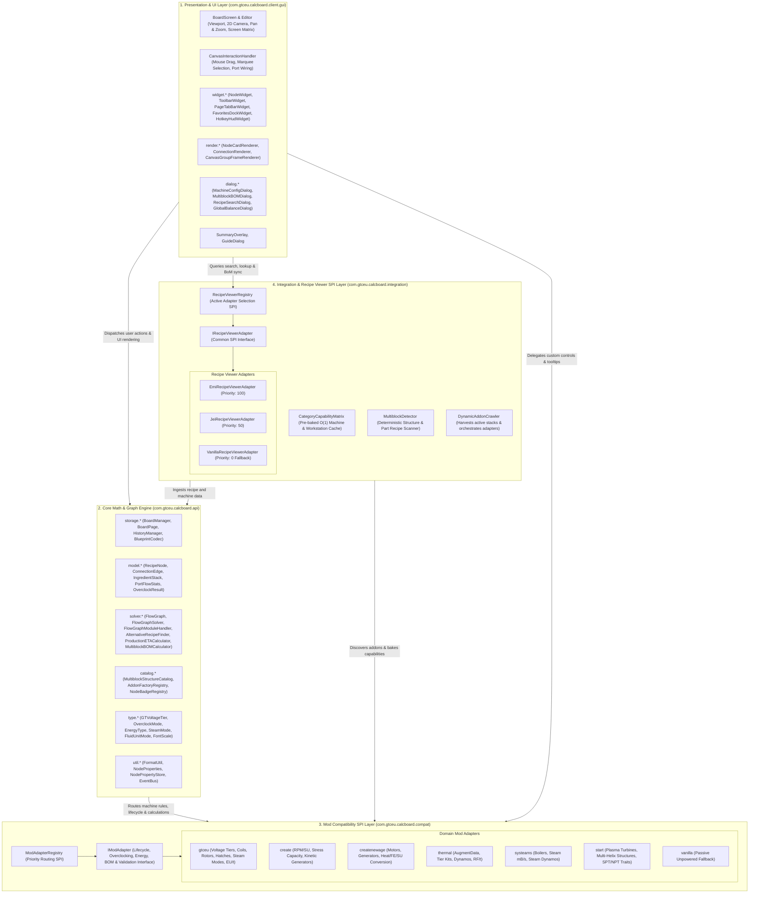
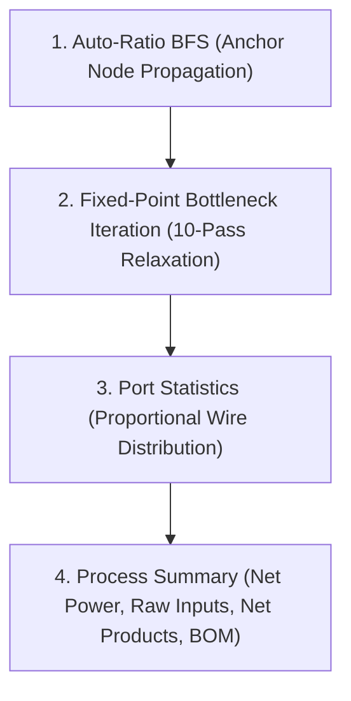
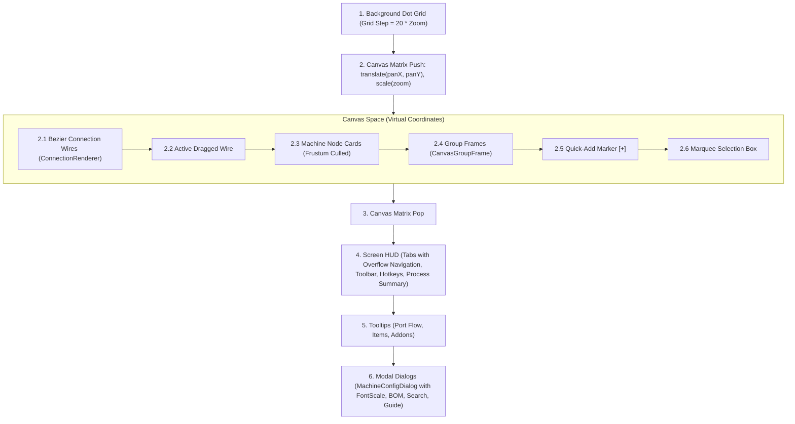

# GregTech Calculator Board - Architecture & Developer Guide

  <b>English</b> | <a href="ARCHITECTURE_KR.md">한국어</a>

> 📘 **Detailed Code Specifications**:
> * 🇰🇷 **Korean Edition**: [docs/ko_kr/CODE_SPECIFICATION.md](file:///d:/dev-ssd/modding/minecraft/GregTechCalculatorBoard/docs/ko_kr/CODE_SPECIFICATION.md)
> * 🇺🇸 **English Edition**: [docs/en_us/CODE_SPECIFICATION.md](file:///d:/dev-ssd/modding/minecraft/GregTechCalculatorBoard/docs/en_us/CODE_SPECIFICATION.md)
> Full v2.0.0 architecture specs, 5 graph algorithms, `CategoryCapabilityMatrix`, and multiplayer concurrency lock protocols are available above.

This document describes the internal architecture, mathematical solver engine, canvas rendering pipeline, and multi-mod compatibility layer for GregTech Calculator Board.

---

## 1. System Overview

The codebase is organized into four strictly decoupled architectural layers following Clean Architecture and SPI (Service Provider Interface) principles:

The core math engine (`com.gtceu.calcboard.api`) has zero dependencies on Minecraft client GUI or rendering classes, allowing it to execute in headless server environments and pass JUnit tests independently.

---

## 2. Core Architectural Principles

### 2.1 Clean Domain Model (`RecipeNode`)
`RecipeNode` is an engine-level generic calculation entity representing any processing workstation, power generator, or compound module on the canvas:
* **Zero Direct Mod Coupling**: `RecipeNode` contains no hardcoded GregTech, Create, or Thermal specific mechanics.
* **Lifecycle & Event Delegation**: Machine icon changes (`setMachineIcon`), energy type queries (`getEnergyType`), default parallels (`getDefaultParallel`), single machine power (`getSingleMachineEUt`), and node operating validation (`isOperational`) are dynamically dispatched to the active `IModAdapter` via `ModAdapterRegistry.getAdapterForNode(node)`.
* **Type-Safe Dynamic Properties**: Additional mod-specific or feature-specific metadata is stored cleanly in `NodePropertyStore` using type-safe `NodeProperty<T>` keys without bloating the core node class fields.
* **In-Place Alternative Recipe Switching (`AlternativeRecipeFinder`)**: Switch recipes directly without deleting nodes, automatically preserving identical ingredient port connections with full Undo/Redo support.

### 2.2 Pluggable Recipe Viewer SPI (`IRecipeViewerAdapter`)
* **Dynamic Adapter Election**: Automatically selects the highest-priority recipe viewer adapter (EMI ➔ JEI ➔ Vanilla Fallback) available in the runtime environment.
* **BoM Tree Integration**: Register full multiblock structural bills of materials into the EMI Recipe Tree or JEI++ shopping lists with a single click.

### 2.3 Addon & Spec Deductive Analysis Policy (Rule 5)
* **Strict Anti-Heuristic Rule**: String matching on tooltips, item display names, or raw item paths (`id.getPath().contains(...)`) to guess machine tiers or addon values is strictly forbidden.
* **Deterministic Deduction**:
  1. Official mod APIs and runtime Java reflection (`Functional Deduction`).
  2. In-game object / simulation state execution.
  3. Pure NBT numeric tags (e.g. `AugmentData` float/int compound tags) and official Forge `TagKey` registries.

### 2.4 Lifecycle Event Bus
Fires Forge lifecycle events (`RecipeNodeEvent`, `FlowGraphEvent`, `MachineCatalogEvent`) allowing external addons to extend node creation, mutation, calculation, and catalog baking.

---

## 3. Multi-Mod Energy & Physical Models

| Energy Type (`EnergyType`) | Domain Mod | Operating Metric | Overclock / Speed Mechanism | Primary Adapter |
| :--- | :--- | :--- | :--- | :--- |
| **`ELECTRIC_EU`** | GregTech CEu | $\text{EU/t}$, Voltage Tier | Standard 4x/2x, Perfect 4x/4x, Sub-tick batches | [`GTCEuModAdapter`](file:///d:/dev-ssd/modding/minecraft/GregTechCalculatorBoard/src/main/java/com/gtceu/calcboard/compat/gtceu/GTCEuModAdapter.java) |
| **`KINETIC_SU`** | Create | $\text{SU}$ (Stress Units), $\text{RPM}$ | Speed scaling: $\text{Duration} \propto \frac{1}{\text{RPM}}$ (Fan recipes fixed) | [`CreateModAdapter`](file:///d:/dev-ssd/modding/minecraft/GregTechCalculatorBoard/src/main/java/com/gtceu/calcboard/compat/create/CreateModAdapter.java) |
| **`ELECTRIC_FE`** | Thermal / New Age | $\text{RF/t}$ / $\text{FE/t}$ | Augments & Tier Kits (Base Power + Auxiliary multipliers) | [`ThermalModAdapter`](file:///d:/dev-ssd/modding/minecraft/GregTechCalculatorBoard/src/main/java/com/gtceu/calcboard/compat/thermal/ThermalModAdapter.java) |
| **`HEAT_OR_SELF`** | Boilers / Dynamos | $\text{mB/s Steam}$ generated | Small Boilers ($\text{LP}=1\times, \text{HP}=3\times$), Large Multiblock Boilers ($\text{Bronze}=1\times$, $\text{Steel}=2.25\times$, $\text{Titanium}=4\times$, $\text{Tungstensteel}=8\times$), Throttle ($25\% \sim 100\%$) | [`GTCEuModAdapter`](file:///d:/dev-ssd/modding/minecraft/GregTechCalculatorBoard/src/main/java/com/gtceu/calcboard/compat/gtceu/GTCEuModAdapter.java), [`SysteamsModAdapter`](file:///d:/dev-ssd/modding/minecraft/GregTechCalculatorBoard/src/main/java/com/gtceu/calcboard/compat/systeams/SysteamsModAdapter.java) |
| **`NONE`** | Vanilla / Passive | 0 Power | Fixed duration / duration multipliers | [`VanillaModAdapter`](file:///d:/dev-ssd/modding/minecraft/GregTechCalculatorBoard/src/main/java/com/gtceu/calcboard/compat/vanilla/VanillaModAdapter.java) |

---

## 4. Mathematical Solver Engine (`FlowGraphSolver`)

### 4.1 Algorithm 1: Fixed-Point Bottleneck Relaxation
Computes the operating efficiency of every node under upstream shortages or recycled feedback loops:

1. Initialize all node efficiencies: $\eta_v^{(0)} = 1.0$.
2. For iteration $k \in [1, 10]$:
   - For each consumer $C$ and connected input port $i$:

$$\text{Supply}_{P_j} = \text{NominalRate}_{P_j} \times \eta_{P_j}^{(k-1)}$$

$$\text{PortDemand}_{P_j} = \sum_{c \in \text{Consumers}(P_j)} \text{NominalDemand}_c$$

$$\text{IncomingSupply}_i = \sum_{P_j} \min\left(\text{NominalDemand}_C, \text{Supply}_{P_j} \times \frac{\text{NominalDemand}_C}{\text{PortDemand}_{P_j}}\right)$$

$$\rho_i = \frac{\text{IncomingSupply}_i}{\text{NominalDemand}_{C, i}}$$

   - Update node efficiency: $\eta_C^{(k)} = \min_i (\rho_i, 1.0)$.
3. If $\max_v |\eta_v^{(k)} - \eta_v^{(k-1)}| < 10^{-4}$, stop early (converged).

### 4.2 Algorithm 2: Port Flow Statistics
- **Input Ports (`getInputPortStats`)**: Compares nominal demand with total incoming supply. Flags deficit (`shortage`), balanced (`100%`), or surplus.
- **Output Ports (`getOutputPortStats`)**: Compares actual production with downstream consumer demand. Flags surplus (`safe overproduction`), balanced, or deficit.

### 4.3 Algorithm 3: Dual-Pass BFS Auto-Ratio
Sizes the machine network from a designated anchor node:
1. **Upstream Pass**: Traverses backward from consumer inputs to producers, setting producer machine counts so $\text{Supply} \ge \text{Demand}$.
2. **Downstream Pass**: Traverses forward from producer outputs to byproduct consumers, sizing consumers to absorb waste streams.
3. **Cycle Guard**: Limits total iterations to $\max(50, |V| \times 5)$ and per-node visits to $\le 3$, preventing infinite loops on cyclic graphs. Anchor count is preserved.

### 4.4 Algorithm 4: Overclocking & Sub-tick Mathematics
When voltage tier difference $\Delta\text{Tier} > 0$:

$$\text{Energy Multiplier} = (4.0)^{\Delta\text{Tier}}, \quad \text{Duration} = \frac{\text{baseDurationTicks}}{(2.0)^{\Delta\text{Tier}}}$$

For Sub-tick processing ($< 1.0\text{ Tick}$):

$$\text{batchesPerTick} = \frac{1.0}{\text{calculatedDurationTicks}}, \quad \text{effectiveDurationTicks} = 1.0$$
$$\text{Cycles Per Second (CPS)} = 20.0 \times \text{batchesPerTick} \times \text{parallel} \times \text{machineCount}$$

---

## 5. Multiblock Structure & BOM Engine (RFC-003, RFC-004)

The Calculator Board features a structural bill-of-materials (BOM) solver:
* **Deductive Blueprint Scanner**: Extracts exact required block counts, dynamic heating coils, and allowed hatch/bus positions from controller pattern recipes.
* **Hybrid Hatch Override**: Enables players to override default hatch configurations with higher tier, multi-fluid, or dual lower-tier hatches.
* **Dynamic Casing Reduction**: Automatically subtracts structural casing blocks when extra utility hatches (parallel, maintenance, optical, computing) are installed into the multiblock frame.

---

## 6. UI & Canvas Rendering Pipeline

### 6.1 Accessibility & Readability Features
* **5-Level UI Font Scale (`FontScale`)**: Scale `MachineConfigDialog` UI from 0.75x to 1.30x via the `[Aa 1.0x]` button (mouse click, wheel scroll, or `+`/`-` hotkeys).
* **Tab Bar Overflow Click Navigation (`PageTabBarWidget`)**: Click left/right `«`, `»` indicators or scroll mouse wheel to smoothly navigate through multiple board tabs with proper scissor padding.
* **Uniform Global Fluid Units (`FluidUnitMode`)**: Toggle between `AUTO` (smart auto-scaling), `ALWAYS_MB` (force millibuckets), and `ALWAYS_B` (force buckets) on the toolbar (`Shift+T`) for canvas-wide unit consistency.

---

## 7. Repository & Licensing

- **Repository**: [Amvermain/GregTechCalculatorBoard](https://github.com/Amvermain/GregTechCalculatorBoard)
- **License**: MIT License
- **Author**: Amvermain
