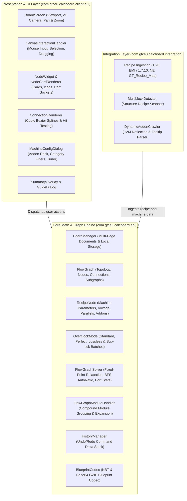
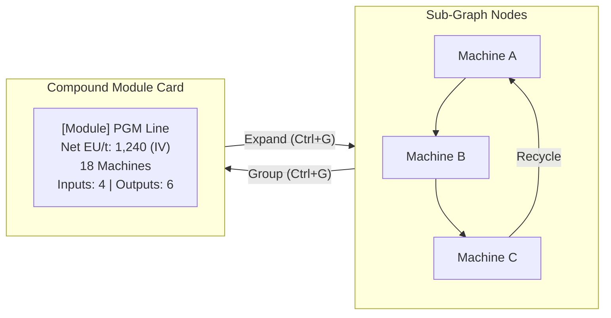
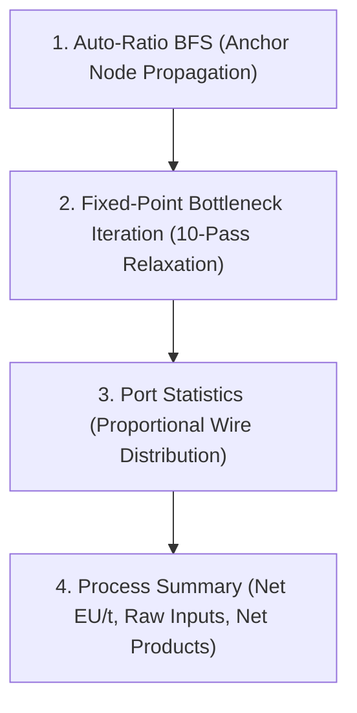
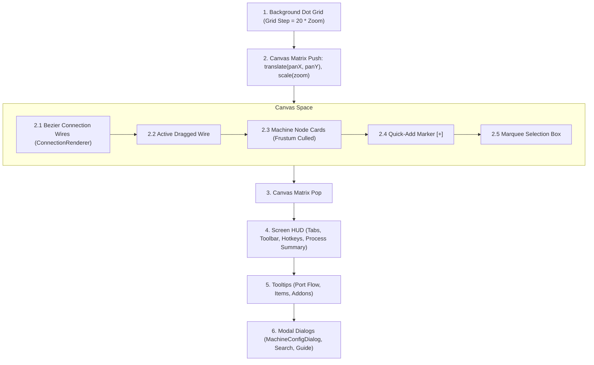

# GregTech Calculator Board - Architecture & Developer Guide

This document describes the internal architecture, mathematical solver engine, canvas rendering pipeline, and 1.7.10 backporting targets for GregTech Calculator Board.

---

## 1. System Overview

The codebase is organized into three decoupled layers:



The core math engine (`com.gtceu.calcboard.api`) has zero dependencies on Minecraft client GUI or rendering classes, allowing it to run in headless environments and pass JUnit tests independently.

---

## 2. Core Domain & Math Engine

### 2.1 Data Models

- **`BoardManager` & `BoardPage`**: Root workspace manager. Handles multi-tab pages, active page state, camera viewport coordinates, and client-side persistence (`<gamedir>/gtcalcboard/calcboard_save.nbt`).
- **`FlowGraph`**: Graph container storing nodes (`RecipeNode`) and directed connection edges (`ConnectionEdge(fromNodeId, outIdx, toNodeId, inIdx)`). Supports nested subgraphs.
- **`RecipeNode`**: Represents a processing machine, power generator, or compound module on the canvas:
  - Inputs and outputs (`List<IngredientStack>`).
  - Base recipe parameters: base duration ticks, base EU/t, recipe voltage tier.
  - Runtime configuration: target voltage tier, overclock mode (`STANDARD`, `PERFECT`, `LOSSLESS`), machine count, parallel multiplier, multiblock flag, generator flag, and installed hardware addons (`List<MachineAddon>`).
  - Operating efficiency: settled rate ($\eta \in [0.0, 1.0]$) computed by the graph solver under supply constraints.
- **`IngredientStack`**: Stores item/fluid ID, display name, amount, base chance ($0.0 \dots 1.0$), and `tierChanceBoost`.

---

### 2.2 Overclocking Mathematics

Overclocking is evaluated dynamically based on the voltage tier difference:

$$\Delta\text{Tier} = \max(0, \text{TargetTier.ordinal} - \text{RecipeTier.ordinal})$$

If $\Delta\text{Tier} > 0$:

$$\text{Energy Multiplier} = (\text{energyFactor})^{\Delta\text{Tier}} \quad (\text{Default: } 4.0^{\Delta\text{Tier}})$$
$$\text{Duration} = \frac{\text{baseDurationTicks}}{(\text{speedFactor})^{\Delta\text{Tier}}} \quad (\text{Standard: } 2.0^{\Delta\text{Tier}}, \text{ Perfect: } 4.0^{\Delta\text{Tier}})$$

#### Sub-tick Processing ($< 1.0\text{ Tick}$)
When overclocking reduces a recipe's duration below $1.0\text{ tick}$ ($0.05\text{ s}$):

$$\text{batchesPerTick} = \frac{1.0}{\text{calculatedDurationTicks}}, \quad \text{effectiveDurationTicks} = 1.0$$
$$\text{Cycles Per Second (CPS)} = 20.0 \times \text{batchesPerTick} \times \text{parallel} \times \text{machineCount}$$

#### Hardware Addons Compounding
$$\text{Total Duration} = \text{Duration} \times \prod_{a \in \text{Addons}} a.\text{getDurationMultiplier}()$$
$$\text{Total EU/t} = \text{EU/t} \times \prod_{a \in \text{Addons}} a.\text{getEutMultiplier}()$$

#### Probabilistic Byproduct Scaling (Tier Chance Boost)
For recipes with chanced outputs (e.g. Macerator, Centrifuge), higher voltage tiers boost output probability:

$$\text{Effective Chance} = \min(1.0, \text{BaseChance} + \Delta\text{Tier} \times \text{TierChanceBoost})$$
$$\text{Expected Output Amount} = \text{Amount} \times \text{Effective Chance}$$

Standard GregTech recipes use $+5.0\%$ per voltage tier ($\text{TierChanceBoost} = 0.05$).

---

### 2.3 Compound Modules (`FlowGraphModuleHandler`)

Compound Modules package a group of selected nodes into a single composite card (`Ctrl+G`):



- **I/O Extraction**: `FlowGraphSolver.computeSummary(subGraph)` derives net external raw inputs and products. Internal intermediate connections are encapsulated.
- **Wire Remapping**: External incoming/outgoing wires are reconnected to the composite card's boundary ports.
- **Scaling**: Adjusting the module's machine count scales all internal machine counts and flow rates proportionally.

---

### 2.4 Solver Algorithms (`FlowGraphSolver`)



#### Algorithm 1: Fixed-Point Bottleneck Relaxation
Computes the operating efficiency of every node under upstream shortages or recycled feedback loops:

1. Initialize all node efficiencies: $\eta_v^{(0)} = 1.0$.
2. For iteration $k \in [1, 10]$:
   - For each consumer $C$ and connected input port $i$:

$$\text{Supply}_{P_j} = \text{NominalRate}_{P_j} \times \eta_{P_j}^{(k-1)}$$

$$\text{PortDemand}_{P_j} = \sum_{c \in \text{Consumers}(P_j)} \text{NominalDemand}_c$$

$$\text{IncomingSupply}_i = \sum_{P_j} \min\left(\text{NominalDemand}_C, \text{Supply}_{P_j} \times \frac{\text{NominalDemand}_C}{\text{PortDemand}_{P_j}}\right)$$

$$\rho_i = \frac{\text{IncomingSupply}_i}{\text{NominalDemand}_{C, i}}$$

   - Update node efficiency: $\eta_C^{(k)} = \min_i (\rho_i, 1.0)$.
3. If $\max_v |\eta_v^{(k)} - \eta_v^{(k-1)}| < 10^{-4}$, stop early (converged).

#### Algorithm 2: Port Flow Statistics
- **Input Ports (`getInputPortStats`)**: Compares nominal demand with total incoming supply. Flags deficit (`shortage`), balanced (`100%`), or surplus.
- **Output Ports (`getOutputPortStats`)**: Compares actual production with downstream consumer demand. Flags surplus (`safe overproduction`), balanced, or deficit.

#### Algorithm 3: Dual-Pass BFS Auto-Ratio
Sizes the machine network from a designated anchor node:
1. **Upstream Pass**: Traverses backward from consumer inputs to producers, setting producer machine counts so $Supply \ge Demand$.
2. **Downstream Pass**: Traverses forward from producer outputs to byproduct consumers, sizing consumers to absorb waste streams.
3. **Cycle Guard**: Limits total iterations to $\max(50, |V| \times 5)$ and per-node visits to $\le 3$, preventing infinite loops on cyclic graphs. Anchor count is preserved.

#### Algorithm 4: Process Summary
Aggregates total power consumption/generation (Net EU/t), maximum active voltage tier, recursive machine breakdown, and net material balance ($\Delta = \text{Production} - \text{Consumption}$).

#### Algorithm 5: Shift-Drag 1:1 Rate Match
When holding `Shift` while dropping a wire between ports, automatically calculates the required machine count:

$$\text{Target Machine Count} = \frac{\text{Source Port Flow Rate}}{\text{Target Single Machine Port Rate}}$$

---

### 2.5 Hardware Addons (`MachineAddon` & `DynamicAddonCrawler`)

- Categories: `COIL`, `PARALLEL`, `MAINTENANCE`, `ROTOR`, `MULTIBLOCK_TRAIT`, `THERMAL_AUGMENT`, `CUSTOM`.
- Machine-tailored modifiers (`addon.forMachine(node)`):
  - **EBF**: $5\%$ EU discount per $900\text{K}$ excess temperature: $\text{EUt Mult} = 0.95^{\lfloor (T_{\text{coil}} - T_{\text{recipe}}) / 900 \rfloor}$.
  - **LCR**: Speed bonus (e.g. RTM: $150\%$ speed $\to 0.67\times$ duration, $85\%$ energy $\to 0.85\times$ EU/t).
  - **Pyrolyse**: Speed bonus (e.g. Nichrome: $200\%$ speed $\to 0.50\times$ duration).
  - **Cracking**: Energy bonus (e.g. HSS-G: $60\%$ energy $\to 0.60\times$ EU/t).
  - **Multi Smelter**: Parallel scaling (e.g. RTM: $128\times$ parallel).
- `DynamicAddonCrawler`: Discovers addon blocks across loaded mods using JVM reflection and multiline tooltip section parsing (`Pattern.DOTALL`), with built-in fallbacks for standard GregTech materials.

---

### 2.6 Undo / Redo (`HistoryManager`)

Command pattern tracking vector state deltas (`BoardCommand`):
- `MoveNodesCommand`, `AddConnectionCommand`, `RemoveConnectionCommand`, `AddNodesCommand`, `RemoveNodesCommand`, `ModifyPropertyCommand`, `GroupModuleCommand`, `ExpandModuleCommand`.
- Memory footprint is under 2 MB for 1,000 history steps.

---

## 3. UI & Canvas Rendering

### 3.1 Viewport Transformation (`BoardScreen`)

Virtual canvas coordinate conversion:

$$\text{CanvasX} = \frac{\text{ScreenX} - \text{PanX}}{\text{Zoom}}, \quad \text{CanvasY} = \frac{\text{ScreenY} - \text{PanY}}{\text{Zoom}}$$
$$\text{ScreenX} = \text{CanvasX} \times \text{Zoom} + \text{PanX}, \quad \text{ScreenY} = \text{CanvasY} \times \text{Zoom} + \text{PanY}$$



---

### 3.2 Spline Routing (`ConnectionRenderer`)

- Cubic Bezier splines between output socket $(x_1, y_1)$ and input socket $(x_2, y_2)$:
  $$dx = \max(40.0, |x_2 - x_1| \times 0.5)$$
  $$P_0 = (x_1, y_1), \quad P_1 = (x_1 + dx, y_1), \quad P_2 = (x_2 - dx, y_2), \quad P_3 = (x_2, y_2)$$
- Distance hit testing: Evaluates Euclidean distance from cursor to curve across 30 parametric samples for right-click wire severing.

---

## 4. Serialization & Blueprints

- **File Save**: `<gamedir>/gtcalcboard/calcboard_save.nbt` via compressed NBT (`NbtIo.writeCompressed`).
- **Blueprint Strings**: `FlowGraph` $\to$ NBT $\to$ GZIP $\to$ URL-safe Base64 with `GTBOARD:` prefix for clipboard import/export.

---

## 5. GTNH 1.7.10 Porting Guide

This section outlines replacement targets for backporting to **Minecraft 1.7.10 / GT5u / TecTech / NEI**.

### 5.1 Recipe Ingestion (NEI $\to$ `RecipeNode`)

Replace `EmiRecipeConverter` with a `GT_Recipe_Map` adapter:

```java
package com.gtceu.calcboard.integration.nei;

import gregtech.api.util.GT_Recipe;
import net.minecraft.item.ItemStack;
import net.minecraftforge.fluids.FluidStack;

public class NeiRecipeConverter {

    public static RecipeNode fromGtRecipe(GT_Recipe recipe, GT_Recipe.GT_Recipe_Map recipeMap) {
        String name = recipeMap.mNEIName != null ? recipeMap.mNEIName : recipeMap.mUnlocalizedName;
        double durationTicks = (double) recipe.mDuration;
        double baseEUt = (double) recipe.mEUt;
        GTVoltageTier tier = GTVoltageTier.fromEUt(baseEUt);

        RecipeNode node = RecipeNode.create(name, durationTicks, baseEUt, tier);

        if (recipe.mInputs != null) {
            for (ItemStack is : recipe.mInputs) {
                if (is != null) {
                    node.addInput(IngredientStack.item(is.getItem().getUnlocalizedName(), is.getDisplayName(), is.stackSize, 1.0));
                }
            }
        }
        if (recipe.mFluidInputs != null) {
            for (FluidStack fs : recipe.mFluidInputs) {
                if (fs != null) {
                    node.addInput(IngredientStack.fluid(fs.getFluid().getName(), fs.getLocalizedName(), fs.amount, 1.0));
                }
            }
        }
        if (recipe.mOutputs != null) {
            for (int i = 0; i < recipe.mOutputs.length; i++) {
                ItemStack is = recipe.mOutputs[i];
                if (is != null) {
                    double chance = (recipe.mChances != null && i < recipe.mChances.length && recipe.mChances[i] > 0)
                            ? (double) recipe.mChances[i] / 10000.0 : 1.0;
                    node.addOutput(IngredientStack.item(is.getItem().getUnlocalizedName(), is.getDisplayName(), is.stackSize, chance));
                }
            }
        }
        if (recipe.mFluidOutputs != null) {
            for (FluidStack fs : recipe.mFluidOutputs) {
                if (fs != null) {
                    node.addOutput(IngredientStack.fluid(fs.getFluid().getName(), fs.getLocalizedName(), fs.amount, 1.0));
                }
            }
        }
        if (recipe.mSpecialValue > 0) {
            node.setRequiredTemperature(recipe.mSpecialValue);
        }
        return node;
    }
}
```

---

### 5.2 Graphics Pipeline (1.20 `GuiGraphics` $\to$ 1.7.10 `GL11`)

| 1.20.1 Implementation | 1.7.10 Replacement |
| :--- | :--- |
| `graphics.fill(x1, y1, x2, y2, color)` | `Gui.drawRect(x1, y1, x2, y2, color)` |
| `graphics.pose().pushPose()` | `GL11.glPushMatrix()` |
| `graphics.pose().translate(x, y, z)` | `GL11.glTranslatef((float)x, (float)y, (float)z)` |
| `graphics.pose().scale(sx, sy, sz)` | `GL11.glScalef((float)sx, (float)sy, (float)sz)` |
| `graphics.pose().popPose()` | `GL11.glPopMatrix()` |
| `graphics.renderItem(stack, x, y)` | `RenderItem.getInstance().renderItemAndEffectIntoGUI(...)` |
| `graphics.renderTooltip(...)` | `drawHoveringText(lines, x, y, fontRenderer)` |
| `graphics.enableScissor(...)` | `GL11.glEnable(GL11.GL_SCISSOR_TEST); GL11.glScissor(...)` |

---

### 5.3 Machine Hierarchy & Voltage Tiers

- **Voltage Tiers**: Map `GTVoltageTier` ordinal to GT5u `GT_Values.VN` ($0 = \text{ULV} \dots 14 = \text{MAX}$).
- **Multiblock Controller Detection**: Check if `metaTileEntity instanceof GT_MetaTileEntity_MultiblockBase_EM` (TecTech) or `instanceof GT_MetaTileEntity_TooltipMultiBlockBase` (GT5u).
- **Heating Coils**: Map to GT5u `mCoilTier` or `HeatingCoilLevel`.
- **Large Turbines**: Calculate output EU/t using `mEfficiency` and `mOptimalFlow`.

---

## 6. Repository & Licensing

- **Repository**: [Amvermain/GregTechCalculatorBoard](https://github.com/Amvermain/GregTechCalculatorBoard)
- **License**: MIT License
- **Author**: Amvermain
