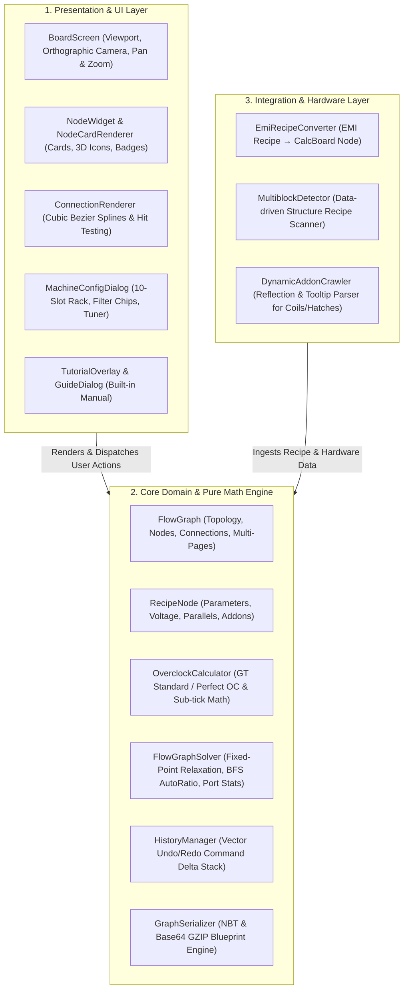
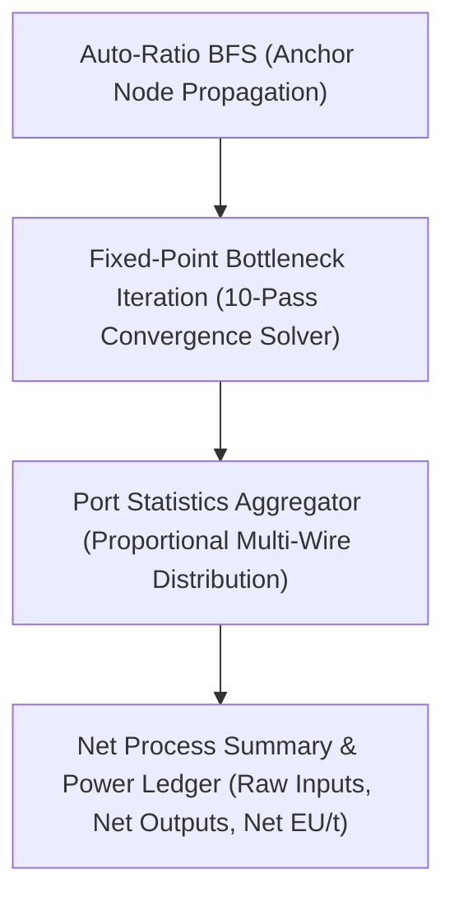
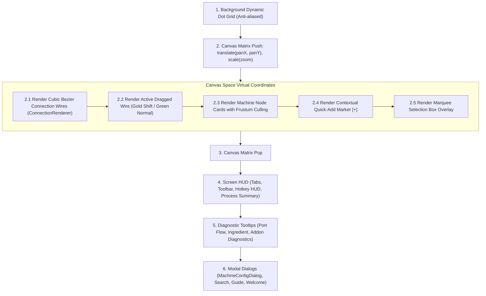

# GregTech Calculator Board (GT Calc Board)
## Comprehensive Technical Architecture & Developer Specification

> **Target Audience**: GregTech: New Horizons (GTNH) Core Dev Team, Backport Maintainers, and Mod Contributors.  
> **Author**: Amvermain  
> **License**: MIT License (Permissive — eligible for fork, modification, and relicensing under GNU GPL v3.0)

---

## Table of Contents
1. [Architectural Overview & System Layering](#1-architectural-overview--system-layering)
2. [Core Domain & Math Engine (`api`)](#2-core-domain--math-engine-api)
   - [2.1 Data Models: `FlowGraph` & `RecipeNode`](#21-data-models-flowgraph--recipenode)
   - [2.2 Overclocking Mathematics: `OverclockCalculator`](#22-overclocking-mathematics-overclockcalculator)
   - [2.3 Flow Graph Solver: `FlowGraphSolver`](#23-flow-graph-solver-flowgraphsolver)
     - [Fixed-Point Bottleneck Relaxation Algorithm](#algorithm-1-fixed-point-bottleneck-relaxation)
     - [Port Flow & Multi-Wire Proportional Distribution](#algorithm-2-port-flow--proportional-distribution)
     - [Dual-Pass BFS Auto-Ratio Propagation](#algorithm-3-dual-pass-bfs-auto-ratio-propagation)
     - [Process Summary & Net Material Balancing](#algorithm-4-process-summary--net-balancing)
     - [Shift-Connect 1:1 Rate Solver](#algorithm-5-shift-connect-11-rate-solver)
   - [2.4 Hardware Addon System: `MachineAddon` & `MachineAddonCatalog`](#24-hardware-addon-system-machineaddon--machineaddoncatalog)
   - [2.5 Dynamic Discovery: `DynamicAddonCrawler` & `MultiblockDetector`](#25-dynamic-discovery-dynamicaddoncrawler--multiblockdetector)
   - [2.6 Delta Command History: `HistoryManager` & `BoardCommand`](#26-delta-command-history-historymanager--boardcommand)
3. [UI, Rendering, & Canvas System (`client.gui`)](#3-ui-rendering--canvas-system-clientgui)
   - [3.1 Viewport Transformation & Canvas Pipeline: `BoardScreen`](#31-viewport-transformation--canvas-pipeline-boardscreen)
   - [3.2 Interaction State Machine: `CanvasHandler`](#32-interaction-state-machine-canvashandler)
   - [3.3 Machine Card Layout & Component Rendering: `NodeCardRenderer`](#33-machine-card-layout--component-rendering-nodecardrenderer)
   - [3.4 Spline Routing & OpenGL Rendering: `ConnectionRenderer`](#34-spline-routing--opengl-rendering-connectionrenderer)
   - [3.5 Hardware Addon Modal & 10-Slot Visual Rack: `MachineConfigDialog`](#35-hardware-addon-modal--10-slot-visual-rack-machineconfigdialog)
4. [Serialization & Blueprint Sharing](#4-serialization--blueprint-sharing)
5. [GTNH 1.7.10 Backport & Migration Guide](#5-gtnh-1710-backport--migration-guide)
   - [5.1 Recipe Ingestion: EMI $\to$ NEI (`GT_Recipe_Map`)](#51-recipe-ingestion-emi-to-nei-gt_recipe_map)
   - [5.2 UI & Graphics Pipeline: Modern `GuiGraphics` $\to$ 1.7.10 `GL11` / `Tessellator`](#52-ui--graphics-pipeline-modern-guigraphics-to-1710-gl11--tessellator)
   - [5.3 Machine Hierarchy: GTCEu `MetaMachine` $\to$ GT5u `GT_MetaTileEntity`](#53-machine-hierarchy-gtceu-metamachine-to-gt5u-gt_metatileentity)
   - [5.4 Coils, Hatches, & Turbines in GT5u](#54-coils-hatches--turbines-in-gt5u)

---

# 1. Architectural Overview & System Layering



> **Key Design Property**: Layer 2 (Core Math & Graph Engine) has **zero dependencies on Minecraft GUI rendering**. It is completely testable via headless JUnit tests (`CalculationTest.java`) and can be ported to 1.7.10 without mathematical changes.

---

# 2. Core Domain & Math Engine (`api`)

## 2.1 Data Models: `FlowGraph` & `RecipeNode`

### `FlowGraph.java`
Manages the topological graph for an active calculation sheet:
* `List<RecipeNode> nodes`: All active machine nodes.
* `List<ConnectionEdge> connections`: Directed connection edges between ports.
  * An edge is defined as: `ConnectionEdge(String fromNodeId, int outputIndex, String toNodeId, int inputIndex)`.
* `List<FlowGraphPage> pages`: Multi-tab page management (`[1. Acid Line] [2. Power] [+]`).
* **Compound Module Subgraphs**: Any `RecipeNode` can contain a nested `FlowGraph subGraph` encapsulated inside it.

### `RecipeNode.java`
Represents an individual processing machine card on the canvas:
* **Identification**: `id` (UUID string), `name` (e.g. *"Chemical Reactor (Nitrobenzene)"*), `recipeLocation`.
* **Materials**: `List<IngredientStack> inputs`, `List<IngredientStack> outputs`. Each stack stores `ResourceLocation id`, `double amount`, `double chance` (for probabilistic outputs), `boolean isFluid`, and optional alternatives.
* **Electrical & Processing Parameters**:
  * `recipeTier`: Base voltage tier required by the recipe.
  * `targetTier`: Voltage tier assigned to the machine (e.g. `LV`, `MV`, `HV`, `EV`, `IV`, `LuV`, `ZPM`, `UV`, `UHV`, `UEV`, `UIV`, `UXV`, `OpV`, `MAX`).
  * `baseDurationTicks`: Recipe base processing time in Minecraft ticks ($20\text{ ticks} = 1.0\text{ s}$).
  * `baseEUt`: Recipe base energy consumption in EU/t.
  * `overclockMode`: `STANDARD` ($4\times\text{EU}, 0.5\times\text{Time}$) or `PERFECT` ($4\times\text{EU}, 0.25\times\text{Time}$).
* **Hardware & Scaling Properties**:
  * `machineCount`: Number of machines deployed (supports fractional calculations and safe integer rounding).
  * `parallel`: Base parallel multiplier (e.g. Parallel Hatch $1\times, 4\times, 16\times, 64\times, 256\times$).
  * `isMultiblock`: Boolean flag switching between Multiblock logic and Singleblock logic.
  * `isGenerator`: Boolean flag indicating power generation (e.g. Steam Turbines, Gas Turbines, Dynamos).
  * `addons`: `List<MachineAddon>` containing equipped Heating Coils, Maintenance Hatches, Turbine Rotors, or custom traits.
  * `efficiency`: Settled operating rate ($0.0 \le \eta \le 1.0$) computed by the graph solver.

---

## 2.2 Overclocking Mathematics: `OverclockCalculator`

Standard GregTech overclocking is calculated dynamically whenever voltage tier or hardware addons change:

$$\Delta\text{Tier} = \text{TargetTier.ordinal} - \text{RecipeTier.ordinal}$$

If $\Delta\text{Tier} > 0$:

$$\text{Time Multiplier} = \begin{cases} 0.50^{\Delta\text{Tier}} & \text{if Standard Overclock} \\ 0.25^{\Delta\text{Tier}} & \text{if Perfect Overclock} \end{cases}$$

$$\text{EU/t Multiplier} = 4.0^{\Delta\text{Tier}}$$

### Effective Hardware Addon Compounding
If hardware addons are installed:
$$\text{Total Duration Multiplier} = \text{Time Multiplier} \times \prod_{a \in \text{Addons}} a.\text{getDurationMultiplier}()$$
$$\text{Total EU/t Multiplier} = \text{EU/t Multiplier} \times \prod_{a \in \text{Addons}} a.\text{getEutMultiplier}()$$

### Sub-Tick Processing Calculation
If the overclocked duration falls below $1.0\text{ tick}$:
$$\text{Duration} = 1.0\text{ tick}$$
$$\text{Sub-Tick Parallel} = \frac{1.0}{\text{Duration}_{\text{theoretical}}}$$
$$\text{Effective CPS (Cycles Per Second)} = \frac{20.0}{\text{Duration}} \times \text{Sub-Tick Parallel} \times \text{MachineCount} \times \text{TotalParallel}$$

---

## 2.3 Flow Graph Solver: `FlowGraphSolver`

`FlowGraphSolver.java` is the pure algorithmic core of the mod.



---

### Algorithm 1: Fixed-Point Bottleneck Relaxation
* **Problem**: In real factories, if an upstream machine lacks raw materials, its output drops. Downstream consumers cannot run at 100% capacity and are throttled. If multiple consumers compete for the same output, or if recycled feedback loops exist, circular dependencies arise.
* **Solution**: A **Fixed-Point Iteration Relaxation Solver (10 rounds)**:
  1. Initialize all nodes: $\eta_v^{(0)} = 1.0$.
  2. In each iteration $k \in [1, 10]$:
     - For each consumer node $C$:
       - For each connected input port $i$:
         - Sum incoming actual supply from all connected producers $P_j$:
           $$\text{Supply}_{P_j} = \text{NominalRate}_{P_j} \times \eta_{P_j}^{(k-1)}$$
           $$\text{PortDemand}_{P_j} = \sum_{c \in \text{Consumers}(P_j)} \text{NominalDemand}_c$$
           $$\text{IncomingSupply}_i = \sum_{P_j} \min\left(\text{NominalDemand}_C, \text{Supply}_{P_j} \times \frac{\text{NominalDemand}_C}{\text{PortDemand}_{P_j}}\right)$$
         - Calculate port satisfaction ratio: $\rho_i = \frac{\text{IncomingSupply}_i}{\text{NominalDemand}_{C, i}}$.
       - Set new efficiency: $\eta_C^{(k)} = \min_{i} (\rho_i, 1.0)$.
  3. If $\max_v |\eta_v^{(k)} - \eta_v^{(k-1)}| < 10^{-4}$, the network has converged; terminate early.

---

### Algorithm 2: Port Flow & Proportional Distribution
Computes real-time fractions for card rendering (e.g. `⚠ 438/500 mB/s` or `123/400 mB/s +`):

* **Input Port Stats (`getInputPortStats`)**:
  - Compares nominal demand $\text{Req} = \text{Amount} \times \text{CPS}_{\text{nominal}}$ with total incoming supply $\text{Supplied}$.
  - If $\text{Supplied} < \text{Req} - 0.001$: **Input Deficit (Shortage ⚠)**.
  - If $\text{Supplied} \approx \text{Req}$: **Balanced (✔)**.
  - If $\text{Supplied} > \text{Req} + 0.001$: **Input Surplus (+)**.

* **Output Port Stats (`getOutputPortStats`)**:
  - Compares actual production $\text{Produced} = \text{Amount} \times \text{CPS}_{\text{effective}}$ with actual downstream consumer demand $\text{Demanded} = \sum \text{Amount} \times \text{CPS}_{C, \text{effective}}$.
  - If $\text{Demanded} < \text{Produced} - 0.001$: **Output Surplus (+, Safe Overproduction)**.
  - If $\text{Demanded} > \text{Produced} + 0.001$: **Output Deficit (⚠, Downstream Starvation)**.

---

### Algorithm 3: Dual-Pass BFS Auto-Ratio Propagation
Given a designated **Base Master Anchor** node (e.g. *Polybenzimidazole Chem Reactor*), propagates required machine counts across the entire tree:

1. **Upstream Pass (Backward Supply Guarantee)**:
   - Traverses input ports backward to parent producers.
   - For each producer $P$, calculates the machine count required to satisfy all downstream consumers:
     $$\text{Count}_P = \frac{\text{TotalDownstreamRequiredRate}}{\text{SingleMachineOutputRate}_P}$$
   - If `integerCounts = true`, applies $\text{Count}_P = \lceil \text{Count}_P \rceil$ to strictly guarantee $Supply \ge Demand$.
2. **Downstream Pass (Forward Byproduct Absorption)**:
   - Traverses output ports forward to byproduct consumers (e.g. Diluted Sulfuric Acid $\to$ Sulfuric Acid Recovery).
   - Sizes consumers to absorb 100% of upstream byproduct generation without backup.

---

### Algorithm 4: Process Summary & Net Balancing
Aggregates the entire board into a single thermodynamic & economic ledger:
* **Total EU/t Consumption & Generation**: $\text{Net EU/t} = \sum \text{Consumed EU/t} - \sum \text{Generated EU/t}$.
* **Highest Voltage Tier**: The maximum electrical tier active on the board.
* **Recursive Machine Breakdown**: Deconstructs Compound Modules into sub-machine lists (e.g. *58 Machines: 12x LCR, 8x Distillation Tower, 16x Centrifuge*).
* **Net Material Balance**:
  $$\Delta = \text{Total Production} - \text{Total Consumption}$$
  - $\Delta < 0$: **Raw Input Required** (e.g. $1,250\text{ mB/s Oxygen}$).
  - $\Delta > 0$: **Net Product Export** (e.g. $500\text{ mB/s Benzene}$).
  - $\Delta = 0$: **100% Recycled Internal Intermediate**.

---

### Algorithm 5: Shift-Connect 1:1 Rate Solver
When the user holds `Shift` while dragging a wire between port $A$ and port $B$:
$$\text{Target Machine Count} = \frac{\text{Connected Port Flow Rate}}{\text{Target Machine Single-Port Rate}}$$
Automatically sizes the target machine so that supply perfectly equals demand on that wire.

---

## 2.4 Hardware Addon System: `MachineAddon` & `MachineAddonCatalog`

Hardware addons represent physical upgrades installed onto machines:

```java
public enum Category {
    COIL,              // Heating Coils (♨ Temperature, EBF discounts, Pyrolyse/LCR speed)
    PARALLEL,          // Parallel Hatches (⚡ 4x, 16x, 64x, 256x, Absolute Parallel)
    MAINTENANCE,       // Maintenance Hatches (🔧 Auto-maintenance, Speed/EU bonus)
    ROTOR,             // Turbine Rotors (Efficiency %, Power %, Max EU/t)
    MULTIBLOCK_TRAIT,  // Processing Trait Modifiers (Throughput boost, Sub-tick OC)
    THERMAL_AUGMENT,   // Thermal Series Dynamos / Augments (RF conversion)
    CUSTOM             // User-created custom modifiers
}
```

### Machine-Tailored Multipliers (`addon.forMachine(node)`)
Coils adapt their bonuses depending on the machine type:
* **Electric Blast Furnace (EBF)**: $5\%$ EU discount per $900\text{K}$ excess temperature above recipe requirement:
  $$\text{EU Multiplier} = 0.95^{\lfloor (T_{\text{coil}} - T_{\text{recipe}}) / 900 \rfloor}$$
* **Large Chemical Reactor (LCR)**: Custom speed multiplier (e.g. RTM Coil: $150\%$ speed $\to 0.67\times$ duration, $85\%$ energy $\to 0.85\times$ EU/t).
* **Pyrolyse Oven**: Processing speed bonus (e.g. Nichrome: $200\%$ speed $\to 0.50\times$ duration).
* **Cracking Unit**: Energy reduction bonus (e.g. HSS-G: $60\%$ energy $\to 0.60\times$ EU/t).
* **Multi Smelter**: Parallel scaling (e.g. RTM: $128\times$ Parallel).

---

## 2.5 Dynamic Discovery: `DynamicAddonCrawler` & `MultiblockDetector`

### `DynamicAddonCrawler.java`
Discovers all heating coils, rotors, and parallel hatches across any loaded mod (GTCEu, KubeJS, Star Technology, GregTech addons):
1. **Java Reflection Engine**: Introspects `ICoilType`, `CoilType`, and `Block` instances directly in JVM memory.
2. **Multiline Tooltip Section Parser**: Extracts stats from localized tooltip blocks using multi-line regular expressions (`Pattern.DOTALL`).
3. **Fallback Matrix**: Comprehensive database for known GregTech materials and modpack custom coils (Zalloy, Magmada Alloy, Infinity, Hypogen, Eternity).

### `MultiblockDetector.java`
Determines whether a recipe can be processed in Multiblock mode:
1. Queries the recipe viewer's `multiblock_info` category directly.
2. If any workstation for the recipe has a registered 3D multiblock structure or is a `MultiblockControllerMachine`, multiblock traits and configuration are enabled.

---

## 2.6 Delta Command History: `HistoryManager` & `BoardCommand`

Implements full vector-based Undo / Redo (`Ctrl + Z` / `Ctrl + Y`):
* Uses the **Command Pattern**: each action stores forward delta and reverse delta:
  - `MoveNodesCommand(nodeIds, dx, dy)`
  - `AddConnectionCommand(edge)` / `RemoveConnectionCommand(edge)`
  - `AddNodesCommand(nodes)` / `RemoveNodesCommand(nodes, edges)`
  - `ModifyPropertyCommand(nodeId, propertyType, oldValue, newValue)`
  - `GroupModuleCommand` / `ExpandModuleCommand`
* Lightweight memory footprint (<2 MB for 1000 history steps).

---

# 3. UI, Rendering, & Canvas System (`client.gui`)

## 3.1 Viewport Transformation & Canvas Pipeline: `BoardScreen`

`BoardScreen.java` manages an infinite virtual 2D canvas with arbitrary panning and zooming:

```
Screen Space (Pixels)                    Canvas Space (Virtual Units)
[Mouse X, Y]  ──( - Pan ) / Zoom ──►    [World X, Y]
[Render X, Y] ◄──( * Zoom ) + Pan ──     [World X, Y]
```

### Render Pass Execution Order



---

## 3.2 Machine Card Layout: `NodeCardRenderer`

Each machine card is rendered with precision-engineered visual components:

```
┌───────────────────────────────────────────────────────────┐
│ [Icon] Machine Title (Customizable)             [⚙] [✕]   │ Header (Tier Color)
├───────────────────────────────────────────────────────────┤
│ Count: [-] [ 1.0 ] [+] [/2] [x2]      [Coil] [Maint] [Par]│ Machine Controls & Mini Addon Tray
│ [HV] [STD OC]                 [⚙ 128x (+1)] [2.00s (0.50/s)│ Tier, OC Mode, Parallels, Cycle
│ ⚡88% 224.0 EU/t (0.44A HV)                                │ Operating Power & Efficiency
├───────────────────────────────────────────────────────────┤
│ [●] [Fluid] 438/500 mB/s ⚠          [Fluid] 153 mB/s ✔ [●]│ Port Rows (Inputs & Outputs)
│ [●] [Fluid] 1000 mB/s ✔             [Fluid]  33 mB/s + [●]│ (3D Icons, Fractional Rates,
│ [●] [Item]  4x Ore ✔                 [Item]  1x Dust ✔ [●]│  State Sockets & Glowing Rings)
└───────────────────────────────────────────────────────────┘
```

---

## 3.3 Spline Routing: `ConnectionRenderer`

* Uses **Cubic Bezier Splines** between output socket $(x_1, y_1)$ and input socket $(x_2, y_2)$:
  $$\text{Control Point Distance } dx = \max(40.0, |x_2 - x_1| \times 0.5)$$
  $$P_0 = (x_1, y_1), \quad P_1 = (x_1 + dx, y_1), \quad P_2 = (x_2 - dx, y_2), \quad P_3 = (x_2, y_2)$$
* **Bezier Hover Detection**: Computes minimum Euclidean distance from mouse cursor to polynomial curve in $O(N)$ sample steps for instant one-click wire severing (`Right-Click`).

---

## 3.4 Hardware Addon Modal: `MachineConfigDialog`

* **10-Slot Visual 3D Item Rack**: Interactive slot bar rendering equipped items with 1-click unequip.
* **Category Filter Chips**: `All`, `♨ Coil`, `⚡ Parallel`, `🔧 Maint`, `⚙ Traits`, `+ Custom`.
* **Dynamic Search Bar**: Instant real-time substring filtering.
* **Custom Modifier Builder**: Direct numeric multipliers for Duration ($-0.1\text{x} \dots +0.1\text{x}$), EU/t, and Parallels.

---

# 4. Serialization & Blueprint Sharing

* **`GraphSerializer.java`**: Serializes full board states (Nodes, Connections, Pages, Addons, Machine Counts) to Minecraft NBT `CompoundTag`.
* **Clipboard Blueprint Strings (`GTBOARD:...`)**:
  1. Serializes `FlowGraph` $\to$ NBT.
  2. Compresses NBT via **GZIP**.
  3. Encodes bytes into URL-safe **Base64** with header `GTBOARD:`.
  4. Players can share complete flowsheets via Discord or text files using `Ctrl + C` and `Ctrl + V`.

---

# 5. GTNH 1.7.10 Backport & Migration Guide

For the GTNH development team porting to Minecraft 1.7.10 / GT5u / NEI, here are the architectural replacement targets:

## 5.1 Recipe Ingestion: EMI $\to$ NEI (`GT_Recipe_Map`)

In 1.20.1, `EmiRecipeConverter` ingests from EMI. In 1.7.10, replace with a direct adapter to **Not Enough Items (NEI)** and GT5u's recipe maps:

```java
// 1.7.10 GTNH Target:
for (GT_Recipe.GT_Recipe_Map recipeMap : GT_Recipe.GT_Recipe_Map.sMappings) {
    for (GT_Recipe recipe : recipeMap.mRecipeList) {
        // Extract ItemStack[] inputs = recipe.mInputs;
        // Extract FluidStack[] fluidInputs = recipe.mFluidInputs;
        // Extract ItemStack[] outputs = recipe.mOutputs;
        // Extract FluidStack[] fluidOutputs = recipe.mFluidOutputs;
        // Extract int duration = recipe.mDuration;
        // Extract int eut = recipe.mEUt;
        // Extract int specialValue = recipe.mSpecialValue; // e.g. EBF coil temp
    }
}
```

---

## 5.2 UI & Graphics Pipeline: Modern `GuiGraphics` $\to$ 1.7.10 `GL11` / `Tessellator`

In 1.20.1, `GuiGraphics` handles batching. In 1.7.10:
* Replace `graphics.fill(x1, y1, x2, y2, color)` with `Gui.drawRect(x1, y1, x2, y2, color)`.
* Replace `graphics.pose().translate()` / `scale()` with `GL11.glPushMatrix()`, `GL11.glTranslatef()`, `GL11.glScalef()`, `GL11.glPopMatrix()`.
* Replace `IngredientRenderer` with `RenderItem.getInstance().renderItemAndEffectIntoGUI(fontRenderer, textureManager, itemStack, x, y)`.
* Fluids in 1.7.10: Render using `drawTexturedModelRectFromIcon` bound to `TextureMap.locationBlocksTexture`.

---

## 5.3 Machine Hierarchy: GTCEu `MetaMachine` $\to$ GT5u `GT_MetaTileEntity`

* **Multiblock Controller Detection**:
  Check if `metaTileEntity instanceof GT_MetaTileEntity_MultiblockBase_EM` or `metaTileEntity instanceof GT_MetaTileEntity_TooltipMultiBlockBase`.
* **Voltage Tiers**:
  Map `GTVoltageTier` directly to `GT_Values.VN` ($0 = \text{ULV}, 1 = \text{LV}, \dots, 9 = \text{MAX}$).

---

## 5.4 Coils, Hatches, & Turbines in GT5u

* **Heating Coils**: Map to GT5u `mCoilTier` or `HeatingCoilLevel`:
  - Tier 0: Cupronickel ($1800\text{K}$)
  - Tier 1: Kanthal ($2700\text{K}$)
  - Tier 2: Nichrome ($3600\text{K}$)
  - Tier 3: Tungstensteel / RTM ($4500\text{K}$)
  - Tier 4: HSS-G ($5400\text{K}$)
  - Tier 5: HSS-S ($6300\text{K}$)
  - Tier 6: Naquadah ($7200\text{K}$)
  - Tier 7: Naquadah Alloy ($8100\text{K}$)
  - Tier 8: Trinium ($9000\text{K}$)
  - Tier 9: Electrum Flux / Infinity ($10800\text{K}+$)
* **Turbines**: Map to `GT_MetaTileEntity_LargeTurbine` rotor calculations using `mEfficiency` and `mOptimalFlow`.

---

# Summary & Contact

* **Repository**: [Amvermain/GregTechCalculatorBoard](https://github.com/Amvermain/GregTechCalculatorBoard)
* **License**: MIT License
* **Primary Author**: Amvermain

*Feel free to open PRs, fork, or ping for technical questions during the GTNH integration!*
