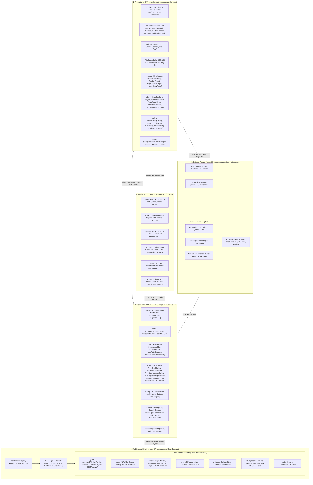

# GregTech Calculator Board - Architecture & Developer Guide

  <b>English</b> | <a href="ARCHITECTURE_KR.md">한국어</a>

> 📘 **Detailed Technical Specification Series**:
> * 🇰🇷 **Korean Edition**: [docs/ko_kr/CODE_SPECIFICATION.md](ko_kr/CODE_SPECIFICATION.md)
> * 🇺🇸 **English Edition**: [docs/en_us/CODE_SPECIFICATION.md](en_us/CODE_SPECIFICATION.md)
> The complete v2.0.0 architecture specifications, 5 graph algorithms, Gauss-Jordan mass balance linear solver, `CategoryCapabilityMatrix`, and 2-tier on-demand streaming protocol are documented in the links above.

This document describes the internal architecture, mathematical solver engine, canvas rendering pipeline, and multi-mod compatibility layer (SPI) of **GregTech Calculator Board**.

---

## 1. System Overview

GTCalcBoard is architected into 5 strictly isolated layers following **Clean Architecture** and **Service Provider Interface (SPI)** principles:

The Core Domain Engine (`com.gtceu.calcboard.api`) and Common Mod Adapters (`com.gtceu.calcboard.compat`) maintain **0% dependency on Minecraft client GUI classes**, guaranteeing independent execution and 100% test pass rates under standard headless JVM environments.

---

## 2. Core Architectural Principles

### 2.1 Pure Domain Model (`RecipeNode`)
`RecipeNode` is an engine-level **pure domain data entity** representing all machines, generators, and compound modules on the canvas:
* **Zero Mod Coupling**: Contains no hardcoded mod branches or third-party classes.
* **Lifecycle & Physical Delegation**: Icon changes (`setMachineIcon`), energy types (`getEnergyType`), power calculations (`getSingleMachineEUt`), operational validation (`validateNode`), and multiblock BOM construction (`buildMultiblockBOM`) are delegated dynamically via `ModAdapterRegistry.getAdapterForNode(node)`.
* **Type-Safe Dynamic Properties**: Mod-specific metadata is encapsulated in `NodePropertyStore` using `NodeProperties`.
* **Immutable View Encapsulation (`FlowGraph`)**: Graph topologies are protected via `Collections.unmodifiableList` and indexed via an internal $O(1)$ `nodeMap`.

### 2.2 Mathematical Solver & Gauss-Jordan Mass Balance (`MassBalanceSolver`)
* **Gauss-Jordan Linear System ($A\mathbf{x} = \mathbf{b}$)**: Solves closed-loop recycling circuits with partial pivoting to guarantee exact mass conservation across complex chemical loops.
* **10-Pass Fixed-Point Relaxation**: Iteratively converges machine steady-state utilization efficiencies ($\eta \in [0.0, 1.0]$) under upstream supply limits.

### 2.3 High-Performance Rendering & Spatial Indexing
* **Single-Pass Batch Rendering**: Culls off-screen elements and renders all visible cards and wires in a unified geometry batch.
* **$128 \times 128$ AABB Uniform Grid (`WireSpatialIndex`)**: Accelerates wire hover and hit testing from $O(E)$ down to **$O(\log E)$**.

### 2.4 Multiplayer Streaming & Distributed Locks
* **2-Tier On-Demand Paging**: Open boards synchronize lightweight metadata (`S2CSyncWorkspaceMetaPacket`) first, loading detailed graph NBTs only upon tab activation.
* **512KB Chunked Streaming (`S2CChunkedDataPacket`)**: Splits large payloads into 512KB chunks, eliminating Netty 2MB buffer overflow crashes.
* **Distributed Lease Locks (`WorkspaceLockManager`)**: Prevents concurrent editing conflicts via 300s lease timeouts and optimistic revision validation.

### 2.5 Deductive Analysis Policy (Rule 5)
* **Zero Heuristics**: String matching, item names, and tooltip parsing (`id.getPath().contains(...)`) are strictly prohibited.
* **3-Step Deterministic Deduction**:
  1. Official APIs & Java Reflection.
  2. Physics Simulations & Internal Objects.
  3. Deterministic NBT numerical data structures & official `TagKey` lookups.

---

> 📑 **Detailed Specifications**:
> * [[00] System Overview](en_us/spec/00_OVERVIEW.md)
> * [[01] Core Domain Models](en_us/spec/01_CORE_DOMAIN_AND_MODELS.md)
> * [[02] Mathematical Engine & Algorithms](en_us/spec/02_MATH_AND_ALGORITHMS.md)
> * [[03] UI & Rendering Pipeline](en_us/spec/03_UI_AND_RENDERING_PIPELINE.md)
> * [[04] Multiplayer & Network Protocol](en_us/spec/04_MULTIPLAYER_AND_NETWORK_PROTOCOL.md)
> * [[05] External Integration & i18n](en_us/spec/05_INTEGRATION_AND_I18N.md)
