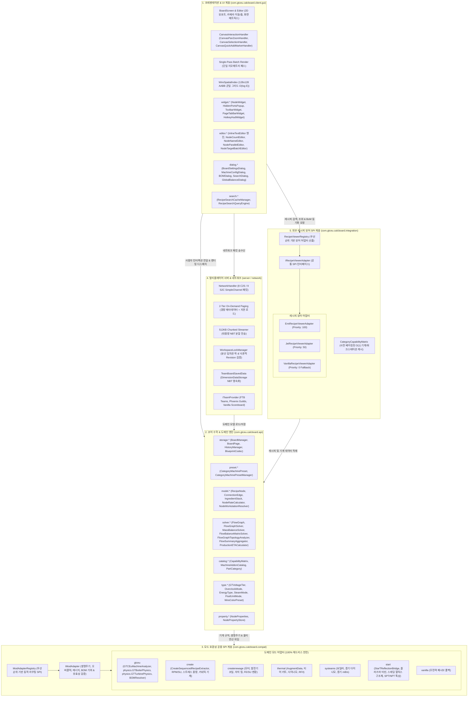

# GregTech Calculator Board - 아키텍처 및 개발자 가이드

  <a href="ARCHITECTURE.md">English</a> | <b>한국어</b>

> 📘 **상세 코드 명세서 시리즈**:
> * 🇰🇷 **한국어 에디션**: [docs/ko_kr/CODE_SPECIFICATION.md](ko_kr/CODE_SPECIFICATION.md)
> * 🇺🇸 **영문 에디션**: [docs/en_us/CODE_SPECIFICATION.md](en_us/CODE_SPECIFICATION.md)
> 전체 v2.0.0 아키텍처 명세서, 5대 그래프 알고리즘, 폐루프 질량 보존 가우스-요르단 선형 솔버, `CategoryCapabilityMatrix`, 및 2계층 온디맨드 멀티플레이어 스트리밍 프로토콜은 위 링크에서 확인할 수 있습니다.

본 문서는 **GregTech Calculator Board (그렉텍 계산기 보드)**의 내부 시스템 아키텍처, 수학적 솔버 엔진, 캔버스 렌더링 파이프라인, 및 멀티 모드 호환성 계층(SPI)을 설명합니다.

---

## 1. 시스템 개요 (System Overview)

본 프로젝트는 **클린 아키텍처(Clean Architecture)** 및 **SPI(Service Provider Interface)** 원칙에 따라 엄격히 격리된 5개의 계층으로 구성되어 있습니다:

코어 연산 엔진(`com.gtceu.calcboard.api`)과 공용 어댑터 계층(`com.gtceu.calcboard.compat`)은 마인크래프트 클라이언트 GUI 및 렌더링 클래스에 대한 의존성이 전혀 없으므로, 헤드리스(Headless) 전용 서버 환경에서도 단독 실행 및 JUnit 단위 테스트 100% 독립 통과가 보장됩니다.

---

## 2. 핵심 아키텍처 원칙 (Core Architectural Principles)

### 2.1 순수 도메인 모델 (`RecipeNode`)
`RecipeNode`는 캔버스 상의 모든 가공 기계, 발전기, 복합 공정 모듈을 대변하는 엔진 레벨의 **순수 도메인 데이터 모델**입니다:
* **모드 종속성 일체 배제**: `RecipeNode` 내부에는 특정 모드(GTCEu, Create, Thermal 등)의 규칙이 하드코딩되지 않습니다.
* **생명주기 및 동작 위임**: 기계 아이콘 교체(`setMachineIcon`), 에너지 형태 판별(`getEnergyType`), 단일 기계 소비/발전량(`getSingleMachineEUt`), 가동 유효성 검증(`isOperational`), BOM 추가 부품 산출(`buildMultiblockBOM`) 등 모든 모드 특화 동작은 `ModAdapterRegistry.getAdapterForNode(node)`를 통해 해당 모드의 `IModAdapter` 구현체로 위임됩니다.
* **타입 세이프 동적 속성 관리**: 특정 모드나 피처 전용 메타데이터(반사판 티어, 터빈 로터 효율, 클린룸 레벨 등)는 클래스 필드로 확장하지 않고, `NodePropertyStore`와 `NodeProperties`를 통해 타입 안전하게 캡슐화됩니다.
* **불변 뷰 캡슐화 (`FlowGraph`)**: 그래프 토폴로지는 `Collections.unmodifiableList` 불변 뷰로 보호되며, 내부 `nodeMap`을 통해 $O(1)$ 빠른 색인을 지원합니다.

### 2.2 수학 엔진 및 가우스-요르단 폐루프 질량 보존 솔버 (`MassBalanceSolver`)
* **가우스-요르단 선형 연립방정식 해 도출 ($A\mathbf{x} = \mathbf{b}$)**: 화학 공정의 순환 재활용 폐루프 사이클에서 질량 보존 법칙을 만족하는 기계 대수 벡터 $\mathbf{x}$를 부분 피보팅 기반의 엄밀한 선형대수학 수치해석으로 계산합니다.
* **10-Pass Fixed-Point Relaxation**: 상류 원자재 공급 제약 하에서 모든 기계의 정상 상태 가동률($\eta \in [0.0, 1.0]$)을 수치적으로 수렴 연산합니다.

### 2.3 고성능 렌더링 파이프라인 및 공간 분할
* **Single-Pass Batch Rendering**: 뷰포트 내의 노드와 와이어를 단일 지오메트리 패스로 렌더링하여 프레임 레이트를 극대화합니다.
* **$128 \times 128$ AABB 균일 그리드 공간 분할 (`WireSpatialIndex`)**: 1,000개 이상의 복잡한 와이어 네트워크에서 마우스 호버 및 클릭 감지를 $O(E)$에서 **$O(\log E)$ 공간 분할 색인**으로 가속합니다.

### 2.4 멀티플레이어 스트리밍 및 분산 락
* **2계층 온디맨드 페이징**: 보드 오픈 시 경량 메타데이터(`S2CSyncWorkspaceMetaPacket`)만 동기화하고, 활성 탭 클릭 시에만 세부 그래프 NBT를 온디맨드로 지연 로드합니다.
* **512KB 청킹 스트리밍 (`S2CChunkedDataPacket`)**: $512\text{KB}$ 초과 대용량 데이터를 안전하게 분할 스트리밍하여 Netty $2\text{MB}$ 버퍼 오버플로우 크래시를 원천 차단합니다.
* **분산 임차권 락 (`WorkspaceLockManager`)**: 300초 임차권(Lease) 기반 소프트 락과 낙관적 Revision 번호 검증을 통해 실시간 동시 편집 충돌을 방지합니다.

### 2.5 애드온 및 스펙 연역적 분석 원칙 (Rule 5)
* **휴리스틱 문자열 추론 금지**: 툴팁 텍스트, 아이템 이름, 아이템 ID 경로(`id.getPath().contains(...)`)를 매칭하여 기계 티어나 애드온 수치를 추측하는 것을 엄격히 금지합니다.
* **결정론적 3단계 연역 체계**:
  1. 공식 API 및 런타임 Java 리플렉션을 통한 기능적 연역.
  2. 모드 내부 객체/물리 시뮬레이션 직접 실행.
  3. 결정론적 NBT 수치 데이터 구조(`AugmentData` Float/Int 태그) 및 공식 `TagKey` 직접 검사.

---

> 📑 **세부 사양서 바로가기**:
> * [[00] 시스템 아키텍처 개요](ko_kr/spec/00_OVERVIEW.md)
> * [[01] 코어 도메인 모델](ko_kr/spec/01_CORE_DOMAIN_AND_MODELS.md)
> * [[02] 수학 엔진 및 알고리즘](ko_kr/spec/02_MATH_AND_ALGORITHMS.md)
> * [[03] UI 및 렌더링 파이프라인](ko_kr/spec/03_UI_AND_RENDERING_PIPELINE.md)
> * [[04] 멀티플레이어 및 네트워크](ko_kr/spec/04_MULTIPLAYER_AND_NETWORK_PROTOCOL.md)
> * [[05] 외부 연동 및 다국어](ko_kr/spec/05_INTEGRATION_AND_I18N.md)