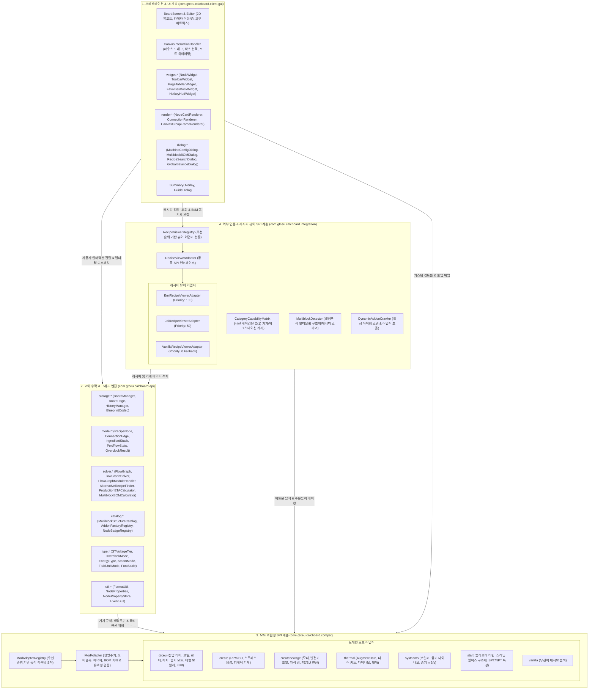
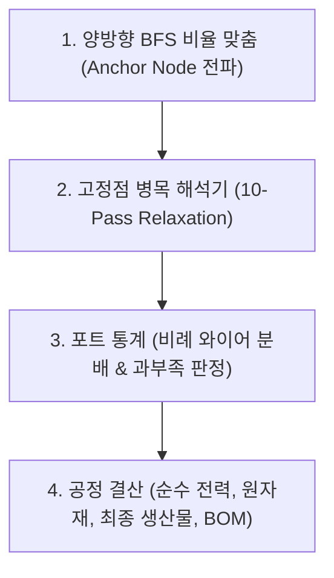
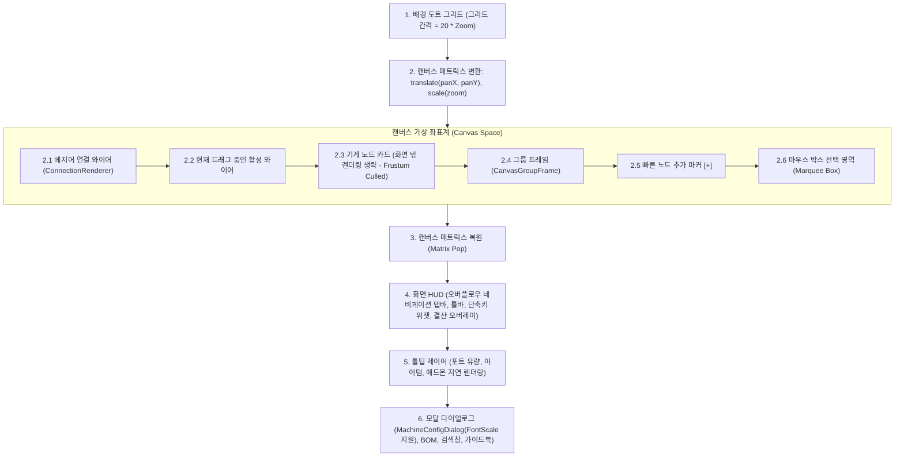

# GregTech Calculator Board - 아키텍처 및 개발자 가이드

  <a href="ARCHITECTURE.md">English</a> | <b>한국어</b>

> 📘 **상세 코드 명세서 시리즈**:
> * 🇰🇷 **한국어 에디션**: [docs/ko_kr/CODE_SPECIFICATION.md](ko_kr/CODE_SPECIFICATION.md)
> * 🇺🇸 **영문 에디션**: [docs/en_us/CODE_SPECIFICATION.md](en_us/CODE_SPECIFICATION.md)
> 전체 v2.0.0 아키텍처 명세서, 5대 그래프 알고리즘, `CategoryCapabilityMatrix`, 및 멀티플레이어 동시성 락 프로토콜은 위 링크에서 확인할 수 있습니다.

본 문서는 **GregTech Calculator Board (그렉텍 계산기 보드)**의 내부 시스템 아키텍처, 수학적 솔버 엔진, 캔버스 렌더링 파이프라인, 및 멀티 모드 호환성 계층(SPI)을 설명합니다.

---

## 1. 시스템 개요 (System Overview)

본 프로젝트는 **클린 아키텍처(Clean Architecture)** 및 **SPI(Service Provider Interface)** 원칙에 따라 엄격히 격리된 4개의 계층으로 구성되어 있습니다:

코어 연산 엔진(`com.gtceu.calcboard.api`)은 마인크래프트 클라이언트 GUI 및 렌더링 클래스에 대한 의존성이 전혀 없으므로, 헤드리스(Headless) 서버 환경에서도 단독 실행 및 JUnit 단위 테스트 100% 독립 통과가 보장됩니다.

---

## 2. 핵심 아키텍처 원칙 (Core Architectural Principles)

### 2.1 순수 도메인 모델 (`RecipeNode`)
`RecipeNode`는 캔버스 상의 모든 가공 기계, 발전기, 복합 공정 모듈을 대변하는 엔진 레벨의 **순수 도메인 데이터 모델**입니다:
* **모드 종속성 일체 배제**: `RecipeNode` 내부에는 특정 모드(GTCEu, Create, Thermal 등)의 규칙이 하드코딩되지 않습니다.
* **생명주기 및 동작 위임**: 기계 아이콘 교체(`setMachineIcon`), 에너지 형태 판별(`getEnergyType`), 기본 병렬(`getDefaultParallel`), 단일 기계 소비/발전량(`getSingleMachineEUt`), 가동 유효성 검증(`isOperational`), BOM 추가 부품 산출(`populateExtraBOMParts`) 등 모든 모드 특화 동작은 `ModAdapterRegistry.getAdapterForNode(node)`를 통해 해당 모드의 `IModAdapter` 구현체로 위임됩니다.
* **타입 세이프 동적 속성 관리**: 특정 모드나 피처 전용 메타데이터(반사판 티어, 터빈 로터 효율, 클린룸 레벨 등)는 클래스 필드로 확장하지 않고, `NodePropertyStore`와 `NodeProperties`를 통해 타입 안전하게 캡슐화됩니다.
* **인플레이스 대체 레시피 교체 (`AlternativeRecipeFinder`)**: 노드를 삭제하지 않고 동일 머신/산출물의 대체 레시피로 즉시 스위칭하며, 동일 재료 포트 와이어를 자동 보존하고 Undo/Redo를 지원합니다.

### 2.2 통합 레시피 뷰어 SPI (`IRecipeViewerAdapter`)
* **플러그형 레시피 뷰어 연동**: `RecipeViewerRegistry`를 통해 런타임에 설치된 모드에 맞춰 최적의 레시피 뷰어 어댑터(EMI ➔ JEI ➔ Vanilla Fallback)를 자동 선출합니다.
* **BoM 트리 목표 등록**: 멀티블록 BoM 쇼핑 리스트를 EMI Recipe Tree 또는 JEI++ 목표로 1클릭 등록하여 하위 재료 크래프팅을 역추적할 수 있습니다.

### 2.3 애드온 및 스펙 연역적 분석 원칙 (Rule 5)
* **휴리스틱 문자열 추론 금지**: 툴팁 텍스트, 아이템 이름, 아이템 ID 경로(`id.getPath().contains(...)`)를 매칭하여 기계 티어나 애드온 수치를 추측하는 것을 엄격히 금지합니다.
* **결정론적 연역 획득 (Deterministic Deduction)**:
  1. 대상 모드의 공식 API 및 런타임 Java 리플렉션을 통한 기능적 연역.
  2. 모드 내부 객체/물리 시뮬레이션 실행.
  3. 결정론적 NBT 수치 데이터(예: `AugmentData` 실수/정수 복합 태그) 및 공식 Forge `TagKey` 직접 검사.

### 2.4 생명주기 이벤트 버스 (Lifecycle Event Bus)
외부 모드나 애드온이 캔버스 노드 생성, 수정, 삭제, 계산 전/후, 카탈로그 구축 이벤트를 구독하고 확장할 수 있도록 표준 Forge 이벤트(`RecipeNodeEvent`, `FlowGraphEvent`, `MachineCatalogEvent`)를 발행합니다.

---

## 3. 멀티 모드 에너지 및 물리 모델 (Multi-Mod Energy Models)

| 에너지 형태 (`EnergyType`) | 대상 모드 | 물리 지표 | 오버클록 및 속도 메커니즘 | 주관 어댑터 |
| :--- | :--- | :--- | :--- | :--- |
| **`ELECTRIC_EU`** | GregTech CEu | $\text{EU/t}$, 전압 티어 | 표준 4x/2x, 퍼펙트 4x/4x, 서브틱 배치 승격 | [`GTCEuModAdapter`](file:///d:/dev-ssd/modding/minecraft/GregTechCalculatorBoard/src/main/java/com/gtceu/calcboard/compat/gtceu/GTCEuModAdapter.java) |
| **`KINETIC_SU`** | Create | $\text{SU}$ (회전력), $\text{RPM}$ | 속도 비례: $\text{Duration} \propto \frac{1}{\text{RPM}}$ (팬 가공은 고정 시간) | [`CreateModAdapter`](file:///d:/dev-ssd/modding/minecraft/GregTechCalculatorBoard/src/main/java/com/gtceu/calcboard/compat/create/CreateModAdapter.java) |
| **`ELECTRIC_FE`** | Thermal / New Age | $\text{RF/t}$ / $\text{FE/t}$ | 증강 키트 & 티어 키트 (기본 전력 + 보조 배율) | [`ThermalModAdapter`](file:///d:/dev-ssd/modding/minecraft/GregTechCalculatorBoard/src/main/java/com/gtceu/calcboard/compat/thermal/ThermalModAdapter.java) |
| **`HEAT_OR_SELF`** | Boilers / Dynamos | $\text{mB/s Steam}$ 생산 | 소형 보일러 ($\text{LP}=1\times, \text{HP}=3\times$), 대형 보일러 ($\text{L-Bronze}=1\times$, $\text{L-Steel}=2.25\times$, $\text{L-Titanium}=4\times$, $\text{L-Tungstensteel}=8\times$), 쓰로틀 ($25\% \sim 100\%$) | [`GTCEuModAdapter`](file:///d:/dev-ssd/modding/minecraft/GregTechCalculatorBoard/src/main/java/com/gtceu/calcboard/compat/gtceu/GTCEuModAdapter.java), [`SysteamsModAdapter`](file:///d:/dev-ssd/modding/minecraft/GregTechCalculatorBoard/src/main/java/com/gtceu/calcboard/compat/systeams/SysteamsModAdapter.java) |
| **`NONE`** | Vanilla / Passive | 무전력 ($0\text{ EU/t}$) | 고정 시간 및 기본 레시피 배수 | [`VanillaModAdapter`](file:///d:/dev-ssd/modding/minecraft/GregTechCalculatorBoard/src/main/java/com/gtceu/calcboard/compat/vanilla/VanillaModAdapter.java) |

---

## 4. 수학적 솔버 엔진 (`FlowGraphSolver`)

### 4.1 알고리즘 1: 10-Pass Fixed-Point Bottleneck Relaxation
피드백 루프(부산물 재활용 공정) 및 공급 부족 상태에서 모든 노드의 정상 상태 가동률($\eta \in [0.0, 1.0]$)을 수렴 연산합니다:
1. 모든 노드의 효율을 $\eta_v^{(0)} = 1.0$으로 초기화.
2. 각 반복 단계 $k \in [1, 10]$에 대해:
   - 각 소비자 $C$의 입력 포트 $i$에 대해:
     $$\text{Supply}_{P_j} = \text{NominalRate}_{P_j} \times \eta_{P_j}^{(k-1)}$$
     $$\text{PortDemand}_{P_j} = \sum_{c \in \text{Consumers}(P_j)} \text{NominalDemand}_c$$
     $$\text{IncomingSupply}_i = \sum_{P_j} \min\left(\text{NominalDemand}_C, \text{Supply}_{P_j} \times \frac{\text{NominalDemand}_C}{\text{PortDemand}_{P_j}}\right)$$
     $$\rho_i = \frac{\text{IncomingSupply}_i}{\text{NominalDemand}_{C, i}}$$
   - 노드 효율 갱신: $\eta_C^{(k)} = \min_i (\rho_i, 1.0)$.
3. 수렴 조건($\max_v |\eta_v^{(k)} - \eta_v^{(k-1)}| < 10^{-4}$) 만족 시 조기 종료.

### 4.2 알고리즘 2: 포트 유량 통계 (`PortFlowStats`)
- **입력 포트**: 명목 요구량과 실제 유입량을 비교하여 부족(경고 점멸), 100% 균형(녹색), 잉여를 시각적으로 판정.
- **출력 포트**: 실제 생산량과 하류 요구량을 비교하여 잉여(안전), 100% 균형, 공급 부족을 판정.

### 4.3 알고리즘 3: Dual-Pass BFS Auto-Ratio
기준 마스터(Anchor) 노드로부터 전체 공정 기계 대수를 1:1로 자동 정합합니다:
1. **Upstream Pass**: 소비자 $\rightarrow$ 생산자 역방향 순회하여 $\text{Supply} \ge \text{Demand}$가 되도록 대수 상향.
2. **Downstream Pass**: 생산자 $\rightarrow$ 부산물 소비자 정방향 순회하여 폐기물/부산물 처리 대수 상향.
3. **Cycle Guard**: 최대 순회 횟수를 $\max(50, |V| \times 5)$로 제한하고 노드당 방문을 $\le 3$회로 제한하여 무한 루프 차단.

### 4.4 알고리즘 4: 오버클록 및 서브틱 연산
전압 티어 차이 $\Delta\text{Tier} > 0$일 때:
$$\text{Energy Multiplier} = (4.0)^{\Delta\text{Tier}}, \quad \text{Duration} = \frac{\text{baseDurationTicks}}{(2.0)^{\Delta\text{Tier}}}$$

$1.0\text{ Tick}$ 미만 서브틱 가공 시:
$$\text{batchesPerTick} = \frac{1.0}{\text{calculatedDurationTicks}}, \quad \text{effectiveDurationTicks} = 1.0$$
$$\text{CPS (Cycles Per Second)} = 20.0 \times \text{batchesPerTick} \times \text{parallel} \times \text{machineCount}$$

---

## 5. 멀티블록 구조체 및 BOM 엔진 (`MultiblockBOMCalculator`)

* **연역적 구조체 블루프린트 스캐너**: 컨트롤러 레시피 및 패턴 정의로부터 필요 케이싱 수, 가열 코일, 허용 해치/버스를 정확히 추출.
* **하이브리드 해치 오버라이드**: 고티어 해치, 1x/4x/9x/16x 멀티 해치, 듀얼 하위 티어 에너지 해치(`⚡ 1x Normal ↔ 2x 1-Tier Lower`)를 자유롭게 교체 적용.
* **단일 기계 및 컴패니언 블록 지원**: 카본 브러시용 발전기 코일(`Generator Coil`), 장착 자석(최대 12개), 서멀 증강 키트, 스레딩 헬릭스 자동 집계.
* **동적 케이싱 감산**: 유틸리티 해치(병렬, 유지보수, 광학, 컴퓨팅) 장착 시 기본 구조체 케이싱 블록 수량 자동 차감.
* **EMI 원클릭 가상 레시피 등록**: 산출된 전체 자재 명세서를 EMI 제작 트리의 루트 노드로 1클릭 등록하여 하위 크래프팅 역추적 지원.

---

## 6. UI 및 캔버스 렌더링 파이프라인 (UI Pipeline)

### 6.1 접근성 및 UI 가독성 확장
* **5단계 UI 배율 (`FontScale`)**: `MachineConfigDialog` 내 `[Aa 1.0x]` 버튼을 통해 0.75x~1.30x 실시간 스케일 조절 지원 (마우스 좌/우클릭, 휠 스크롤, `+`/`-` 단축키).
* **탭 바 오버플로우 클릭 네비게이션 (`PageTabBarWidget`)**: 다수의 페이지 생성 시 좌/우 `«`, `»` 인디케이터 클릭 및 휠 스크롤로 매끄러운 탭 이동 지원.
* **전역 유체 단위 모드 (`FluidUnitMode`)**: 툴바의 유체 단위 토글 버튼(`Shift+T`)을 통해 `AUTO`(자동 스케일링), `ALWAYS_MB`(항상 mB), `ALWAYS_B`(항상 B)로 캔버스 전체 유량 표기 일괄 통일.

---

## 7. 저장소 및 라이선스 (Repository & License)

- **저장소**: [Amvermain/GregTechCalculatorBoard](https://github.com/Amvermain/GregTechCalculatorBoard)
- **라이선스**: MIT License
- **개발자**: Amvermain