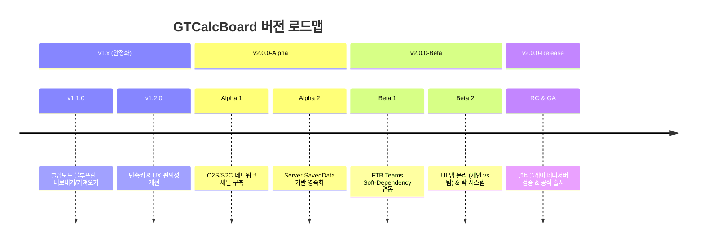
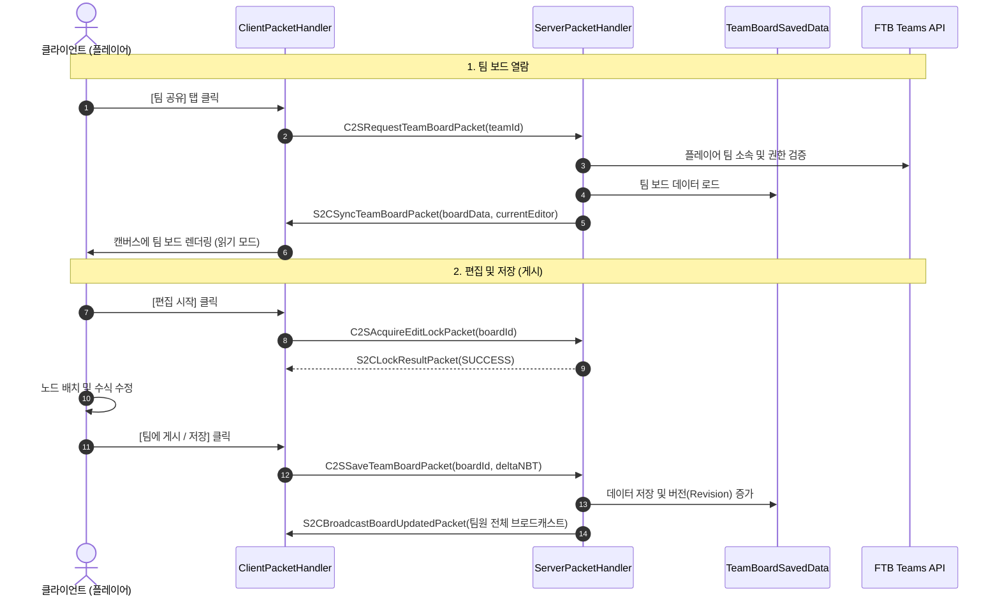
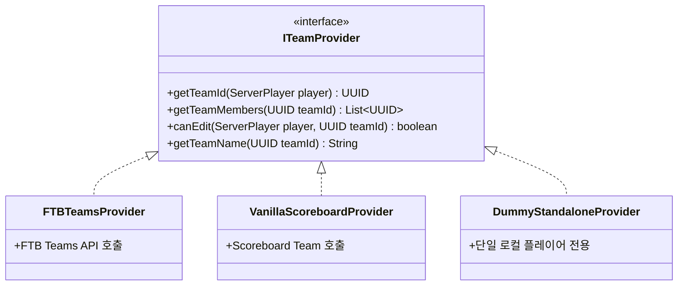

# GTCalcBoard v2.0.0 개발 계획서: 멀티플레이 & FTB Teams 연동

본 문서는 **GregTech Calculator Board (GTCalcBoard)**의 차세대 메이저 업데이트인 **`v2.0.0` (The Multiplayer & Team Collaboration Update)**의 기술 아키텍처, 기능 명세, 개발 단계 및 일정 로드맵을 정의합니다.

---

## 1. 프로젝트 비전 & 목표 (Executive Summary)

* **비전**: 개인용 계산 보드 도구(1.x)에서 **대규모 테크 모드팩(GTCEu Modern / GTNH) 멀티플레이의 핵심 협업 인프라(2.0)**로 도약.
* **핵심 가치**:
  1. **인게임 협업**: 디스코드나 외부 스프레드시트 없이 게임 내에서 팀원들과 공정 설계를 실시간/비동기로 공유.
  2. **모드팩 생태계 통합**: FTB Teams(및 바닐라 팀)와의 원활한 연동을 통한 팀별 작업 공간 자동 격리/공유.
  3. **무결성과 안정성**: 싱글플레이 및 FTB Teams가 없는 서버에서도 완벽하게 동작하는 소프트 디펜던시(Soft-Dependency) 구조 유지.

---

## 2. 시맨틱 버저닝 & 릴리즈 로드맵 (Milestones)



### [Phase 1] `v1.x` 기반 다지기 (v1.1.0 ~ v1.2.0)
* **목표**: 2.0 전환 전 클라이언트 완성도 및 직렬화 포맷 안정화.
* **주요 작업**:
  - `BlueprintCodec` 고도화 (NBT ↔ GZIP ↔ Base64 문자열 안정성 확보).
  - 대용량 노드 배치 시의 렌더링 성능 최적화.

### [Phase 2] `v2.0.0-Alpha` - 서버 네트워크 & 영속화 인프라
* **목표**: 클라이언트-서버 간 양방향 통신 및 월드 데이터 저장소 구축.
* **주요 작업**:
  - Forge `SimpleChannel` 네트워크 파이프라인 구축.
  - 서버 사이드 `TeamBoardSavedData` (`net.minecraft.world.level.saveddata.SavedData`) 구현.
  - 대용량 그래프 NBT 패킷 분할(Chunking) 또는 압축 스트리밍 처리.

### [Phase 3] `v2.0.0-Beta` - FTB Teams 연동 & 동시성 제어
* **목표**: 외부 팀 모드 연동 및 UI 완성.
* **주요 작업**:
  - `ITeamProvider` 인터페이스 설계 (FTB Teams ↔ Vanilla Scoreboard ↔ Standalone Fallback).
  - 화면 상단 `[👤 개인 보드]` / `[👥 팀 공유 보드]` 탭 UI 추가.
  - 편집 충돌 방지를 위한 '편집 잠금(Lock) / 게시(Publish)' 메커니즘 도입.

### [Phase 4] `v2.0.0` 정식 릴리즈 (GA)
* **목표**: 데디케이티드 서버 환경 부하 테스트 및 배포.
* **주요 작업**:
  - 10인 이상 멀티 서버 동시 접속 테스트.
  - 1.7.10 백포트 브랜치 호환 구조 검증 (`WorldSavedData` 매핑).
  - 한/영 문서 및 인게임 가이드 업데이트.

---

## 3. 시스템 아키텍처 설계 (Technical Architecture)

### 3.1 네트워크 & 패킷 파이프라인



### 3.2 서버 데이터 영속화 (`SavedData`)
- **저장 위치**: `<world>/data/gtcalcboard/team_<team_uuid>.dat`
- **저장 구조**:
  ```json
  {
    "format_version": 2,
    "team_id": "c1f7b029-...",
    "last_modified_by": "PlayerName",
    "last_modified_time": 1724123456789,
    "revision": 42,
    "active_lock": {
      "holder_uuid": "...",
      "expire_timestamp": 1724123800000
    },
    "pages": [
      {
        "id": "page_ethylene_line",
        "title": "석유 및 에틸렌 공정",
        "graph_nbt": "..."
      }
    ]
  }
  ```

### 3.3 팀 프로바이더 추상화 (`ITeamProvider`)

FTB Teams가 설치되지 않았거나 싱글 플레이인 환경에서도 크래시 없이 동작하도록 계층화합니다.



---

## 4. 동시성 제어 및 충돌 방지 전략

마인크래프트 서버의 패킷 낭비를 줄이고 데이터 손실을 방지하기 위해 **"가벼운 편집 잠금(Lock) + 수동 게시(Publish)"** 방식을 채택합니다.

1. **소유권 기반 잠금 (Soft Lock)**
   * 한 플레이어가 [편집] 모드로 진입하면 서버에 락을 요청합니다.
   * 다른 팀원이 해당 보드를 열면 **"🔒 [플레이어A]님이 수정 중입니다 (읽기 전용)"** 상태로 표시됩니다.
2. **락 타임아웃 & 유휴 해제 (Heartbeat & Timeout)**
   * 편집 중인 플레이어가 5분 이상 조작이 없거나 접속을 종료하면 자동으로 락이 반환됩니다.
3. **개인 보드로 복사 (Fork to Personal)**
   * 다른 팀원이 편집 중이더라도, 현재 상태를 내 `[개인 보드]`로 즉시 복사하여 독립적으로 수정해 볼 수 있습니다.

---

## 5. UI / UX 명세

1. **상단 탭 바 분리**
   * `[ 👤 내 보드 ]` : 로컬 저장 / 개인 작업 공간.
   * `[ 👥 팀 보드 (FTB) ]` : 서버 동기화 / 팀원 공유 공간.
2. **팀 툴바 버튼**
   * `[ 💾 팀에 저장 ]`: 수정한 내용을 서버에 커밋하고 팀원들에게 푸시.
   * `[ 🔄 최신 불러오기 ]`: 다른 팀원이 수정한 최신 상태로 새로고침.
   * `[ 📋 개인 보드로 복사 ]`: 팀 보드를 내 개인 탭으로 포크(Fork).
3. **상태 표시기 (Status Indicator)**
   * 동기화 완료 (`● 정상`), 수정 중 (`● 로컬 변경사항 있음`), 다른 유저 편집 중 (`🔒 잠김`).

---

## 6. 테스트 & 품질 보증 (QA Strategy)

| 구분 | 테스트 항목 | 검증 방법 |
| :--- | :--- | :--- |
| **단위 테스트** | NBT 직렬화/역직렬화 호환성 | JUnit headless 테스트로 대규모 노드 데이터 변환 검증 |
| **패킷 테스트** | 대용량 그래프 전송 시 패킷 크기 한계 | 500개 이상 노드 그래프 저장 시 패킷 분할/압축 검증 |
| **동시성 테스트** | 다중 클라이언트 동시 접근 | 데디케이티드 서버 환경에서 3인 이상 동시 락 요청/해제 검증 |
| **호환성 테스트** | FTB Teams 부재 환경 | FTB Teams 모드 제거 후 바닐라/싱글 환경에서 무결성 검증 |
| **백포트 검증** | 1.7.10 구조 호환성 | `SavedData` ➔ `WorldSavedData` 매핑 인터페이스 사전 호환 |

---

## 7. 결론

`v2.0.0` 업데이트는 GTCalcBoard를 단순한 편의성 계산기를 넘어 **멀티플레이 팩토리 자동화의 핵심 협업 플랫폼**으로 진화시키는 중대한 이정표가 될 것입니다.
단계별 마일스톤에 따라 안정성을 최우선으로 점진적 개발을 진행합니다.
