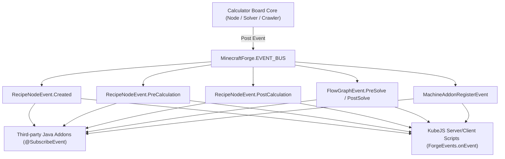
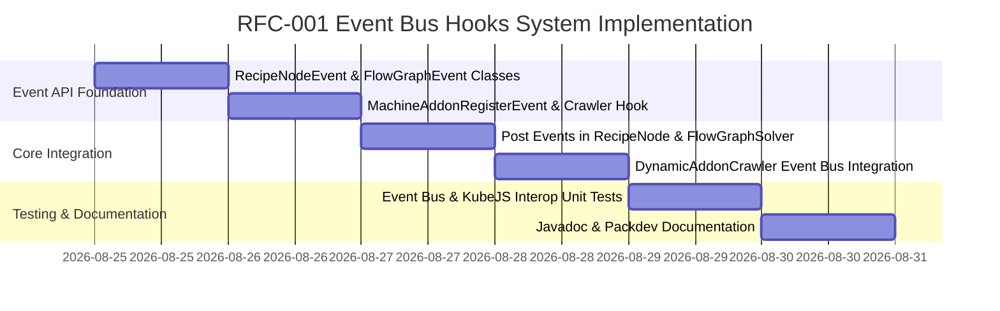

# RFC-001: 생명주기 및 확장 이벤트 버스 훅 시스템 (Lifecycle & Extension Event Bus Hooks)

* **문서 번호**: RFC-001
* **상태**: `IMPLEMENTED`
* **대상 버전**: `v2.0.0-alpha.9+`
* **주제**: Forge Event Bus(`MinecraftForge.EVENT_BUS`) 기반 노드 생명주기, 그래프 솔버 연산, 커스텀 애드온 등록 훅 및 KubeJS 스크립트 연동 개방형 API 시스템

---

## 1. 개요 및 배경 (Motivation)

### 1.1 배경
* 마인크래프트 모드 생태계, 특히 그렉텍(GTCEu Modern) 및 대형 테크 모드팩 환경에서는 **KubeJS, CraftTweaker 및 서드파티 애드온 모드**가 게임의 규칙과 레시피를 동적으로 변경합니다.
* 기존의 어댑터(`IModAdapter`)와 내부 크롤러(`DynamicAddonCrawler`)는 자바 레벨에서 강력하지만, 모드팩 제작자(Packdev)가 스크립트만으로 계산기 보드와 상호작용하기에는 다음과 같은 한계가 있었습니다:
  1. **KubeJS 스크립트 접근성 부재**: 모드팩 제작자가 특정 레시피의 계산 결과를 스크립트로 보정하거나, 모드팩 전용 커스텀 애드온을 손쉽게 주입할 방법이 없습니다.
  2. **서드파티 애드온의 믹스인(Mixin) 위험성**: 타 모드가 노드 생성이나 그래프 연산 타이밍을 가로채기 위해 내부 코드를 패치해야 하는 위험이 존재합니다.
* 마인크래프트의 표준 이벤트 버스인 `MinecraftForge.EVENT_BUS`에 생명주기 이벤트를 포스팅(Post)하면, 리스너가 없을 때는 **비용이 0에 수렴(Zero Overhead)**하면서도 생태계 전체에 완벽한 확장성을 제공할 수 있습니다.

### 1.2 목표
1. **표준 Forge Event 계층 구조 구축**:
   * `RecipeNodeEvent` (Created, PreCalculation, PostCalculation)
   * `FlowGraphEvent` (PreSolve, PostSolve)
   * `MachineAddonRegisterEvent` (커스텀 하드웨어 애드온 주입)
2. **KubeJS 모드팩 스크립트 100% 호환**:
   * `ForgeEvents.onEvent`를 통해 스크립트 몇 줄로 계산기 보드의 노드 속성, 유량, 애드온을 자유롭게 제어.
3. **취소(Cancelable) 및 수치 변조(Mutable) 파이프라인**:
   * 이벤트 리스너에서 계산된 유량, 소요 시간, 전력량을 직접 읽고 수정할 수 있는 안전한 인터페이스 제공.

---

## 2. 사용자 핵심 유저 스토리 (User Stories)

| ID | 역할 | 행동 (Action) | 기대 효과 (Outcome) |
| :--- | :--- | :--- | :--- |
| **US-01** | 모드팩 제작자 (KubeJS) | `MachineAddonRegisterEvent`를 리슨하여 커스텀 퀘스트 보상 증강을 등록 | 인게임 계산기 보드의 Hardware Config 다이얼로그에 모드팩 전용 애드온이 즉시 표시되고 연산에 반영됨 |
| **US-02** | 모드팩 제작자 (KubeJS) | `RecipeNodeEvent.PostCalculation`을 리슨하여 특정 매직 레시피의 유량을 2배로 부스트 | 스크립트 조건에 맞는 노드의 입출력 유량이 계산기 캔버스에서 자동으로 2배로 계산되어 반영됨 |
| **US-03** | 서드파티 모드 개발자 | `FlowGraphEvent.PostSolve`를 리슨하여 공정 최적화 결과 텔레메트리 획득 | 믹스인 없이도 플레이어가 계산기를 조작할 때 공정 그래프 데이터를 안전하게 읽어와 자체 GUI에 연동 |

---

## 3. 시스템 아키텍처 명세 (Architecture Specification)



---

## 4. 세부 API 및 이벤트 클래스 설계

### 4.1 패키지: `com.gtceu.calcboard.api.event`

#### 1. `RecipeNodeEvent.java`
```java
public abstract class RecipeNodeEvent extends net.minecraftforge.eventbus.api.Event {
    private final RecipeNode node;

    public RecipeNodeEvent(RecipeNode node) {
        this.node = node;
    }

    public RecipeNode getNode() {
        return node;
    }

    /**
     * Fired when a RecipeNode is created or initialized from EMI/Search.
     */
    public static class Created extends RecipeNodeEvent {
        public Created(RecipeNode node) {
            super(node);
        }
    }

    /**
     * Fired before overclocking, duration, and energy calculations are computed.
     */
    public static class PreCalculation extends RecipeNodeEvent {
        public PreCalculation(RecipeNode node) {
            super(node);
        }
    }

    /**
     * Fired after effective input/output rates are calculated.
     * Allows listeners to modify effective rates.
     */
    public static class PostCalculation extends RecipeNodeEvent {
        private final Map<IngredientStack, Double> inputRates;
        private final Map<IngredientStack, Double> outputRates;

        public PostCalculation(RecipeNode node, Map<IngredientStack, Double> inputRates, Map<IngredientStack, Double> outputRates) {
            super(node);
            this.inputRates = inputRates;
            this.outputRates = outputRates;
        }

        public Map<IngredientStack, Double> getInputRates() {
            return inputRates;
        }

        public Map<IngredientStack, Double> getOutputRates() {
            return outputRates;
        }
    }
}
```

#### 2. `FlowGraphEvent.java`
```java
public abstract class FlowGraphEvent extends net.minecraftforge.eventbus.api.Event {
    private final FlowGraph graph;

    public FlowGraphEvent(FlowGraph graph) {
        this.graph = graph;
    }

    public FlowGraph getGraph() {
        return graph;
    }

    public static class PreSolve extends FlowGraphEvent {
        public PreSolve(FlowGraph graph) {
            super(graph);
        }
    }

    public static class PostSolve extends FlowGraphEvent {
        public PostSolve(FlowGraph graph) {
            super(graph);
        }
    }
}
```

#### 3. `MachineAddonRegisterEvent.java`
```java
public class MachineAddonRegisterEvent extends net.minecraftforge.eventbus.api.Event {
    private final List<MachineAddon> registeredAddons = new ArrayList<>();

    public void register(MachineAddon addon) {
        if (addon != null) {
            registeredAddons.add(addon);
        }
    }

    public List<MachineAddon> getRegisteredAddons() {
        return Collections.unmodifiableList(registeredAddons);
    }
}
```

---

## 5. KubeJS 스크립트 작성 예시 (Packdev Guide)

```javascript
// kubejs/client_scripts/calcboard_custom_addons.js

// 1. 커스텀 퀘스트 전용 애드온 등록
ForgeEvents.onEvent('com.gtceu.calcboard.api.event.MachineAddonRegisterEvent', event => {
    let customAugment = new com.gtceu.calcboard.api.MachineAddon(
        "custom:star_booster",
        "Star Booster [8x Par, 2x Speed]",
        "Custom Star Technology Overclock Augment",
        "kubejs:item/star_booster",
        com.gtceu.calcboard.api.AddonCategory.AUGMENT
    );
    customAugment.setParallelMultiplier(8);
    customAugment.setDurationMultiplier(0.5);
    event.register(customAugment);
});

// 2. 특정 레시피 유량 동적 변조
ForgeEvents.onEvent('com.gtceu.calcboard.api.event.RecipeNodeEvent$PostCalculation', event => {
    let node = event.getNode();
    if (node.getName().contains("Starlight")) {
        // Starlight 생산량 100% 보너스 적용
        event.getOutputRates().forEach((stack, rate) => {
            event.getOutputRates().put(stack, rate * 2.0);
        });
    }
});
```

---

## 6. 개발 로드맵 (Phased Implementation)


