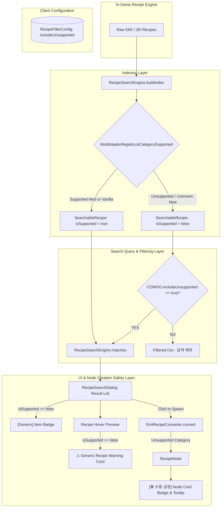
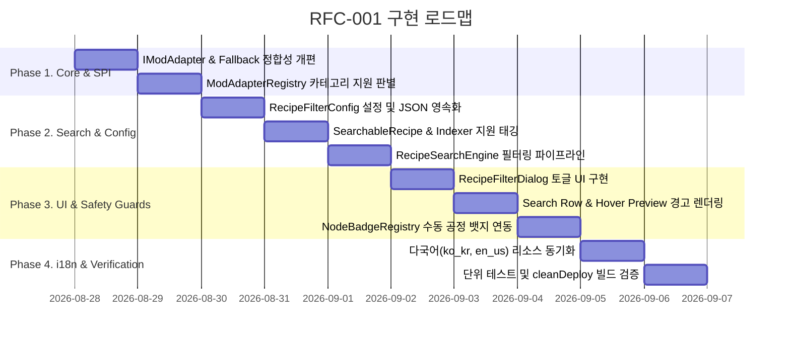

# RFC-001: 미지원 레시피 스마트 필터링 및 패널화 안전장치 (Smart Unsupported Recipe Filtering & Safety Guard)

| 항목 | 내용 |
| :--- | :--- |
| **문서 번호** | **RFC-001** |
| **기능명** | 미지원 레시피 스마트 기본 필터링 및 패널화 안전장치 |
| **대상 버전** | `v2.0.0-alpha.12` |
| **상태** | **ACCEPTED** |
| **작성일자** | 2026-08-28 |
| **저자** | GregTechCalculatorBoard Team |

---

## 1. 개요 및 배경 (Motivation)

### 1.1 현재의 기술적 / 사용자 경험적 한계
`GregTech Calculator Board`는 공정 흐름 다이어그램 작성과 함께 **정밀한 전력(EU/FE/SU) 소비·생산, 티어별 오버클럭, 가열 코일/터빈 로터 등 하드웨어 증강, 멀티블록 BOM 산출**을 지원하는 전문 공정 계산기입니다.

그러나 현재의 레시피 검색 및 노드 변환 엔진([`EmiRecipeConverter`](file:///d:/dev-ssd/modding/minecraft/GregTechCalculatorBoard/src/main/java/com/gtceu/calcboard/integration/emi/EmiRecipeConverter.java))은 런타임에 로드된 모든 EMI/JEI 레시피를 무차별적으로 인덱싱하고 수용합니다. 이로 인해 다음과 같은 심각한 문제가 발생합니다:

1. **부정확한 계산 데이터 (Garbage In, Garbage Out)**:
   - 전용 모드 어댑터([`IModAdapter`](file:///d:/dev-ssd/modding/minecraft/GregTechCalculatorBoard/src/main/java/com/gtceu/calcboard/compat/IModAdapter.java))가 구현되지 않은 타 모드(Mekanism, Botania, Blood Magic 등)의 레시피는 고유 메커니즘을 파싱할 수 없어 **기본값(20 ticks, 0 EU/t, ULV Tier, EnergyType.NONE)**으로 생성됩니다.
   - 이를 보드에 배치하면 전체 공정의 비율(Ratio) 계산 및 전력 수지가 완전히 왜곡됩니다.
2. **사용자 신뢰도 저하**:
   - 검색창에 노출된 레시피를 본 유저는 *"이 모드가 이 기계의 전력과 오버클럭까지 정상 지원한다"*고 기대하지만, 실제로는 더미 데이터로 생성되어 모드의 완성도를 오해하거나 버그로 인식하게 됩니다.
3. **검색 노이즈 폭증 (Signal-to-Noise Ratio 악화)**:
   - 대형 모드팩에서 수만~수십만 개의 미지원 레시피가 섞여 나와, 정작 유저가 찾고자 하는 GTCEu, Create, Thermal 등의 핵심 계산 대상 레시피를 검색하기 어려워집니다.

### 1.2 본 RFC의 핵심 목표
- **스마트 기본 필터링 (Smart Default)**: 공식 모드 어댑터가 명시적으로 지원을 선언한 카테고리/모드(GTCEu, Create, Thermal, Systeams, Create New Age, Vanilla 등)만 기본 검색 결과에 노출하여 계산 신뢰성과 검색 품질을 보장합니다.
- **사용자 선택권 보장 (Opt-In Toggle)**: 단순 아이템 흐름 다이어그램(Flowchart) 용도로 미지원 레시피가 필요한 유저를 위해, 필터 다이얼로그(⚙)에서 "미지원 레시피 포함" 토글 옵션을 제공합니다.
- **시각적 안전장치 (Safety Guards)**: 미지원 레시피를 검색하거나 보드에 노드로 배치할 경우, `[Generic / 미지원]` 뱃지, 경고 툴팁, `[🛠 수동 공정]` 노드 뱃지를 명확히 표시하여 사용자가 수치(시간/전력)를 직접 수동 입력해야 함을 인지시킵니다.

---

## 2. 핵심 유저 스토리 (User Stories)

| 대상 | 유저 액션 | 기대 결과 |
| :--- | :--- | :--- |
| **일반 플레이어** | 검색 단축키(`S`)를 눌러 레시피 검색창을 연다. | 공식 지원되는 GTCEu, Create, Thermal, 바닐라 레시피만 깔끔하게 노출되며, 미지원 모드의 더미 레시피로 인한 검색 노이즈가 발생하지 않는다. |
| **일반 플레이어** | 검색 결과에서 원하는 정밀 공정을 선택하여 보드에 배치한다. | 실제 인게임과 정확히 일치하는 소요 시간, 전압 티어, 오버클럭 공식이 즉시 적용되어 올바른 수치 계산이 이루어진다. |
| **커스텀 설계 유저** | 필터 설정(⚙)을 열고 `[ ] 미지원 레시피 포함` 체크박스를 활성화한다. | 미지원 타 모드의 레시피도 검색 목록에 나타나며, 항목에 `[Generic]` 주황색 뱃지가 표시된다. |
| **커스텀 설계 유저** | 미지원 레시피에 마우스를 올리거나(Hover) 보드에 배치한다. | 미리보기 카드에 "기본값으로 생성됨" 경고가 표시되고, 생성된 노드 상단에 `[🛠 수동 공정]` 뱃지가 부착되어 수치 수동 편집을 유도한다. |

---

## 3. 시스템 아키텍처 명세 (Architecture Specification)

### 3.1 전체 처리 파이프라인 (Pipeline Architecture)



---

### 3.2 SPI 및 어댑터 지원 판별 명세

#### 1) `IModAdapter` 인터페이스 확장
```java
public interface IModAdapter {
    // ... 기존 메서드 ...

    /**
     * 어댑터가 전용 모드 어댑터가 아닌 범용 폴백(Generic Fallback) 전용인지 여부를 선언합니다.
     * 기본값은 false입니다.
     */
    default boolean isGenericFallback() {
        return false;
    }
}
```

#### 2) `VanillaModAdapter` 정밀화
- `VanillaModAdapter`는 `isGenericFallback()`을 `true`로 선언합니다.
- `handlesCategory(ResourceLocation categoryId)`를 순수 바닐라 카테고리(`minecraft:crafting`, `minecraft:smelting`, `minecraft:blasting`, `minecraft:smoking`, `minecraft:campfire_cooking`, `minecraft:stonecutting`, `minecraft:smithing`, `minecraft:brewing`, `minecraft:composting`, `minecraft:anvil` 또는 `minecraft` 네임스페이스) 판별로 한정합니다.

#### 3) `ModAdapterRegistry.isCategorySupported` 판별 알고리즘
```java
public static boolean isCategorySupported(ResourceLocation categoryId) {
    init();
    if (categoryId == null) return false;

    // 1. 활성화된 전용 어댑터(폴백 제외)가 직접 지원하는지 검사
    for (IModAdapter a : ADAPTERS) {
        if (a.isGenericFallback()) continue;
        if (a.isLoaded() && a.handlesCategory(categoryId)) {
            return true;
        }
    }

    // 2. 바닐라 레시피 카테고리 지원 검사
    return isVanillaCategory(categoryId);
}
```

---

### 3.3 영속화 및 설정 데이터 구조 (Persistence Model)

#### `gtcalcboard_filters.json` 포맷 확장
```json
{
  "excludedCategories": [
    "gtceu:world_interaction",
    "gtceu:fluid_canning"
  ],
  "includeUnsupported": false
}
```

- `RecipeFilterConfig` 싱글톤에 `includeUnsupported` 필드를 추가하고, 하위 호환성을 보장하도록 기존 `Set<String>` 포맷 파싱 및 신규 JSON Object 포맷 파싱을 모두 수용합니다.

---

## 4. UI / UX 디자인 상세 명세

### 4.1 필터 다이얼로그 (RecipeFilterDialog) 와이어프레임

```
+-------------------------------------------------------------+
| ⚙ 카테고리 필터 설정 (Category Filters)                 [✕] |
+-------------------------------------------------------------+
| [전체 선택] [전체 해제] [기본값]   [🔍 카테고리 검색...     ] |
+-------------------------------------------------------------+
|  [✔] ⚡ 원심분리기 (Centrifuge)                       (142) |
|  [✔] ⚙ 압축기 (Compressor)                           (85)  |
|  [✔] 🪓 Create 절삭 (Cutting)                         (34)  |
|  [  ] ❌ 미지원 카테고리 (Mekanism Crusher)             (12)  |
+-------------------------------------------------------------+
| [✔] 미지원 모드/레시피 포함 (Include Unsupported)            |
|     💡 전력/시간 공식이 지원되지 않는 레시피를 목록에 표시  |
+-------------------------------------------------------------+
|                         [ 완료 (Done) ]                     |
+-------------------------------------------------------------+
```

### 4.2 검색 목록 및 Hover Preview 뱃지 디자인

1. **검색 결과 행 (List Row)**:
   - 지원 레시피: `[아이콘] [티어/전력/소요시간] 레시피 이름`
   - 미지원 레시피: `[아이콘] [Generic] §6레시피 이름 §8(미지원 모드)`
2. **Hover Preview 카드 상단 경고 박스**:
   - 배경: `0xEE3D2C1C` (Dark Amber)
   - 테두리: `0xFFFB923C` (Orange)
   - 내용:
     - `§6§l⚠ 미지원 레시피 (Generic Recipe)`
     - `§7이 레시피는 전력 및 소요 시간 자동 계산이 지원되지 않으며 기본값(20t, 0 EU/t)으로 생성됩니다.`

### 4.3 노드 카드 수동 공정(Generic) 뱃지 & 툴팁

- `NodeProperties.IS_GENERIC_UNSUPPORTED` 플래그가 `true`인 경우, `NodeBadgeRegistry`를 통해 노드 상단에 뱃지가 자동 부착됩니다:
  - 뱃지 텍스트: `🛠 수동 공정` (또는 `🛠 Generic`)
  - 뱃지 테두리/배경: 주황색 (`0xFFFB923C` / `0xEE3D2C1C`)
  - 툴팁:
    - `§6🛠 미지원 모드 공정`
    - `§7전력 및 소요 시간 공식이 매핑되지 않았습니다.`
    - `§e💡 노드 설정창에서 소요 시간과 전력 수치를 수동으로 입력하세요.`

---

## 5. 동시성 및 예외 처리 (Concurrency & Robustness)

1. **비동기 인덱싱 스레드 안전성**:
   - `SearchableRecipe` 레코드는 불변(Immutable) 객체이므로 백그라운드 인덱싱 스레드(`ForkJoinPool`)에서 `isSupported` 플래그를 빌드하여 캐싱해도 동시성 충돌이 없습니다.
2. **실시간 필터 토글 반응성**:
   - 필터 다이얼로그에서 `includeUnsupported` 토글 시, `RecipeSearchDialog`의 `searchVersion`을 원자적으로 증가시키고 즉시 재필터링(`updateSearchResultsSynchronously`)을 실행하여 딜레이 없이 UI에 반영됩니다.

---

## 6. 단계별 개발 로드맵 (Phased Implementation Roadmap)



---

## 7. 검증 및 테스트 체크리스트 (Verification Checklist)

- [ ] **단위 테스트 (Unit Tests)**:
  - `ModAdapterRegistryTest`: `isCategorySupported()`가 GTCEu, Create, Thermal, Systeams, Vanilla 카테고리에 대해 `true`, 미지원 카테고리에 대해 `false`를 반환하는지 검증.
  - `RecipeFilterConfigTest`: `includeUnsupported` 기본값이 `false`이며, JSON 직렬화/역직렬화가 정상 동작하는지 검증.
  - `RecipeSearchEngineTest`: `includeUnsupported == false`일 때 미지원 레시피가 검색 결과에서 완전히 제외되는지 검증.
  - `RecipeSearchEngineTest`: `includeUnsupported == true`일 때 미지원 레시피가 검색되고 `isSupported == false` 뱃지가 부착되는지 검증.
  - `I18nConsistencyTest`: `en_us.json`과 `ko_kr.json`의 신규 번역 키가 완벽하게 일치하는지 검증.
- [ ] **빌드 및 배포 검증**:
  - `.\gradlew.bat test` 전체 통과.
  - `.\gradlew.bat cleanDeploy` 정상 빌드 완료.
