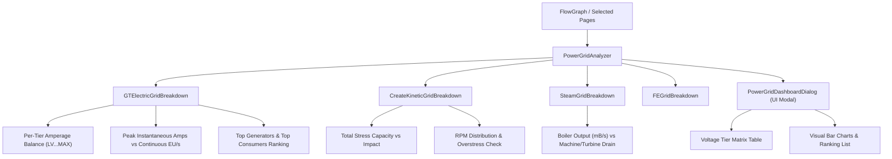
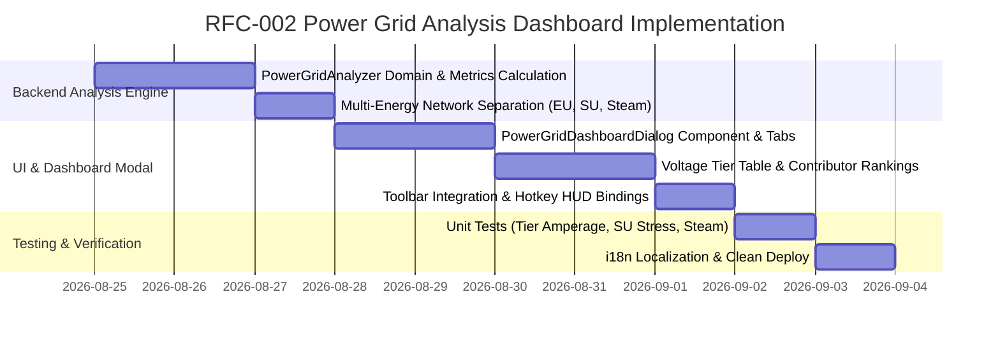

# RFC-002: 전력망 계통도 및 다종 에너지 수지 분석 대시보드 (Power Grid Analysis Dashboard)

* **문서 번호**: RFC-002
* **상태**: `PROPOSED / PLANNING`
* **대상 버전**: `v2.0.0-alpha.9+`
* **주제**: GTCEu 전압 티어별(LV~MAX) Amperage 수지 분석, Create 응력(SU), Thermal FE, 증기(Steam) 다종 에너지 분리 및 발전원/소비처 기여도 분석 계통도 시스템

---

## 1. 개요 및 배경 (Motivation)

### 1.1 배경
* 그렉텍(GregTech) 및 테크 모드팩에서 전력망 설계는 단순한 "총 전력량의 덧셈"이 아닙니다.
* 실제 인게임 공장 운영 시 다음과 같은 엄격한 계통 분리가 발생합니다:
  1. **전압 티어(Voltage Tier) 및 암페어(Amperage) 불일치**:
     * $32,768\text{ EU/t}$의 전력이 존재하더라도, 이것이 `EV (8A EV)`로 공급되는지 `IV (4A IV)`로 공급되는지에 따라 기계의 가동 여부와 변압기(Transformer / Substation) 필요 여부가 결정됩니다.
  2. **다종 에너지 네트워크 혼재 (Multi-Energy Networks)**:
     * GTCEu Electric EU, Create Kinetic SU (Stress Capacity vs Impact), Thermal Expansion FE, 그리고 초반 보일러/증기(Steam) 배관망은 서로 다른 물리 법칙과 한계를 지닙니다.
  3. **발전원과 부하 병목 추적의 어려움**:
     * 전력망 적자(Deficit) 발생 시, 어떤 발전기가 출력을 내지 못하고 있는지(예: 터빈 유량 부족), 어떤 공정 기계가 전체 전력의 대부분을 소모하고 있는지 직관적으로 파악하기 어렵습니다.
* 현재 계산기 보드는 전체 EU를 단순 합산(`netGen - netDrain`)하여 상단 배너에만 표시하므로, 티어별 계통 불균형이나 에너지 유형별 수지를 정밀하게 진단할 수 없습니다.

### 1.2 목표
1. **전압 티어별 전력 수지(Voltage Tier Power Breakdown)**: LV부터 MAX까지 각 티어별 발전량(Amps/EUt) vs 소비량(Amps/EUt) 및 흑자/적자 상태를 정밀 진단.
2. **다종 에너지 계통 분리 (Multi-Energy Grid)**:
   * ⚡ **GTCEu Electric EU**: 티어별 Amperage 및 변압 수지
   * ⚙ **Create Kinetic SU**: 총 발생 응력(Capacity) vs 소비 부하(Impact) 및 과부하율(% Stress)
   * ♨ **Steam Network**: 총 보일러 증기 발생량(mB/s) vs 증기 기계/터빈 소모량(mB/s)
   * 🔥 **Thermal / FE**: 발전량(FE/t) vs 소비량(FE/t)
3. **발전원/소비처 Top 기여도 분석 (Sources & Consumers Ranking)**:
   * 주요 발전 노드들의 발전 기여도(%)와 최대 전력 소모 기계 Top 5 랭킹 시각화.
4. **순시 피크 전력(Peak Amps) vs 초당 평균 소모(Continuous EU/s)** 비교 분석.
5. **독립된 전력망 대시보드 모달 및 툴바 연계**:
   * 상단 툴바 `[⚡ Power Grid]` 버튼 및 글로벌 밸런스 전력 배너 클릭을 통한 원클릭 접근.

---

## 2. 사용자 핵심 유저 스토리 (User Stories)

| ID | 역할 | 행동 (Action) | 기대 효과 (Outcome) |
| :--- | :--- | :--- | :--- |
| **US-01** | 공장 엔지니어 | 툴바의 `[⚡ Power Grid]` 버튼 클릭 | 전압 티어별(LV~UV), Create 회전력(SU), 증기(Steam) 계통별 흑자/적자 수지 표를 한눈에 확인 |
| **US-02** | 라인 설계자 | EV 라인에 대형 EBF와 분쇄기를 다수 배치 | Power Grid에서 `[EV Grid: -18A EV 🔴]` 결손 경고를 확인하고, 상위 IV 발전소로부터 스텝다운할 변압기(Transformer) 용량을 정확히 산출 |
| **US-03** | 발전소 설계자 | 플라즈마 터빈과 가스 터빈을 배치한 후 전력망 확인 | 발전원 랭킹에서 플라즈마 터빈이 80%, 가스 터빈이 20% 기여하고 있음을 확인하고 발전소 확장 계획 수립 |
| **US-04** | Create 자동화 유저 | Create 맷돌과 믹서 라인을 구성 | `[Kinetic SU Grid]` 탭에서 총 가용 65,536 SU 중 42,000 SU(64%)를 사용 중임을 확인하여 과부하(Overstress) 사전 방지 |

---

## 3. 시스템 아키텍처 명세 (Architecture Specification)



### 3.1 도메인 데이터 모델 (`PowerGridSummary.java`)

```java
public record PowerGridSummary(
    Map<GTVoltageTier, TierPowerBalance> electricBalances,
    KineticPowerBalance kineticBalance,
    SteamPowerBalance steamBalance,
    FEPowerBalance feBalance,
    List<PowerNodeContribution> topGenerators,
    List<PowerNodeContribution> topConsumers,
    double totalNetEUt
) {
    public record TierPowerBalance(
        GTVoltageTier tier,
        double generatedEUt,
        double consumedEUt,
        double generatedAmps,
        double consumedAmps,
        double netAmps,
        int generatorCount,
        int consumerCount
    ) {
        public boolean isDeficit() { return netAmps < -0.001; }
        public boolean isSurplus() { return netAmps > 0.001; }
    }

    public record KineticPowerBalance(
        double totalCapacitySU,
        double totalImpactSU,
        double netSU,
        double stressPercentage,
        int sourceCount,
        int consumerCount
    ) {
        public boolean isOverstressed() { return stressPercentage > 100.0; }
    }

    public record SteamPowerBalance(
        double generatedSteamPerSec,
        double consumedSteamPerSec,
        double netSteamPerSec
    ) {}

    public record PowerNodeContribution(
        String nodeTitle,
        ResourceLocation machineIcon,
        GTVoltageTier tier,
        double powerRate,
        double percentage,
        boolean isGenerator
    ) {}
}
```

---

## 4. UI / UX 디자인 상세

### 4.1 전력망 대시보드 모달 레이아웃 와이어프레임

```text
+-----------------------------------------------------------------------------------------------+
| ⚡ POWER GRID & ENERGY SYSTEM DASHBOARD                                                   [X] |
+-----------------------------------------------------------------------------------------------+
| [⚡ GT Electric (EU)]  |  [⚙ Kinetic (SU)]  |  [♨ Steam Grid]  |  [🔥 FE / Flux]              |
+-----------------------------------------------------------------------------------------------+
| ⚡ Electric System Overview: Total Net: +48,640 EU/t (Surplus 🟢)                             |
| Peak Instantaneous Draw: 124A | Average Continuous Consumption: 98,200 EU/s                   |
+-----------------------------------------------------------------------------------------------+
| [ Voltage Tier Breakdown ]                                                                    |
| TIER  | GENERATION         | CONSUMPTION        | NET BALANCE     | STATUS                    |
| LV    | 0A (0 EU/t)        | 4A (-128 EU/t)     | -4.00A LV       | 🔴 DEFICIT (Need Transf)  |
| MV    | 2A (+256 EU/t)     | 2A (-256 EU/t)     | 0.00A MV        | 🟡 BALANCED               |
| HV    | 8A (+4,096 EU/t)   | 4A (-2,048 EU/t)   | +4.00A HV       | 🟢 SURPLUS                |
| EV    | 32A (+65,536 EU/t) | 16A (-32,768 EU/t) | +16.00A EV      | 🟢 SURPLUS                |
| IV    | 0A (0 EU/t)        | 2A (-16,384 EU/t)  | -2.00A IV       | 🔴 DEFICIT                |
+-----------------------------------------------------------------------------------------------+
| [ Top Power Generators ]                 | [ Top Power Consumers ]                            |
| 1. ⚛ Nyinsane Plasma Turbine: 61.4k (65%) | 1. ⚡ Electric Blast Furnace #1: 16.3k (35%)       |
| 2. ⚡ Large Gas Turbine #1: 16.3k (18%)   | 2. ⚡ Chemical Reactor Line: 8.1k (18%)            |
| 3. ⚡ HV Diesel Generator: 4.0k (4%)     | 3. ⚡ Implosion Compressor: 4.0k (9%)              |
+-----------------------------------------------------------------------------------------------+
| 📑 Target Pages: [✔ Page 1] [✔ Page 2] [Select All]                     [📊 Export Grid Spec] |
+-----------------------------------------------------------------------------------------------+
```

---

## 5. 개발 로드맵 (Phased Implementation)


