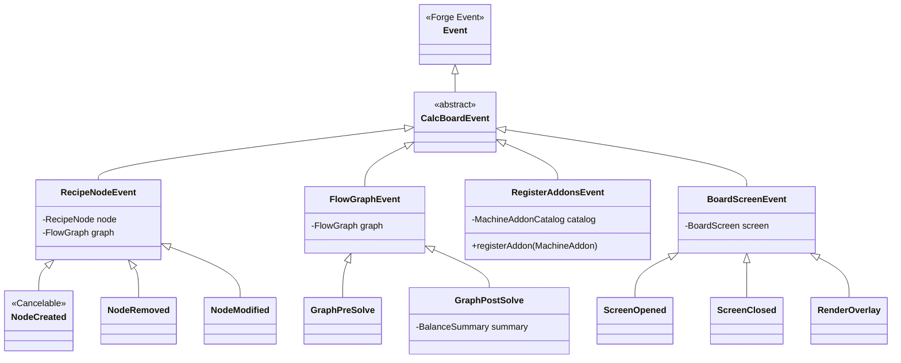
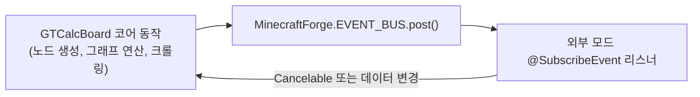

# RFC-003: Forge 라이프사이클 이벤트 버스 & 애드온 훅 시스템 (Lifecycle Event Bus & Hook System)

* **문서 번호**: RFC-003
* **상태**: `PROPOSED / PLANNING`
* **주제**: 외부 모드 및 애드온 개발자를 위한 Forge EventBus 기반 커스텀 이벤트(`MinecraftForge.EVENT_BUS`), 노드 라이프사이클 훅 및 확장 인프라

---

## 1. 개요 및 배경 (Motivation)

### 1.1 배경
현재 GTCalcBoard는 `IModAdapter` 및 `ModAdapterRegistry`를 통해 전체 모드 호환성을 완벽히 지원하고 있습니다.
* 그러나 외부 모드 개발자가 가벼운 커스텀 로직(예: *"노드가 생성될 때 특정 NBT 주입"*, *"연산 완료 후 결과 가로채기"*, *"커스텀 하드웨어 코일 아이템 등록"*)을 작성하고자 할 때, 전체 `IModAdapter`를 구현하는 것은 진입 장벽이 될 수 있습니다.
* 마인크래프트 모딩 표준인 **Forge EventBus (`@SubscribeEvent`)** 기반의 커스텀 이벤트를 발행하면, 외부 개발자들이 가장 익숙하고 표준적인 방식으로 우리 모드의 라이프사이클에 개입할 수 있습니다.

### 1.2 목표
1. **표준 Forge 이벤트 클래스 계층 구축 (`com.gtceu.calcboard.api.event.*`)**: 노드 생성, 그래프 연산, 애드온 등록, GUI 렌더링 시점에 이벤트 발행.
2. **취소 가능(Cancelable) 및 가변 이벤트 지원**: 외부 모드가 노드 생성을 취소하거나 연산 결과를 커스텀하게 보정할 수 있는 유연성 제공.
3. **완벽한 어댑터 시스템과의 공존**: `IModAdapter`는 대규모 모드 연동용으로 유지하고, `EventBus`는 가벼운 애드온 및 이벤트 기반 확장용으로 이원화 지원.

---

## 2. 이벤트 클래스 계층 구조 (Event Hierarchy)



---

## 3. 핵심 이벤트 상세 명세

### 3.1 노드 라이프사이클 이벤트 (`RecipeNodeEvent`)

```java
public abstract class RecipeNodeEvent extends CalcBoardEvent {
    private final RecipeNode node;
    private final FlowGraph graph;

    /** 노드가 캔버스에 생성되어 추가될 때 발행 (Cancelable) */
    @Cancelable
    public static class Created extends RecipeNodeEvent { ... }

    /** 노드가 캔버스에서 삭제될 때 발행 */
    public static class Removed extends RecipeNodeEvent { ... }

    /** 노드의 기계 대수, 티어, 오버클럭 모드가 변경될 때 발행 */
    public static class Modified extends RecipeNodeEvent { ... }
}
```

* **발행 시점**:
  - `FlowGraph.addNode(node)` 호출 시 $\rightarrow$ `MinecraftForge.EVENT_BUS.post(new RecipeNodeEvent.Created(node, this))`
* **활용 예시**:
  - 외부 애드온 모드가 노드 생성 시점에 커스텀 데이터 태그나 기본 병렬 설정을 자동으로 주입.

---

### 3.2 하드웨어 애드온 등록 이벤트 (`RegisterAddonsEvent`)

```java
public class RegisterAddonsEvent extends CalcBoardEvent {
    private final MachineAddonCatalog catalog;

    public void registerAddon(MachineAddon addon) {
        this.catalog.registerCustomAddon(addon);
    }
}
```

* **발행 시점**:
  - `DynamicAddonCrawler.crawlAll()` 실행 종료 시점에 발행.
* **활용 예시**:
  - 타 모드가 자기 모드의 커스텀 가열 코일이나 터빈 로터를 이벤트 리스너 한 줄로 즉시 등록:
  ```java
  @SubscribeEvent
  public static void onRegisterAddons(RegisterAddonsEvent event) {
      event.registerAddon(MachineAddon.coil(new ResourceLocation("mymod:super_coil"), 4500, 0.75));
  }
  ```

---

### 3.3 그래프 연산 훅 이벤트 (`FlowGraphEvent`)

```java
public abstract class FlowGraphEvent extends CalcBoardEvent {
    /** 그래프 계산 직전에 발행 */
    public static class PreSolve extends FlowGraphEvent { ... }

    /** 그래프 계산 완료 직후 결과 요약과 함께 발행 */
    public static class PostSolve extends FlowGraphEvent {
        private final BalanceSummary summary;
        public BalanceSummary getSummary() { return summary; }
    }
}
```

* **발행 시점**:
  - `FlowGraphSolver.solve()` 연산 완료 직후 발행.
* **활용 예시**:
  - 외부 모드가 연산된 총 전력(EU/t)이나 부산물 밸런스 데이터를 외부 통계 모니터링 시스템으로 전송.

---

### 3.4 캔버스 화면 & 렌더링 훅 이벤트 (`BoardScreenEvent`)

```java
public abstract class BoardScreenEvent extends CalcBoardEvent {
    public static class Open extends BoardScreenEvent { ... }
    public static class Close extends BoardScreenEvent { ... }

    /** 캔버스 UI 렌더링 최상단에 커스텀 렌더링을 그릴 수 있는 훅 */
    public static class RenderOverlay extends BoardScreenEvent {
        private final GuiGraphics graphics;
        private final int mouseX, mouseY;
        private final float partialTick;
    }
}
```

* **활용 예시**:
  - 외부 모드가 보드 화면 상단에 커스텀 위젯(예: "현재 기지 배터리 잔량 HUD")을 직접 오버레이 렌더링.

---

## 4. 아키텍처 통합 및 안전성 (Safety)



1. **예외 격리 (Exception Isolation)**:
   * 외부 모드의 이벤트 리스너 내부에서 예외(`Exception`)가 발생하더라도 계산기 보드가 크래시되지 않도록 `try-catch`로 안전하게 감싸서 로그 출력.
2. **클라이언트/서버 분리 (`Dist`)**:
   * GUI 관련 이벤트(`BoardScreenEvent`)는 `@OnlyIn(Dist.CLIENT)`로 엄격히 분리하여 데디케이티드 서버 환경에서 클래스 로딩 에러 원천 차단.

---

## 5. 결론

본 RFC의 **라이프사이클 이벤트 버스 & 애드온 훅 시스템**은 마인크래프트 생태계의 모든 개발자들에게 가장 친숙하고 안전한 확장 통로를 제공함으로써, GTCalcBoard를 중심으로 수많은 3rd-party 확장 모드가 자생적으로 탄생할 수 있는 건강한 모딩 생태계를 완성할 것입니다.
