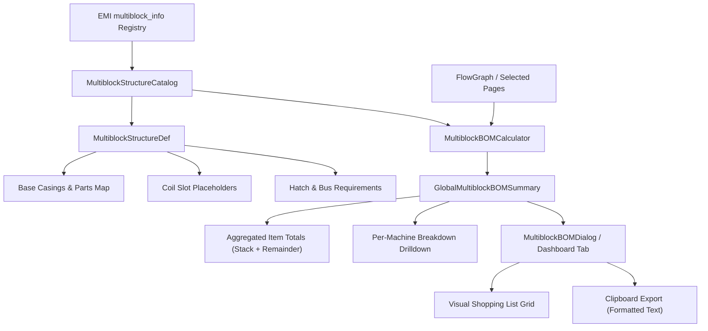
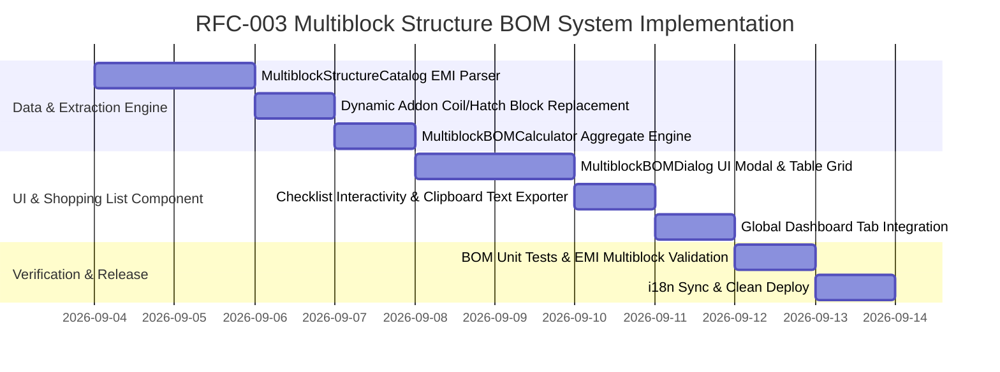

# RFC-003: 멀티블록 구조체 건축 자재 명세서 및 쇼핑 리스트 (Multiblock Structure BOM & Shopping List)

* **문서 번호**: RFC-003
* **상태**: `PROPOSED / PLANNING`
* **대상 버전**: `v2.0.0-alpha.9+`
* **주제**: EMI `multiblock_info` 구조체 레시피 기반 캔버스 멀티블록 총 건축 자재(BOM / Bill of Materials) 자동 산출, 동적 코일/해치 치환 및 인게임 건축 쇼핑 리스트 시스템

---

## 1. 개요 및 배경 (Motivation)

### 1.1 배경
* 그렉텍(GregTech) 및 대형 테크 모드팩의 핵심 꽃은 거대한 **멀티블록 기계(Multiblock Machines)**를 짓고 연결하는 것입니다.
* 그러나 실제 인게임에서 공정을 건설하는 과정에는 큰 불편함이 존재합니다:
  1. **복잡한 자재 계산의 수작업**:
     * 예를 들어 공정에 `EBF 4대`, `대형 화학 반응기(LCR) 2대`, `증기 분쇄기 4대`가 필요할 때, 각 멀티블록에 필요한 케이싱(Casings), 가열 코일(Coils), 해치(Hatches), 버스(Buses)의 총합을 플레이어가 일일이 수첩에 적거나 계산기로 더해야 합니다.
  2. **사용자 설정 애드온(코일/해치) 미반영 한계**:
     * 사용자가 EBF에 `칸탈 코일(Kanthal)`을 선택했거나 특정 유지보수 해치를 장착했다면, 기본 구조체의 큐프로니켈 코일 대신 칸탈 코일이 자재 목록에 정확히 반영되어야 합니다.
  3. **인게임 건축 준비(Shopping List)의 단절**:
     * 공정 비율을 아무리 완벽하게 계산했더라도, "창고에서 어떤 블록을 몇 세트씩 꺼내와야 하는지"를 알려주는 건축 명세서가 없어 인게임 제작 준비에 많은 시간이 소모됩니다.

### 1.2 목표
1. **`multiblock_info` 구조체 데이터 자동 연역 추출**:
   * EMI의 `multiblock_info` 레시피 입력 목록을 파싱하여, 각 멀티블록 컨트롤러별 표준 케이싱/부품 소요량과 구조체 크기를 인덱싱.
2. **스마트 동적 부품 치환 및 입출력 수량 실시간 산정**:
   * **가열 코일**: 장착된 코일(Kanthal, Nichrome 등)로 치환.
   * **전력 해치(Energy Hatch)**: 노드의 **현재 가동 전압 티어(MV, HV, EV, IV, LuV, ZPM, UV 등)**에 맞는 Energy Hatch로 자동 치환.
   * **입/출력 버스 & 해치 수량**: 레시피의 실제 **유체 입/출력 개수($N_{\text{fluid}}$) 및 아이템 입/출력 종류 수**에 맞춰 필요한 Input/Output Hatch 및 Bus 수량을 실시간 확장 반영.
   * **유지보수 해치**: 자동 유지보수 해치 등 장착 시 해당 부품으로 치환.
   * **기계 대수 올림($\lceil N \rceil$)**: 실제 물리적 건설 대수에 맞춰 자재 총합 곱셈.
3. **전역 멀티블록 자재 명세서 (Global Multiblock BOM) 산출**:
   * 캔버스(또는 선택된 대상 페이지)에 배치된 모든 멀티블록의 필요 블록을 취합하여 **아이템 아이콘, 총 수량, 스택 단위($N\text{ stacks} + M\text{ items}$)**로 집계.
4. **인게임 건축 쇼핑 리스트 UX 지원**:
   * 대시보드 내 검색/필터링, 준비 완료 체크박스, **`[📋 클립보드로 복사]`** 기능 제공.
5. **EMI BoM Tree & 즐겨찾기(Favorites) 직접 연동**:
   * 완성된 총 자재 명세서 및 멀티블록 레시피를 `dev.emi.emi.bom.BoM` 및 `dev.emi.emi.runtime.EmiFavorites` API를 통해 **EMI의 내장 Recipe Tree / BoM Tree 및 사이드바에 원클릭으로 직접 등록**.

---

## 2. 사용자 핵심 유저 스토리 (User Stories)

| ID | 역할 | 행동 (Action) | 기대 효과 (Outcome) |
| :--- | :--- | :--- | :--- |
| **US-01** | 공장 건축가 | 캔버스에 EBF 4대(니크롬 코일 장착)와 LCR 2대를 설계 | `[📋 Multiblock BOM]` 탭을 열어 `Nichrome Coil 64개 (1 stack)`, `Heat Proof Casing 120개 (1s 56)`, `PTFE Casing 48개` 등의 총 자재 명세서를 한눈에 확인 |
| **US-02** | 자재 조달자 | 인벤토리와 창고에서 블록을 꺼내며 준비 | 쇼핑 리스트에서 준비 완료된 블록 항목을 클릭하여 체크(취소선 표시)하며 누락 없이 자재 조달 |
| **US-03** | 협업 플레이어 | `[📋 클립보드로 복사]` 버튼 클릭 | 디스코드나 채팅창에 건축 자재 목록(텍스트)을 즉시 공유하여 팀원들과 자재 제작 분담 |
| **US-04** | EMI 애용자 | `[🌳 EMI Recipe Tree에 등록]` 버튼 클릭 | EMI 내장 BoM Tree 및 사이드바에 자재 목표가 즉시 등록되어, 일반 인벤토리/상자 화면에서도 EMI 오버레이로 자재 수집 현황을 실시간 추적 |

---

## 3. 시스템 아키텍처 명세 (Architecture Specification)



### 3.1 도메인 데이터 모델 (`MultiblockBOMSummary.java`)

```java
public record MultiblockBOMSummary(
    List<BOMItemEntry> aggregatedItems,
    List<MachineBOMContribution> machineContributions,
    int totalMultiblockCount,
    int totalUniqueBlocks
) {
    public record BOMItemEntry(
        ItemStack itemSample,
        ResourceLocation itemId,
        String displayName,
        int totalAmount,
        int stacks,
        int remainder,
        List<String> usedByMachines
    ) {
        public String formatStackCount() {
            int stackSize = itemSample.getMaxStackSize();
            int s = totalAmount / stackSize;
            int r = totalAmount % stackSize;
            if (s > 0 && r > 0) return String.format("%d stacks + %d (%d)", s, r, totalAmount);
            if (s > 0) return String.format("%d stacks (%d)", s, totalAmount);
            return String.format("%d items", totalAmount);
        }
    }

    public record MachineBOMContribution(
        RecipeNode node,
        String machineName,
        double machineCount,
        Map<ResourceLocation, Integer> requiredBlocks
    ) {}
}
```

---

## 4. UI / UX 디자인 상세

### 4.1 멀티블록 자재 명세서 (BOM / Shopping List) 레이아웃 와이어프레임

```text
+-----------------------------------------------------------------------------------------------+
| 📋 MULTIBLOCK CONSTRUCTION BOM & SHOPPING LIST                                            [X] |
+-----------------------------------------------------------------------------------------------+
| Total Multiblocks: 8 Machines (4 Types) | Total Unique Blocks Required: 14 Types              |
| [ Search Blocks... ]  |  [ Filter: All / Casings / Coils / Hatches ]  |  [📋 Copy to Clipboard] |
+-----------------------------------------------------------------------------------------------+
| ITEM ICON & NAME               | TOTAL REQUIRED         | STACK CONVERSION     | USED IN      |
|-----------------------------------------------------------------------------------------------|
| [📦] Heat Proof Casing         | 120 blocks             | 1 stack + 56 blocks  | EBF (x4)     |
| [🌀] Kanthal Heating Coil       | 64 blocks              | 1 stack (64 blocks)  | EBF (x4)     |
| [📦] Chemically Inert Casing   | 48 blocks              | 48 blocks            | LCR (x2)     |
| [📦] Bronze Machine Casing     | 96 blocks              | 1 stack + 32 blocks  | Steam Oven   |
| [⚡] MV Energy Hatch            | 8 blocks               | 8 blocks             | EBF, LCR     |
| [📥] LV Input Bus              | 12 blocks              | 12 blocks            | All Multi    |
| [📤] LV Output Bus             | 10 blocks              | 10 blocks            | All Multi    |
| [🔧] Maintenance Hatch         | 8 blocks               | 8 blocks             | All Multi    |
| [🏛] Electric Blast Furnace    | 4 blocks               | 4 blocks             | Controller   |
| [🏛] Large Chemical Reactor    | 2 blocks               | 2 blocks             | Controller   |
+-----------------------------------------------------------------------------------------------+
| 📑 Target Pages: [✔ Page 1] [✔ Page 2] [Select All]                     [✔ Auto-Sync Addons]  |
+-----------------------------------------------------------------------------------------------+
```

---

## 5. 개발 로드맵 (Phased Implementation)


