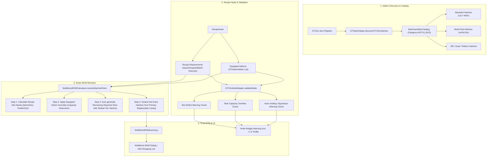
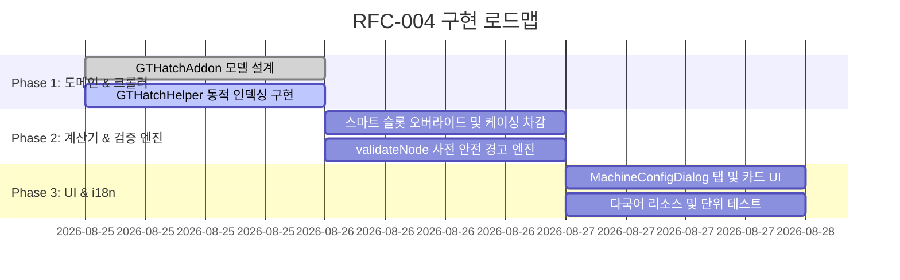

# RFC-004: 하이브리드 스마트 오버라이드 입/출력 해치 및 버스 애드온 시스템 (Hybrid Smart Override Input/Output Hatches & Buses Addon System)

* **문서 번호**: RFC-004
* **상태**: `PROPOSED / DRAFT`
* **대상 버전**: `v2.0.0-alpha.9+`
* **주제**: Zero-Config 레시피 기반 자동 산출을 기본으로 유지하면서, 다중 유체 해치(4x/9x/16x), ME 연동 해치, 사용자 지정 티어 해치 등을 애드온 창에서 자유롭게 장착/오버라이드할 수 있는 하이브리드 스마트 입출력 해치 시스템 및 용량/슬롯 결손 자동 경고 메커니즘

---

## 1. 개요 및 배경 (Motivation)

### 1.1 현황 및 한계
1. **레시피 기반 단일 티어 자동 산출의 한계**:
   * 현재 `MultiblockBOMCalculator`는 레시피의 입출력 품목 수(유체 수, 아이템 수)와 노드의 전압 티어(Target Tier)를 기반으로 기본 입/출력 해치 및 버스를 자동으로 산출합니다.
   * 하지만 GTCEu 생태계에는 단순 1배수 해치 외에도 다양한 특수 해치들이 존재합니다:
     * **다중 유체 해치 (Multi-Fluid Hatches)**: 4x Quad, 9x Nonuple, 16x Hexadecatuple 등 단 하나의 해치로 여러 종류의 유체를 동시에 입출력하는 고효율 해치
     * **ME 연동 해치**: `ME Dual Input Hatch`, `ME Pattern Provider Hatch` 등 AE2 네트워크와 직접 연결되는 일체형 해치
     * **티어 혼합 설치**: 머신은 UHV 티어이지만 자재 절약을 위해 입력 해치는 LV를 설치하거나, 대용량 완충을 위해 고티어 해치를 사용하는 실제 인게임 빌드
2. **단순 수동 장착 전환 시의 사용자 피로도 (UX Issue)**:
   * 모든 입/출력 해치를 수동 애드온으로 전환할 경우, 레시피 노드를 배치할 때마다 *"입력 해치 2개, 출력 해치 11개, 입력 버스 1개..."*를 일일이 달아주어야 하므로 계산기 본연의 편리함(Zero-Config)이 크게 훼손됩니다.
3. **잘못된 해치 오버라이드 시 인게임 공정 정지 위험**:
   * 사용자가 자재를 아끼려고 낮은 티어의 버스를 달았으나 레시피 출력 품목 종류가 버스 슬롯 수를 초과하거나(예: 5종 출력에 4슬롯 LV 버스 장착),
   * 1회 가공량(또는 병렬 가공량)이 해치의 탱크 용량보다 커서 기계가 멈추는 경우(예: 1회 160B 배출 레시피에 16B 탱크 해치 장착),
   * 인게임에서 기계가 가동되지 않으므로 이를 계산기 캔버스에서 사전에 감지하고 경고해 주어야 합니다.

### 1.2 핵심 목표: 하이브리드 스마트 오버라이드 및 사전 위험 경고
1. **기본 상태: 100% Zero-Config 자동 산출**:
   * 아무 애드온도 장착하지 않은 기본 상태에서는 레시피 슬롯 수 및 머신 티어에 맞춰 최적의 해치/버스가 자동으로 산출됩니다.
2. **애드온 장착 시: 스마트 슬롯 오버라이드 (Smart Slot Override)**:
   * 사용자가 `📦 Hatches / Buses` 탭에서 특정 해치를 장착하면, 장착된 해치가 제공하는 슬롯 수(예: 16x 다중 유체 해치는 16개 유체 슬롯 커버)만큼 자동 산출 목록에서 차감/대체됩니다.
   * 레시피 요구 슬롯보다 더 많은 용량의 해치를 달거나 잉여 버퍼 해치를 달았을 때도 BOM에 정확히 반영됩니다.
3. **지능형 해치/버스 유효성 검증 및 경고 (Pre-Flight Safety Warning)**:
   * **아이템 슬롯 부족 경고**: 레시피 출력 종류 수 > 장착된 출력 버스 총 슬롯 수
   * **유체 슬롯 부족 경고**: 레시피 출력 유체 종류 수 > 장착된 출력 해치 총 슬롯 수
   * **탱크 용량 부족 경고 (Batch Overflow)**: 단일 배치(또는 병렬) 출력량 > 장착된 출력 해치 단일 탱크 용량
   * **부산물 삭제 모드(Voiding Mode) 안내**: 미연결 부산물 유체 발생 시 기계 정지 방지를 위한 안내
4. **엄격한 케이싱 차감 및 부피 보존**:
   * 오버라이드 및 추가된 모든 해치는 구조체의 주 기계 케이싱(Watertight Casing, Heat Proof Casing 등)에서 정확히 1:1로 차감되어 3D 구조체의 실제 부피를 완벽히 유지합니다.

---

## 2. 사용자 핵심 유저 스토리 (User Stories)

| ID | 역할 | 행동 (Action) | 기대 효과 (Outcome) |
| :--- | :--- | :--- | :--- |
| **US-01** | 일반 사용자 | 대형 증류탑(LFD) 레시피(유체 출력 11종) 배치 | 별도 설정 없이도 `EV Output Hatch 11개`가 BOM에 자동 산출되고 케이싱이 올바르게 차감됨 (Zero-Config) |
| **US-02** | 고급 사용자 | LFD 기계 설정창에서 `16x Hexadecatuple Output Hatch` 1개 장착 | 11개의 단일 출력 해치 대신 `16x Output Hatch 1개`로 자동 치환되며, 케이싱도 1개만 차감되어 깔끔한 최종 빌드 반영 |
| **US-03** | ME 자동화 엔지니어 | 대형 화학 반응기(LCR)에 `ME Dual Input Hatch` 장착 | 개별 아이템 입력 버스와 유체 입력 해치 대신 ME 듀얼 해치 1개로 BOM이 갱신 |
| **US-04** | 자재 절약가 | UHV 기계의 설정창에서 `LV Input Hatch` 1개 장착 | UHV 입력 해치 대신 실제 인게임에 설치한 저렴한 `LV Input Hatch`가 BOM에 집계 |
| **US-05** | 공정 설계자 | 5개 아이템이 출력되는 레시피에 4슬롯짜리 `LV Output Bus` 장착 | 노드에 `⚠ 슬롯 부족 경고 (5종 출력 필요 / 4슬롯 장착됨)`가 즉시 표시되어 인게임 공정 정지 사고를 사전 방지 |
| **US-06** | 대용량 공정 설계자 | 1회 가공당 160,000 mB를 쏟아내는 레시피에 16,000 mB 용량 해치 장착 | `⚠ 탱크 용량 초과 경고 (배치당 160B 배출 / 해치 용량 16B)`가 표시되어 고용량 해치로 교체 유도 |

---

## 3. 시스템 아키텍처 명세 (Architecture Specification)



---

## 4. 세부 도메인 모델 및 유효성 검증 알고리즘

### 4.1 해치 애드온 모델 (`GTHatchAddon.java`)
```java
public class GTHatchAddon extends MachineAddon {
    public enum HatchType {
        ITEM_INPUT,
        ITEM_OUTPUT,
        FLUID_INPUT,
        FLUID_OUTPUT,
        DUAL_INPUT,
        DUAL_OUTPUT,
        ME_PATTERN_PROVIDER,
        GENERIC_HATCH
    }

    private final HatchType hatchType;
    private final GTVoltageTier tier;
    private final int slotCapacity; // 1, 4, 9, 16 etc.
    private final long tankCapacityBytes; // 16,000 mB, 32,000 mB etc.
    private final boolean isME;

    // Getter & NBT Serialization methods...
}
```

### 4.2 사전 안전 검증 로직 (`GTCEuModAdapter.validateNode`)

```java
// 1. 아이템 출력 버스 슬롯 검증
int requiredItemOutputs = (int) node.getOutputs().stream().filter(IngredientStack::isItem).count();
if (requiredItemOutputs > 0 && hasEquippedOutputBus(node)) {
    int totalEquippedSlots = getEquippedOutputBusSlotCount(node);
    if (totalEquippedSlots < requiredItemOutputs) {
        warnings.add(Component.translatable("gui.gtcalcboard.node_warning.item_slot_deficit", requiredItemOutputs, totalEquippedSlots));
        valid = false;
    }
}

// 2. 유체 출력 해치 슬롯 검증
int requiredFluidOutputs = (int) node.getOutputs().stream().filter(IngredientStack::isFluid).count();
if (requiredFluidOutputs > 0 && hasEquippedOutputHatch(node)) {
    int totalEquippedFluidSlots = getEquippedOutputHatchSlotCount(node);
    if (totalEquippedFluidSlots < requiredFluidOutputs) {
        warnings.add(Component.translatable("gui.gtcalcboard.node_warning.fluid_slot_deficit", requiredFluidOutputs, totalEquippedFluidSlots));
        valid = false;
    }
}

// 3. 단일 배치 유체 출력량 vs 해치 탱크 용량 검증 (Batch Overflow)
for (IngredientStack out : node.getOutputs()) {
    if (out.isFluid()) {
        double batchFluidMB = out.getAmount() * node.getTotalParallel();
        long maxTankCapacity = getMaxEquippedOutputTankCapacity(node, out);
        if (maxTankCapacity > 0 && batchFluidMB > maxTankCapacity) {
            warnings.add(Component.translatable("gui.gtcalcboard.node_warning.tank_capacity_overflow", 
                    out.getDisplayName(), (int) Math.round(batchFluidMB), maxTankCapacity));
            valid = false;
        }
    }
}
```

---

## 5. UI / UX 디자인 상세

### 5.1 기계 설정 다이얼로그 (`MachineConfigDialog`)
1. **신규 필터 칩 추가**:
   * `📦 Hatches / Buses` (`gui.gtcalcboard.addon_cat.hatch_bus`)
2. **카탈로그 카드 표시 정보**:
   * **1행**: 해치 명칭 (예: `16x Hexadecatuple Output Hatch`)
   * **2행 배지**: `§b📦 16 Fluid Slots` / `§e⚡ EV (2,048 EU)` / `§d📡 ME Provider`
   * **3행 서브타이틀**: `§7Tank: 16,000 mB/slot`
3. **노드 위젯 경고 표시**:
   * 경고 발생 시 카드 우측 상단에 `⚠` 아이콘 점멸 및 호버 툴팁에 세부 원인(슬롯 부족, 용량 초과 등) 적색 표기.

---

## 6. 개발 로드맵 (Phased Implementation)



---

## 7. 검증 및 테스트 계획 (Verification Plan)

1. **단위 테스트 (Unit Tests)**:
   * **Zero-Config 회귀 검증**: 해치를 장착하지 않았을 때 기존 11개 유체 출력 해치가 정상 자동 산출되는지 확인.
   * **다중 유체 해치 치환 검증**: 16x 해치 1개 장착 시 11개 기본 해치가 완전히 대체되고 케이싱이 1개만 차감되는지 검증.
   * **슬롯 결손 경고 검증**: 5종 아이템 출력 레시피에 4슬롯 LV 버스 장착 시 `validateNode`에서 `item_slot_deficit` 경고가 발생하는지 검증.
   * **탱크 용량 초과 경고 검증**: 1회 160B 배출 레시피에 16B 해치 장착 시 `tank_capacity_overflow` 경고가 발생하는지 검증.
2. **다국어 일관성 검증 (`testI18nCompletenessAndConsistency`)**:
   * `en_us.json`과 `ko_kr.json` 동등 지원 및 포맷 토큰 일치 검증.

