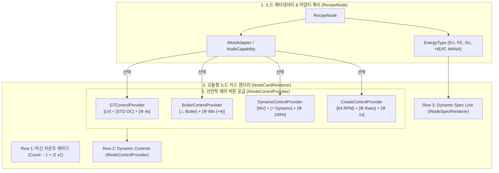
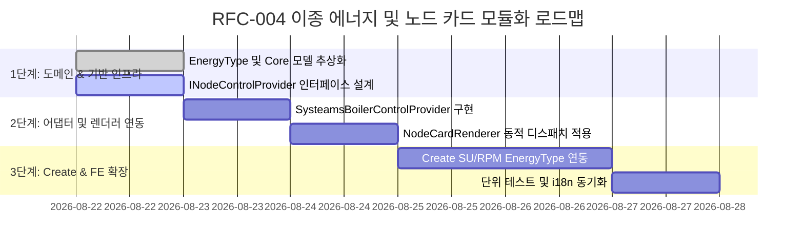

# RFC-004: 모듈형 노드 카드 제어기 및 이종 에너지 확장 프레임워크 (Modular Node Card Control & Multi-Energy Extensibility Framework)

* **문서 번호**: RFC-004
* **상태**: `PROPOSED / PLANNING`
* **대상 버전**: `v2.0.0-alpha.6` 이상
* **주제**: 그렉텍(GT) 중심의 고정 UI/에너지 폼팩터를 탈피하고, 써멀(Thermal), 크리에이트(Create), 메카니즘(Mekanism) 등 이종 모드의 구동 역학(EU, FE, SU@RPM, Heat)을 선언적으로 수용하는 동적 노드 카드 렌더링 인프라 구축

---

## 1. 개요 및 배경 (Motivation)

### 1.1 현재 시스템의 구조적 한계 (GT-Centric UI Coupling)
현재 계산기 보드의 노드 카드 렌더러(`NodeCardRenderer.java`)는 그렉텍(GTCEu)의 전기 기계 폼팩터를 기준으로 강하게 결합(Coupled)되어 있습니다:
1. **무의미한 고정 컨트롤 노출**:
   * 전기를 소모하지 않는 써멀 보일러(`Lapidary Boiler` 등)나 향후 증기 기계, 마나 기계에서도 그렉텍 전압 티어 버튼(`[LV]`, `[MV]`), 4배수 오버클럭 버튼(`[STD OC]`)이 강제로 렌더링됩니다.
2. **부적절한 전력선 표기**:
   * 전력 소모가 $0$인 보일러 및 무전력 노드에 `0.0 EU/t (LV)`가 표기되어 시각적 노이즈를 유발합니다.
3. **이종 에너지/동력 단위 확장 불가**:
   * **크리에이트(Create)**의 회전 동력 체계인 `SU (Stress Units)`와 `RPM (회전속도)`,
   * **써멀/메카니즘**의 `RF/FE`,
   * **보타니아(Botania)**의 `Mana/t` 등의 고유 에너지 단위를 유연하게 표현할 수 없습니다.

### 1.2 핵심 목표
1. **다중 에너지 & 동력 도메인 추상화 (`EnergyType` & `EnergyUnit`)**: 기계가 사용하는 물리량(전기 EU, RF/FE, 회전 SU, 열/증기)을 완벽히 분리하고 맞춤형 렌더링 포맷터 제공.
2. **선언적 노드 카드 제어 버튼 조립기 (`INodeControlProvider`)**: 노드 카드의 2번째 줄(제어 버튼 영역)을 하드코딩하지 않고, 해당 모드의 `IModAdapter`가 기계 특성에 맞는 최적의 버튼 세트만 선언적으로 공급.
3. **노드 정보선 동적 렌더링 (`INodeSpecRenderer`)**: 3번째 줄(전력 및 가공시간 영역)을 기계의 에너지 타입에 맞추어 맞춤 렌더링 (보일러: 분출 속도 요약, Create: SU @ RPM, GT: EU/t).

---

## 2. 시스템 아키텍처 (System Architecture)

### 2.1 전체 파이프라인 구조도



---

## 3. 핵심 인터페이스 및 데이터 구조 명세

### 3.1 에너지 및 구동 물리 체계 (`EnergyType`)

```java
public enum EnergyType {
    /** 그렉텍 전기 기계 (전압 티어 LV~MAX, 4배수 오버클럭) */
    ELECTRIC_EU("EU/t", 0xFF55FFFF, true, true),
    
    /** 써멀/메카니즘 등 RF/FE 전기 기계 및 발전기 */
    ELECTRIC_FE("FE/t", 0xFFFF5555, false, false),
    
    /** 크리에이트 회전 동력 기기 (Stress Units & RPM) */
    KINETIC_SU("SU", 0xFFFFAA00, false, false),
    
    /** 열/연료 자가 연소 및 증기 보일러 (전력 소모 없음) */
    HEAT_OR_SELF("Steam", 0xFF55FF88, false, false),
    
    /** 보타니아 마나 기기 */
    MANA("Mana/t", 0xFF55FFFF, false, false);

    private final String unitLabel;
    private final int accentColor;
    private final boolean supportsGtVoltageTiers;
    private final boolean supportsGtOverclockMode;

    EnergyType(String unitLabel, int accentColor, boolean supportsGtVoltageTiers, boolean supportsGtOverclockMode) {
        this.unitLabel = unitLabel;
        this.accentColor = accentColor;
        this.supportsGtVoltageTiers = supportsGtVoltageTiers;
        this.supportsGtOverclockMode = supportsGtOverclockMode;
    }
}
```

---

### 3.2 선언적 노드 카드 제어기 인터페이스 (`INodeControlProvider`)

```java
public interface INodeControlProvider {
    /** 2번째 줄에 렌더링할 대화형 버튼/위젯 목록 반환 */
    List<NodeCardWidget> createControls(RecipeNode node, int x, int y, int cardWidth);
    
    /** 버튼 클릭 이벤트 핸들링 */
    boolean handleControlClick(RecipeNode node, int controlIndex, double mouseX, double mouseY, int button);
}
```

#### 표준 컨트롤 제공자 구현체:
1. **`GTNodeControlProvider`**:
   * `[LV]` (티어 순환) + `[STD OC / PERF OC]` (오버클럭 모드) + `[⚙ 4x]` (병렬/설정 창)
2. **`BoilerNodeControlProvider`**:
   * `[♨ Boiler]` (보일러 뱃지) + `[⚙ 48x (+4)]` (업그레이드 키트 & 보일러 애드온 설정 창)
3. **`DynamoNodeControlProvider`**:
   * `[MV]` (출력 전압 등급) + `[⚡ Dynamo]` (발전기 뱃지) + `[⚙ 100% (+4)]` (발전 효율/증강)
4. **`CreateNodeControlProvider`**:
   * `[64 RPM]` (회전 속도 조절 다이얼/드롭다운) + `[⚙ Ratio]` (기어비) + `[⚙ 1x]` (병렬)

---

### 3.3 노드 스펙 및 물리량 렌더러 (`INodeSpecRenderer`)

```java
public interface INodeSpecRenderer {
    /** 3번째 줄(Row 3)의 좌측 물리량 요약 텍스트 렌더링 */
    void renderSpec(GuiGraphics graphics, Font font, RecipeNode node, int x, int y, int maxWidth);
}
```

* **보일러 노드 출력 예시**:
  `♨ Steam Boiler (48x)` 또는 `+2.25k B/s Steam` (전력 소모 표기 제거)
* **Create 노드 출력 예시**:
  `⚙ 256 SU @ 64 RPM` (가공 시간 비례 연산)
* **GT 노드 출력 예시**:
  `⚡ 128 EU/t (MV)`

---

## 4. UI / UX 디자인 와이어프레임 비교

### 4.1 기존 화면 (GT 고정 폼팩터)
```
+-------------------------------------------------------------+
| 📦 Lapidary Boiler (Diamond)                            🎯 x |
| Count: [-] [  8  ] [+] [/2] [x2]                     +1 🔲🔲🔲 |
| [LV] [STD OC]                            [⚙ 48x (+4)]       |  <-- 무의미한 LV, STD OC 노출
| 0.0 EU/t (LV)                               25.60s (15/s)   |  <-- 0.0 EU/t 불필요 노출
| 💎 -15/s                              2.25k B/s Steam 🟩    |
| 💧 -562.5 B/s                                               |
+-------------------------------------------------------------+
```

### 4.2 개선 화면 (RFC-004 선언적 폼팩터)
```
+-------------------------------------------------------------+
| 📦 Lapidary Boiler (Diamond)                            🎯 x |
| Count: [-] [  8  ] [+] [/2] [x2]                     +1 🔲🔲🔲 |
| [♨ Boiler]                               [⚙ 48x (+4)]       |  <-- 깔끔한 보일러 배너 & 넓은 설정 버튼
| ♨ +2.25k B/s Steam (48x)                    25.60s (15/s)   |  <-- 보일러 전용 분출 스펙 표기
| 💎 -15/s                              2.25k B/s Steam 🟩    |
| 💧 -562.5 B/s                                               |
+-------------------------------------------------------------+
```

### 4.3 Create 회전 기계 화면 (미래 확장성)
```
+-------------------------------------------------------------+
| ⚙ Mechanical Mixer                                      🎯 x |
| Count: [-] [  2  ] [+] [/2] [x2]                            |
| [ 64 RPM ▾ ] [⚙ 1:1]                     [⚙ 1x]             |  <-- RPM 변경 및 기어비 조절
| ⚙ 256 SU @ 64 RPM                           2.00s (0.50/s)  |  <-- Stress Units 동력 표기
| 🪨 -2/s                                   2x Crushed 🟩     |
+-------------------------------------------------------------+
```

---

## 5. 단계별 개발 로드맵 (Phased Implementation)



---

## 6. 결론

본 RFC-004는 계산기 보드가 단순히 "그렉텍 전용 계산기"에 머무르지 않고, **써멀, 크리에이트, 메카니즘 등 모드팩 내의 모든 테크 모드를 완벽한 시각적 정합성과 직관적인 UI로 품어낼 수 있는 핵심 아키텍처**를 완성합니다.
