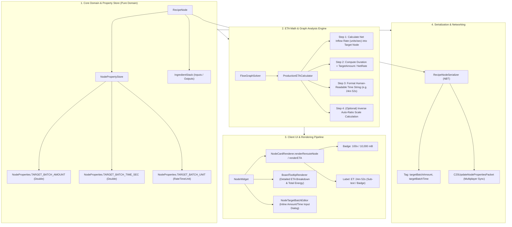
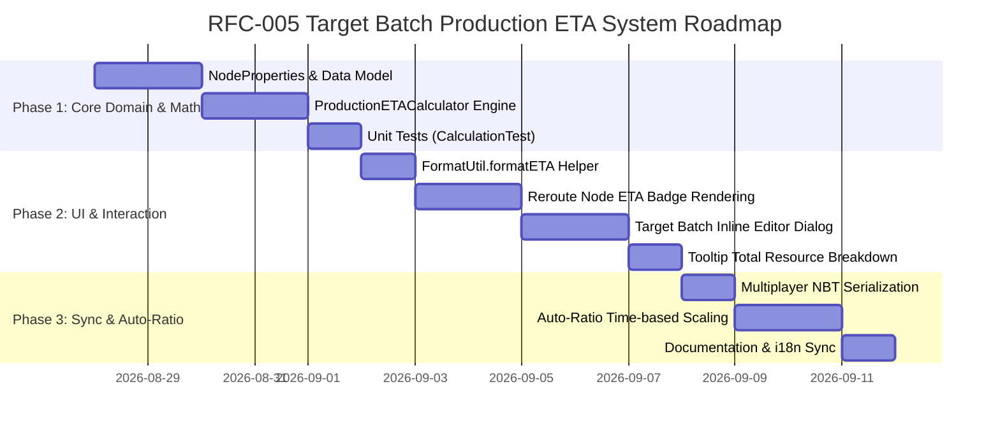

# RFC-005: 목표 배치 생산 소요 시간(ETA / Estimated Time) 산출 및 타겟 노드 시스템 (Target Batch Production ETA & Goal Node System)

* **문서 번호**: RFC-005
* **상태**: `PROPOSED / DRAFT`
* **대상 버전**: `v2.0.0-alpha.10+`
* **주제**: 플로우 그래프의 단말/리라우트 노드 및 출력 포트에 목표 수량(Batch Goal Amount)을 설정하고, 초당 순 생산율(Net Production Rate)을 기반으로 전체 배치 완료까지 걸리는 예상 소요 시간(Estimated Time, ET)을 실시간으로 산출 및 캔버스에 직관적으로 시각화하는 시스템

---

## 1. 개요 및 배경 (Motivation)

### 1.1 현황 및 한계
1. **정적 속도(Rate, units/sec) 중심 정보 제공의 한계**:
   * 현재 `GregTechCalculatorBoard`는 모든 생산 및 소비를 "초당 생산량/소비량(`0.067/s`, `10.0/s`, `mB/s`, `EU/t`)"의 정적 단위 속도(Rate)로 계산하고 표시합니다.
   * 그러나 실제 게임 플레이에서 플레이어가 내리는 핵심 의사결정 질문 중 다수는 **"특정 목표량을 생산하는 데 총 몇 분/몇 시간이 걸리는가?"**입니다:
     * *"고급 합금판(Advanced Alloy) 100개를 만드는 데 몇 분이 걸릴까?"*
     * *"나노 CPU 1,000개를 밤새(8시간 동안) 생산할 수 있을까?"*
     * *"로켓 연료 1,000,000 mB를 채우는 데 얼마나 대기해야 하는가?"*
2. **복잡한 수동 암산과 외부 계산기 의존**:
   * 플레이어는 노드에 표시된 `0.067/s`를 보고 외부 계산기를 열어 `100 / 0.067 = 1492.5초 = 약 24분 52초`를 일일이 계산해야 하는 불편을 겪고 있습니다.
3. **단말/리라우트(Reroute) 노드의 목표 설정 부재**:
   * 리라우트 노드는 현재 단순 배선 정리(Junction) 목적으로만 주로 사용되고 있으며, 최종 공정의 최종 수확물(Sink/Terminal Target)로서 "얼마나 생산할 것인가"를 정의하는 목표 노드 역할을 수행하지 못하고 있습니다.

### 1.2 핵심 목표
1. **직관적인 목표 수량(Batch Target Amount) 지정**:
   * 리라우트(Reroute) 노드 및 레시피 출력 단말에 원하는 목표 수량(예: `100x`, `1,000x`, `64,000 mB`)을 지정할 수 있는 인라인 인터페이스 제공.
2. **실시간 배치 소요 시간(Estimated Time, ET) 연산**:
   * 연결된 상류 노드들의 실시간 순 유입 속도($\text{Rate}_{\text{net}}$)에 따라 소요 시간을 즉각 계산:
     $$\text{Estimated Time (ET)} = \frac{\text{Target Amount}}{\text{Net Inflow Rate (\text{units/s})}}$$
3. **가독성 높은 휴먼 친화적 시간 포맷팅**:
   * `24m 52s`, `1h 30m`, `< 1s`, `3d 12h` 등 직관적인 시간 포맷팅 렌더링.
4. **목표 시간 기반 기계 대수 역산(Target Time Inverse Planner) 확장**:
   * *"100개를 5분 안에 완성하고 싶다"*와 같이 희망 완료 시간($T_{\text{target}}$)을 입력하면, 필요한 순 속도를 도출하여 상류 기계 대수/병렬 수를 자동 스케일링하는 Auto-Ratio 기능과의 유기적 연계.
5. **완전한 NBT 영속화 및 Clean Architecture(Rule 5, 6) 준수**:
   * `NodePropertyStore`를 활용하여 모드 종속성 없는 순수 도메인 확장.

---

## 2. 사용자 핵심 유저 스토리 (User Stories)

| ID | 역할 | 행동 (Action) | 기대 효과 (Outcome) |
| :--- | :--- | :--- | :--- |
| **US-01** | 공정 설계자 | Chemical Reactor 출력 포트에서 드래그하여 리라우트 노드를 생성하고 수량을 `100`으로 설정 | 리라우트 노드 아이콘 하단에 `100x`와 함께 `ET: 24m 52s` 라벨이 즉시 렌더링됨 |
| **US-02** | 대규모 자동화 유저 | 로켓 연료 생산 플랜트의 최종 유체 리라우트 노드에 목표치 `1,000,000 mB` 설정 | 현재 `250 mB/s` 유입 시 `ET: 1h 6m 40s`가 계산되어 표시되고, 총 필요 전력량 및 원자재 소요량이 툴팁에 표시됨 |
| **US-03** | 속도 최적화 설계자 | 목표 노드의 소요 시간 라벨(`ET: 24m 52s`)을 클릭하여 목표 시간을 `5m`으로 지정 | 필요 생산 속도가 `0.333/s`로 재계산되며, Auto-Ratio를 통해 상류 Chemical Reactor가 1대에서 5대로 자동 증설됨 |
| **US-04** | 멀티플레이어 협동 팀원 | 팀원이 공유 워크스페이스에서 목표 생산 배치(`500x`)를 지정한 청사진을 확인 | 서버 동기화 패킷을 통해 모든 팀원 화면에 동일한 `ET` 라벨과 완료 예상 시간이 일관되게 표시됨 |
| **US-05** | 복합 레시피 구성자 | 단일 리라우트 노드에 2개 이상의 생산 기계 라인이 병합 유입되는 구조 구성 | 두 기계의 합산 생산율(예: $0.067 + 0.133 = 0.200/\text{s}$)이 정확히 반영되어 `ET: 8m 20s`로 단축 계산됨 |

---

## 3. 시스템 아키텍처 명세 (Architecture Specification)



---

## 4. 세부 수학 공식 및 알고리즘 명세 (Mathematical & Algorithmic Specification)

### 4.1 기본 소요 시간 연산 (Forward Duration Calculation)

노드 $N$의 특정 슬롯(아이템/유체) $i$에 대한 순 유입 속도 $\text{Rate}_{\text{in}}(N, i)$는 해당 포트에 연결된 모든 상류(Upstream) 출력 노드들의 유효 공급 속도의 합입니다:

$$\text{Rate}_{\text{in}}(N, i) = \sum_{U \in \text{Upstreams}(N, i)} \text{OutputRate}(U)$$

목표 배치 수량을 $A_{\text{target}}$ (단위: Items 또는 mB)이라 할 때, 예상 소요 시간 $T_{\text{ET}}$ (단위: 초, seconds)는 다음과 같이 산출됩니다:

$$T_{\text{ET}} = \begin{cases} 
\frac{A_{\text{target}}}{\text{Rate}_{\text{in}}(N, i)} & \text{if } \text{Rate}_{\text{in}}(N, i) > 0 \\
\infty & \text{if } \text{Rate}_{\text{in}}(N, i) \le 0 
\end{cases}$$

### 4.2 게임 내 틱(Tick) 및 소요 시간 정밀 포맷팅 규칙 (`FormatUtil.formatETA`)

소요 시간 $T$ (초)에 따른 표시 규격:

| 시간 범위 ($T$) | 표기 형식 (Format Pattern) | 예시 (Example) |
| :--- | :--- | :--- |
| $T \le 0$ 또는 공급 없음 | `∞` 또는 `-` | `∞` |
| $0 < T < 1.0\text{s}$ | `< 1s` | `< 1s` |
| $1.0\text{s} \le T < 60\text{s}$ | `XX.Xs` (소수점 1자리) | `24.5s`, `52.0s` |
| $1\text{m} \le T < 60\text{m}$ | `Xm Ys` | `24m 52s`, `3m 15s` |
| $1\text{h} \le T < 24\text{h}$ | `Xh Ym` (또는 필요 시 `Xh Ym Zs`) | `1h 30m`, `8h 15m` |
| $T \ge 24\text{h}$ | `Xd Yh` | `2d 14h`, `5d 0h` |

### 4.3 배치 생산 시 총 소모 자원 및 에너지 집계 공식
소요 시간 $T_{\text{ET}}$ 동안 전체 공정 그래프가 소비할 총 전기 에너지 $E_{\text{total}}$ (단위: EU) 및 총 원자재 소비량 $C_{\text{total}}(M)$:

$$E_{\text{total}} = \sum_{k \in \text{ActiveNodes}} \left( \text{Power}_{\text{EU/t}}(k) \times 20 \times T_{\text{ET}} \right) \quad [\text{EU}]$$

$$C_{\text{total}}(M) = \text{ConsumptionRate}(M) \times T_{\text{ET}} \quad [\text{Items or mB}]$$

이 정보는 캔버스에서 `ET` 라벨에 마우스를 올렸을 때 툴팁으로 함께 제공되어, 대규모 공정 가동 전 자원 버퍼링 계획 수립을 돕습니다.

---

## 5. UI / UX 디자인 상세 명세

### 5.1 캔버스 노드 렌더링 와이어프레임

```
[ 단말 리라우트 / 타겟 노드 (Reroute Node with Target Amount) ]
+----------------------------+
|        [아이템 아이콘]       |
|            100x            |  <-- 설정된 목표 배치 수량 (Target Amount)
+----------------------------+
       ET: 24m 52s              <-- 하단 실시간 계산된 Estimated Time 배지
```

### 5.2 목표 수량 / 시간 편집 팝업 (Target Batch Editor)
리라우트 노드 또는 목표 슬롯을 **우클릭(Right Click)** 또는 **더블클릭**하거나, 노드 호버 시 나타나는 `⏱` 아이콘을 클릭하면 인라인 팝업 에디터가 열립니다:

```
+--------------------------------------------------+
|  🎯 Set Target Batch Goal                        |
+--------------------------------------------------+
|  Mode: [ (•) Target Amount  ( ) Target Time ]    |
|                                                  |
|  Target Amount:  [ 100       ] Items / mB        |
|  Current Rate:   0.067 /s                        |
|  Estimated Time: 24 minutes 52 seconds           |
|                                                  |
|  ----------------------------------------------  |
|  [ Preset Quick Buttons ]                        |
|  [ 16x ]  [ 64x ]  [ 100x ]  [ 1000x ]  [ 64k ]  |
|                                                  |
|  [ Apply & Scale Upstream (Auto-Ratio) ]         |
|  [ Save Goal ]                     [ Clear / Cancel ]
+--------------------------------------------------+
```

### 5.3 상세 정보 툴팁 와이어프레임 (BoardTooltipRenderer)
```
==================================================
🎯 Target Batch Production Summary
- Target Item: 100x [Wood Plate]
- Net Production Rate: +0.067 /s (4.02 /min)
- Estimated Duration (ET): 24m 52.5s (29,850 ticks)
--------------------------------------------------
📊 Total Resource Required for Batch:
- Total Power: 895,500 EU (30.0 EU/t continuous)
- Wood Log: 100 Items (-0.067/s)
- Sulfuric Acid: 10,000 mB (-6.67 mB/s)
==================================================
[Click to Edit Batch Goal | Shift+Click to Reset]
```

---

## 6. 개발 로드맵 (Phased Implementation)



---

## 7. 다국어 지원 키 (Localization Keys)

| 언어 키 (Lang Key) | 영문 (en_us) | 한국어 (ko_kr) |
| :--- | :--- | :--- |
| `gui.gtcalcboard.eta.label` | `ET: %s` | `소요 시간: %s` |
| `gui.gtcalcboard.eta.infinite` | `ET: ∞` | `소요 시간: ∞` |
| `gui.gtcalcboard.eta.less_than_sec` | `< 1s` | `< 1초` |
| `gui.gtcalcboard.eta.tooltip.title` | `Target Batch Production` | `목표 배치 생산 요약` |
| `gui.gtcalcboard.eta.tooltip.target` | `Target Goal: %s` | `목표 수량: %s` |
| `gui.gtcalcboard.eta.tooltip.rate` | `Net Rate: %s` | `순 생산율: %s` |
| `gui.gtcalcboard.eta.tooltip.duration` | `Estimated Duration: %s` | `예상 소요 시간: %s` |
| `gui.gtcalcboard.eta.tooltip.total_energy`| `Total Energy Required: %s` | `총 소요 에너지: %s` |
| `gui.gtcalcboard.dialog.target_batch.title`| `Set Target Batch Goal` | `목표 생산 수량 설정` |
