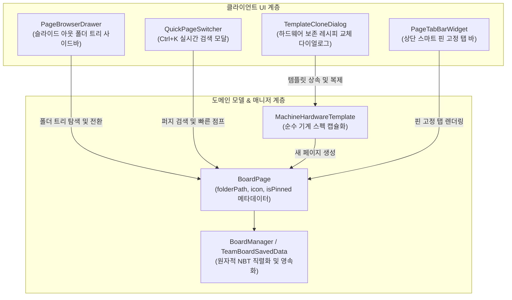
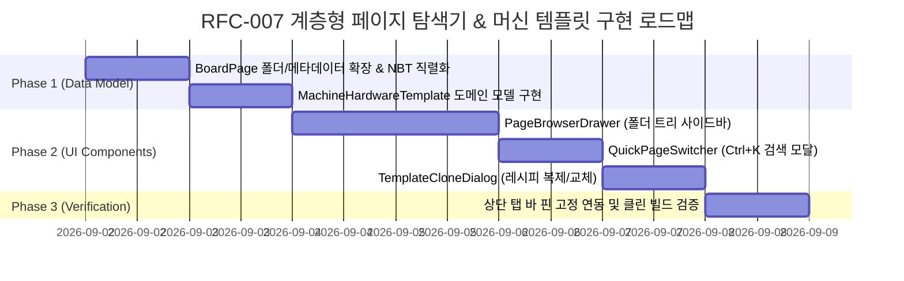

# RFC-007: 계층형 폴더블 페이지 탐색기 및 머신 하드웨어 템플릿 시스템

| 메타데이터 항목 | 내용 |
| :--- | :--- |
| **문서 번호** | RFC-007 |
| **기능명** | Hierarchical Foldable Page Explorer & Machine Setup Templates |
| **제안 상태** | PROPOSED |
| **대상 버전** | v2.2.0 |
| **작성 일자** | 2026-09-01 |
| **선행 요구사항** | 없음 (순수 클라이언트 UI 및 도메인 인프라) |

---

## 1. 개요 및 배경 (Motivation)

### 1.1 현황 및 문제점
- **대규모 공정 페이지의 관리 한계**: 복합 공정 및 대규모 공장을 설계할 때 페이지(탭) 수가 10~30개 이상으로 증가하면, 현재의 단순 가로 1열 탭 바(`PageTabBarWidget`) 구조로는 원하는 페이지를 찾기 위해 좌우로 끝없이 스크롤해야 하는 심각한 조작 피로도가 발생합니다.
- **카테고리 및 그룹화 부재**: 금속 제련, 석유화학, 전자 회로, 기지 전력망 등 서로 다른 도메인의 공정들이 단일 선형 리스트에 섞여 체계적인 분류가 불가능합니다.
- **동일 기계 다중 레시피 생성의 반복 작업**: 동일한 기계(예: EV 티어, 4x 병렬, 칸탈 코일이 장착된 EBF)에서 티타늄, 텅스텐, 크롬, 니크롬 등 수십 가지 레시피를 각각 독립 페이지로 작성할 때, 매번 기계 스펙(티어, 전압, 코일, 병렬 등)을 처음부터 수동으로 다시 설정해야 하는 번거로움이 있습니다.

### 1.2 해결 목표
1. **폴더블 계층형 페이지 탐색기 (`PageBrowserDrawer`)**: 다층 폴더 트리(`📁 AE2 패턴 / 📁 금속 제련`), 실시간 검색, 접기/펼치기, 드래그 앤 드롭 정렬을 지원하는 슬라이드 아웃 사이드바 UI를 제공합니다.
2. **키보드 중심 빠른 페이지 점프 (`QuickPageSwitcher`)**: 단축키(`Ctrl + K` / `Ctrl + P`)로 호출되는 미니멀 검색 팝업을 통해 수십 개의 페이지 중 원하는 페이지로 0.1초 만에 즉시 전환합니다.
3. **머신 하드웨어 템플릿 & 레시피 교체 복제 (`TemplateCloneDialog`)**: 기존 기계의 하드웨어 스펙(티어, 코일, 병렬 해치, 애드온)을 100% 보존한 채 새 레시피만 선택하여 새 페이지를 즉시 생성하는 원클릭 복제 시스템을 구축합니다.

---

## 2. 핵심 유저 스토리 (User Stories)

| 대상 | 유저 스토리 | 기대 결과 |
| :--- | :--- | :--- |
| **공정 설계자** | 기존 EV 4x 칸탈 EBF 페이지를 기반으로 텅스텐 제련 페이지를 추가하고자 한다. | `[페이지 복제 및 레시피 교체]`를 눌러 텅스텐 레시피를 선택하면, 기계 하드웨어 설정이 그대로 유지된 텅스텐 페이지가 즉시 생성된다. |
| **공장 관리자** | 40개 이상의 공정 페이지를 카테고리별로 깔끔하게 정리하고자 한다. | 사이드바 브라우저에서 `📁 금속 제련`, `📁 전자 회로` 폴더를 생성하고 드래그 앤 드롭으로 페이지를 분류한다. |
| **플레이어** | 작업 도중 특정 공정 페이지(예: "에폭시 수지 라인")로 빠르게 전환하고자 한다. | 캔버스 어디서나 `Ctrl+K`를 누르고 `에폭` 입력 후 `Enter`를 누르면 즉시 해당 페이지로 화면이 전이된다. |

---

## 3. 시스템 아키텍처 및 데이터 모델

### 3.1 계층 구조 다이어그램



---

### 3.2 데이터 모델 명세

#### (1) `BoardPage` 확장 필드
```java
public class BoardPage {
    private final String id;
    private String name;                   // 페이지 표시 이름 (예: "Titanium Ingot Line")
    private String folderPath;             // 폴더 계층 경로 (예: "Metals/Refining")
    private ItemStack representativeIcon;  // 대표 아이콘 (최종 산출물 아이템)
    private boolean isPinned;              // 상단 탭 핀 고정 여부
    private boolean isFolderCollapsed;     // 폴더 접힘 여부 (폴더 노드인 경우)
    
    private final FlowGraph graph;
    // Pan, Zoom, HistoryManager...
}
```

#### (2) `MachineHardwareTemplate` (머신 하드웨어 템플릿)
```java
public record MachineHardwareTemplate(
    String templateId,
    String displayName,            // 예: "EBF Standard (EV / 4x Parallel / Kanthal)"
    ResourceLocation machineId,    // gtceu:electric_blast_furnace
    int voltageTier,               // 3 (EV)
    int parallelLimit,             // 4
    NodePropertyStore properties   // 코일 티어, 반사판, 로터 등 모드 특화 하드웨어 속성
) {
    /**
     * 지정된 새 레시피를 주입하여 템플릿 하드웨어가 적용된 신규 RecipeNode 생성
     */
    public RecipeNode applyToRecipe(IRecipe<?> newRecipe);
}
```

---

## 4. UI / UX 상세 명세

### 4.1 폴더블 페이지 탐색기 (`PageBrowserDrawer`)

```
+-----------------------------------------------------------------------------------------------+
| [ 📑 페이지 브라우저 ]  [📌 메인 전력망] [📌 티타늄 라인] [📌 에폭시] [ + ]  [ 🔍 Ctrl+K 빠른 점프 ] |
+---------------------+-------------------------------------------------------------------------+
| [🔍 페이지 검색... ]|                                                                         |
|                     |                                                                         |
| 📁 금속 제련 (12)   |                                                                         |
|  ├─ 🔘 [티타늄 인곳]|                           [ 캔버스 영역 ]                                |
|  ├─ 🔘 [텅스텐강]   |                  (선택된 티타늄 인곳 전용 공정 그래프)                    |
|  └─ 🔘 [칸탈 인곳]  |                                                                         |
| 📁 전자 회로 (8)    |                                                                         |
|  ├─ 🔘 [EV 메인프레임]                                                                        |
|  └─ 🔘 [IV 회로]    |                                                                         |
| 📁 기지 인프라 (3)  |                                                                         |
+---------------------+-------------------------------------------------------------------------+
```

1. **사이드바 토글**: 상단 탭 바 좌측의 `[📑 페이지 브라우저]` 버튼 클릭 또는 단축키(`Tab`)로 슬라이드 아웃.
2. **폴더 관리**: 우클릭 메뉴를 통해 새 폴더 생성(`New Folder`), 이름 변경, 폴더 삭제(내부 페이지는 기본 폴더로 이동).
3. **드래그 앤 드롭**: 항목을 마우스로 끌어서 다른 폴더로 이동하거나 상하 순서 변경.
4. **시각적 뱃지**: 각 페이지 좌측에 **대표 생산물 아이콘** 렌더링.

---

### 4.2 키보드 중심 빠른 페이지 전환기 (`QuickPageSwitcher`)

- 캔버스 어디서나 `Ctrl + K` 또는 `Ctrl + P` 입력 시 화면 중앙에 반투명 검색 모달 등장.
- 입력된 텍스트로 페이지명/폴더명 실시간 퍼지 필터링 $\to$ 키보드 방향키(`↑`/`↓`)로 선택 후 `Enter`로 즉시 전이.

---

### 4.3 머신 템플릿 & 원클릭 복제/교체 (`TemplateCloneDialog`)

```
[ 페이지 복제 및 레시피 교체 ]
+-------------------------------------------------------------+
| 베이스 하드웨어: EBF (EV Tier / 4x Parallel / Kanthal Coil)   |
|                                                             |
| 교체할 새 레시피 검색: [ 텅스텐 인곳 (Tungsten Ingot)       ] |
|                                                             |
| 새 페이지 이름: [ Tungsten Ingot Line                      ] |
| 대상 폴더:      [ Metals/Refining                          ] |
|                                                             |
|                  [ 취소 ]      [ 새 페이지 생성 ]            |
+-------------------------------------------------------------+
```

1. 기존 페이지 탭 우클릭 $\to$ `[페이지 복제 및 레시피 교체]` 선택.
2. 레시피 검색창에서 새 레시피 선택 시, 기존 기계 하드웨어 스펙이 그대로 유지된 채 새 페이지로 즉시 생성.

---

## 5. 구현 단계별 로드맵 (Phased Roadmap)



---

## 6. 결론 및 기대 효과

1. **외부 의존성 제로**: AE2 등의 외부 모드 없이도 모든 유저가 강력한 공정 관리성과 생산성 향상을 즉시 체감할 수 있습니다.
2. **후속 기능(RFC-008 AE2 연동)의 완벽한 기반**: 패턴별 독립 페이지를 수십 개 생성하더라도 본 UI 인프라를 통해 완벽하게 정리 및 탐색할 수 있습니다.
