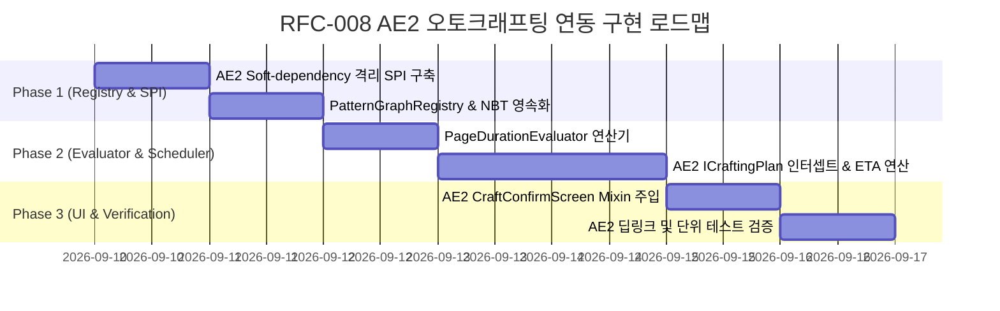

# RFC-008: AE2 오토크래프팅 플랜 연동 및 패턴-페이지 기반 정밀 ETA 시스템

| 메타데이터 항목 | 내용 |
| :--- | :--- |
| **문서 번호** | RFC-008 |
| **기능명** | AE2 Autocrafting Plan Integration & Pattern-Page Precision ETA Engine |
| **제안 상태** | PROPOSED |
| **대상 버전** | v2.3.0 |
| **작성 일자** | 2026-09-01 |
| **선행 요구사항** | RFC-007 (계층형 페이지 탐색기 및 머신 템플릿) |
| **연관 모드** | Applied Energistics 2 (AE2), GTCEu Modern, Thermal Series, Create |

---

## 1. 개요 및 배경 (Motivation)

### 1.1 현황 및 문제점
- **AE2 오토크래프팅 시간 예측 부재**: AE2의 기본 크래프팅 시스템은 요청된 작업의 총 바이트 수(`bytes()`)와 재료 목록만 제공할 뿐, 해당 작업이 완료되기까지 실제로 얼마의 시간(Ticks/Seconds)이 소요될지 예측하지 못합니다.
- **모드 기계의 비선형 가공 시간**: GTCEu, Thermal, Create 등의 기계는 전압 티어, 오버클럭 횟수, 병렬 처리 해치, 가열 코일 온도 등에 따라 가공 시간과 병렬 처리량이 동적으로 변화합니다.
- **RFC-007 기반의 연계**: RFC-007을 통해 구축된 **"패턴 전용 독립 페이지(`BoardPage`)"**의 정밀 연산 스펙(단위 틱, 유효 병렬도)을 AE2의 크래프팅 계획과 직접 결합하여 완전한 예측 시스템을 구현할 수 있습니다.

### 1.2 해결 목표
1. **패턴 ↔ 페이지 바인딩 (`PatternGraphRegistry`)**: AE2 가공 패턴(`IPatternDetails`)과 사용자가 작성한 전용 `BoardPage`를 1:1로 매핑합니다.
2. **AE2 크래프팅 플랜 인터셉트**: `ICraftingPlan.patternTimes()`로부터 고유 패턴별 실행 횟수를 추출하여 $O(K)$ 복잡도로 정밀 ETA 및 병목 공정을 산출합니다.
3. **AE2 확인창 UI 렌더링 & 딥링크**: AE2 `CraftConfirmScreen`에 계산된 예상 시간을 표시하고, 병목 공정 클릭 시 해당 계산기 페이지로 즉시 전이되는 딥링크를 제공합니다.

---

## 2. 핵심 유저 스토리 (User Stories)

| 대상 | 유저 스토리 | 기대 결과 |
| :--- | :--- | :--- |
| **공정 설계자** | 티타늄 제련 페이지를 작성한 후, 해당 페이지를 AE2 티타늄 가공 패턴에 바인딩한다. | 패턴 실행 시 해당 페이지의 기계 티어, 코일, 병렬 설정이 연산에 정확히 반영된다. |
| **플레이어** | ME 터미널에서 티타늄 블록 500개 제작을 요청하고 확인 화면(`CraftConfirmScreen`)을 확인한다. | "Bytes Used" 하단에 `ETA: ~3m 42s (Bottleneck: EBF Titanium)`가 표시되며, 클릭 시 해당 계산기 페이지가 열린다. |
| **서버 관리자** | 여러 플레이어가 대규모 크래프팅 작업을 동시에 요청한다. | 물리 블록 스캔 없이 등록된 페이지 메타데이터 및 $O(K)$ 연산만 수행하여 서버 틱 렉이 발생하지 않는다. |

---

## 3. 시스템 아키텍처 명세

### 3.1 계층 구조 다이어그램

```mermaid
flowchart TD
    subgraph UI_Layer ["클라이언트 UI 계층"]
        A1["AE2 CraftConfirmScreen (Mixin Injection)"]
        A2["GTCalcBoard Canvas Screen"]
    end

    subgraph Service_Layer ["연산 및 스케줄링 계층"]
        B1["PatternGraphRegistry (패턴 ↔ BoardPage 매핑)"]
        B2["PageDurationEvaluator (페이지 단위 틱/병렬도 산출)"]
        B3["Ae2CraftingPlanEvaluator (DAG CPM & Co-Processor 스케줄러)"]
    end

    subgraph AE2_Integration ["AE2 엔진 계층 (Soft-Dependency)"]
        C1["CraftConfirmMenu (Server Hook)"]
        C2["ICraftingPlan (patternTimes API)"]
    end

    C1 -->|1. ICraftingPlan 획득| C2
    C2 -->|2. patternTimes() 전달| B3
    B1 -->|3. 바인딩 페이지 스펙 제공| B2
    B2 -->|4. 단위 틱/병렬도 전달| B3
    B3 -->|5. 정밀 ETA 및 병목 산출| C1
    C1 -->|6. 동기화 패킷 전송| A1
    A1 -.->|7. 병목 라벨 클릭 딥링크| A2
```

---

### 3.2 핵심 컴포넌트 명세

#### (1) `PatternGraphRegistry` (패턴-페이지 매핑 레지스트리)
```java
public class PatternGraphRegistry {
    // 패턴 고유 해시 -> 바인딩된 BoardPage ID
    private final Map<PatternId, UUID> pageBindings = new ConcurrentHashMap<>();

    public void bindPatternToPage(PatternId patternId, UUID pageId);
    public void unbindPattern(PatternId patternId);
    public Optional<BoardPage> getBoundPage(IPatternDetails pattern);
}
```

#### (2) `Ae2CraftingPlanEvaluator` (플랜 스케줄러 & ETA 엔진)
- **알고리즘 복잡도**: $O(K)$ ($K$ = 플랜 내 고유 패턴 수)
- **연산 공식**:
  $$\text{Batches}_i = \left\lceil \frac{\text{Count}_i}{P_{\text{eff}, i}} \right\rceil$$
  $$T_{\text{total}, i} = \text{Batches}_i \times T_{\text{unit}, i}$$
  $$\text{ConcurrencyFactor} = \min(\text{CoProcessors} + 1, K)$$
  $$\text{FinalETA} = \max\left(\max_{i} T_{\text{total}, i}, \left\lceil \frac{\sum T_{\text{total}, i}}{\text{ConcurrencyFactor}} \right\rceil\right)$$

---

## 4. UI / UX 상세 명세

### 4.1 AE2 크래프팅 확인창 UI & 딥링크 (`CraftConfirmScreen`)

```
+-----------------------------------------------------------+
| Crafting Plan: 1,280 Bytes Used                           |
| CPU: 16k Crafting Storage (4 Co-Processors)               |
|                                                           |
| > [GTCalcBoard] Estimated Time: ~2m 45s                   |
| > Bottleneck: 🔗 [EBF Titanium Ingot (Click to Open)]     |
+-----------------------------------------------------------+
| [ Item Grid Summary ]                                     |
|  - 500x Titanium Ingot (Crafting: 500)                    |
+-----------------------------------------------------------+
| [ Start ]                          [ Select CPU ] [ Cancel ]|
+-----------------------------------------------------------+
```

- **딥링크 동작**: 병목 라벨 클릭 시 계산기 보드가 열리며 해당 `BoardPage`로 즉시 화면 전이.

---

## 5. 구현 단계별 로드맵 (Phased Roadmap)



---

## 6. 결론

본 기능은 RFC-007의 강력한 페이지 및 템플릿 인프라 위에서 동작하며, AE2 오토크래프팅 환경에서 정확한 시간 예측과 직관적인 병목 진단을 가능하게 합니다.
