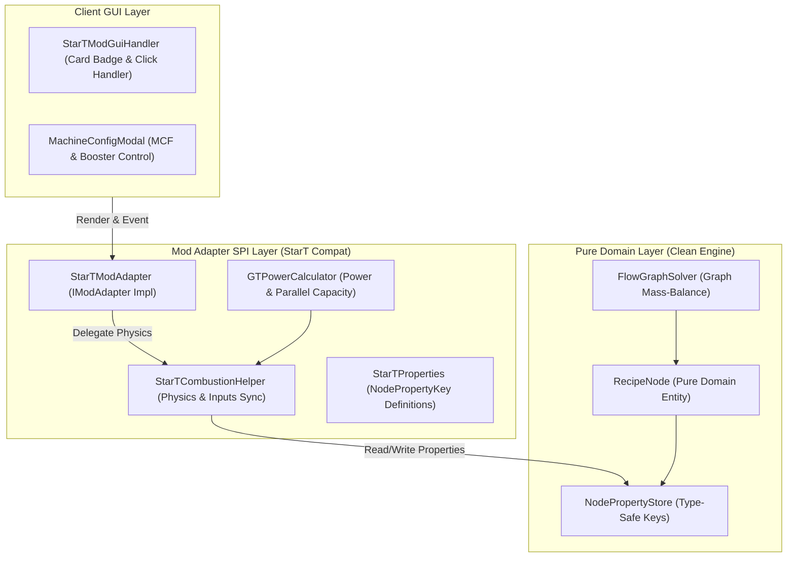
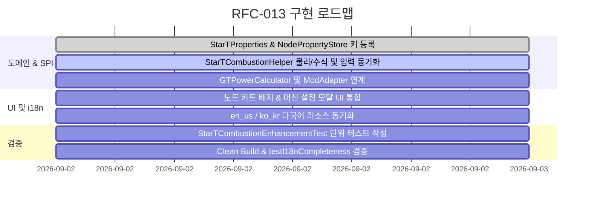

# RFC-013: Star Technology 모듈러 연소 복합체(Modular Combustion Complex) 및 프레임 부스팅 발전 시스템 통합 명세
# (Star Technology Modular Combustion Complex & Frame Boosting Integration Specification)

- **문서 번호**: RFC-013
- **대상 버전**: `v2.1.0`
- **상태**: `PROPOSED`
- **작성일**: 2026-09-02
- **주관 계층**: Pure Domain Layer (`api.model`, `api.property`), Mod Adapter SPI Layer (`compat.start`, `compat.gtceu`), Client GUI Layer (`client.gui.compat.start`, `client.gui.editor`)

---

## 1. 개요 및 배경 (Motivation)

### 1.1 현황 및 배경
Star Technology 모드팩 환경에서 대규모 전력 생산의 핵심 인프라인 **모듈러 연소 프레임 (Modular Combustion Frame [MCF], `start_core:modular_combustion_frame`)** 및 4종의 **모듈러 연소/로켓 모듈 (Modular Combustion/Rocket Modules)** 멀티블록 발전 시스템은 다음과 같은 복합 메커니즘을 가집니다:

1. **허브-노드 결합형 모듈러 아키텍처**:
   - MCF 프레임 본체는 자체 발전 레시피를 구동하지 않고, 최대 8개의 하위 모듈 멀티블록(UCM, SCM, SRM, NRM)과 도킹 해치(`MODULAR_NODE` $\leftrightarrow$ `MODULAR_TERMINAL`)로 결합하여 각 모듈에서 생산된 에너지를 수집·출력합니다.
2. **2단계 중첩 부스팅(Dual-Tier Boosting) 물리 메커니즘**:
   - **1단계 (모듈 산화제 부스팅)**: 각 모듈은 고유 윤활유와 발연질산/초산화물 계열 산화제를 $3.6\text{초}(72\text{틱})$ 주기로 소모하여 출력 Amps를 기본 $1\text{A}\sim 2\text{A}$에서 $5\text{A}\sim 12\text{A}$로 증폭하고 병렬 수를 $2\times$ 확장합니다.
   - **2단계 (MCF 프레임 냉각 부스팅)**: MCF 프레임은 연결된 모듈 1개당 시간당 $500\text{ B}$ ($500,000\text{ mB/hr}$)의 냉각수를 소모하며, 탈이온수 공급 시 $+40\%$ ($1.4\times$), 증류수 공급 시 $+20\%$ ($1.2\times$), 미공급 시 $-10\%$ ($0.9\times$)의 출력 승수를 전체 전력에 적용합니다.
3. **기존 계산기 모델링의 한계**:
   - 기존 시스템은 단일 기계 기반의 발전량만을 계산하며, 이러한 복합 도킹 발전 프레임워크와 다중 유체 소모(연료 + 윤활유 + 산화제 + 냉각수) 연계 수치를 정확히 시뮬레이션하지 못했습니다.

### 1.2 목표
- Pure Domain의 불변성을 유지하면서 `NodePropertyStore` 및 SPI 확장을 통해 4종 모듈과 MCF 프레임의 2단계 부스팅을 정밀 모델링합니다.
- 노드 카드 UI 및 머신 설정 모달에서 산화제 부스팅 토글과 MCF 냉각수 등급을 직관적으로 제어할 수 있도록 지원합니다.
- 연료뿐만 아니라 윤활유, 산화제, 냉각수 소모량을 레시피 계산 그래프와 BOM(자재 명세서)에 결정론적(Deterministic)으로 자동 동기화합니다.

---

## 2. 핵심 유저 스토리 (User Stories)

| 구분 | 유저 스토리 (User Story) | 수용 기준 (Acceptance Criteria) |
|---|---|---|
| **US-01** | 플레이어는 LuV~UEV 티어 모듈러 연소/로켓 모듈 노드를 배치하고 연료 투입에 따른 발전량을 계산할 수 있다. | UCM(LuV), SCM(ZPM), SRM(UV), NRM(UEV)의 기본 전압 및 $V[\text{Tier}] / \text{recipeEUt}$ 병렬 계산이 정확히 수행된다. |
| **US-02** | 플레이어는 노드 카드에서 클릭 한 번으로 [산화제 부스팅]을 활성화하여 전력 증폭 및 산화제/윤활유 소모량을 확인할 수 있다. | 부스팅 활성화 시 출력 Amps가 $5\text{A}\sim 12\text{A}$로 증가하고, $3.6\text{초}$ 주기 소모 유체가 `node.getInputs()`에 자동 등록된다. |
| **US-03** | 플레이어는 모듈이 MCF 프레임에 도킹된 상태를 선택하고 냉각수 등급(None / Distilled / Deionized)을 지정할 수 있다. | 냉각수 등급에 따라 $0.9\times, 1.2\times, 1.4\times$ 승수가 전력에 적용되며, $500\text{ B/hr}$의 냉각수 소비량이 그래프에 반영된다. |
| **US-04** | 플레이어는 MCF 프레임 단독 노드를 배치하여 연결할 모듈 수(1~8대)를 설정하고 통합 발전량과 냉각수 총량을 일괄 산출할 수 있다. | 모듈 수 $N$에 따른 냉각수 소모량($N \times 500\text{ B/hr}$)과 레이저 해치 출력 한도가 계산된다. |

---

## 3. 시스템 아키텍처 및 SPI 명세 (Architecture Specification)

### 3.1 계층 구조 다이어그램 (Layer Interaction)



---

### 3.2 물리 연산 및 수학 공식 명세 (Physics & Mathematical Model)

#### 1) 모듈 기본 사양 및 산화제 부스팅 파라미터

| 모듈 식별자 | 기계 ID | 기본 전압 ($V_{\text{tier}}$) | 기본 Amps ($A_{\text{base}}$) | 부스팅 Amps ($A_{\text{boost}}$) | 필수 윤활유 ($R_{\text{lube}}$, $3.6\text{s}$) | 필수 산화제 ($R_{\text{ox}}$, $3.6\text{s}$) |
|---|---|---|---|---|---|---|
| **UCM** | `start_core:luv_combustion_module` | $32,768\text{ EU/t}$ | $1\text{ A}$ | **$5\text{ A}$** | Lubricant $100\text{ mB}$ | White Fuming Nitric Acid $324\text{ mB}$ |
| **SCM** | `start_core:zpm_combustion_module` | $131,072\text{ EU/t}$ | $1\text{ A}$ | **$6\text{ A}$** | Lubricant $200\text{ mB}$ | Red Fuming Nitric Acid $432\text{ mB}$ |
| **SRM** | `start_core:uv_combustion_module` | $524,288\text{ EU/t}$ | $2\text{ A}$ | **$8\text{ A}$** | Tungsten Disulfide ($\text{WS}_2$) $200\text{ mB}$ | Dioxygen Difluoride ($\text{O}_2\text{F}_2$) $756\text{ mB}$ |
| **NRM** | `start_core:uev_combustion_module` | $2,097,152\text{ EU/t}$ | $2\text{ A}$ | **$12\text{ A}$** | Tungsten Disulfide ($\text{WS}_2$) $400\text{ mB}$ | Ferrocenium Superoxide ($\text{FcSO}_2$) $864\text{ mB}$ |

#### 2) 병렬 처리 및 연료 소모량 공식
* **기본 병렬 수 ($P_{\text{base}}$)**:
  $$P_{\text{base}} = \max\left(1, \left\lfloor \frac{V_{\text{tier}}}{\text{RecipeEU/t}} \right\rfloor\right)$$
* **실효 가동 병렬 수 ($P_{\text{eff}}$)**:
  $$P_{\text{eff}} = P_{\text{base}} \times \left( \text{IsOxidizerBoosted} \,?\, 2 : 1 \right)$$
* **출력 전류 배율 ($M_{\text{amp}}$)**:
  $$M_{\text{amp}} = \text{IsOxidizerBoosted} \,?\, A_{\text{boost}} : A_{\text{base}}$$

#### 3) MCF 프레임 냉각 부스팅 배율 ($M_{\text{frame}}$)

$$M_{\text{frame}} = \begin{cases} 
1.0 & \text{단독 운전 (Standalone, No Frame)} \\
0.9 & \text{MCF 장착 / 냉각수 미공급 (No Coolant Penalty)} \\
1.2 & \text{MCF 장착 / 증류수 공급 (Distilled Water, +20\%)} \\
1.4 & \text{MCF 장착 / 탈이온수 공급 (De-Ionized Water, +40\%)}
\end{cases}$$

#### 4) 최종 발전 출력 ($P_{\text{total}}$)

$$P_{\text{total}} = \text{RecipeEU/t} \times P_{\text{base}} \times M_{\text{amp}} \times M_{\text{frame}}$$

#### 5) 부수 유체 시간당 투입량 공식 ($\text{Fluid Consumption Rate}$)
레시피 1회당 투입량($Q_{\text{recipe}}$, 단위: $\text{mB}$)은 가동 주기 $T_{\text{op}} = 3.6\text{초}(72\text{틱})$와 레시피 지속 시간 $D_{\text{sec}}$에 따라 다음과 같이 계산됩니다:

$$Q_{\text{lube}} = \frac{R_{\text{lube}}}{3.6} \times \frac{D_{\text{sec}}}{P_{\text{eff}}}, \quad Q_{\text{ox}} = \frac{R_{\text{ox}}}{3.6} \times \frac{D_{\text{sec}}}{P_{\text{eff}}}$$

$$Q_{\text{coolant}} = \frac{500,000\text{ mB}}{3600\text{ 초}} \times \frac{D_{\text{sec}}}{P_{\text{eff}}} \approx 138.889 \times \frac{D_{\text{sec}}}{P_{\text{eff}}}$$

---

### 3.3 타입 세이프 속성 키 정의 (`StarTProperties.java`)

Rule 6에 따라 `RecipeNode`에 전용 필드를 추가하지 않고 `NodePropertyStore`에 다음 키를 신규 등록합니다:

```java
public final class StarTProperties {
    /** 모듈 자체 산화제 부스팅 활성화 여부 (true: 5A~12A, false: 1A~2A) */
    public static final NodePropertyKey<Boolean> OXIDIZER_BOOST =
            NodePropertyKey.of("start_core:oxidizer_boost", Boolean.class, false);

    /** MCF 프레임 냉각수 부스팅 등급 (0: STANDALONE, 1: UNCOOLED_0_9X, 2: DISTILLED_1_2X, 3: DEIONIZED_1_4X) */
    public static final NodePropertyKey<Integer> MCF_COOLANT_MODE =
            NodePropertyKey.of("start_core:mcf_coolant_mode", Integer.class, 0);

    /** MCF 프레임에 도킹된 모듈 수 (MCF 컨트롤러 전용, 1~8) */
    public static final NodePropertyKey<Integer> MCF_LINKED_MODULES =
            NodePropertyKey.of("start_core:mcf_linked_modules", Integer.class, 1);
}
```

---

## 4. UI / UX 디자인 상세

### 4.1 노드 카드 인라인 부스터 배지 (Node Card Booster Badge)

노드 카드 상단 액션 바 영역에 모듈 상태를 한눈에 확인하고 즉시 순환(Cycle)할 수 있는 2개의 배지를 렌더링합니다:

1. **산화제 부스트 배지 ([OX])**:
   - `[OX: OFF (1A)]`: 비활성 (회색 테두리 `0xFF666666`, 배경 `0xFF222222`)
   - `[OX: BOOST (6A)]`: 활성 (황금색 테두리 `0xFFFFD700`, 배경 `0xFF4A3E16`)
2. **MCF 냉각 배지 ([MCF])**:
   - `[MCF: NONE]`: 단독 가동 ($1.0\times$)
   - `[MCF: 0.9x]`: 노쿨링 페널티 (적색 `0xFFFF7777`, 배경 `0xFF3D2424`)
   - `[MCF: 1.2x]`: 증류수 ($+20\%$, 청록색 `0xFF38BDF8`, 배경 `0xFF1C3240`)
   - `[MCF: 1.4x]`: 탈이온수 ($+40\%$, 네온 시안 `0xFF00FFFF`, 배경 `0xFF0E3A4A`)

```
+-----------------------------------------------------------------------+
| [⚡] Supreme Combustion Module [SCM]                       (Tier: ZPM) |
| Mode: 6A Boost (786,432 EU/t)  |  MCF Boost: 1.4x (De-Ionized Water)    |
| [OX: BOOST (6A)] [MCF: 1.4x (De-Ionized)]                             |
+-----------------------------------------------------------------------+
| Inputs:                                                               |
| • High Octane Gasoline: 120.0 mB/t                                    |
| • Lubricant: 55.56 mB/s (200 mB / 3.6s)                               |
| • Red Fuming Nitric Acid: 120.0 mB/s (432 mB / 3.6s)                  |
| • De-Ionized Water: 138.89 B/s (500 B/hr)                             |
| Outputs:                                                              |
| • Power: 1,101,004.8 EU/t (Net: +1,101,004.8 EU/t)                   |
+-----------------------------------------------------------------------+
```

---

## 5. 다국어 리소스 (i18n) 명세

`en_us.json` 및 `ko_kr.json`에 동등하게 다음 키를 동기화합니다:

```json
{
  "gui.gtcalcboard.config.start.ox_boost_off": "Oxidizer: OFF (%dA)",
  "gui.gtcalcboard.config.start.ox_boost_on": "Oxidizer: ACTIVE (%dA)",
  "gui.gtcalcboard.config.start.mcf_mode_standalone": "MCF: Standalone (1.0x)",
  "gui.gtcalcboard.config.start.mcf_mode_uncooled": "MCF: Uncooled (0.9x)",
  "gui.gtcalcboard.config.start.mcf_mode_distilled": "MCF: Distilled Water (+20%)",
  "gui.gtcalcboard.config.start.mcf_mode_deionized": "MCF: De-Ionized Water (+40%)",
  "gui.gtcalcboard.tooltip.start.ox_boost_desc": "Consumes %s every 3.6s to boost output amps to %dA and doubles fuel parallel.",
  "gui.gtcalcboard.tooltip.start.mcf_coolant_desc": "Consumes %s (500 B/hr per module) for a %s EU/t output modifier."
}
```

---

## 6. 개발 로드맵 및 검증 계획 (Phased Roadmap & Verification)

### 6.1 개발 단계 (Milestones)



### 6.2 단위 테스트 검증 시나리오 (`StarTCombustionEnhancementTest.java`)
1. **단독 기본 발전 검증**:
   - SCM 노드에 ZPM 연료 투입 시 기본 1A ($131,072\text{ EU/t}$) 및 $1\times$ 병렬이 정확히 도출되는지 검증.
2. **산화제 부스팅 활성화 검증**:
   - `OXIDIZER_BOOST = true` 설정 시 6A ($786,432\text{ EU/t}$) 및 $2\times$ 병렬로 승격되고, RFNA 및 Lubricant 입력 유체가 자동 등록되는지 검증.
3. **MCF 프레임 탈이온수 부스팅 복합 검증**:
   - `MCF_COOLANT_MODE = DEIONIZED_1_4X` 적용 시 $786,432 \times 1.4 = 1,101,004.8\text{ EU/t}$가 출력되고, 탈이온수 $500\text{ B/hr}$ 유체 입력이 동기화되는지 검증.
4. **다국어 무결성 검증**:
   - `testI18nCompletenessAndConsistency`를 통해 한/영 번역 누락 및 포맷팅 토큰 일치 여부 100% 통과 검증.
