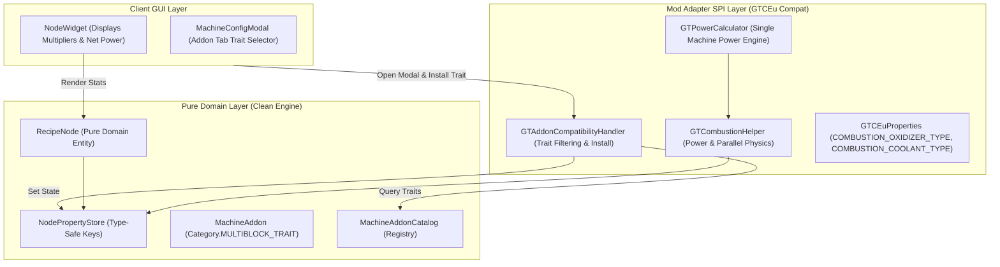
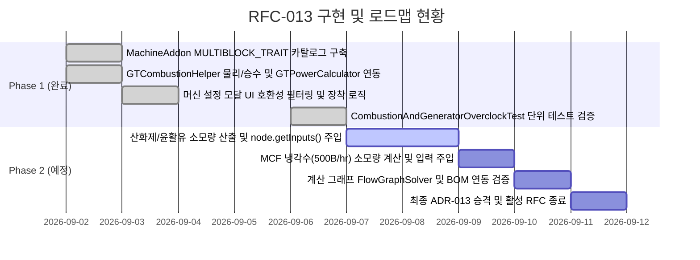

# RFC-013: Star Technology 모듈러 연소 복합체(Modular Combustion Complex) 및 프레임 부스팅 발전 시스템 통합 명세
# (Star Technology Modular Combustion Complex & Frame Boosting Integration Specification)

- **문서 번호**: RFC-013
- **대상 버전**: `v2.2.0`
- **상태**: `PARTIALLY_IMPLEMENTED` (Phase 1 물리/UI 통합 완료, Phase 2 부수 유체 연동 대기)
- **작성일**: 2026-09-02
- **최종 갱신일**: 2026-09-06
- **주관 계층**: Pure Domain Layer (`api.model`, `api.catalog`), Mod Adapter SPI Layer (`compat.gtceu.helper`, `compat.gtceu.handler`), Client GUI Layer (`client.gui.dialog.MachineConfigModal`)

---

## 1. 개요 및 배경 (Motivation)

### 1.1 현황 및 배경
Star Technology 모드팩 환경에서 대규모 전력 생산의 핵심 인프라인 **모듈러 연소 프레임 (Modular Combustion Frame [MCF], `start_core:modular_combustion_frame`)** 및 4종의 **모듈러 연소/로켓 모듈 (Modular Combustion/Rocket Modules)** 멀티블록 발전 시스템은 다음과 같은 복합 메커니즘을 가집니다:

1. **허브-노드 결합형 모듈러 아키텍처**:
   - MCF 프레임 본체는 자체 발전 레시피를 구동하지 않고, 하위 모듈 멀티블록(UCM, SCM, SRM, NRM)과 도킹 해치(`MODULAR_NODE` $\leftrightarrow$ `MODULAR_TERMINAL`)로 결합하여 각 모듈에서 생산된 에너지를 수집·출력합니다.
   - GTCEu 순정 멀티블록인 LCE(EV) 및 ECE(IV)는 `MODULAR_TERMINAL` 해치가 없어 MCF에 연결되지 않으며, 오직 Star Technology 모듈 4종만 연결 가능합니다.
2. **2단계 중첩 부스팅(Dual-Tier Boosting) 물리 메커니즘**:
   - **1단계 (모듈 산화제 부스팅)**: 각 모듈은 고유 윤활유와 발연질산/초산화물 계열 산화제를 $3.6\text{초}(72\text{틱})$ 주기로 소모하여 출력 Amps를 기본 $1\text{A}\sim 2\text{A}$에서 $5\text{A}\sim 12\text{A}$로 증폭하고 병렬 수를 $2\times$ 확장합니다.
   - **2단계 (MCF 프레임 냉각 부스팅)**: MCF 프레임은 연결된 모듈 1개당 시간당 $500\text{ B}$ ($500,000\text{ mB/hr}$)의 냉각수를 소모하며, 탈염수 공급 시 $+40\%$ ($1.4\times$), 증류수 공급 시 $+20\%$ ($1.2\times$), 미공급 시 $-10\%$ ($0.9\times$)의 출력 승수를 전체 전력에 적용합니다.

### 1.2 구현 방향 진화 및 통합 (Trait-based Architecture Evolution)
- **초기 기획**: Star Technology 전용 어댑터(`StarTModAdapter`), 독점 속성 키(`StarTProperties`), 노드 카드 상단 전용 토글 배지 버튼(`[OX]`, `[MCF]`) 신설을 구상하였습니다.
- **실제 채택된 아키텍처**:
  - 도메인 순수성 유지 및 UI 일관성을 위해 범용 멀티블록 트레이트 시스템인 **`MachineAddon` (`Category.MULTIBLOCK_TRAIT`)** 및 `GTCombustionHelper`로 통합 구현되었습니다.
  - 전용 배지로 노드 카드를 복잡하게 만드는 대신, 다른 부품(코일, 로터, 해치)들과 동일하게 **머신 설정 다이얼로그 (Machine Config Dialog / Addon Tab)**에서 통일된 인터랙션으로 부스팅을 구성합니다.
  - **Phase 1 (완료)**: 발전 출력 승수($5\text{A}\sim 12\text{A}$), 병렬 2배 확장, 냉각 부스팅($0.9\times, 1.2\times, 1.4\times$) 계산 엔진 및 머신 설정 UI 통합 완료.
  - **Phase 2 (예정)**: 부수 유체(산화제, 윤활유, 냉각수)의 소모 유량 산출 및 `node.getInputs()` 자동 주입을 통한 계산 그래프/BOM 연동.

---

## 2. 핵심 유저 스토리 및 구현 상태 (User Stories & Implementation Status)

| 구분 | 유저 스토리 (User Story) | 수용 기준 (Acceptance Criteria) | 상태 (Status) |
|---|---|---|:---:|
| **US-01** | 플레이어는 LuV~UEV 티어 모듈러 연소/로켓 모듈 노드를 배치하고 연료 투입에 따른 발전량을 계산할 수 있다. | UCM(LuV), SCM(ZPM), SRM(UV), NRM(UEV)의 기본 전압 및 $V[\text{Tier}] / \text{recipeEUt}$ 병렬 계산이 정확히 수행된다. | 🟢 **완료 (Phase 1)** |
| **US-02** | 플레이어는 머신 설정 창에서 산화제 부스팅을 활성화하여 전력 증폭 및 산화제/윤활유 소모량을 확인할 수 있다. | 부스팅 활성화 시 출력 Amps가 $5\text{A}\sim 12\text{A}$로 증가하고 병렬 수가 $2\times$ 확장된다. $3.6\text{초}$ 주기 소모 유체가 `node.getInputs()`에 자동 등록된다. | 🟡 **부분 완료**<br/>(전력/병렬 완료, 유체 입력 Phase 2) |
| **US-03** | 플레이어는 모듈에 MCF 냉각수 등급(Distilled / Deionized) 애드온을 장착하고 출력 승수를 적용할 수 있다. | 냉각수 등급에 따라 $1.2\times, 1.4\times$ 승수가 전력에 적용된다. $500\text{ B/hr}$의 냉각수 소비량이 그래프에 반영된다. | 🟡 **부분 완료**<br/>(승수 완료, 유체 입력 Phase 2) |
| **US-04** | 플레이어는 MCF 프레임 단독 노드를 배치하여 연결할 모듈 수(1~8대)를 설정하고 통합 발전량과 냉각수 총량을 일괄 산출할 수 있다. | 모듈 수 $N$에 따른 냉각수 소모량($N \times 500\text{ B/hr}$)과 레이저 해치 출력 한도가 계산된다. | ⚪ **백로그 (Phase 2)** |

---

## 3. 시스템 아키텍처 및 SPI 명세 (Architecture Specification)

### 3.1 계층 구조 다이어그램 (Layer Interaction)



---

### 3.2 물리 연산 및 수학 공식 명세 (Physics & Mathematical Model)

#### 1) 모듈 기본 사양 및 산화제 부스팅 파라미터

| 모듈 식별자 | 기계 ID | 기본 전압 ($V_{\text{tier}}$) | 기본 Amps ($A_{\text{base}}$) | 부스팅 Amps ($A_{\text{boost}}$) | 필수 윤활유 ($R_{\text{lube}}$, $3.6\text{s}$) | 필수 산화제 ($R_{\text{ox}}$, $3.6\text{s}$) |
|---|---|---|---|---|---|---|
| **UCM** | `start_core:luv_combustion_module` | $32,768\text{ EU/t}$ | $1\text{ A}$ | **$5\text{ A}$** | Lubricant $100\text{ mB}$ | White Fuming Nitric Acid $324\text{ mB}$ |
| **SCM** | `start_core:zpm_combustion_module` | $131,072\text{ EU/t}$ | $1\text{ A}$ | **$6\text{ A}$** | Lubricant $200\text{ mB}$ | Red Fuming Nitric Acid $432\text{ mB}$ |
| **SRM** | `start_core:uv_combustion_module` | $524,288\text{ EU/t}$ | $2\text{ A}$ | **$8\text{ A}$** | Tungsten Disulfide ($\text{WS}_2$) $200\text{ mB}$ | Dioxygen Difluoride ($\text{O}_2\text{F}_2$) $756\text{ mB}$ |
| **NRM** | `start_core:uev_combustion_module` | $2,097,152\text{ EU/t}$ | $2\text{ A}$ | **$12\text{ A}$** | Tungsten Disulfide ($\text{WS}_2$) $400\text{ mB}$ | Ferrocenium Superoxide ($\text{FcSO}_2$) $864\text{ mB}$ |

#### 2) 병렬 처리 및 연료 소모량 공식
* **기본 병렬 수 ($P_{\text{base}}$)**:
  $$P_{\text{base}} = \max\left(1, \left\lfloor \frac{V_{\text{tier}}}{\text{RecipeEU/t}} \right\rfloor\right)$$
* **실효 가동 병렬 수 ($P_{\text{eff}}$)**:
  $$P_{\text{eff}} = P_{\text{base}} \times \left( \text{IsOxidizerBoosted} \,?\, 2 : 1 \right)$$
* **출력 전류 배율 ($M_{\text{amp}}$)**:
  $$M_{\text{amp}} = \text{IsOxidizerBoosted} \,?\, A_{\text{boost}} : A_{\text{base}}$$

#### 3) MCF 프레임 냉각 부스팅 배율 ($M_{\text{frame}}$)

$$M_{\text{frame}} = \begin{cases} 
1.0 & \text{단독 운전 (Standalone, No Frame)} \\
0.9 & \text{MCF 단독 노드 / 냉각수 미공급 (No Coolant Penalty)} \\
1.2 & \text{MCF 결합 / 증류수 공급 (Distilled Water, +20\%)} \\
1.4 & \text{MCF 결합 / 탈염수 공급 (De-Ionized Water, +40\%)}
\end{cases}$$

#### 4) 최종 발전 출력 ($P_{\text{total}}$)

$$P_{\text{total}} = \text{RecipeEU/t} \times P_{\text{base}} \times M_{\text{amp}} \times M_{\text{frame}}$$

#### 5) 부수 유체 시간당 투입량 공식 (Phase 2 연동 예정)
레시피 1회당 투입량($Q_{\text{recipe}}$, 단위: $\text{mB}$)은 가동 주기 $T_{\text{op}} = 3.6\text{초}(72\text{틱})$와 레시피 지속 시간 $D_{\text{sec}}$에 따라 다음과 같이 산출됩니다:

$$Q_{\text{lube}} = \frac{R_{\text{lube}}}{3.6} \times \frac{D_{\text{sec}}}{P_{\text{eff}}}, \quad Q_{\text{ox}} = \frac{R_{\text{ox}}}{3.6} \times \frac{D_{\text{sec}}}{P_{\text{eff}}}$$

$$Q_{\text{coolant}} = \frac{500,000\text{ mB}}{3600\text{ 초}} \times \frac{D_{\text{sec}}}{P_{\text{eff}}} \approx 138.889 \times \frac{D_{\text{sec}}}{P_{\text{eff}}}$$

---

### 3.3 타입 세이프 속성 키 정의 (`GTCEuProperties.java`)

`NodePropertyStore`에 등록되어 운영 중인 결정론적 키는 다음과 같습니다:

```java
public final class GTCEuProperties {
    /** 모듈 산화제 부스트 유체 종류 ("none", "white_fuming_nitric_acid", "red_fuming_nitric_acid", "dioxygen_difluoride", "ferrocenium_superoxide") */
    public static final NodePropertyKey<String> COMBUSTION_OXIDIZER_TYPE =
            NodeProperties.register("gtceu:combustion_oxidizer_type", String.class, "none");

    /** MCF 냉각 부스트 유체 종류 ("none", "distilled_water", "deionized_water") */
    public static final NodePropertyKey<String> COMBUSTION_COOLANT_TYPE =
            NodeProperties.register("gtceu:combustion_coolant_type", String.class, "none");
}
```

---

## 4. UI / UX 디자인 상세

### 4.1 머신 설정 모달 애드온 탭 연동
- 노드 카드의 복잡도를 줄이기 위해 노드 우클릭 또는 톱니바퀴 아이콘으로 호출되는 **머신 설정 다이얼로그(Machine Config Modal)**의 **Addon 탭**에 멀티블록 트레이트로 배치됩니다.
- 노드의 기계 종류에 따라 호환 가능한 트레이트만 필터링되어 노출됩니다:
  - **LCE (EV)**: `gtceu:oxygen_boost` (산소 부스트)만 노출.
  - **ECE (IV)**: `gtceu:liquid_oxygen_boost` (액체 산소 부스트)만 노출.
  - **UCM (LuV)**: `start_core:t1_oxidizer_boost`, `start_core:distilled_water_coolant`, `start_core:deionized_water_coolant` 노출.
  - **SCM (ZPM)**: `start_core:t2_oxidizer_boost`, `start_core:distilled_water_coolant`, `start_core:deionized_water_coolant` 노출.
  - **SRM (UV)**: `start_core:t3_oxidizer_boost`, `start_core:distilled_water_coolant`, `start_core:deionized_water_coolant` 노출.
  - **NRM (UEV)**: `start_core:t4_oxidizer_boost`, `start_core:distilled_water_coolant`, `start_core:deionized_water_coolant` 노출.
  - **MCF (Frame)**: `start_core:distilled_water_coolant`, `start_core:deionized_water_coolant` 노출.
- 상호 배타적 선택: 증류수와 탈염수 냉각 트레이트는 동시에 2개를 장착할 수 없으며, 새 냉각 트레이트 선택 시 기존 냉각 트레이트가 자동 대체됩니다.

---

## 5. 다국어 리소스 (i18n) 명세

`en_us.json`, `ko_kr.json`, `zh_cn.json`, `ru_ru.json` 4개 언어에 100% 동기화된 트레이트 키:

```json
{
  "trait.gtceu.oxygen_boost": "Oxygen Boost",
  "trait.gtceu.oxygen_boost.desc": "Boosts Large Combustion Engine output to 3x EU/t and doubles fuel consumption.",
  "trait.gtceu.liquid_oxygen_boost": "Liquid Oxygen Boost",
  "trait.gtceu.liquid_oxygen_boost.desc": "Boosts Extreme Combustion Engine output to 4x EU/t and doubles fuel consumption.",
  "trait.start_core.t1_oxidizer_boost": "UCM Oxidizer Boost (5A)",
  "trait.start_core.t1_oxidizer_boost.desc": "Consumes White Fuming Nitric Acid and Lubricant to boost output to 5A and double fuel parallel.",
  "trait.start_core.t2_oxidizer_boost": "SCM Oxidizer Boost (6A)",
  "trait.start_core.t2_oxidizer_boost.desc": "Consumes Red Fuming Nitric Acid and Lubricant to boost output to 6A and double fuel parallel.",
  "trait.start_core.t3_oxidizer_boost": "SRM Oxidizer Boost (8A)",
  "trait.start_core.t3_oxidizer_boost.desc": "Consumes Dioxygen Difluoride and WS2 to boost output to 8A and double fuel parallel.",
  "trait.start_core.t4_oxidizer_boost": "NRM Oxidizer Boost (12A)",
  "trait.start_core.t4_oxidizer_boost.desc": "Consumes Ferrocenium Superoxide and WS2 to boost output to 12A and double fuel parallel.",
  "trait.start_core.distilled_water_coolant": "MCF Coolant: Distilled Water (+20%)",
  "trait.start_core.distilled_water_coolant.desc": "Supplies distilled water via Modular Combustion Frame for a +20% (1.2x) EU/t multiplier.",
  "trait.start_core.deionized_water_coolant": "MCF Coolant: Deionized Water (+40%)",
  "trait.start_core.deionized_water_coolant.desc": "Supplies deionized water via Modular Combustion Frame for a +40% (1.4x) EU/t multiplier."
}
```

---

## 6. 개발 단계 및 검증 상태 (Phased Milestones & Verification)



### 6.1 Phase 1 단위 테스트 검증 결과 (`CombustionAndGeneratorOverclockTest.java`)
- `testStarTCombustionModuleCoolantAddonCompatibility`: UCM 노드에 탈염수 장착 시 $1.4\times$ ($32,768 \times 1.4\text{ EU/t}$) 승수 적용 및 해제 시 $1.0\times$ 원복 검증 통과.
- `testStarTModularCombustionFrameCoolant`: MCF 프레임 노드에 미냉각($0.9\times$), 증류수($1.2\times$), 탈염수($1.4\times$) 승수 적용 및 해제 검증 통과.
- `testStarTCombustionModuleOxidizerBoost`: UCM 5A ($163,200\text{ EU/t}$, 병렬 408), SCM 6A ($786,240\text{ EU/t}$, 병렬 1638) 승격 검증 통과.
- `testSingleblockCombustionGeneratorRejectsBoostAndTraits`: LV/MV/HV 싱글블록 연소 발전기에서 부스트 트레이트 및 유지보수 해치 원천 차단 검증 통과.
