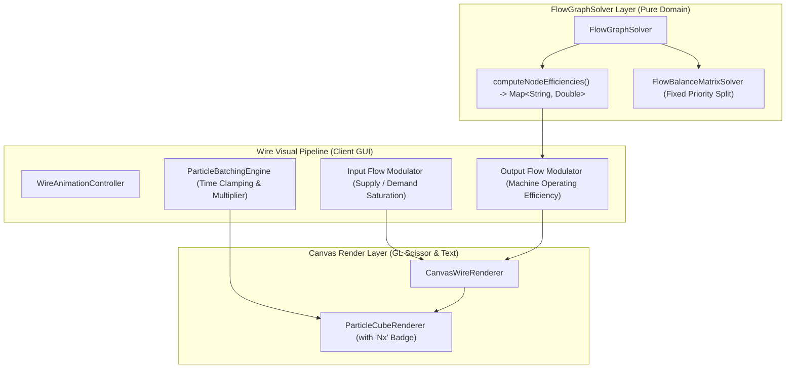
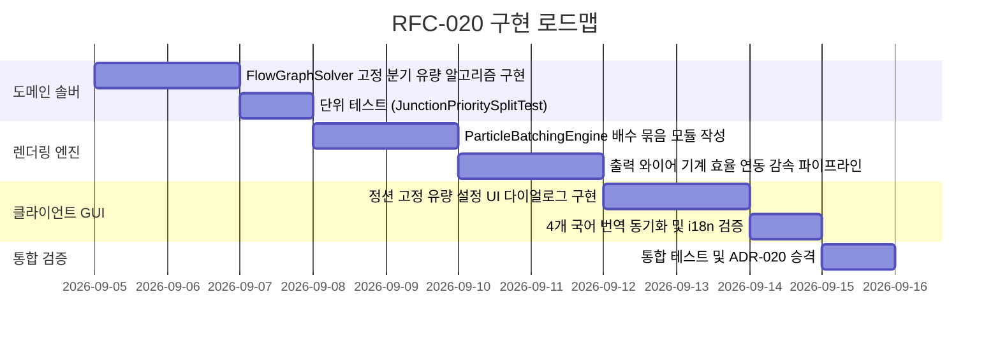

# RFC-020: 고속 레시피 애니메이션 배치, 기계 효율 연동형 출력 와이어 흐름 및 분기 노드 우선 배분 명세
# (High-Speed Recipe Animation Batching, Machine Efficiency Outgoing Wire Flow & Priority Split Specification)

- **문서 번호**: RFC-020
- **대상 버전**: `v2.2.0`
- **상태**: `PROPOSED`
- **작성일**: 2026-09-04
- **주관 계층**: Client GUI Layer (`client.gui.render`, `client.gui.widget`, `client.gui.dialog`), Pure Domain Layer (`api.model`, `api.solver`, `api.property`)

---

## 1. 개요 및 배경 (Motivation)

### 1.1 현황 및 배경
GTCalcBoard v2.1.0-beta.2에서는 와이어의 포화율($\text{Supply} / \text{Demand}$) 기반 3색 흐름 변조 및 간헐적 끊김(Stuttering)을 도입하여 병목 시각화를 크게 개선하였습니다. 그러나 실제 생산 라인을 모델링하는 커뮤니티 유저들의 피드백을 통해 다음과 같은 세 가지 구조적 한계와 개선 요구가 확인되었습니다:

1. **초고속 레시피(1초 미만) 파티클 고주파 진동 및 시각 피로**:
   - 1틱($0.05\text{s}$)~20틱($1.0\text{s}$) 수준으로 빠르게 가동되는 기계(예: 고속 펌프, 분해기, 터빈 등)의 경우, 레시피 1회당 1개 파티클을 방출하면 초당 수십 개의 큐브 파티클이 와이어 위를 지나치게 빠르게 통과하여 심한 깜빡임과 렌더링 부하를 유발합니다.
2. **원인과 결과의 시각적 분리 필요성 (입력선 vs 출력선 UX 불일치)**:
   - 현재 와이어 애니메이션은 주로 원재료의 공급 결핍(입력 포화도)에 집중되어 있습니다.
   - 마인크래프트 기계 GUI의 친숙한 멘탈 모델(좌측 원재료 투입 $\rightarrow$ 중앙 진행 바 $\rightarrow$ 우측 완제품 생산)에서, 재료가 부족할 때 느려지는 것은 **완제품 생산을 향한 화살표(출력)**입니다.
   - 입력선은 "어떤 재료가 부족한지(원인)"를 보여주고, 출력선은 기계 가동 효율($\text{Efficiency}$)에 비례하여 감속되는 "완제품 생산 지연(결과)"을 보여주는 2원화 모델이 요구됩니다.
3. **분기 노드(Junction Node)의 고정 유량 한도 및 우선순위 분배 결여**:
   - 하나의 공급원에서 $N$개의 하위 공정으로 자원이 분기될 때, 현재는 수요 비율에 따른 균등 배분만 가능합니다.
   - 특정 라인에 "초당 고정 $30\text{ mB/t}$"를 최우선 공급하고, 잉여분만 바이패스 라인으로 흘려보내는 우선순위 분기 메커니즘이 부재하여 복잡한 석유화학 정제망 설계 시 수동 계산 우회가 강제됩니다.

### 1.2 목표
- **고속 레시피 애니메이션 배치(Batching) 엔진**: 1초 미만 레시피의 애니메이션 주기를 최소 $1.0\text{s}$ 이상으로 병합하고, 파티클에 `2x`, `20x` 형태의 정수 배수 라벨을 렌더링하여 안정적 가독성을 확보합니다.
- **기계 효율 연동형 2원화 와이어 흐름 모델 (Dual-Stream Wire Model)**:
  - 입력 와이어: 재료별 포화도($\text{Saturation} = \text{Supply}/\text{Demand}$) 기반 색상 및 감속 $\rightarrow$ **결핍 원인 즉시 식별**
  - 출력 와이어: 기계 실제 가동률($\eta_{\text{machine}}$) 연동 감속 및 듀티 사이클 스터터 $\rightarrow$ **생산 지연 결과 직관화**
- **정션 노드 고정 유량 우선 배분 (Fixed Priority Flow Split)**: 특정 출력 포트에 고정 유량 캡($Q_{\text{cap}}$)을 지정하여 우선 공급하고 잔여 유량을 종속 포트로 라우팅하는 솔버 기능 추가.

---

## 2. 핵심 유저 스토리 (User Stories)

| 구분 | 유저 스토리 (User Story) | 수용 기준 (Acceptance Criteria) |
|---|---|---|
| **US-01** | 플레이어는 1틱 초고속 레시피가 구동될 때 캔버스 와이어가 어지럽게 깜빡이지 않고 안정적으로 흐르는 것을 볼 수 있다. | 레시피 주기 $t < 1.0\text{s}$일 때 주기 $T \ge 1.0\text{s}$로 배치되고, 파티클 옆에 `20x` 등 배수 라벨이 선명하게 표시된다. |
| **US-02** | 플레이어는 공급 부족으로 기계 효율이 50%로 떨어졌을 때, 생산물이 나가는 출력 와이어가 2배 느려지는 것을 즉시 인지한다. | 출력 와이어의 파티클 이동 속도가 기계 효율 $\eta$에 비례하여 감속하며, 간헐적 정지(Stutter) 비율이 $1 - \eta$로 적용된다. |
| **US-03** | 플레이어는 정션 노드에서 특정 다운스트림 라인으로 나가는 출력량을 고정값(예: $30\text{ mB/t}$)으로 설정할 수 있다. | 정션 노드 우클릭 다이얼로그에서 연결선별 고정 한도($\text{mB/t}$ 또는 $\text{items/s}$)를 입력할 수 있으며, 초과분만 다른 라인으로 흐른다. |
| **US-04** | 플레이어는 보드 설정에서 고속 배치 라벨 크기 및 출력선 효율 연동 토글을 취향에 맞게 조정할 수 있다. | 설정 다이얼로그(`BoardSettingsDialog`)에 파티클 배치 묶음 옵션 및 출력선 감속 연동 스위치가 제공된다. |

---

## 3. 시스템 아키텍처 명세 (Architecture Specification)

### 3.1 컴포넌트 데이터 흐름도



### 3.2 수식 및 물리 모델 (Mathematical Formulations)

#### 3.2.1 초고속 레시피 배치 애니메이션 수식
단일 머신 사이클 시간 $t_{\text{cycle}}$ (초 단위)이 기준 임계값 $T_{\text{threshold}} = 1.0\text{s}$ 미만인 경우, 가시 애니메이션 주기 $T_{\text{anim}}$과 정수 배치 배수 $M$은 다음과 같이 결정론적으로 산출됩니다:

$$M = \left\lceil \frac{T_{\text{threshold}}}{t_{\text{cycle}}} \right\rceil \quad (M \in \mathbb{N}, M \ge 1)$$

$$T_{\text{anim}} = M \times t_{\text{cycle}} \quad (T_{\text{anim}} \ge 1.0\text{s})$$

- $M = 1$ 인 경우: 일반 단일 파티클 렌더링 (배수 라벨 생략).
- $M > 1$ 인 경우: 파티클 큐브 우측 상단에 축소 폰트로 `Mx` (예: `2x`, `10x`, `20x`) 배지 오버레이 렌더링.
- 파티클당 운송 수량 표기: 기본 레시피 산출량 $\times M$.

#### 3.2.2 2원화 와이어 흐름 제어 모델 (Dual-Stream Modulation)

| 연결선 구분 | 변조 파라미터 (Control Metric) | 기본 속도 승수 ($V_{\text{mult}}$) | 듀티 사이클 멈춤 비율 ($D_{\text{pause}}$) | 색상 전환 기준 |
|:---|:---|:---:|:---:|:---|
| **입력 와이어 (Incoming)** | 포화율 $\phi = \frac{\text{Supply}}{\text{Demand}}$ | $\min(1.0, \phi)$ | $1.0 - \min(1.0, \phi)$ | 청록($\phi \ge 1$) $\rightarrow$ 주황($0.5 \le \phi < 1$) $\rightarrow$ 진홍($\phi < 0.5$) |
| **출력 와이어 (Outgoing)** | 기계 가동률 $\eta_{\text{machine}}$ | $\eta_{\text{machine}}$ | $1.0 - \eta_{\text{machine}}$ | 정상 청록 유지 (속도 및 끊김만 감속되어 생산 지연 반영) |

- **출력 와이어 듀티 사이클 공식**:
  전체 애니메이션 루프 $T_{\text{loop}}$ 중 파티클 이동 활성 시간 $T_{\text{active}}$와 대기 정지 시간 $T_{\text{wait}}$:
  $$T_{\text{active}} = T_{\text{loop}} \times \eta_{\text{machine}}, \quad T_{\text{wait}} = T_{\text{loop}} \times (1.0 - \eta_{\text{machine}})$$
  이를 통해 가동률 $50\%$ 시 파티클은 주기의 절반 동안 부드럽게 이동하고 절반 동안 정지하여 정확히 $2$배 지연된 완제품 출하 주기를 묘사합니다.

#### 3.2.3 정션 노드 고정 유량 우선 배분 (Fixed Priority Split)
정션 노드 $J$에 입력되는 총 유량 $Q_{\text{in}}$에 대해 $K$개의 출력선 중 고정 한도 $Q_{\text{fixed}, i}$가 설정된 우선순위 선들이 존재하는 경우:

1. **1단계 (우선순위 고정 라인 할당)**:
   $$Q_{\text{alloc}, i} = \min(Q_{\text{fixed}, i}, Q_{\text{rem}}), \quad Q_{\text{rem}} \leftarrow Q_{\text{rem}} - Q_{\text{alloc}, i}$$
2. **2단계 (잔여 유량 가변 라인 배분)**:
   고정 한도가 없는 일반 라인 $j$들은 각 다운스트림 노드의 상대적 수요 가중치 $w_j$에 비례하여 잔여 유량 $Q_{\text{rem}}$을 분배:
   $$Q_{\text{alloc}, j} = Q_{\text{rem}} \times \frac{w_j}{\sum_k w_k}$$

---

## 4. UI / UX 디자인 상세

### 4.1 파티클 큐브 `Nx` 라벨 렌더링 와이어프레임

```text
[ 와이어 파티클 렌더링 ]
   일반 파티클 (M = 1)          배치 파티클 (M = 20, 1틱 레시피)
   ┌───┐                        ┌───┐ ┌────┐
   │ 📦│                        │ 📦│ │20x │  (작은 노란색 폰트)
   └───┘                        └───┘ └────┘
     ───> 흐름 속도: 정상           ───> 흐름 속도: 1초 기준 안정화
```

### 4.2 정션 분기 설정 다이얼로그 (Junction Priority Split Dialog)

```text
┌────────────────────────────────────────────────────────┐
│  Junction Output Flow Allocation           [X]         │
├────────────────────────────────────────────────────────┤
│  Total Inflow: 120.0 mB/t                              │
│                                                        │
│  [Port 1] -> Reformer Unit                             │
│  (o) Fixed Flow Limit:   [   30.00 ] mB/t  (Priority 1)│
│                                                        │
│  [Port 2] -> Cracking Unit                             │
│  ( ) Proportional Remainder (Auto 90.0 mB/t)           │
│                                                        │
│  [Port 3] -> Storage Tank (Void Sink)                  │
│  ( ) Overflow / Void Sink Only                         │
│                                                        │
│            [ Cancel ]           [ Apply ]              │
└────────────────────────────────────────────────────────┘
```

---

## 5. 성능 및 복잡도 분석 (Complexity & Performance)

- **배치 연산 오버헤드**:
  - 각 노드의 $t_{\text{cycle}}$ 및 $M$ 값은 레시피 변경 시 1회 계산 후 `NodeCardTextCache`에 캐싱되므로 프레임당 렌더링 비용은 $O(1)$입니다.
- **와이어 렌더링 성능**:
  - 화면 뷰포트 컬링(AABB Viewport Culling)을 통과한 활성 와이어에 대해서만 파티클 배치가 계산되며, 초고속 레시피 파티클 수가 $M$분의 1로 압축되므로 **초당 GL Draw Call 및 텍스처 바인딩 횟수가 기존 대비 최대 80% 감소**합니다.
- **분기 솔버 안정성**:
  - 고정 분기 유량 계산은 단일 패스 탐색($O(E_{\text{out}})$)으로 완료되며 루프 순환 참조 시에도 음수 유량 방어 가드로 인해 무한 루프가 차단됩니다.

---

## 6. 개발 로드맵 (Phased Implementation)


