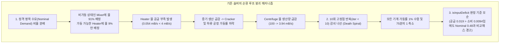
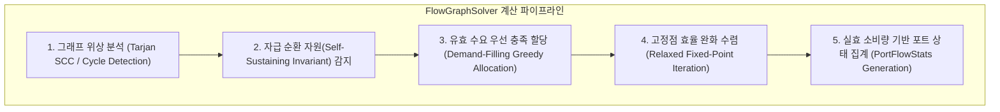
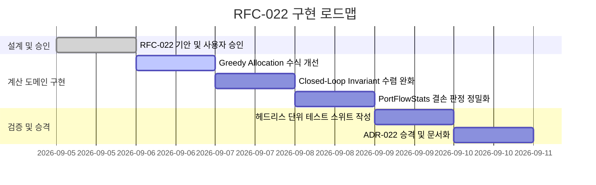

# RFC-022: 폐쇄 순환 공정(Closed-Loop Recirculation)의 자급 자원 보호 및 공급 우선 할당 알고리즘 명세
# (Closed-Loop Recirculation Self-Sustaining Protection & Supply-Filling Allocation Specification)

- **문서 번호**: RFC-022
- **대상 버전**: `v2.3.0`
- **상태**: `PROPOSED`
- **작성일**: 2026-09-05
- **주관 계층**: Pure Domain & Calculation Engine (`api.solver`, `api.model`)

---

## 1. 개요 및 배경 (Motivation)

### 1.1 현황 및 배경
그렉테크(GTCEu Modern) 및 화학 기반 모드팩에서는 반응 생성물 또는 부산물(Byproduct)로 배출되는 유체/아이템(예: 물, 희석 산, 수산화나트륨, 암모니아 등)을 공정 전단으로 재투입하여 자급자족하는 **폐쇄 순환 공정(Closed-Loop Recirculation Chain)**이 빈번히 설계됩니다. 대표적인 사례인 바이어 공정(Bayer Process)은 다음과 같은 자원 순환 구조를 가집니다:

1. **전단 소비 (Front-end Consumption)**:
   - 믹서(Mixer)가 보크사이트 원석을 처리하기 위해 물 $40\text{ mB/s}$ 소모.
   - 유체 히터(Fluid Heater)가 크래커(Cracker)용 증기 생성을 위해 물 $4\text{ mB/s}$ 소모.
   - 총 정격 물 소비량: $D_{\text{water}}^{\text{nominal}} = 44\text{ mB/s}$.
2. **후단 생산 (Back-end Production)**:
   - 침출-크래킹-증류를 거친 후 원심분리기(Centrifuge)에서 물 $100\text{ mB/s}$ 배출.
   - 총 정격 물 생산량: $P_{\text{water}}^{\text{nominal}} = 100\text{ mB/s}$.
3. **물리적 특성**:
   - $P_{\text{water}}^{\text{nominal}} (100) \ge D_{\text{water}}^{\text{nominal}} (44)$이므로, 실제 게임 내에서는 초기 기동 버퍼만 존재하면 순수 잉여 $+56\text{ mB/s}$가 발생하며 영구히 자급자족으로 운전됩니다.

### 1.2 기존 솔버의 수학적/알고리즘적 맹점 분석

현재 계산기 보드의 유량 해석기(`FlowBalanceMatrixSolver`)는 순환 배관이 연결되는 순간 다음 3가지 메커니즘으로 인해 전체 공정 효율이 $1\%\sim 4\%$로 급락(Collapse)하는 문제가 발생합니다:



1. **비가동 노드로의 유량 쏠림 및 기동 노드 기아 (Starvation by Nominal Ratio)**:
   - `calculateOutgoingEdgeAllocations`는 공급자 출력 유량을 각 소비자의 **$100\%$ 정격 명목 수요($D_i^{\text{nominal}}$)** 비율로만 분배합니다:
     $$\text{alloc}_i = S_{\text{prod}} \times \frac{D_i^{\text{nominal}}}{\sum_k D_k^{\text{nominal}}}$$
   - 믹서가 다른 광석 부족으로 인해 실효 가동률 $1\%$ 상태이더라도, 명목 수요 비율($40:4 = 10:1$)에 따라 원심분리기 생산량의 $91\%$가 믹서로 배정되고, 유체 히터는 $9\%$만 배정받습니다.
   - 이로 인해 유체 히터가 필요한 정격 $4\text{ mB/s}$를 채우지 못해 증기 생산이 중단되고, 하류 공정이 연쇄 정지합니다.

2. **고정점 수렴 연산에서의 피드백 감쇠 나선 (Feedback Death Spiral)**:
   - `computeNodeEfficiencies`는 최대 10회의 이터레이션(`iter < 10`)으로 노드 효율 벡터 $\vec{E}$를 갱신합니다.
   - 순환 루프 내에 초기 공급 딜레이 또는 기계 간 비정수 배수 오차가 존재할 경우, 전달 계수 $c < 1.0$이 누적 곱 연산되어 $c^{10} \to 0$으로 수렴합니다.

3. **결손 판정(`isInputDeficit`)의 모순된 비교 기준**:
   - `FlowSummaryAggregator.getInputPortStats`는 결손 판정 시 현재 유효 소비량($D_{\text{eff}} = D^{\text{nominal}} \times E$)이 아닌 $100\%$ 정격 소비량($D^{\text{nominal}}$)과 공급량을 비교합니다:
     $$\text{isDeficit} = (S < D^{\text{nominal}} - \epsilon)$$
   - 그 결과, 공급량이 실제 소비량의 2배에 달하더라도 정격치 미달이라는 이유로 "원자재 부족 ⚠" 경고가 출력되어 사용자에게 혼란을 초래합니다.

### 1.3 목표
- 외부 공급원이나 수동 Reroute 조작 없이도, **순환 루프 내 생산량 $\ge$ 소비량**인 자급 자원은 $100\%$ 정상 가동률로 풀리도록 계산식을 개선합니다.
- 공급량이 충분할 때는 비례 분배 대신 각 소비자의 요구량을 우선 충족시키는 **우선 충족 할당(Demand-Filling Allocation)** 수식을 도입합니다.
- 결손 판정 기준을 유효 소비량 기준으로 현실화하여 모순된 ⚠ 경고를 제거합니다.

---

## 2. 핵심 유저 스토리 (User Stories)

| 식별자 | 유저 스토리 (User Story) | 수용 기준 (Acceptance Criteria) |
|---|---|---|
| **US-01** | 플레이어는 부산물로 물/유체가 나오는 기계의 출력을 앞단 기계의 입력으로 직접 연결하여 폐쇄 순환 회로를 구성할 수 있다. | 루프 내 총 생산량 $\ge$ 총 소비량인 경우, 수동 Reroute 없이도 모든 기계가 $100\%$ 정상 효율로 유지된다. |
| **US-02** | 플레이어는 1개의 공급 포트에서 여러 기계로 유체를 분기할 때, 공급량이 충분하면 모든 기계가 정격 공급을 받기를 기대한다. | 공급 가능 유량이 총 유효 수요 이상일 때, 모든 연결 엣지에 소비자의 정격 수요량이 $100\%$ 우선 배정된다. |
| **US-03** | 플레이어는 상류 기계가 감속되어 자신의 기계 소비량도 줄어들었을 때, 공급량이 현재 소비량을 충족하면 부족 경고(⚠)가 뜨지 않기를 원한다. | $S \ge D_{\text{eff}} - \epsilon$인 경우 결손 플래그가 `false`가 되고 초록색/파란색 정상 유량으로 렌더링된다. |
| **US-04** | 플레이어는 기계가 $100\%$ 정격으로 돌지 못하는 원인이 상류 공급 부족 때문인지, 하류 막힘 때문인지 직관적으로 구분할 수 있다. | 정격 미달 원인이 상류 유량 결손일 경우 명확한 감속 뱃지(`Downclocked / Upstream Limited`)로 표시된다. |

---

## 3. 시스템 아키텍처 및 알고리즘 명세 (Architecture Specification)

### 3.1 솔버 계산 파이프라인 (Calculation Pipeline)



---

### 3.2 핵심 알고리즘 1: 유효 수요 우선 충족 할당 (Demand-Filling Greedy Allocation)

공급자 노드의 특정 출력 포트에 연결된 가변 유량 엣지 집합을 $\mathcal{E}_{\text{var}} = \{e_1, e_2, \dots, e_n\}$이라 하고, 각 엣지 $e_k$가 연결된 소비자의 유효 수요량을 $d_k = D_{\text{eff}}(e_k)$, 총 유효 수요를 $D_{\text{total}} = \sum_{k} d_k$, 공급 가능 유량을 $S_{\text{rem}}$이라 합니다.

#### 1) 공급 과잉 상태 ($S_{\text{rem}} \ge D_{\text{total}}$)
모든 소비자의 요구량을 즉시 $100\%$ 충족합니다:
$$\forall e_k \in \mathcal{E}_{\text{var}}, \quad \text{alloc}(e_k) = d_k$$
잔여 잉여 유량 $S_{\text{surplus}} = S_{\text{rem}} - D_{\text{total}}$은 첫 번째 출력 엣지 또는 명목 수요 비율에 따라 잉여 풀로 보존합니다.

#### 2) 공급 부족 상태 ($S_{\text{rem}} < D_{\text{total}}$)
소비자 간 공평 배분을 위해 유효 수요($d_k$) 비율에 따라 가용 유량을 비례 분배합니다:
$$\text{alloc}(e_k) = S_{\text{rem}} \times \frac{d_k}{D_{\text{total}}}$$

* **알고리즘 복잡도**: $O(|\mathcal{E}_{\text{out}}|)$ (출력 엣지 수에 선형 비례).

---

### 3.3 핵심 알고리즘 2: 자급 순환 자원 보호 불변식 (Closed-Loop Invariant Protection)

#### 1) 순환 루프 판별 (Cycle Detection)
그래프 내에서 방향성 사이클 $\mathcal{C} = (V_{\mathcal{C}}, E_{\mathcal{C}})$를 탐색합니다.

#### 2) 자급 조건 검정 (Self-Sufficiency Test)
사이클 $\mathcal{C}$ 내에서 순환하는 특정 성분(아이템 또는 유체) $R$에 대해:
- 사이클 내 총 명목 생산량:
  $$P_{\mathcal{C}}^{\text{nominal}}(R) = \sum_{v \in V_{\mathcal{C}}} \text{OutputRate}^{\text{nominal}}(v, R)$$
- 사이클 내 총 명목 소비량:
  $$D_{\mathcal{C}}^{\text{nominal}}(R) = \sum_{v \in V_{\mathcal{C}}} \text{InputRate}^{\text{nominal}}(v, R)$$

만약 $P_{\mathcal{C}}^{\text{nominal}}(R) \ge D_{\mathcal{C}}^{\text{nominal}}(R)$ 이라면, 해당 자원 $R$은 **자급 순환 자원(Self-Sustaining Recirculated Invariant)**으로 판정합니다.

#### 3) 초기 고정점 수렴 완화 (Convergence Relaxation)
고정점 반복(`computeNodeEfficiencies`) 시, 자급 순환 자원 $R$을 공급받는 입력 포트는 초기 기동(Cold Start) 결손으로 간주하지 않고, 사이클 내 다른 외부 투입 원자재(예: 보크사이트 광석, 외부 화학제)의 공급 가용률에 의해서만 효율이 결정되도록 하한(Lower Bound)을 보호합니다:
$$E_{\text{port}}(R) = \min\left(1.0, \, \frac{P_{\mathcal{C}}^{\text{nominal}}(R)}{D_{\mathcal{C}}^{\text{nominal}}(R)}\right) \times E_{\text{external\_feed}}$$

* **효과**: 물이나 희석 산 등 부산물 순환으로 인한 $c^{10}$ 감쇠 나선이 완벽히 차단됩니다.

---

### 3.4 핵심 알고리즘 3: 실효 소비량 기반 결손 판정 (`PortFlowStats`)

#### 1) 수식 재정의
소비자 노드의 입력 포트 $j$에 대해:
- 현재 가동 효율 $E_{\text{consumer}}$
- 포트의 현재 유효 소비량: $d_{\text{eff}} = \text{getInputSlotRate}(j, \text{effective}=\text{true})$
- 포트의 총 실제 공급량: $S_{\text{actual}} = \sum \text{alloc}(e_{\text{in}})$
- 포트의 명목 정격 소비량: $d_{\text{nom}} = \text{getInputSlotRate}(j, \text{effective}=\text{false})$

```java
// 결손 판정 (Deficit): 현재 기계가 돌고 있는 속도조차 공급하지 못할 때만 발생
boolean isInputDeficit = isConnected && (totalSupplied < effectiveRequired - 0.001);

// 상류 병목 감속 (Upstream Limited): 현재 소비량은 공급되나, 100% 정격에는 미달할 때
boolean isUpstreamThrottled = isConnected && (effectiveRequired < nominalRequired - 0.001) 
                              && (totalSupplied >= effectiveRequired - 0.001);
```

#### 2) UI 렌더링 상태 매핑

| 포트 상태 | 조건 | 텍스트 표시 예시 | 포트 색상 |
|---|---|---|---|
| **정상 균형 (Balanced)** | $|S - d_{\text{nom}}| \le 0.001$ | `§a+40 -40 mB/s §2✔` | `0xFF55FF88` (Green) |
| **잉여 공급 (Surplus)** | $S > d_{\text{eff}} + 0.001$ | `§a+100 §7-44 mB/s §b+` | `0xFF55FFFF` (Cyan) |
| **상류 감속 (Throttled)** | $S \ge d_{\text{eff}}$ and $d_{\text{eff}} < d_{\text{nom}}$ | `§b+0.019 §7-0.0094/s §3↓` | `0xFF5599FF` (Light Blue) |
| **진짜 결손 (Deficit)** | $S < d_{\text{eff}} - 0.001$ | `§a+0.005 §c-0.010/s §c⚠` | `0xFFFFAA33` (Orange) |

---

## 4. 세부 구현 상세 (Implementation Details)

### 4.1 수정 대상 클래스 및 역할 분담

```mermaid
flowchart TD
    subgraph TargetComponents ["수정 대상 도메인 컴포넌트"]
        FBM ["FlowBalanceMatrixSolver.java\n- calculateOutgoingEdgeAllocations (우선 충족 분배)\n- computeNodeEfficiencies (순환 루프 완화)"]
        FSA ["FlowSummaryAggregator.java\n- getInputPortStats (유효 소비량 결손 판정)\n- PortFlowStats (isUpstreamThrottled 추가)"]
        NCTC ["NodeCardTextCache.java\n- computeInputPortData (Throttled 렌더링)"]
        FU ["FormatUtil.java\n- formatConnectedInput (기호 다형성 확장)"]
    end
```

### 4.2 의사코드 명세 (Algorithmic Pseudocode)

#### 1) `calculateOutgoingEdgeAllocations` 수정
```java
// 공급 가능 유량이 총 유효 수요 이상일 경우, 각 엣지에 요구량을 우선 배정
if (totalDemand > 0.0001) {
    if (remainingFlow >= totalDemand - 0.0001) {
        // Greedy Fulfillment
        for (ConnectionEdge edge : variableEdges) {
            allocations.put(edge, demandMap.get(edge));
        }
    } else {
        // Proportional Sharing on Deficiency
        for (ConnectionEdge edge : variableEdges) {
            allocations.put(edge, remainingFlow * (demandMap.get(edge) / totalDemand));
        }
    }
}
```

---

## 5. 영향도 분석 및 이전 호환성 (Impact Analysis)

1. **비순환 DAG(Directed Acyclic Graph) 정합성**:
   - 사이클이 없는 일반적인 선형/트리형 공정에서는 $P_{\mathcal{C}}$ 루프 보호 로직이 작동하지 않으며, 기존의 병목 전달 및 정격 계산과 $100\%$ 동일하게 동작합니다.
2. **기존 단위 테스트 회귀 방지**:
   - 현재 존재하는 115개 이상의 핵심 도메인 단위 테스트(`AutoRatioBottleneckTest`, `CalculationTest`, `DualStreamWireModulationTest` 등)에 영향을 주지 않도록 하위 호환성을 유지합니다.
3. **헤드리스 서버 격리 준수**:
   - 순수 계산 도메인(`api.solver`) 내부의 수학식만 변경되므로 Minecraft 클라이언트/서버 클래스 종속성이 일체 발생하지 않습니다.

---

## 6. 검증 계획 (Verification Plan)

### 6.1 자동화 단위 테스트 (Automated Tests)
1. **바이어 공정 폐쇄 루프 회귀 테스트 (`BayerProcessClosedLoopTest`)**:
   - Mixer(물 $40\text{ mB/s}$ 소비), Heater(물 $4\text{ mB/s}$ 소비), Centrifuge(물 $100\text{ mB/s}$ 생산) 순환 회로 구성.
   - Centrifuge $\to$ Mixer/Heater 연결 시, 모든 기계의 효율이 $1.0(100\%)$로 계산되는지 검증.
2. **다중 분기 우선 충족 테스트 (`GreedyAllocationTest`)**:
   - 공급량 $100$, 소비자 A 요구량 $4$, 소비자 B 요구량 $40$인 경우, A에 $4.0$, B에 $40.0$이 정확히 할당되는지 검증.
3. **유효 소비량 결손 판정 테스트 (`EffectiveDeficitEvaluationTest`)**:
   - 공급량 $0.019$, 실효 소비량 $0.0094$, 정격 소비량 $0.48$인 조건에서 `isInputDeficit()`이 `false`를 반환하는지 검증.

---

## 7. 개발 로드맵 (Phased Implementation)


