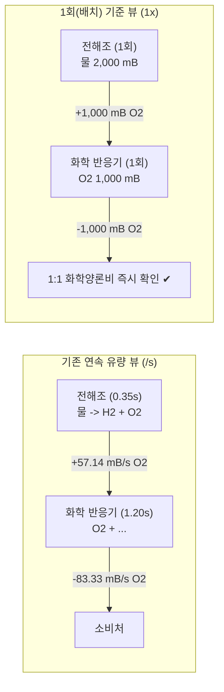
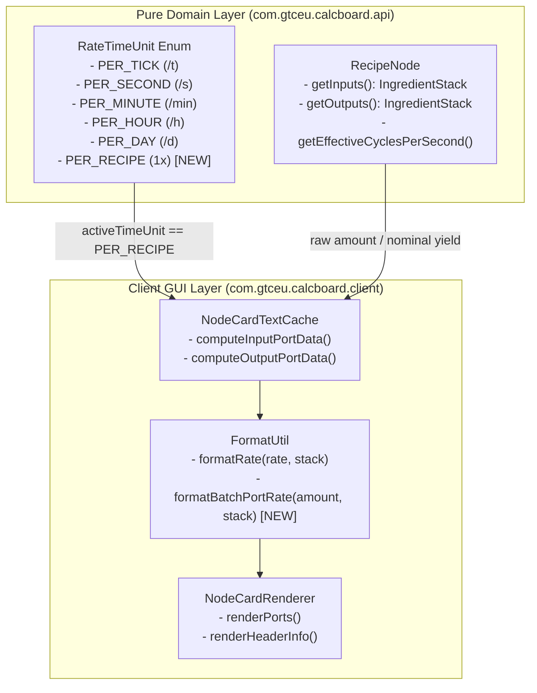
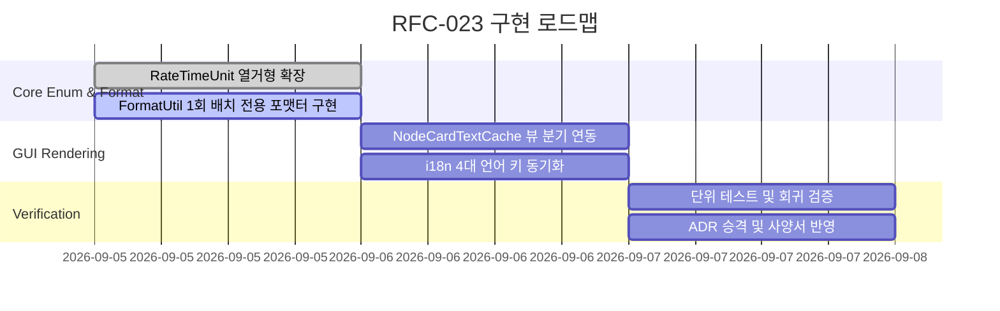

# RFC-023: 레시피 1회(배치) 기준 뷰 모드 및 화학양론적 순환 루프 검증 명세
# (Per-Craft Batch View & Stoichiometric Recirculation Loop Verification Specification)

- **문서 번호**: RFC-023
- **대상 버전**: `v2.3.0`
- **상태**: `PROPOSED`
- **작성일**: 2026-09-05
- **주관 계층**: UI Rendering & Pure Calculation Domain (`client.gui.render`, `client.gui.util`, `api.type`, `api.model`, `api.solver`)

---

## 1. 개요 및 배경 (Motivation)

### 1.1 현황 및 배경
본 계산기 모드(`GregTechCalculatorBoard`)는 연속 흐름(Continuous Flow Rate, 단위: `/s`, `/t`, `/min`, `/h`, `/d`) 기반의 정상 상태(Steady-state) 물리 모델로 설계되어 있습니다. 기계 노드에 등록된 원본 레시피 수량($A_{\text{in}}, A_{\text{out}}$)에 전압 티어 오버클럭, 병렬 수($P$), 기계 대수($N$), 가동 효율($\eta$)이 결합되어 최종 실효 초당 사이클 수($\text{CPS}_{\text{eff}}$)가 곱해진 유량이 산출됩니다:

$$\text{Rate} = A \times \text{CPS}_{\text{eff}} \times N \times \eta \quad [\text{items/s} \text{ 또는 } \text{mB/s}]$$

### 1.2 문제점 분석 (화학 순환 공정 설계 시의 사용자 애로사항)
그렉테크의 대표적인 다단계 화학 공정(백금족 금속 분리 정제선, 바이어 알루미나 공정, 질산/황산 폐쇄 재활용 회로 등)을 설계할 때, 플레이어는 공장의 물리적 규모(기계 대수 및 오버클럭 티어)를 확정하기에 앞서 **"공정 체인이 화학양론적으로 닫힌 순환 루프(Closed Stoichiometric Loop)를 형성하는가?"**를 먼저 검증하고자 합니다.

그러나 기계마다 기본 작업 시간(Duration, 예: $0.35\text{s}$, $1.2\text{s}$, $7.5\text{s}$, $15.0\text{s}$)이 상이하여, 이를 연속 시간 유량으로 환산할 경우 다음과 같은 비직관적인 소수점 문제가 발생합니다:



1. **소수점 난립으로 인한 암산 불가능**:
   - 순수 레시피 상으로는 $2{,}000\text{ mB} \to 1{,}000\text{ mB}$의 정수비 반응임에도, 오버클럭 소요 시간이 개입되어 $+57.14\text{ mB/s}$, $-83.33\text{ mB/s}$와 같은 무한소수가 노드 카드에 렌더링됩니다.
   - 단위 시간을 $1\text{분}(/\min)$으로 늘려도 $+3{,}428.57\text{ mB/min}$ 등으로 변환될 뿐, 화학 반응비 정합성을 직관적으로 파악할 수 없습니다.
2. **공정 설계 단계의 불일치**:
   - 플레이어의 설계 워크플로우는 **[1단계: 화학 반응비 논리 설계]** $\to$ **[2단계: 기계 대수 및 오버클럭 티어 물리 배치]**의 순서로 진행됩니다.
   - 현재 시스템은 1단계 단계에서도 강제적으로 2단계(CPS 및 티어 오버클럭) 연산을 적용하여 루프 성립 여부 검증을 방해합니다.

### 1.3 목표
1. 기계의 작업 시간($t$) 및 오버클럭 CPS 변수를 소거하고, 순수 레시피 1회(Batch / 1 Craft) 기준의 정량 투입/산출량을 시각화하는 **배치 뷰 모드 (`RateTimeUnit.PER_RECIPE`)**를 도입합니다.
2. 포트 간 엣지 연결 시, 1회당 생산량과 소비량의 비를 $O(|E|)$ 선형 시간으로 검증하여 화학양론적 밸런스 일치 여부(✔)를 즉시 시각화합니다.
3. 기존 계산기의 핵심 물리 도메인(`FlowGraphSolver`, `NodeRateCalculator`)의 연속 유량 엔진을 파괴하지 않고, 뷰(View/Format) 계층의 단위 확장 형태로 완벽히 격리하여 구현합니다.

---

## 2. 핵심 유저 스토리 (User Stories)

| 식별자 | 유저 스토리 (User Story) | 수용 기준 (Acceptance Criteria) |
| :--- | :--- | :--- |
| **US-01** | 플레이어는 툴바의 시간 단위 토글러 버튼 또는 단축키를 통해 `/s`, `/min` 등과 동등하게 **`1x (Per Craft / 1회당)`** 단위를 순환 선택할 수 있다. | `RateTimeUnit` 순환 목록에 `PER_RECIPE`가 포함되며, 클릭 시 즉시 캔버스 전역 노드 카드의 표시 단위가 갱신된다. |
| **US-02** | 1회 기준 뷰 모드 활성화 시, 노드 카드의 모든 포트 텍스트에서 시간 접미사(`/s`)가 제거되고 순수 레시피 수치(예: `-1,000 mB`, `+500 mB`, `-4`)가 정수로 표시된다. | 기계의 오버클럭 속도나 기계 대수($N$)와 무관하게 원본 레시피의 `amount` 기반 수치가 직관적으로 렌더링된다. |
| **US-03** | 플레이어는 공급 노드의 1회 생산량과 소비 노드의 1회 소비량이 일치할 경우, 소수점 오차 없이 완전 일치 초록색 체크(`§2✔`)를 확인할 수 있다. | $|q_{\text{out}} - q_{\text{in}}| \le 10^{-4}$ 조건 만족 시 정상 밸런스 인디케이터가 표시된다. |
| **US-04** | 1회 기준 뷰 모드에서도 기계 헤더 영역의 전력 및 작업 소요 시간은 참고용으로 계속 확인할 수 있다. | 전력 및 소요 시간 정보는 유지되되, 괄호 안의 CPS 수치(`(2.85/s)`)는 `(1x)`로 대체되거나 간결히 정돈된다. |

---

## 3. 시스템 아키텍처 명세 (Architecture Specification)

### 3.1 뷰 파이프라인 및 데이터 흐름 (Rendering Pipeline)



### 3.2 단위 열거형 확장 (`RateTimeUnit`)

`com.gtceu.calcboard.api.type.RateTimeUnit`에 신규 열거형 상수를 추가합니다:

```java
public enum RateTimeUnit {
    PER_TICK("/t", 0.05, "gui.gtcalcboard.unit.per_tick"),
    PER_SECOND("/s", 1.0, "gui.gtcalcboard.unit.per_second"),
    PER_MINUTE("/min", 60.0, "gui.gtcalcboard.unit.per_minute"),
    PER_HOUR("/h", 3600.0, "gui.gtcalcboard.unit.per_hour"),
    PER_DAY("/d", 86400.0, "gui.gtcalcboard.unit.per_day"),
    PER_RECIPE(" 1x", 0.0, "gui.gtcalcboard.unit.per_recipe"); // factor 0.0은 시간 소거 플래그

    public boolean isRecipeBatchMode() {
        return this == PER_RECIPE;
    }
}
```

### 3.3 포맷팅 엔진 명세 (`FormatUtil`)

`FormatUtil`에 1회 레시피 기준 전용 포맷팅 헬퍼를 추가하여 기존 연속 유량 수식과의 간섭을 차단합니다:

```java
public static String formatRecipeBatchAmount(double rawAmount, IngredientStack stack) {
    if (stack != null && stack.isStressUnit()) {
        return NumberFormatUtil.formatCompactNumber(rawAmount) + " SU";
    }
    boolean isFluid = (stack != null && stack.isFluid());
    if (isFluid) {
        if (activeFluidUnitMode == FluidUnitMode.ALWAYS_MB) {
            return formatCompactNumber(rawAmount) + " mB";
        } else if (activeFluidUnitMode == FluidUnitMode.ALWAYS_B) {
            return formatCompactNumber(rawAmount / 1000.0) + " B";
        } else {
            return rawAmount >= 1000.0 
                    ? formatCompactNumber(rawAmount / 1000.0) + " B"
                    : formatCompactNumber(rawAmount) + " mB";
        }
    }
    return formatCompactNumber(rawAmount);
}
```

### 3.4 노드 카드 텍스트 캐시 포트 데이터 연산 (`NodeCardTextCache`)

`computeInputPortData` 및 `computeOutputPortData`에서 `FormatUtil.getActiveTimeUnit().isRecipeBatchMode()` 분기를 적용합니다:

1. **입력 포트 (Input Port)**:
   - 표시 수치: $A_{\text{in}} = \text{inStack.getAmount()}$
   - 미연결 시: `§7-` + `formatRecipeBatchAmount(Ain, in)`
   - 연결 시: 하류 연결 공급 합계의 1회 기준 양과 $A_{\text{in}}$을 비교하여 밸런스(✔), 결손(⚠), 잉여(+) 판정.
2. **출력 포트 (Output Port)**:
   - 표시 수치: $A_{\text{out}} = \text{outStack.getAmount()} \times \text{chance}$
   - 미연결 시: `§a+` + `formatRecipeBatchAmount(Aout, out)`
   - 연결 시: $A_{\text{out}}$과 연결 소비 노드의 요구량을 비교하여 상태 판정.

---

## 4. UI / UX 디자인 상세

### 4.1 사이드바 툴바 및 단축키 인터랙션
- **단위 전환 버튼**:
  - 기존 툴바의 시간 단위 토글 버튼에 `1x` 상태가 순환 추가됩니다:
    $$[\text{/s}] \;\longrightarrow\; [\text{/min}] \;\longrightarrow\; [\text{/h}] \;\longrightarrow\; [\text{/d}] \;\longrightarrow\; [\text{/t}] \;\longrightarrow\; [\mathbf{1x}] \;\longrightarrow\; [\text{/s}]$$
  - 단축키(단위 전환 핫키) 입력 시 동일하게 `1x` 모드로 전환됩니다.

### 4.2 노드 카드 시각적 와이어프레임 비교

#### [기존: 초당 연속 유량 모드 (/s)]
```text
┌──────────────────────────────────────────────┐
│ ⚡ Large Chemical Reactor              [LV] x │
│ [ 1.00 ]  [+]  [/2]  [x2]                    │
│ 1365.3 EU/t (LV)            20.00s (0.05/s)  │
├──────────────────────────────────────────────┤
│ 💧 -26.67 mB/s      │ 🧪 +35.67 mB/s         │
│ 🔘 -0.05/s          │ 🫧 +17.78 mB/s         │
└──────────────────────────────────────────────┘
```

#### [신규: 1회 배치 모드 (1x)]
```text
┌──────────────────────────────────────────────┐
│ ⚡ Large Chemical Reactor              [LV] x │
│ [ 1.00 ]  [+]  [/2]  [x2]                    │
│ 1365.3 EU/t (LV)                  20.00s (1x)│
├──────────────────────────────────────────────┤
│ 💧 -533 mB          │ 🧪 +713 mB             │
│ 🔘 -1               │ 🫧 +356 mB             │
└──────────────────────────────────────────────┘
```

---

## 5. 다국어 리소스 관리 (i18n)

다음 4개 언어 파일에 `gui.gtcalcboard.unit.per_recipe` 키를 동기화합니다:

| 언어 코드 | 파일 경로 | 번역 텍스트 |
| :--- | :--- | :--- |
| **`ko_kr`** | `assets/gtcalcboard/lang/ko_kr.json` | `"1회당 (레시피)"` |
| **`en_us`** | `assets/gtcalcboard/lang/en_us.json` | `"Per Craft (1x)"` |
| **`zh_cn`** | `assets/gtcalcboard/lang/zh_cn.json` | `"单次配方 (1x)"` |
| **`ru_ru`** | `assets/gtcalcboard/lang/ru_ru.json` | `"За рецепт (1x)"` |

---

## 6. 품질 및 아키텍처 원칙 준수 검증 (Compliance Checklist)

- [x] **Rule 1 (자기 서술적 클린 코드)**: 불필요한 단순 해설 주석 배제 및 3단계 이하의 평탄한 제어 흐름 유지.
- [x] **Rule 5 (결정론적 연역 분석)**: 문자열 파싱(`contains`) 없이 `RateTimeUnit.isRecipeBatchMode()` 및 강타입 수치 모델 직접 연산.
- [x] **Rule 6 (도메인 모델 순수성)**: `RecipeNode` 및 `FlowGraph` 코어 모델에 GUI/포맷팅 코드가 오염되지 않고 `FormatUtil` 및 `NodeCardTextCache`에 완전 캡슐화.
- [x] **Strict Anti-Hype Policy**: 과장된 마케팅 수식어 일체 배제, 수학적 입출력 모델과 데이터 흐름 중심의 담백한 엔지니어링 어조 유지.

---

## 7. 개발 로드맵 (Phased Implementation)


