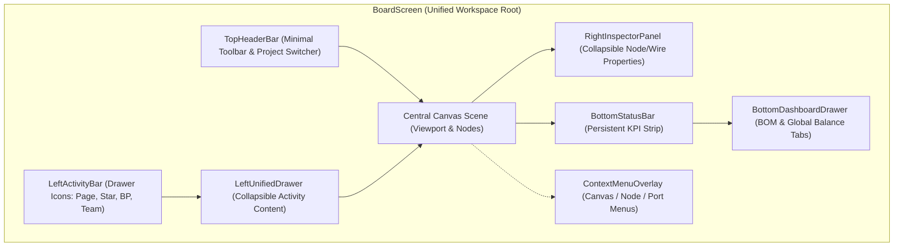
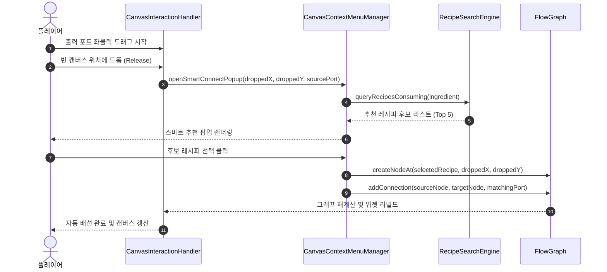
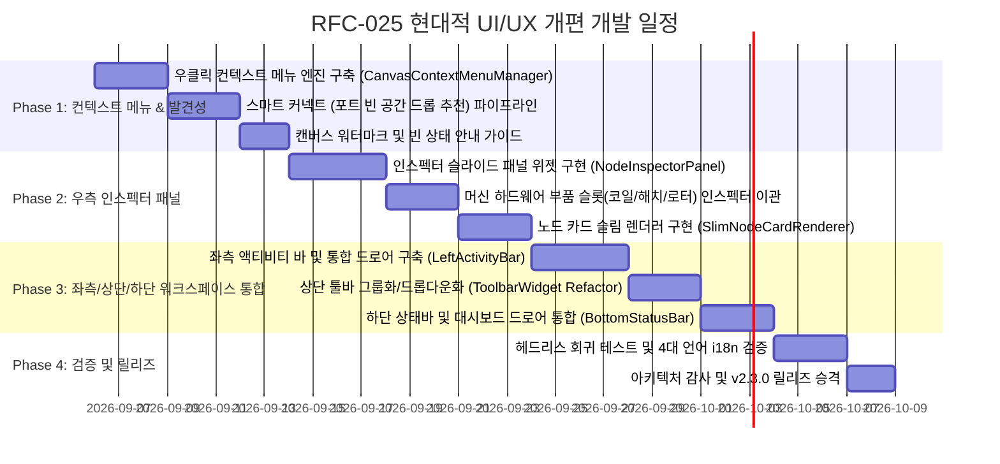

# RFC-025: 3-패널 통합 워크스페이스 및 컨텍스트 중심 UI/UX 현대화 명세
# (Unified Canvas Workspace & Context-Driven UI/UX Modernization Specification)

- **문서 번호**: RFC-025
- **대상 버전**: `v2.3.0`
- **상태**: `PROPOSED`
- **작성일**: 2026-09-05
- **주관 계층**: Client GUI Layer (`client.gui`, `client.gui.widget`, `client.gui.interaction`, `client.gui.render`), Pure Domain Layer (`api.model`, `api.storage`)

---

## 1. 개요 및 배경 (Motivation)

### 1.1 현황 및 한계 분석 (AS-IS)
`GregTechCalculatorBoard`는 $O(1)$ 포트 유량 캐싱, 폐쇄 순환 루프 보호, 목표 유량 역산 등 복잡한 엔지니어링 계산 엔진을 성공적으로 구축했으나, 이를 조작하는 클라이언트 GUI 계층은 기능 추가에 따라 다음과 같은 구조적 UX 한계에 직면해 있습니다:

1. **숨겨진 인터랙션(Hidden Affordance) 과다 및 발견성(Discoverability) 저하**:
   - `Auto Connect`는 `Shift` 조합 시 `Quick Connect`로 변경, `Auto Ratio`는 `Shift`(조화)/`Alt`(분수 비율) 조합 시에만 세부 모드가 활성화되는 등 핵심 기능이 은닉 단축키 뒤에 숨어 있습니다.
   - 포트 숨김(우클릭), 포트 보이드(Ctrl/Shift+우클릭), 대체 재료 순환(휠 스크롤) 등 노드 내부 조작 또한 시각적 단서가 없어 신규 사용자가 18개 항목의 단축키 치트시트(`HotkeyHudWidget`)를 숙지하지 않으면 기능 활용이 불가능합니다.
2. **노드 카드의 초과밀 마이크로 대시보드화 (Visual Clutter)**:
   - 노드 카드 1개 내에 4~5개 극소형 헤더 버튼, 4개 대수 증감 버튼(`-`, `+`, `/2`, `x2`), 티어/속도 제어 텍스트, 오버클럭 버튼, 장착 애드온 트레이, 입출력 포트가 전부 밀집되어 있습니다.
   - 노드가 10개 이상 배치되면 화면 전체가 작은 계측기들로 뒤덮여 시각적 소음(Visual Noise)이 급증하고 캔버스 가독성이 저하됩니다.
3. **현대적 노드 에디터 멘탈 모델과의 충돌**:
   - Figma, Blender, Unreal Engine 등 업계 표준 노드 도구에서 마우스 우클릭은 **컨텍스트 메뉴(Context Menu)**를 호출하는 표준 조작입니다.
   - 현행 시스템은 빈 캔버스 우클릭이 화면 패닝(Pan)으로 바인딩되어 있으며 캔버스 수준의 컨텍스트 메뉴가 전무하여, 새 노드 추가 시 `Space` 또는 빈 곳 더블클릭 단축키에 의존해야 합니다.
4. **고정 오버레이에 의한 작업 캔버스 침범 (Canvas Real Estate 압박)**:
   - 상단 15개 버튼 툴바, 좌상단 탭 바, 좌측 페이지 드로어, 우측/하단 즐겨찾기 독, 좌하단 단축키 HUD, 우하단 수지 요약창이 사방에서 캔버스를 점유하여 중앙 유효 작업 면적이 협소합니다.
5. **모달 다이얼로그 남발로 인한 작업 흐름(Flow) 단절**:
   - 머신 설정(`MachineConfigDialog`), 자재 명세서(`MultiblockBOMDialog`), 글로벌 수지(`GlobalBalanceDashboardDialog`) 등 20여 종의 모달이 열릴 때마다 캔버스가 어두워지며 중앙을 가로막아 회로를 보면서 설정을 튜닝하는 연속적 인터랙션이 차단됩니다.

### 1.2 설계 목표 (TO-BE Principles)
- **컨텍스트 기반 인터랙션 도입**: 캔버스 빈 공간, 노드, 포트, 선택 영역 우클릭 시 명확한 컨텍스트 메뉴를 제공하여 단축키 암기 없이 모든 기능을 100% 탐색 가능하도록 개선합니다.
- **3-패널 통합 워크스페이스 구축 (Unified 3-Panel Architecture)**:
  - **좌측 액티비티 바 (Left Activity Bar)**: 페이지 탐색, 즐겨찾기, 블루프린트, 팀 관리를 단일 슬라이드 드로어로 일원화.
  - **중앙 슬림 캔버스 (Zen Canvas)**: 노드 카드를 본체-포트 중심으로 슬림화하고, 캔버스 워터마크 안내를 배치.
  - **우측 인스펙터 패널 (Node Inspector Panel)**: 노드 선택 시 티어, 오버클럭, 코일/해치/로터 하드웨어 설정을 비모달(Non-modal) 사이드바로 실시간 제어.
  - **하단 반응형 상태바 (Adaptive Status Bar)**: 전력/기계 총합 및 수지/BOM 대시보드를 하단 드로어로 단일화.
- **기존 파워 유저 하위 호환성 100% 보장**: 기존의 모든 단축키(Space, J, T, B, Ctrl+G, Ctrl+Shift+G 등)는 완전히 동일하게 유지하여 기존 사용자의 생산성 저하를 방지합니다.

---

## 2. 핵심 유저 스토리 (User Stories)

| 구분 | 유저 스토리 (User Story) | 수용 기준 (Acceptance Criteria) |
|---|---|---|
| **US-01** | 신규 플레이어는 빈 캔버스에서 조작법을 몰라도 시각적 안내와 우클릭 메뉴를 통해 첫 레시피를 손쉽게 추가할 수 있다. | 빈 캔버스 중앙에 `[우클릭 또는 Space로 레시피 추가]` 워터마크가 표시되며, 우클릭 시 `[+ 레시피 검색]`, `[+ 정크션 추가]` 메뉴가 즉시 표시된다. |
| **US-02** | 플레이어는 노드 출력 포트를 빈 공간으로 드래그하여 해당 부산물을 소모하는 다음 공정을 즉시 추천받아 연결할 수 있다. | 포트 드래그 후 빈 캔버스에 릴리즈 시 '스마트 추천 팝업'이 출력되며, 검색된 레시피 노드가 해당 위치에 생성되고 와이어가 자동 배선된다. |
| **US-03** | 플레이어는 화면 전체를 가리는 모달 없이 캔버스를 보면서 우측 인스펙터에서 기계 티어와 부품(코일/해치/로터)을 즉시 튜닝할 수 있다. | 노드 클릭 시 우측 인스펙터 패널이 슬라이드 인되며, 전압 칩 버튼 및 부품 슬롯 변경 시 캔버스 전력 및 가동률이 실시간 갱신된다. |
| **US-04** | 플레이어는 비율 최적화 버튼의 드롭다운 메뉴를 통해 정수, 분수, 조화 비율의 차이를 직관적으로 이해하고 선택할 수 있다. | 상단 `[비율 최적화 ▼]` 클릭 시 3대 모드(정수 올림, 정밀 분수, 현재 생산량 조화)가 명확한 텍스트 설명과 함께 표시된다. |
| **US-05** | 플레이어는 여러 노드를 드래그 선택하여 상단 플로팅 액션 바 또는 우클릭으로 모듈화/프레임 생성을 즉시 수행할 수 있다. | 다중 선택 시 선택 영역 상단에 플로팅 액션 바(`[▤ 프레임]`, `[📦 모듈]`, `[⚖ 비율]`, `[정렬]`)가 출력된다. |
| **US-06** | 플레이어는 캔버스 뷰를 유지한 채 하단 상태바를 통해 실시간 BOM(자재 청구서)과 입출력 수지(Balance)를 대조 검토할 수 있다. | 하단 상태바 클릭 시 하단 대시보드 드로어가 전개되며, BOM과 Balance를 탭으로 전환하며 캔버스 노드와 상호 하이라이트된다. |

---

## 3. 시스템 아키텍처 명세 (Architecture Specification)

### 3.1 3-패널 통합 워크스페이스 구조 (Unified 3-Panel Hierarchy)



### 3.2 핵심 신규 컴포넌트 설계

#### 1) `CanvasContextMenuManager` (우클릭 컨텍스트 메뉴 엔진)
- **위치**: `com.gtceu.calcboard.client.gui.interaction.CanvasContextMenuManager`
- **역할**: 마우스 우클릭 시 마우스 이동 거리(Drag Threshold: 4px)를 측정하여, 단순 클릭 릴리즈인 경우 마우스 위치에 계층형 컨텍스트 메뉴를 렌더링.
- **메뉴 컨텍스트 분기**:
  - **빈 캔버스 (Empty Canvas)**:
    - `+ 레시피 검색 및 추가 (Space)`
    - `+ 재배선 정크션 추가 (J)`
    - `📋 클립보드 붙여넣기 (Ctrl+V)`
    - `⌖ 전체 뷰 맞춤 (Home/F)`
    - `🧹 자동 레이아웃 정렬`
  - **단일 노드 (Single Node)**:
    - `⚙ 상세 설정 및 부품 (우측 인스펙터)`
    - `⟲ 레시피 교체`
    - `➔ 입출력 방향 반전 (F)`
    - `⌖ 기준 목표 노드 지정`
    - `⎘ 노드 복제 (Ctrl+D)`
    - `✕ 노드 삭제 (Del)`
  - **다중 선택 영역 (Multi-Selection)**:
    - `▤ 프레임으로 묶기 (Ctrl+G)`
    - `📦 단일 모듈로 압축 (Ctrl+Shift+G)`
    - `⧉ 공유 기계 프레임 생성 (Ctrl+Shift+S)`
    - `⚖ 선택 영역만 자동 비율 계산`
    - `✕ 선택 영역 삭제 (Del)`
  - **포트 (Port)**:
    - `👁 포트 숨기기`
    - `🗑 부산물 소각(Void) 토글`
    - `⚡ 목표 생산량 지정 (역산)`
    - `🔄 대체 재료 순환`

#### 2) `NodeInspectorPanel` (비모달 우측 인스펙터 패널)
- **위치**: `com.gtceu.calcboard.client.gui.widget.NodeInspectorPanel`
- **역할**: 캔버스에서 노드 또는 와이어가 선택되었을 때 우측에서 부드럽게 전개(`width: 200px`)되는 속성 제어 패널.
- **주요 섹션**:
  1. **헤더**: 기계 아이콘, 커스텀 명칭 텍스트필드, 노드 ID, 닫기 버튼.
  2. **기계 대수 제어**: 대수 슬라이더, `[-]`, `[+]`, `/2`, `x2`, 베이스 앵커(Lock) 토글.
  3. **전압 및 모드 제어**: 티어 선택기(ULV~MAX 라디오 칩), 오버클럭 모드 드롭다운.
  4. **하드웨어 부품 장착 (멀티블록/특수 기계)**:
     - 코일 등급 선택기 (Cupronickel ~ Trinium 등)
     - 병렬 제어 해치 등급 (1x, 4x, 16x, 64x)
     - 터빈 로터/서멀 증강 슬롯
  5. **입출력 포트 관리**: 포트 목록, 실효 유량, 소각(Void) 스위치, 목표 유량 역산기.

#### 3) `SlimNodeCardRenderer` (경량 노드 카드 렌더러)
- **위치**: `com.gtceu.calcboard.client.gui.render.NodeCardRenderer` (리팩토링)
- **카드 높이 및 요소 축소**:
  - 기존 3행(티어, 오버클럭, 애드온 트레이)을 노드 카드 표면에서 제거하여 우측 인스펙터로 이관.
  - 카드 높이를 평균 $35\%\sim 45\%$ 감축하여 캔버스 내 노드 밀집도 향상.
  - 카드 표면에는 **[머신 아이콘 + 이름 + 대수(`xN.NN`) + 경고 배지]**와 **[입/출력 포트 슬롯]**만 집중 배치.

#### 4) `AdaptiveStatusBar` & `BottomDashboardDrawer` (하단 대시보드)
- **위치**: `com.gtceu.calcboard.client.gui.widget.AdaptiveStatusBar`
- **역할**:
  - 평상시: 화면 하단에 18px 높이의 얇은 띠로 상시 정보 표시 (`⚡ 총 전력: -2,048 EU/t (EV) | ▦ 기계: 8대 | ⚠ 결손: 0 | [▲ 대시보드]`).
  - 클릭/드래그 시: 하단에서 높이 160px의 드로어가 전개되어 **[자재 명세서 (BOM)]**, **[총 입출력 수지 (Balance)]**, **[전력/유체 그래프]**를 탭으로 조회.

### 3.3 사용자 인터랙션 시퀀스 다이어그램 (Smart Connect Workflow)



---

## 4. UI / UX 상세 와이어프레임 (UI Wireframe Specification)

### 4.1 통합 3-패널 메인 레이아웃 (Main Workspace Wireframe)

```
┌───┬───────────────────────────────────────────────────────────────────┬───┐
│ ▤ │ [석유 정제 라인 v2 ▼]     [최적화 ▼]  [보기 ▼]  [도움말 ▼]   │ ↶ ↷ │ ✕ │
├───┴───────────────────────────────────────────────────────────────────┴───┤
│[A]│                                                           │[INSPECTOR]│
│ 📁│                                                           │           │
│   │     ┌─────────────────────┐       ┌─────────────────────┐ │ 화학반응기│
│ ★ │     │ 증류탑 (Distillation)│       │ 화학반응기 (x2.50)  │ │ ───────── │
│   │     │ ─────────────────── │───────│ ─────────────────── │ │ ■ 대수:2.5│
│ 📋│     │ ● 원유    ● 나프타 ═╪══════>│ ● 나프타  ● 폴리에틸│ │ [-][+][x2]│
│   │     │           ● 황산가스│       │ ● 염소    ● 잔여염산│ │           │
│ 👥│     └─────────────────────┘       └─────────────────────┘ │ ■ 전압: HV│
│   │                                                           │ [MV](HV)EV│
│ ⚙ │              "우클릭하여 새 레시피 또는 정크션을 추가하세요"      │           │
│   │                         (Watermark Guide)                 │ ■ 부품:   │
│   │                                                           │ [코일/해치]│
├───┴───────────────────────────────────────────────────────────┴───────────┤
│ [STATUS] ⚡ 총 전력: -1,840 EU/t (HV)  │  ▦ 총 기계: 14대  │  [▲ 대시보드]   │
└───────────────────────────────────────────────────────────────────────────┘
```

### 4.2 슬림 노드 카드 (Slim Node Card) 구조 비교

```
[ 기존 과밀 노드 카드 (AS-IS) ]           [ 제안 슬림 노드 카드 (TO-BE) ]
┌──────────────────────────────┐        ┌──────────────────────────────┐
│ [아이콘] 화학 반응기 ⟲ ➔ ⌖ x │        │ [아이콘] 화학 반응기 (x2.5) x│
│ Count [-] [ 2.5 ] [+] /2 x2  │ ───▶   │ ──────────────────────────── │
│ [HV] [Overclock: Standard] ⚙ │        │ ● [나프타] 120 L/s  ● [PE]   │
│ -1,024 EU/t (2.0s)           │        │ ● [염소]    50 L/s  ● [HCl]  │
│ ──────────────────────────── │        └──────────────────────────────┘
│ ● [나프타] 120 L/s  ● [PE]   │         * 상세 티어, 오버클럭, 정밀 대수,
│ ● [염소]    50 L/s  ● [HCl]  │           코일 설정은 클릭 시 우측 인스펙터로 이관
└──────────────────────────────┘
```

### 4.3 캔버스 우클릭 컨텍스트 메뉴 (Context Menu Wireframe)

```
┌────────────────────────────────┐
│  + 레시피 검색 및 추가 (Space) │
│  + 재배선 정크션 추가 (J)      │
│  ────────────────────────────  │
│  📋 클립보드 붙여넣기 (Ctrl+V) │
│  ⌖ 전체 뷰 맞춤 (Home / F)     │
│  🧹 캔버스 자동 정렬 (Auto)    │
│  ────────────────────────────  │
│  ⚙ 작업공간 환경설정           │
└────────────────────────────────┘
```

---

## 5. 마이그레이션 및 하위 호환성 (Compatibility & Phased Rollout)

### 5.1 기존 키바인딩 하위 호환성 불변식
- `BoardHotkeyHandler` 내에 등록된 모든 기존 단축키는 100% 동일하게 동작합니다:
  - `Space` / 빈 곳 더블클릭: 레시피 검색창 호출
  - `J`: 커서 위치 정크션 노드 추가
  - `T` / `Shift + T`: 시간 및 유체 단위 순환
  - `B` / `Shift + B`: 글로벌 수지 / BOM 호출 (하단 드로어 자동 전개 연동)
  - `Ctrl + G` / `Ctrl + Shift + G`: 프레임 생성 / 모듈 압축
  - `Ctrl + Z / Y`, `Ctrl + C / V / X`: 언두/리두 및 클립보드 조작

### 5.2 사용자 인터페이스 개인화 설정 (`BoardSettingsDialog`)
- **노드 카드 상세도 (Card Detail Level)**:
  - `SLIM` (기본값, 인스펙터 연동형 경량 카드)
  - `CLASSIC` (기존의 카드 표면 3행 버튼 직접 조작 방식)
- **우클릭 팬(Pan) 보존 옵션**:
  - 우클릭 드래그 시 패닝을 유지하되, 드래그 변위가 4px 미만인 클릭 릴리즈에만 컨텍스트 메뉴를 팝업하여 기존 조작감의 이질감을 0으로 수렴시킵니다.

---

## 6. 개발 로드맵 및 단계별 마일스톤 (Implementation Roadmap)


