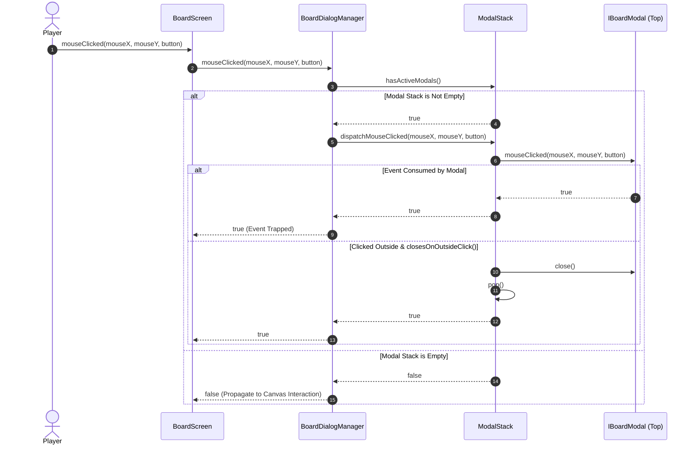
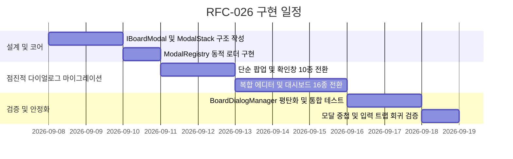

# RFC-026: 모달 다이얼로그 스택 및 레지스트리 아키텍처 명세
# (Modal Dialog Stack & Registry Architecture Specification)

- **문서 번호**: RFC-026
- **대상 버전**: `v2.3.0`
- **상태**: `PROPOSED`
- **작성일**: 2026-09-06
- **주관 계층**: Client GUI Layer (`client.gui.dialog`, `client.gui`)

---

## 1. 개요 및 배경 (Motivation)

### 1.1 현황 및 한계 분석 (AS-IS)
`GregTechCalculatorBoard`의 GUI 계층은 설정, 레시피 검색, 멀티블록 BOM, 글로벌 수지 대시보드 등 총 26종의 대화형 모달 다이얼로그를 지원합니다. 그러나 현재 다이얼로그 라이프사이클과 이벤트 디스패치를 총괄하는 [`BoardDialogManager.java`](file:///d:/dev-ssd/modding/minecraft/GregTechCalculatorBoard/src/main/java/com/gtceu/calcboard/client/gui/dialog/BoardDialogManager.java)는 다음과 같은 구조적 한계를 지니고 있습니다:

1. **공통 다이얼로그 추상화 인터페이스의 부재**:
   - 26종의 다이얼로그 클래스가 공통 기반 인터페이스나 추상 클래스를 상속하지 않고, 각각 독자적인 시그니처(`render(...)`, `isVisible()`, `close()`)를 사용합니다.
2. **반복적인 선형 if-else 블록 누적 (700여 줄의 보일러플레이트)**:
   - `isAnyModalOpen()`, `renderModals()`, `mouseClicked()`, `mouseReleased()`, `mouseScrolled()`, `keyPressed()`, `charTyped()`, `tick()` 등 모든 사용자 입력 및 렌더링 생명주기 메서드마다 26개의 `if (dialog != null && dialog.isVisible())` 조건문이 반복 복사되어 있습니다.
3. **개방-폐쇄 원칙(OCP) 위배**:
   - 신규 다이얼로그를 1개 추가할 때마다 `BoardDialogManager` 내부의 10여 개 메서드에 하드코딩된 분기문을 추가해야 하므로 결합도가 높고 회귀 결함 위험이 존재합니다.
4. **모달 중첩(Stacking) 및 배경 암전(Dimming) 제어의 비일관성**:
   - 다이얼로그 위에 하위 확인 창이나 셀렉터 창이 팝업될 때(예: `ExportFolderDialog` 위에 `SaveToTeamDialog`), Z-Order 순위 및 포커스 관리가 메서드 내 if문의 순서에 전적으로 의존하여 포커스 탈취 및 배경 딤(Dimming) 중복 렌더링이 발생합니다.

### 1.2 설계 목표 (TO-BE Principles)
- **`IBoardModal` 공통 인터페이스 도입**: 모든 모달 다이얼로그가 표준화된 인터페이스를 구현하도록 강제하여 다형성(Polymorphism)을 확립합니다.
- **LIFO 기반 모달 스택 (`ModalStack`) 구축**: 활성화된 다이얼로그들을 계층적 스택(`Deque<IBoardModal>`)으로 관리하여, 입력 라우팅은 항상 최상단 모달(Top of Stack)에 우선 전달되고 ESC 입력 시 최상단부터 순차 닫힘을 보장합니다.
- **모달 레지스트리 및 지연 생성 (`ModalRegistry`)**: 다이얼로그 인스턴스를 타입 안전한 키(`ModalId<T>`) 기반 레지스트리에 등록하고 필요 시점에 온디맨드로 생성(Lazy Initialization)하여 초기화 메모리 부하를 줄입니다.
- **단일 책임 및 선언적 이벤트 디스패치**: `BoardDialogManager`의 이벤트 라우팅 복잡도를 $O(N)$(26개 분기)에서 $O(1)$(최상단 모달 위임)로 평탄화합니다.

---

## 2. 핵심 요구사항 및 아키텍처 매트릭스

| 요구사항 ID | 구분 | 내용 | 성공 판정 기준 |
| :--- | :--- | :--- | :--- |
| **REQ-026-1** | 인터페이스 표준화 | 모든 26개 다이얼로그 클래스가 `IBoardModal` 인터페이스 구현 | 컴파일 타임 인터페이스 일치율 100% |
| **REQ-026-2** | O(1) 이벤트 디스패치 | `mouseClicked`, `keyPressed` 등 입력 이벤트를 최상단 모달에 직접 라우팅 | `BoardDialogManager` 내 26개 if-else 분기 100% 제거 |
| **REQ-026-3** | 계층적 중첩 모달 지원 | 모달 위에 자식 모달(Confirm, Selector 등) 오픈 시 스택 푸시 | 부모 모달 입력 완전 차단, ESC 입력 시 역순 닫힘 |
| **REQ-026-4** | 배경 딤 단일 렌더링 | 활성 모달이 1개 이상일 때 반투명 배경(`0x80000000`) 렌더링 1회만 실행 | 중첩 모달 오픈 시 배경 과도 암전(Double Dimming) 방지 |
| **REQ-026-5** | 지연 인스턴스화 | 모달 창 첫 호출 시점에 인스턴스를 생성하는 Lazy Loader 지원 | `BoardScreen.init()` 시점의 인스턴스 생성 오버헤드 완화 |

---

## 3. 시스템 아키텍처 명세 (Architecture Specification)

### 3.1 계층 구조 다이어그램
```mermaid
graph TD
    subgraph Screen["Client GUI Screen"]
        BS["BoardScreen"]
    end

    subgraph Manager["Modal Management Subsystem"]
        BDM["BoardDialogManager (Mediator Facade)"]
        MS["ModalStack (Deque&lt;IBoardModal&gt;)"]
        MR["ModalRegistry (ModalId&lt;T&gt; Map)"]
    end

    subgraph Interface["Modal Contract"]
        IBM["&lt;&lt;interface&gt;&gt; IBoardModal"]
    end

    subgraph Modals["Concrete Modal Dialogs (26 Instances)"]
        D1["RecipeSearchDialog"]
        D2["MultiblockBOMDialog"]
        D3["GlobalBalanceDashboardDialog"]
        D4["MachineConfigDialog"]
        D5["DeletePageConfirmDialog"]
        D_ETC["... Other 21 Dialogs"]
    end

    BS -->|Input & Render Events| BDM
    BDM -->|Push / Pop / Top| MS
    BDM -->|Lookup / Instantiate| MR
    MS -->|Dispatch Top-most| IBM
    IBM <|.. D1
    IBM <|.. D2
    IBM <|.. D3
    IBM <|.. D4
    IBM <|.. D5
    IBM <|.. D_ETC
```

### 3.2 핵심 인터페이스 규격 (`IBoardModal`)
모든 모달 다이얼로그는 다음 인터페이스를 구현합니다:

```java
package com.gtceu.calcboard.client.gui.dialog;

import net.minecraft.client.gui.GuiGraphics;

/**
 * Standardized contract for all modal dialogs rendered above the board canvas.
 */
public interface IBoardModal {

    /**
     * Unique identifier for registry lookup.
     */
    ModalId<?> getModalId();

    /**
     * Checks if this modal is currently visible and active.
     */
    boolean isVisible();

    /**
     * Lifecycle callback invoked immediately after this modal is pushed onto the stack.
     */
    default void onOpen() {}

    /**
     * Closes the modal and pops it from the active stack.
     */
    void close();

    /**
     * Lifecycle callback invoked immediately after this modal is removed from the stack.
     */
    default void onClose() {}

    /**
     * Renders the modal window and its internal components.
     * Background dimming is handled centrally by ModalStack.
     */
    void render(GuiGraphics graphics, int width, int height, int mouseX, int mouseY, float partialTicks);

    /**
     * Handles mouse click input.
     * @return true if the event was consumed.
     */
    boolean mouseClicked(double mouseX, double mouseY, int button);

    /**
     * Handles mouse release input.
     */
    default boolean mouseReleased(double mouseX, double mouseY, int button) {
        return false;
    }

    /**
     * Handles mouse wheel scrolling.
     */
    default boolean mouseScrolled(double mouseX, double mouseY, double delta) {
        return false;
    }

    /**
     * Handles key press input.
     * Standard implementation: ESC key closes the modal.
     */
    default boolean keyPressed(int keyCode, int scanCode, int modifiers) {
        if (keyCode == org.lwjgl.glfw.GLFW.GLFW_KEY_ESCAPE) {
            close();
            return true;
        }
        return false;
    }

    /**
     * Handles character typing input (e.g. text inputs).
     */
    default boolean charTyped(char codePoint, int modifiers) {
        return false;
    }

    /**
     * Periodic logic tick (20 ticks/sec).
     */
    default void tick() {}

    /**
     * Declares whether this modal requires a dark backdrop veil.
     */
    default boolean requiresBackdropDim() {
        return true;
    }

    /**
     * Declares whether mouse events outside the modal boundary should close it.
     */
    default boolean closesOnOutsideClick() {
        return false;
    }
}
```

### 3.3 타입 세이프 모달 식별자 (`ModalId`) 및 레지스트리
```java
package com.gtceu.calcboard.client.gui.dialog;

import java.util.Objects;

public final class ModalId<T extends IBoardModal> {
    private final String id;
    private final Class<T> modalClass;

    private ModalId(String id, Class<T> modalClass) {
        this.id = Objects.requireNonNull(id);
        this.modalClass = Objects.requireNonNull(modalClass);
    }

    public static <T extends IBoardModal> ModalId<T> of(String id, Class<T> modalClass) {
        return new ModalId<>(id, modalClass);
    }

    public String getId() { return id; }
    public Class<T> getModalClass() { return modalClass; }
}
```

### 3.4 모달 스택 생명주기 및 이벤트 제어 흐름 (`ModalStack`)


---

## 4. 성능, 메모리 및 예외 안전성 분석

### 4.1 시간 및 공간 복잡도
- **이벤트 디스패치 시간 복잡도**: 기존 $O(N)$ (최대 26회 if 검사) $\rightarrow$ **$O(1)$** (스택 `peek()` 대상 1회 디스패치).
- **공간 복잡도**: 스택은 활성 모달만 유지하므로 일반적인 상황에서 $O(1)$ (깊이 1~3 수준, $M \le 3$), 레지스트리 메타데이터는 $O(N)$ ($N = 26$).
- **GC 압박 완화**: 매 틱/프레임마다 생성되는 객체 없음. `activeModalStack`은 사전 할당된 `ArrayDeque`를 재사용.

### 4.2 예외 격리 및 안전성
- 특정 모달의 `render` 또는 `mouseClicked` 내부에서 예외 발생 시 스택 트레이스를 기록하고 해당 모달을 안전하게 `pop()`하여, 메인 화면(`BoardScreen`) 전체가 크래시되거나 입력이 영구 잠기는 현상을 원천 방지합니다.

---

## 5. 마이그레이션 계획 및 점진적 전환 전략

1. **단계 1: 코어 스택 및 인터페이스 도입**
   - `IBoardModal`, `ModalId`, `ModalStack`, `ModalRegistry` 패키지 구성.
2. **단계 2: 독립 다이얼로그 어댑터 마이그레이션 (배치 1)**
   - 단순 확인/입력 다이얼로그 10종(`DeletePageConfirmDialog`, `TutorialExitConfirmDialog`, `NoteEditDialog`, `FrameEditDialog` 등)에 `IBoardModal` 구현 적용.
3. **단계 3: 대형 복합 다이얼로그 마이그레이션 (배치 2)**
   - `RecipeSearchDialog`, `MachineConfigDialog`, `MultiblockBOMDialog`, `GlobalBalanceDashboardDialog` 적용.
4. **단계 4: `BoardDialogManager` 디스패치 루프 평탄화 및 레거시 제거**
   - 26개의 if-else 블록을 완전히 제거하고 `ModalStack` 위임 코드로 교체.

---

## 6. 개발 로드맵 (Phased Implementation)


