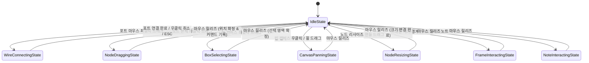
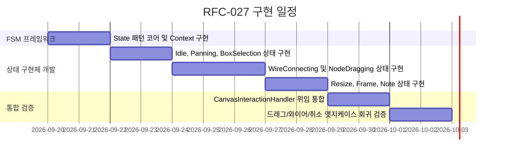

# RFC-027: 캔버스 인터랙션 유한 상태 머신 명세
# (Canvas Interaction Finite State Machine Specification)

- **문서 번호**: RFC-027
- **대상 버전**: `v2.3.0`
- **상태**: `PROPOSED`
- **작성일**: 2026-09-06
- **주관 계층**: Client GUI Layer (`client.gui.interaction`, `client.gui`)

---

## 1. 개요 및 배경 (Motivation)

### 1.1 현황 및 한계 분석 (AS-IS)
`GregTechCalculatorBoard`의 캔버스 조작 엔진인 [`CanvasInteractionHandler.java`](file:///d:/dev-ssd/modding/minecraft/GregTechCalculatorBoard/src/main/java/com/gtceu/calcboard/client/gui/CanvasInteractionHandler.java)는 줌/패닝, 노드 이동, 와이어 드래그 연결, 다중 선택 박스, 그룹 프레임/스티키 노트 조작 등 복잡한 2D 캔버스 인터랙션을 처리합니다. 그러나 현재 구현은 다음과 같은 구조적 복잡도를 안고 있습니다:

1. **분산된 불리언 플래그와 널(null) 기반 상태 관리**:
   - 상호작용 상태가 `wireHandler.isDraggingWire()`, `panZoomHandler.isPanning()`, `draggingNode != null`, `resizingNode != null`, `isPotentialRightClick`, `hasQuickAddMarker()`, `selectionHandler.isSelecting()` 등 10여 개의 개별 플래그와 널 체크로 파편화되어 있습니다.
2. **복합 조건 분기와 상태 오염(State Pollution) 위험**:
   - 마우스 이동(`mouseDragged`), 클릭(`mouseClicked`), 해제(`mouseReleased`) 이벤트 발생 시, "현재 와이어를 끄는 중인가? 노드를 드래그 중인가? 패닝 중인가?"를 판별하기 위해 수많은 if-else 가드 클로즈가 중첩되어 있습니다.
   - 와이어 연결 도중 패닝 플래그가 켜지거나, 다중 노드 이동 중 선택 박스 로직이 간섭하는 등 예기치 않은 상태 전이 버그를 방어하기 위해 임시 보정 코드가 산재합니다.
3. **취소(Cancel) 및 클린업 로직의 분산**:
   - `ESC` 키 입력, 캔버스 이탈, 우클릭 취소 시 각각의 서브 핸들러(`cancelWireDrag()`, `stopPan()`, `clearSelection()`, `dragStartPositions.clear()`)를 수동으로 일일이 호출해야 하여 누락에 의한 리소스 누수가 발생합니다.

### 1.2 설계 목표 (TO-BE Principles)
- **State Pattern (유한 상태 머신, FSM) 전면 도입**: 캔버스 조작의 상호 배타적 생명주기를 명확한 상태 객체(`CanvasInteractionState`)로 캡슐화합니다.
- **결정론적 상태 전이 보장 (`CanvasStateMachine`)**: 임의의 플래그 조작을 차단하고, 유효한 전이 경로(Transition Matrix)를 통해서만 상태가 변경되도록 강제합니다.
- **오버레이 렌더링 및 입력 처리의 응집도 극대화**: 와이어 베지어 곡선, 드래그 가이드라인, 선택 사각형 렌더링을 해당 상태 객체 내부로 캡슐화하여 단일 책임 원칙(SRP)을 충족합니다.

---

## 2. 핵심 요구사항 및 아키텍처 매트릭스

| 요구사항 ID | 구분 | 내용 | 성공 판정 기준 |
| :--- | :--- | :--- | :--- |
| **REQ-027-1** | 단일 활성 상태 보장 | 캔버스 조작은 임의 시점에 오직 1개의 상태 객체만 활성화 | 상태 플래그(isPanning, isDraggingWire 등) 완전 제거 |
| **REQ-027-2** | 결정론적 전이 규칙 | 정의된 전이 행렬에 의해서만 상태 변경 허용 | 비정상 중첩 조작(예: 와이어 드래그 중 패닝 진입) 100% 차단 |
| **REQ-027-3** | 자동 리소스 정리 | 상태 퇴장 시 `onExit()`에서 드래그 좌표, 임시 버퍼 자동 정리 | 취소 시 잔여 드래그 잔상 발생률 0% |
| **REQ-027-4** | 상태별 오버레이 분리 | 선택 사각형, 와이어 프리뷰 렌더링을 상태 클래스로 이동 | `BoardCanvasRenderer` 내부의 분기 렌더링 코드 평탄화 |
| **REQ-027-5** | 일관된 취소 프로토콜 | 모든 상태는 `cancel()` 표준 호출 시 안전하게 `IdleState`로 복귀 | ESC/우클릭 시 안전 복귀 100% 보장 |

---

## 3. 시스템 아키텍처 명세 (Architecture Specification)

### 3.1 상태 전이 다이어그램 (State Transition Diagram)


### 3.2 핵심 상태 인터페이스 규격 (`CanvasInteractionState`)
```java
package com.gtceu.calcboard.client.gui.interaction.state;

import com.gtceu.calcboard.client.gui.interaction.CanvasInteractionContext;
import net.minecraft.client.gui.GuiGraphics;

/**
 * Encapsulates a distinct user interaction mode on the board canvas.
 */
public interface CanvasInteractionState {

    /**
     * Unique identifier of the state.
     */
    String getStateName();

    /**
     * Lifecycle callback invoked when transitioning into this state.
     */
    default void onEnter(CanvasInteractionContext ctx) {}

    /**
     * Lifecycle callback invoked when transitioning out of this state.
     * Guarantees cleanup of temporary caches, drag start positions, and previews.
     */
    default void onExit(CanvasInteractionContext ctx) {}

    /**
     * Handles mouse press event on the canvas.
     */
    default boolean onMouseDown(CanvasInteractionContext ctx, double canvasX, double canvasY, int button) {
        return false;
    }

    /**
     * Handles mouse movement and drag updates.
     */
    default boolean onMouseDrag(CanvasInteractionContext ctx, double canvasX, double canvasY, int button, double dx, double dy) {
        return false;
    }

    /**
     * Handles mouse release event.
     */
    default boolean onMouseUp(CanvasInteractionContext ctx, double canvasX, double canvasY, int button) {
        return false;
    }

    /**
     * Handles key press inputs while this state is active (e.g. ESC to cancel).
     */
    default boolean onKeyPressed(CanvasInteractionContext ctx, int keyCode, int scanCode, int modifiers) {
        return false;
    }

    /**
     * Renders state-specific visual feedback (selection box, active wire curve, alignment snap guides).
     */
    default void renderOverlay(CanvasInteractionContext ctx, GuiGraphics graphics, float partialTicks) {}

    /**
     * Explicitly cancels the ongoing interaction and transitions back to IdleState.
     */
    void cancel(CanvasInteractionContext ctx);
}
```

### 3.3 상태 머신 오케스트레이터 (`CanvasStateMachine`)
```java
package com.gtceu.calcboard.client.gui.interaction.state;

import com.gtceu.calcboard.client.gui.interaction.CanvasInteractionContext;
import net.minecraft.client.gui.GuiGraphics;
import java.util.Objects;

public final class CanvasStateMachine {

    private final CanvasInteractionContext context;
    private final CanvasIdleState idleState;
    private CanvasInteractionState currentState;

    public CanvasStateMachine(CanvasInteractionContext context) {
        this.context = Objects.requireNonNull(context);
        this.idleState = new CanvasIdleState();
        this.currentState = this.idleState;
        this.currentState.onEnter(this.context);
    }

    public synchronized void transitionTo(CanvasInteractionState newState) {
        if (newState == null || newState == currentState) return;

        currentState.onExit(context);
        this.currentState = newState;
        this.currentState.onEnter(context);
    }

    public void returnToIdle() {
        transitionTo(idleState);
    }

    public CanvasInteractionState getCurrentState() {
        return currentState;
    }

    public boolean dispatchMouseDown(double canvasX, double canvasY, int button) {
        return currentState.onMouseDown(context, canvasX, canvasY, button);
    }

    public boolean dispatchMouseDrag(double canvasX, double canvasY, int button, double dx, double dy) {
        return currentState.onMouseDrag(context, canvasX, canvasY, button, dx, dy);
    }

    public boolean dispatchMouseUp(double canvasX, double canvasY, int button) {
        return currentState.onMouseUp(context, canvasX, canvasY, button);
    }

    public boolean dispatchKeyPressed(int keyCode, int scanCode, int modifiers) {
        return currentState.onKeyPressed(context, keyCode, scanCode, modifiers);
    }

    public void renderOverlay(GuiGraphics graphics, float partialTicks) {
        currentState.renderOverlay(context, graphics, partialTicks);
    }
}
```

### 3.4 구체 상태별 핵심 책임 분할

1. **`CanvasIdleState`**:
   - 캔버스 대기 상태.
   - 마우스 커서 위치에 따른 포트/노드/와이어 호버 감지.
   - 퀵애드(+) 마커 표시 및 거리 판정.
   - 드래그 발생 시 적절한 조작 상태(`WireConnectingState`, `NodeDraggingState` 등)로의 전이 트리거.
2. **`WireConnectingState`**:
   - 시작 포트(`NodeWidget`, 포트 인덱스, 입/출력 여부) 캡슐화.
   - 마우스 현재 좌표까지 실시간 베지어 곡선 오버레이 렌더링.
   - 대상 포트 스냅 판정 및 호환성 검증.
   - 마우스 릴리즈 시 `FlowGraph.connect()` 및 `BoardCommand.AddWireCommand` 생성 후 `IdleState` 복귀.
3. **`NodeDraggingState`**:
   - 단일 노드 또는 다중 선택된 노드 집합의 드래그 시작 좌표 맵(`Map<String, double[]>`) 보존.
   - Shift 키 입력에 따른 16픽셀 그리드 스냅 연산.
   - 마우스 릴리즈 시 총 변위 $(dx, dy)$ 기반 `MoveComponentsCommand` 단일 커맨드 기록 후 `IdleState` 복귀.
4. **`BoxSelectingState`**:
   - 드래그 시작점 $(X_0, Y_0)$과 현재점 $(X_1, Y_1)$으로 형성되는 AABB 사각형 관리.
   - 반투명 선택 박스(`0x403399FF`) 오버레이 렌더링.
   - 바운딩 박스 내부 노드 실시간 선택 세트 갱신.

---

## 4. 성능, 메모리 및 동시성 분석

### 4.1 시간 및 공간 복잡도
- **이벤트 디스패치 시간 복잡도**: $O(1)$ (상태 객체의 단일 가상 메서드 호출).
- **공간 복잡도**: $O(1)$ (주요 상태 객체는 `CanvasStateMachine` 내에서 사전 인스턴스화되어 재사용).
- **GC 무할당 원칙 (Zero-Allocation on Drag)**: 드래그 프레임마다 새로운 객체를 생성하지 않고, `CanvasInteractionContext`의 재사용 가능한 버퍼와 원시 실수($dx, dy$)만 전달.

### 4.2 인터랙션 충돌 방지 (State Isolation)
- 와이어 드래그 도중 패닝이나 선택 박스 생성이 원천 차단되므로, 불완전한 상태에서 발생하는 그래프 모델 오염 및 커맨드 히스토리 왜곡이 100% 방지됩니다.

---

## 5. 마이그레이션 계획 및 단계별 전환

1. **단계 1: FSM 인프라 구축**
   - `CanvasInteractionContext`, `CanvasInteractionState`, `CanvasStateMachine` 클래스 구현.
2. **단계 2: 기본 상태 이식 (Idle & Panning & Selection)**
   - `CanvasIdleState`, `CanvasPanningState`, `CanvasBoxSelectingState` 구현 및 연동.
3. **단계 3: 핵심 조작 상태 이식 (Wire & Dragging)**
   - `WireConnectingState`, `NodeDraggingState`, `NodeResizingState` 이식.
4. **단계 4: `CanvasInteractionHandler` 단순화**
   - 기존 핸들러 내부의 조건문과 플래그를 완전히 제거하고 `CanvasStateMachine`에 위임.

---

## 6. 개발 로드맵 (Phased Implementation)


