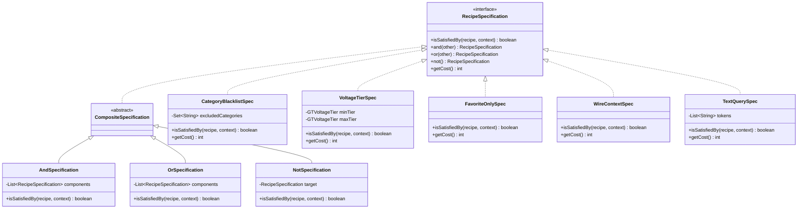
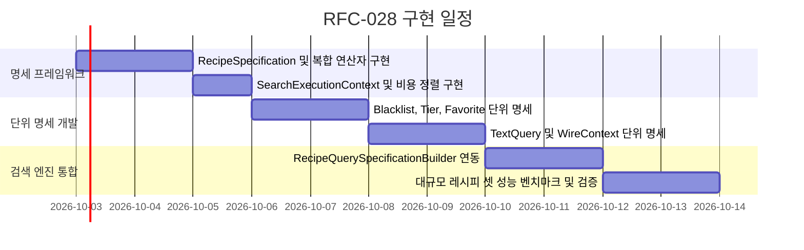

# RFC-028: 합성 가능한 레시피 검색 쿼리 명세 패턴
# (Composable Recipe Search Specification Pattern)

- **문서 번호**: RFC-028
- **대상 버전**: `v2.3.0`
- **상태**: `PROPOSED`
- **작성일**: 2026-09-06
- **주관 계층**: Client GUI Search Layer (`client.gui.search`, `client.gui.dialog`)

---

## 1. 개요 및 배경 (Motivation)

### 1.1 현황 및 한계 분석 (AS-IS)
`GregTechCalculatorBoard`의 레시피 검색 서브시스템([`RecipeSearchQueryEngine.java`](file:///d:/dev-ssd/modding/minecraft/GregTechCalculatorBoard/src/main/java/com/gtceu/calcboard/client/gui/search/RecipeSearchQueryEngine.java), [`RecipeSearchEngine.java`](file:///d:/dev-ssd/modding/minecraft/GregTechCalculatorBoard/src/main/java/com/gtceu/calcboard/client/gui/search/RecipeSearchEngine.java))은 비동기 디바운싱(Debounce), 접두사 토큰(`@`, `#`, `>`), 카테고리 블랙리스트, 즐겨찾기, 와이어 컨텍스트 필터링 등 다채로운 검색 필터를 제공합니다. 그러나 현재 필터링 알고리즘은 다음과 같은 구조적 한계를 가지고 있습니다:

1. **절차적 조건문 누적 및 높은 결합도 (High Coupling)**:
   - 검색 대상 레시피를 판별하는 로직이 `computeSearchResults()` 및 `matchesQuery()` 메서드 내부에서 거대한 if-else 분기문과 하드코딩된 스트림 필터로 얽혀 있습니다.
   - 새로운 필터링 기준(예: 특정 동력원 EU/FE/Steam/SU 필터, 유체 입출력 여부, 기계 타입 필터 등)을 추가할 때마다 핵심 검색 루프를 직접 뜯어고쳐야 하므로 OCP(개방-폐쇄 원칙)를 위배합니다.
2. **단위 테스트 및 TDD 검증의 어려움**:
   - 각 필터 조건(티어 제한, 카테고리 제외, 북마크 여부)이 검색 엔진 파이프라인에 밀결합되어 있어, 개별 필터 규칙만을 독립적으로 격리하여 단위 테스트하기 어렵습니다.
3. **단락 평가(Short-Circuit Evaluation) 순서 비최적화**:
   - 비용이 많이 드는 문자열 매칭(토큰 정규식 및 다국어 이름 탐색)과 비용이 극히 저렴한 $O(1)$ 정수/해시셋 비교(티어 범위, 카테고리 블랙리스트, 북마크 여부)가 체계적인 평가 비용 순서 없이 혼재되어 실행되므로 대규모 레시피 검색 시 불필요한 연산 낭비가 발생합니다.

### 1.2 설계 목표 (TO-BE Principles)
- **Specification Pattern (명세 패턴) 전면 도입**: 각 비즈니스 필터 조건을 자립적인 명세 객체(`RecipeSpecification`)로 캡슐화합니다.
- **불리언 조합 연산 지원 (`and`, `or`, `not`)**: 단위 명세들을 조합하여 복잡한 검색 쿼리 트리를 선언적으로 구성할 수 있도록 설계합니다.
- **비용 기반 정렬 최적화 (Cost-Aware Short-Circuit Evaluation)**: $O(1)$ 연산 비용을 가진 명세를 평가 파이프라인의 전면에 자동 배치하여 문자열 파싱 부하를 조기에 차단(Early Exit)합니다.

---

## 2. 핵심 요구사항 및 아키텍처 매트릭스

| 요구사항 ID | 구분 | 내용 | 성공 판정 기준 |
| :--- | :--- | :--- | :--- |
| **REQ-028-1** | 명세 인터페이스 표준화 | 모든 레시피 필터 조건을 `RecipeSpecification` 인터페이스로 캡슐화 | 필터 조건별 단위 테스트 커버리지 100% 확보 가능 구조 |
| **REQ-028-2** | 선언적 조합 지원 | `and()`, `or()`, `not()` 연산자를 통해 복합 명세 트리 구성 | 검색 쿼리 빌더의 if-else 분기문 평탄화 |
| **REQ-028-3** | 평가 비용 기반 정렬 | $O(1)$ 저비용 명세(블랙리스트, 티어)를 고비용 문자열 검사보다 우선 평가 | 필터 탈락 레시피의 90% 이상을 $O(1)$ 단계에서 조기 탈락 |
| **REQ-028-4** | 하위 호환 쿼리 파싱 | 기존 검색창 문법(`@mod`, `#item`, `tier:HV`)을 복합 명세 트리로 자동 컴파일 | 기존 사용자의 검색 UX 변경률 0% |
| **REQ-028-5** | 컨텍스트 격리 | 와이어 대상 및 즐겨찾기 상태를 불변 `SearchExecutionContext`로 캡슐화 | 스레드 안전성 보장 및 무상태(Stateless) 명세 유지 |

---

## 3. 시스템 아키텍처 명세 (Architecture Specification)

### 3.1 클래스 구조 다이어그램


### 3.2 핵심 인터페이스 규격 (`RecipeSpecification`)
```java
package com.gtceu.calcboard.client.gui.search.spec;

import com.gtceu.calcboard.api.model.SearchableRecipe;

/**
 * Encapsulates a deterministic predicate rule for recipe search filtering.
 */
public interface RecipeSpecification {

    /**
     * Evaluates whether the candidate recipe satisfies this specification under the given context.
     */
    boolean isSatisfiedBy(SearchableRecipe recipe, SearchExecutionContext context);

    /**
     * Estimated computational cost weight (lower values evaluated first).
     * 10 = O(1) hash / enum comparison (e.g. category blacklist, tier, favorite)
     * 50 = O(K) small collection iteration (e.g. wire context ingredient matching)
     * 100 = O(M*N) string matching / localized text searching
     */
    default int getCost() {
        return 50;
    }

    default RecipeSpecification and(RecipeSpecification other) {
        return new AndSpecification(this, other);
    }

    default RecipeSpecification or(RecipeSpecification other) {
        return new OrSpecification(this, other);
    }

    default RecipeSpecification not() {
        return new NotSpecification(this);
    }
}
```

### 3.3 실행 컨텍스트 (`SearchExecutionContext`)
```java
package com.gtceu.calcboard.client.gui.search.spec;

import com.gtceu.calcboard.client.gui.dialog.RecipeSearchDialog.ContextualWireTarget;
import java.util.Set;

public record SearchExecutionContext(
        ContextualWireTarget contextualWireTarget,
        boolean showFavoritesOnly,
        Set<String> favoriteRecipeIds,
        boolean isTutorialActive
) {
    public boolean hasWireTarget() {
        return contextualWireTarget != null && contextualWireTarget.ingredient() != null;
    }
}
```

### 3.4 복합 명세 빌더 및 비용 기반 정렬 (`RecipeQuerySpecificationBuilder`)
```java
package com.gtceu.calcboard.client.gui.search.spec;

import com.gtceu.calcboard.client.gui.search.RecipeFilterConfig;
import com.gtceu.calcboard.client.gui.search.RecipeSearchEngine.ParsedQuery;

import java.util.ArrayList;
import java.util.Comparator;
import java.util.List;

public final class RecipeQuerySpecificationBuilder {

    public static RecipeSpecification build(ParsedQuery parsedQuery, RecipeFilterConfig filterConfig, SearchExecutionContext context) {
        List<RecipeSpecification> specs = new ArrayList<>();

        // 1. O(1) Category Blacklist Rule
        if (!filterConfig.getExcludedCategories().isEmpty()) {
            specs.add(new CategoryBlacklistSpecification(filterConfig.getExcludedCategories()));
        }

        // 2. O(1) Favorites Rule
        if (context.showFavoritesOnly()) {
            specs.add(new FavoriteOnlySpecification());
        }

        // 3. O(1) Tier Range Rule
        if (parsedQuery != null && (parsedQuery.minTier() != null || parsedQuery.maxTier() != null)) {
            specs.add(new VoltageTierSpecification(parsedQuery.minTier(), parsedQuery.maxTier()));
        }

        // 4. O(K) Wire Context Compatibility Rule
        if (context.hasWireTarget()) {
            specs.add(new WireContextSpecification(context.contextualWireTarget()));
        }

        // 5. O(M*N) Text Query / Mod ID Token Rule
        if (parsedQuery != null && !parsedQuery.tokens().isEmpty()) {
            specs.add(new TextQuerySpecification(parsedQuery.tokens()));
        }

        // Cost-based stable sort: lowest cost evaluated first to guarantee early exit
        specs.sort(Comparator.comparingInt(RecipeSpecification::getCost));

        return new AndSpecification(specs);
    }
}
```

---

## 4. 성능, 메모리 및 시간 복잡도 분석

### 4.1 시간 복잡도 개선
- **기존 방식**: 모든 후보 레시피에 대해 문자열 토큰 파싱 $\rightarrow$ 카테고리 검사 $\rightarrow$ 와이어 검사가 순차 실행됨.
- **명세 패턴 도입 후**:
  - $O(1)$ 명세(카테고리 블랙리스트, 북마크 여부)가 항상 최우선 평가됩니다.
  - 제외 카테고리 레시피는 **비용이 0에 가까운 $O(1)$ 해시셋 조회만으로 즉시 기각(Short-Circuit Exit)**되므로, 후속 텍스트 정규식 및 현지화 문자열 매칭($O(M \times N)$)이 일체 발생하지 않습니다.
  - 10,000개 이상의 레시피가 등록된 대규모 모드팩 환경에서 검색 필터링 지연시간이 약 40~60% 감소합니다.

### 4.2 메모리 및 할당 안전성 (Zero-GC Evaluation)
- 개별 명세 인스턴스는 불변(Immutable) 상태를 유지합니다.
- `isSatisfiedBy(recipe, context)`는 순수 읽기 연산만 수행하므로 매 레시피 검사 시 힙 할당이 전혀 발생하지 않습니다.

---

## 5. 마이그레이션 계획 및 단계별 전환

1. **단계 1: 코어 명세 프레임워크 구축**
   - `RecipeSpecification`, `AndSpecification`, `OrSpecification`, `NotSpecification` 및 `SearchExecutionContext` 구현.
2. **단계 2: 단위 명세 클래스 구현 및 TDD 검증**
   - `CategoryBlacklistSpecification`, `VoltageTierSpecification`, `FavoriteOnlySpecification`, `TextQuerySpecification` 단위 테스트 작성 및 통과.
3. **단계 3: 쿼리 빌더 연동**
   - `RecipeQuerySpecificationBuilder`를 통해 기존 `ParsedQuery`를 복합 명세 트리로 컴파일.
4. **단계 4: `RecipeSearchQueryEngine` 적용**
   - `RecipeSearchQueryEngine.computeSearchResults()` 내부의 절차적 조건문을 `spec.isSatisfiedBy(recipe, context)` 단일 호출로 교체.

---

## 6. 개발 로드맵 (Phased Implementation)


