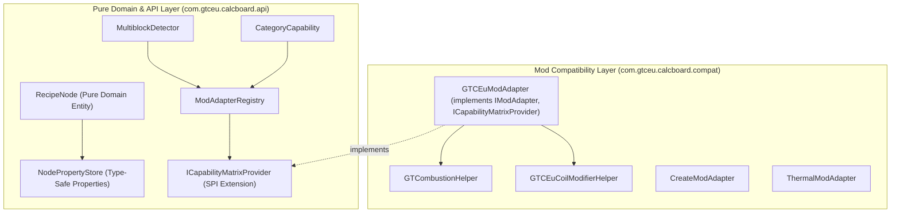
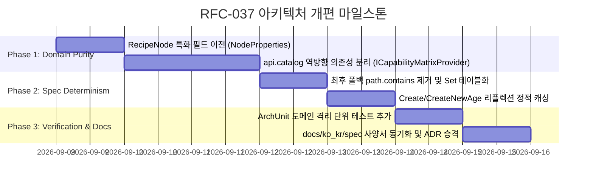

# RFC-037: 도메인 엔티티 순수성 회복, 역방향 의존성 격리 및 결정론적 스펙 연역 무결성 개편 명세
# (Domain Purity Restoration, Reverse Dependency Isolation & Deterministic Spec Deduction Refactoring)

- **문서 번호**: RFC-037
- **대상 버전**: `v2.2.0-beta.2` (또는 `v2.2.0`)
- **상태**: `PROPOSED`
- **기안일**: 2026-09-08
- **주관 계층**: Pure Domain Layer (`api.model`, `api.catalog`, `api.property`), Mod Adapter SPI Layer (`compat.*`), Client GUI Layer (`client.gui.compat`)

---

## 1. 개요 및 배경 (Motivation)

### 1.1 현황 및 배경
`GregTech Calculator Board`는 다수의 산업/테크 모드(GTCEu Modern, Create, Thermal Series, Applied Energistics 2, Star Technology 등)를 아우르는 복합 계산 생태계로 성장해 왔습니다. 지속적인 기능 확장 과정에서 도메인 순수성과 결정론적 연역 원칙(Rule 5, Rule 6)을 준수해 왔으나, 2.2.0-beta.1 릴리즈 아키텍처 감사(Architecture Audit) 결과 다음과 같은 계층적 누수와 국소적 기술 부채가 식별되었습니다:

1. **상위 도메인/카탈로그 계층의 하위 모드 호환 계층 역방향 직접 참조 (Leaky Abstraction)**:
   - `com.gtceu.calcboard.api.catalog` 및 `api.bom` 내 클래스들(`MultiblockDetector`, `CategoryCapability`, `MachineAddon`, `MultiblockStructureCatalog`)이 하위 계층인 `com.gtceu.calcboard.compat.gtceu.helper.*` 구체 클래스를 컴파일 타임에 직접 참조하고 있습니다.
   - 이는 클린 아키텍처의 의존성 역전 원칙(Dependency Inversion Principle, DIP)에 위배되며, GTCEu 비의존 환경이나 독립 헤드리스 환경에서의 모듈 분리성을 저해합니다.
2. **도메인 엔티티(`RecipeNode`) 내 모드 특화 필드 잔존**:
   - `RecipeNode.java`에 Star Technology 전용 모델인 `threadingConfig`(스레딩 헬릭스) 및 `steamMode`가 인스턴스 필드로 직접 선언되어 있어 도메인 모델 순수성을 일부 저해하고 있습니다.
3. **최후 폴백 경로 내 `path.contains(...)` 부분 문자열 매칭 잔존**:
   - 터빈 카탈로그(`TurbineCatalog`), 리플렉션 브릿지(`GTCEuReflectionBridge`), 머플러 판별기(`GTAddonCompatibilityHandler`), 코일 보너스 판별기(`GTCEuCoilModifierHelper`), 다이나모 키워드(`ThermalAugmentHelper`) 등의 최후 폴백 로직에 `path.contains(...)`가 남아 있어 Rule 5(결정론적 스펙 연역 원칙)의 완전성을 훼손할 가능성이 있습니다.
4. **레시피 변환 루프 내 런타임 리플렉션 반복 호출**:
   - `CreateRecipeHandler` 및 `CreateNewAgeRecipeHandler`의 변환 메서드 내부에서 `backingRecipe.getClass().getMethod(...)`를 동적으로 매번 호출하여 성능 및 안정성 최적화 여지가 존재합니다.

### 1.2 목표 (Goals)
- **$100\%$ 도메인 순수성 달성**: `api` 패키지에서 `compat` 패키지로 향하는 컴파일 타임 참조를 완전히 제거하고, `IModAdapter` 및 SPI 확장을 통한 제어 역전(IoC) 구조 확립.
- **`NodePropertyStore` 중심의 메타데이터 통합**: `RecipeNode` 내 모드 특화 필드를 `NodeProperties`로 완전히 이전하여 엔티티 모델의 순수성 복원.
- **결정론적 레지스트리 기반 스펙 판정**: 모든 `contains(...)` 휴리스틱을 `Set<ResourceLocation>` 기반 Exact Match 및 공식 태그(`TagKey`) 검사로 전면 전환.
- **리플렉션 $O(1)$ 정적 캐싱 완료**: 레시피 변환 경로의 리플렉션 멤버를 `static final`로 1회 캐싱하여 런타임 오버헤드 최소화.

---

## 2. 핵심 유저 스토리 및 엔지니어링 요구조건 (Requirements)

| 구분 | 요구조건 (Requirement) | 수용 기준 (Acceptance Criteria) |
|---|---|---|
| **REQ-01** | `api` 도메인 패키지의 의존성 역전 (IoC) | `com.gtceu.calcboard.api` 패키지 내에서 `com.gtceu.calcboard.compat.*` 임포트 **0건** 달성 (ArchUnit 검증 통과). |
| **REQ-02** | `RecipeNode` 모드 특화 필드 이전 | `threadingConfig` 및 `steamMode`를 `NodeProperties`로 이전하고 직렬화/역직렬화 호환성 100% 유지. |
| **REQ-03** | Rule 5 결정론적 식별자 매칭 일원화 | 터빈, 코일 반응기, 머플러, 다이나모 식별 시 `path.contains(...)`를 전면 배제하고 `Set<ResourceLocation>` 테이블로 일원화. |
| **REQ-04** | 리플렉션 정적 캐싱 및 미사용 코드 정리 | `CreateRecipeHandler` 및 `CreateNewAgeRecipeHandler` 내 동적 `getMethod()`를 정적 캐시로 전환하고 중복 메서드 제거. |
| **REQ-05** | CDG 클라이언트 접근 SPI 표준화 | `CDGRecipeHandler`의 `Minecraft` 리플렉션을 공식 `ILevelRecipeProvider` SPI를 통해 단일화. |

---

## 3. 시스템 아키텍처 명세 (Architecture Specification)

### 3.1 계층 의존성 역전 다이어그램 (Dependency Inversion Architecture)



### 3.2 신규 SPI 인터페이스 설계 (`ICapabilityMatrixProvider`)

`api.catalog` 계층이 `compat.gtceu`를 직접 알지 않고, 해당 모드의 어댑터에 머신 특성을 질의할 수 있도록 확장 SPI를 정의합니다:

```java
package com.gtceu.calcboard.compat.extension;

import net.minecraft.resources.ResourceLocation;

/**
 * SPI extension for querying mod-specific machine capabilities without direct coupling.
 */
public interface ICapabilityMatrixProvider {
    boolean isCombustionEngine(ResourceLocation machineId);
    boolean isPlasmaTurbine(ResourceLocation machineId);
    boolean supportsParallelHatch(ResourceLocation machineId);
    int getCoilTierRequirement(ResourceLocation machineId);
}
```

---

## 4. 세부 리팩토링 설계 (Detailed Refactoring Specifications)

### 4.1 Section 1: `api.catalog` 역방향 의존성 해소
1. **`MultiblockDetector.java`**:
   - `GTCombustionHelper.isCombustionEngine()` 직접 호출 ➔ `ModAdapterRegistry.findExtension(ICapabilityMatrixProvider.class)`를 통한 동적 질의.
   - `GTCEuCoilModifierHelper` 직접 호출 ➔ `ICoilSpecProvider` SPI 인터페이스로 위임.
2. **`CategoryCapability.java`**:
   - `GTPlasmaTurbineModel` 직접 호출 ➔ `ICapabilityMatrixProvider.isPlasmaTurbine()` 질의로 대체.
3. **`MultiblockStructureCatalog.java`**:
   - `GTCEuCoilModifierHelper` 직접 참조를 제거하고 중립적 카탈로그 데이터 기반으로 동작하도록 분리.

### 4.2 Section 2: `RecipeNode` 도메인 모델 순수성 회복
1. **`NodeProperties` 신규 키 정의**:
   - `NodeProperties.THREADING_CONFIG`: `NodeProperty<NodeThreadingConfig>` (기본값 `null`)
   - `NodeProperties.STEAM_MODE`: `NodeProperty<SteamMode>` (기본값 `SteamMode.NONE`)
2. **엔티티 필드 제거 및 위임**:
   - `RecipeNode.getThreadingConfig()` ➔ `getProperties().get(NodeProperties.THREADING_CONFIG)`
   - `RecipeNode.setThreadingConfig(config)` ➔ `getProperties().set(NodeProperties.THREADING_CONFIG, config)`
   - 직렬화기(`RecipeNodeSerializer`)와의 완벽한 하위 호환성 유지.

### 4.3 Section 3: 결정론적 Exact Match 레지스트리 구축
1. **터빈 분류 테이블화 (`TurbineCatalog`)**:
   ```java
   private static final Set<ResourceLocation> EV_GAS_TURBINES = Set.of(
       new ResourceLocation("gtceu", "ev_gas_turbine"),
       new ResourceLocation("gtceu", "large_gas_turbine")
   );
   ```
2. **머플러 판별 일원화 (`GTAddonCompatibilityHandler`)**:
   - `id.contains("muffler")`를 제거하고, `GTCEuAddonCrawler.isMufflerHatchItem()` 정밀 검사 로직으로 일원화.
3. **다이나모 식별 테이블화 (`ThermalAugmentHelper`)**:
   - 문자열 부분 검색 대신 `DYNAMO_BOILER_TYPES` 및 `TagKey<Item>` Exact Match 활용.

### 4.4 Section 4: 런타임 리플렉션 정적 캐싱 및 코드 정리
1. **`CreateRecipeHandler` 및 `CreateNewAgeRecipeHandler`**:
   - `ProcessingRecipe` 상위 클래스의 `getProcessingDuration()`, `getRollableResults()` 등의 `Method` 객체를 클래스 로딩 시점에 `static final`로 1회 캐싱.
   - `CreateRecipeHandler` 내 미사용 중복 메서드인 `getDynamicStressCapacity()` 완전 삭제.
2. **`CDGRecipeHandler`**:
   - `Minecraft` 클라이언트 직접 리플렉션 대신 `ILevelRecipeProvider`를 통해 일관된 레지스트리 접근 유지.

---

## 5. 개발 로드맵 및 마일스톤 (Implementation Roadmap)



---

## 6. 결론 및 향후 계획

본 RFC-037은 2.2.0-beta.1 릴리즈 아키텍처 감사를 통해 확인된 기술적 부채와 권고사항들을 체계적으로 해소하여, 향후 2.2.0 정식 릴리즈 및 대규모 모드 연동 시에도 단단하고 결함 없는 클린 아키텍처 기반을 제공할 것입니다.
