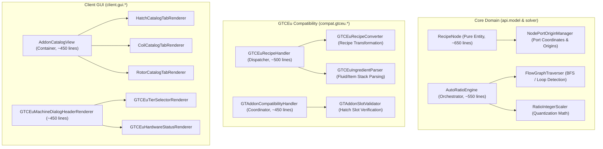
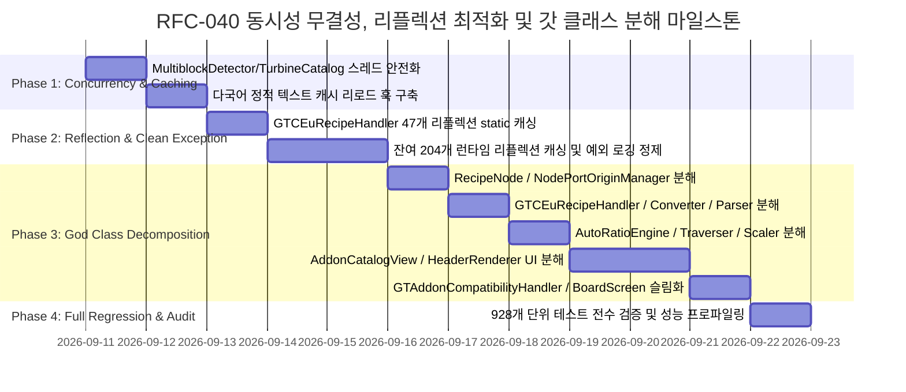

# RFC-040: 런타임 동시성 무결성, 리플렉션 정적 최적화 및 갓 클래스 모듈화 명세
# (Runtime Concurrency Integrity, Reflection Static Optimization & God Class Modular Decomposition Specification)

- **문서 번호**: RFC-040
- **대상 버전**: `v2.2.0-beta.3` (또는 `v2.2.0`)
- **상태**: `PROPOSED`
- **기안일**: 2026-09-09
- **주관 계층**: Core Domain & Solver Layer (`api.solver`, `api.bom`, `api.catalog`), Mod Compatibility Layer (`compat.gtceu.*`), Client GUI Layer (`client.gui.*`)

---

## 1. 개요 및 배경 (Motivation)

### 1.1 현황 및 시스템 취약점
`GregTech Calculator Board`는 대규모 공정 계산 및 실시간 캔버스 시각화를 제공하며 기능의 완성도를 높여왔습니다. 그러나 지속적인 기능 확장과 다양한 모드 지원 과정에서 다음의 4대 비기능적 부채(Non-Functional Debt)가 누적되어 런타임 안정성과 장기적 유지보수성을 저해하고 있습니다:

1. **멀티스레드 동시성 결함 및 포인터 오염 위험**:
   - `MultiblockDetector.java`의 13개 글로벌 컬렉션(`MULTIBLOCK_RECIPE_CONTROLLERS`, `COIL_MULTIBLOCK_CONTROLLERS`, `TURBINE_CONTROLLERS` 등)이 일반 `HashSet`으로 선언되어 있습니다.
   - `TurbineCatalog.java`의 `TURBINE_BASE_TIERS`, `TURBINE_BASE_PRODUCTIONS` 역시 일반 `HashMap`으로 관리됩니다.
   - 백그라운드 레시피 크롤러(Worker Thread)가 실행되는 도중 UI 스레드가 기계 카탈로그를 동시 조회할 경우 `ConcurrentModificationException` 또는 `HashMap` 내부 버킷 훼손이 발생할 수 있습니다.
2. **다국어(i18n) 설정 변경 시 갱신되지 않는 정적 텍스트 캐시**:
   - `MultiblockStructureCatalog.java` 및 `GTCEuMultiblockStructureScanner.java`의 `ITEM_NAME_CACHE`, `BLOCK_NAME_CACHE`에 언어 변경(Resource Reload) 시 무효화하는 리스너가 누락되어 있습니다.
   - 인게임에서 언어를 변경하더라도 최초 조회된 언어로 부품 이름이 영구 고정 표시되는 사용성 결함이 존재합니다.
3. **핫패스 런타임 비캐싱 리플렉션 다발 (251건)**:
   - 클래스 로딩 시점에 `static final`로 캐싱되어야 할 리플렉션 멤버 중 251건이 메서드 실행 시마다 동적으로 탐색되고 있습니다.
   - 특히 레시피 변환의 핵심 핫패스인 `GTCEuRecipeHandler.java`에만 47건의 동적 리플렉션이 집중되어 있어 대량 레시피 인덱싱 시 불필요한 오버헤드를 유발합니다.
4. **광범위한 예외 은폐 (`catch (Throwable ignored)`)**:
   - 전체 코드베이스에 490건의 `catch (Throwable)` 블록이 존재하며, 이 중 423건이 아무런 로깅 없이 무시(`ignored`)되고 있어 런타임 잠재 결함 추적을 불가능하게 만듭니다.
5. **800라인 초과 모놀리식 갓 클래스(God Classes) 7종 누적**:
   - `RecipeNode`(1,242줄), `AddonCatalogView`(996줄), `GTCEuMachineDialogHeaderRenderer`(994줄), `GTCEuRecipeHandler`(989줄), `AutoRatioEngine`(981줄), `GTAddonCompatibilityHandler`(968줄), `BoardScreen`(933줄) 등 핵심 도메인, 연산, UI 클래스들이 과도한 다중 책임을 안고 있어 유지보수 복잡도를 증대시킵니다.

### 1.2 개편 목표 (Goals)
- **100% 스레드 세이프 카탈로그 확립**: 비동기 조회/등록 컬렉션을 `ConcurrentHashMap` 기반으로 전면 전환하여 동시성 경합 원천 차단.
- **다국어 반응형 캐시 라이프사이클 수립**: 리소스 리로드 리스너를 통한 정적 명칭 캐시의 결정론적 무효화.
- **리플렉션 $O(1)$ 정적 캐싱 완료**: `GTCEuRecipeHandler`를 포함한 251건의 동적 리플렉션을 `static {}` 1회 캐싱으로 최적화.
- **예외 처리 정밀화 및 디버그 가시성 확보**: 무분별한 `Throwable ignored`를 구체적 예외(`ReflectiveOperationException` 등)로 한정하고 적절한 디버그 로깅 적용.
- **갓 클래스 7종 SRP 분해**: 각 클래스를 800줄 이하의 단일 책임 컴포넌트로 분해하여 응집도 향상 및 결합도 감소.

---

## 2. 핵심 요구조건 및 수용 기준 (Requirements)

| 요구조건 ID | 핵심 요구사항 | 검증 및 수용 기준 (Acceptance Criteria) |
| :--- | :--- | :--- |
| **REQ-040-01** | 전역 카탈로그 컬렉션 동시성 스레드 세이프 전환 | `MultiblockDetector`의 13개 `HashSet` 및 `TurbineCatalog`의 2개 `HashMap`을 `ConcurrentHashMap.newKeySet()` 및 `ConcurrentHashMap`으로 교체. 동시 읽기/쓰기 유닛 테스트 통과. |
| **REQ-040-02** | 정적 텍스트 캐시 다국어 리로드 리스너 연동 | `MultiblockStructureCatalog` 및 `GTCEuMultiblockStructureScanner`의 `ITEM_NAME_CACHE`, `BLOCK_NAME_CACHE`에 클라이언트 언어 변경 시 `clear()` 호출 훅 연동. |
| **REQ-040-03** | `GTCEuRecipeHandler` 47개 리플렉션 정적 캐싱 | 메서드 내부의 동적 `getMethod()`, `getField()`를 클래스 로딩 시 `static final` 캐싱으로 전환. 핫패스 $O(1)$ 직접 호출 보장. |
| **REQ-040-04** | 잔여 204개 런타임 리플렉션 핫패스 캐싱 | `CDGRecipeHandler`, `AddonCrawler`, `Inspector` 등 런타임 루프 내 리플렉션 전수 캐싱. |
| **REQ-040-05** | `catch (Throwable ignored)` 정밀화 및 로깅 | 무차별 `Throwable` 포획을 구체적 예외(`NoSuchMethodException`, `IllegalAccessException` 등)로 좁히고 비정상 실패는 `LOGGER.debug()` 기록. |
| **REQ-040-06** | `RecipeNode.java` 책임 분해 (1,242줄 ➔ 700줄 이하) | 포트 오리진 관리 로직을 `NodePortOriginManager`로 분리하고, 복제/직렬화 보조 헬퍼를 추출하여 SRP 확립. |
| **REQ-040-07** | `AddonCatalogView.java` 탭 렌더러 분해 (996줄 ➔ 500줄 이하) | 해치/코일/로터 탭 렌더링을 `HatchCatalogTabRenderer`, `CoilCatalogTabRenderer`, `RotorCatalogTabRenderer`로 분해. |
| **REQ-040-08** | `GTCEuMachineDialogHeaderRenderer.java` 분해 (994줄 ➔ 500줄 이하) | 티어 버튼 렌더링(`GTCEuTierSelectorRenderer`) 및 하드웨어 상태 서브 렌더러 분리. |
| **REQ-040-09** | `GTCEuRecipeHandler.java` 파서 분해 (989줄 ➔ 600줄 이하) | 레시피 변환기(`GTCEuRecipeConverter`)와 입출력 파서(`GTCEuIngredientParser`) 분리 및 최대 6단계 중첩 평탄화. |
| **REQ-040-10** | `AutoRatioEngine.java` 알고리즘 분해 (981줄 ➔ 600줄 이하) | 그래프 순회기(`FlowGraphTraverser`)와 정수 스케일러(`RatioIntegerScaler`) 분리. |
| **REQ-040-11** | `GTAddonCompatibilityHandler.java` 분해 (968줄 ➔ 500줄 이하) | 슬롯 검증기(`GTAddonSlotValidator`) 및 애드온 디스패처 분리. |
| **REQ-040-12** | `BoardScreen.java` 오케스트레이션 정제 (933줄 ➔ 650줄 이하) | 캔버스 뷰포트 계산 및 이벤트 라우팅 책임을 하위 매니저로 완전 위임. |

---

## 3. 시스템 아키텍처 및 분해 구조 명세

### 3.1 갓 클래스 분해 컴포넌트 구조도 (SRP Decomposition Model)



---

## 4. 세부 컴포넌트 리팩토링 설계 (Detailed Technical Specifications)

### 4.1 Section 1: 카탈로그 컬렉션 동시성 안전화
1. **`MultiblockDetector.java`**:
   ```java
   // 변경 전: private static final Set<ResourceLocation> MULTIBLOCK_RECIPE_CONTROLLERS = new HashSet<>();
   // 변경 후:
   private static final Set<ResourceLocation> MULTIBLOCK_RECIPE_CONTROLLERS = ConcurrentHashMap.newKeySet();
   private static final Set<ResourceLocation> COIL_MULTIBLOCK_CONTROLLERS = ConcurrentHashMap.newKeySet();
   private static final Set<ResourceLocation> TURBINE_CONTROLLERS = ConcurrentHashMap.newKeySet();
   ```
2. **`TurbineCatalog.java`**:
   ```java
   // 변경 전: private static final Map<ResourceLocation, Integer> TURBINE_BASE_TIERS = new HashMap<>();
   // 변경 후:
   private static final Map<ResourceLocation, Integer> TURBINE_BASE_TIERS = new ConcurrentHashMap<>();
   private static final Map<ResourceLocation, Double> TURBINE_BASE_PRODUCTIONS = new ConcurrentHashMap<>();
   ```

### 4.2 Section 2: 정적 텍스트 캐시 라이프사이클 훅 구축
1. `MultiblockStructureCatalog` 및 `GTCEuMultiblockStructureScanner`에 정적 무효화 메서드 노출:
   ```java
   public static void invalidateTextCaches() {
       ITEM_NAME_CACHE.clear();
       BLOCK_NAME_CACHE.clear();
   }
   ```
2. 클라이언트 리소스 매니저 갱신 이벤트 또는 언어 설정 변경 리스너에 `invalidateTextCaches()` 등록.

### 4.3 Section 3: `GTCEuRecipeHandler` 리플렉션 47개소 정적 캐싱
1. GTCEu Modern의 `GTRecipe`, `RecipeCondition`, `Content` 관련 리플렉션 `Method` 및 `Field`를 `GTCEuReflectionBridge` 또는 전용 `static {}` 블록에 단일 캐싱.
2. 런타임 루프 내 `Class.getMethod(...)` 및 `getDeclaredField(...)` 호출 전면 배제.
3. GTCEu 버전별 메서드 시그니처 차이는 클래스 로딩 시 1회 폴백 체인을 통해 판별하여 함수형 인터페이스(`Supplier` / `Function`)로 바인딩.

### 4.4 Section 4: 예외 처리 무결성 정비
1. 런타임 호환성 검사 및 리플렉션 호출 구문에서 무차별 `catch (Throwable ignored)` 전면 제거.
2. `catch (ReflectiveOperationException e)` 등 구체적 예외를 명시하고, 의도된 미지원 모드 폴백이 아닌 경우 `CalcBoardMod.LOGGER.debug("Failed reflective access: {}", e.getMessage());` 형태로 추적 가능한 진단 로그 남김.

### 4.5 Section 5: 갓 클래스 7종 단일 책임(SRP) 분해

#### 1. `RecipeNode.java` 분해 (1,242줄 ➔ ~650줄)
* **`NodePortOriginManager`**: 포트의 상대 좌표 계산, 포트 인덱싱, 포트 그룹 오리진 변환 로직 추출.
* **`RecipeNodeSerializer` 보강**: NBT 저장/복원 관련 장황한 보일러플레이트 코드를 직렬화기 전담으로 완전 이전.

#### 2. `AddonCatalogView.java` 분해 (996줄 ➔ ~450줄)
* **`HatchCatalogTabRenderer`**: 유지보수 해치, 병렬 해치 그리드 및 호환성 툴팁 렌더링.
* **`CoilCatalogTabRenderer`**: 코일 티어 목록, 작동 온도 배수 시각화 렌더링.
* **`RotorCatalogTabRenderer`**: 로터 홀더 티어, 효율/내구도 테이블 렌더링.

#### 3. `GTCEuMachineDialogHeaderRenderer.java` 분해 (994줄 ➔ ~450줄)
* **`GTCEuTierSelectorRenderer`**: ULV~MAX 전압 티어 전환 버튼, 오버클럭 잠금 아이콘 렌더링.
* **`GTCEuHardwareStatusRenderer`**: 기계 내 코일 상태, 로터 내구도 바, 클린룸 상태 렌더링.

#### 4. `GTCEuRecipeHandler.java` 분해 (989줄 ➔ ~500줄)
* **`GTCEuRecipeConverter`**: GTCEu 레시피 객체에서 도메인 `RecipeCalculationContext`로의 변환 오케스트레이션.
* **`GTCEuIngredientParser`**: Chanced Item, Fluid Stack, Circuit Configuration 조건 파싱 로직 전담.
* 6단계 깊이의 중첩 루프를 조기 반환 가드 및 헬퍼 메서드로 1~2단계로 평탄화.

#### 5. `AutoRatioEngine.java` 분해 (981줄 ➔ ~550줄)
* **`FlowGraphTraverser`**: BFS/DFS 그래프 순회, 사이클 및 순환 루프 탐지 전담.
* **`RatioIntegerScaler`**: 최대공약수(GCD), 최소공배수(LCM) 및 정수 올림/양자화 수학 공식 전담.

#### 6. `GTAddonCompatibilityHandler.java` 분해 (968줄 ➔ ~450줄)
* **`GTAddonSlotValidator`**: 기계 종류별 장착 가능 슬롯 및 티어 상한 유효성 검증 전담.

#### 7. `BoardScreen.java` 분해 (933줄 ➔ ~650줄)
* 캔버스 드로잉 및 모달 스택 이벤트 라우팅의 책임을 이미 분리된 `BoardCanvasRenderer` 및 `ModalStack`으로 완전 이양하고 화면 제어자(Screen Controller) 역할만 유지.

---

## 5. 개발 로드맵 및 마일스톤 (Implementation Roadmap)



---

## 6. 결론 및 기대 효과

본 RFC-040 개편을 통해:
1. 백그라운드 인덱싱 스레드와 UI 렌더링 간의 **동시성 경합 및 잠재적 충돌 위험을 원천 해소**합니다.
2. 핫패스 리플렉션 251건의 정적 캐싱을 통해 **레시피 대량 로딩 및 뷰어 연동 반응 속도를 비약적으로 향상**시킵니다.
3. 800라인을 초과하던 7대 갓 클래스들이 **명확한 단일 책임의 컴포넌트로 분해**되어 코드 가독성, 테스트 용이성 및 유지보수성이 극대화됩니다.
