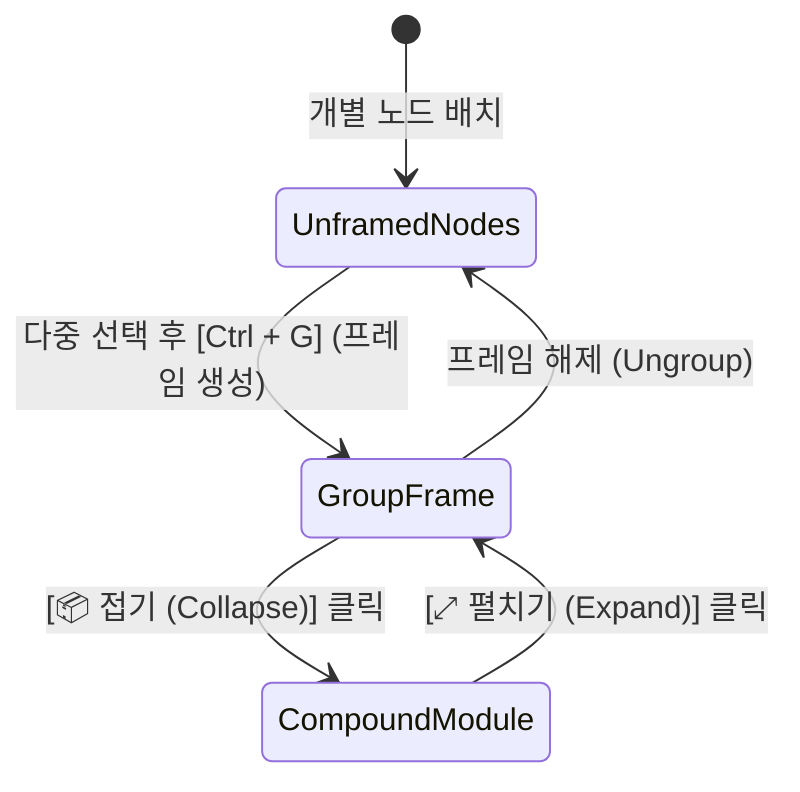

# RFC: GTCalcBoard v1.1.0 - 캔버스 시각적 구역 프레임 & 주석 시스템 (Canvas Group Frames & Notes)

* **문서 번호**: RFC-007
* **대상 버전**: `v1.1.0` (또는 `v1.0.6+`)
* **상태**: `PROPOSED / PLANNING`
* **주제**: 캔버스 구역 시각적 그룹화 프레임, 일괄 이동 및 컴파운드 모듈과의 유기적 접기/펼치기 연동

---

## 1. 개요 및 배경 (Motivation)

### 1.1 배경
대규모 공정 캔버스에는 수십 개의 기계 노드가 배치됩니다.
* 현재 `v1.x`에는 여러 노드를 하나로 캡슐화하는 **컴파운드 모듈(`CompoundModule`)** 기능이 구현되어 있으나,
* 노드들을 접지 않고 **전체 배선과 기계들을 펼쳐둔 상태에서 시각적으로 구역(Zone)을 나누고 라벨링**하고 싶어 하는 유저 니즈가 존재합니다.

### 1.2 목표
1. **시각적 구역 프레임 (`CanvasGroupFrame`)**: 노드들을 펼쳐둔 상태로 둘러싸는 반투명 색상 배경 박스와 헤더 타이틀 제공.
2. **프레임 일괄 드래그 (Group Dragging)**: 프레임 헤더를 잡고 드래그하면 내부의 모든 노드가 함께 이동.
3. **컴파운드 모듈과의 양방향 연동**:
   - `[프레임]` $\rightarrow$ `[📦 모듈로 접기 (Collapse)]`
   - `[모듈]` $\rightarrow$ `[⤢ 프레임으로 펼치기 (Expand to Frame)]`
4. **캔버스 주석 메모 (Sticky Notes)**: 공정 구역별 주의사항 및 코멘트 작성.

---

## 2. 사용자 핵심 유저 스토리 (User Stories)

| ID | 역할 | 행동 (Action) | 기대 효과 (Outcome) |
| :--- | :--- | :--- | :--- |
| **US-01** | 공정 설계자 | 노드들을 드래그 선택 후 `Ctrl + G` (또는 `[🖼️ 프레임 생성]`) 클릭 | 선택된 노드들을 감싸는 반투명 컬러 프레임 박스가 자동 생성됨 |
| **US-02** | 공정 설계자 | 프레임 헤더를 잡고 캔버스 빈 곳으로 드래그 | 프레임 내부의 모든 기계 노드와 내부 연결선이 위치 관계를 유지하며 한 번에 이동 |
| **US-03** | 공정 설계자 | 프레임 상단의 `[📦 모듈로 접기]` 버튼 클릭 | 펼쳐져 있던 프레임 내부 노드들이 기존 1개의 컴파운드 모듈 카드로 깔끔하게 캡슐화 |
| **US-04** | 공정 설계자 | 캡슐화된 모듈 카드에서 `[⤢ 펼치기]` 클릭 | 원래의 프레임 테두리와 노드 배치 레이아웃이 100% 온전히 복원됨 |

---

## 3. UI / UX 렌더링 명세

### 3.1 프레임 구조 및 비주얼 디자인

```text
+===================================================================================+
| 🏷️ 석유 1차 정제 & 에틸렌 분해 구역                          [🎨 색상] [📦 접기] [X] |
+-----------------------------------------------------------------------------------+
|                                                                                   |
|    +-------------------+                       +-------------------+              |
|    |  Distillation T.  | ====================> |  Chemical Reactor |              |
|    +-------------------+                       +-------------------+              |
|                                                                                   |
|  📝 [메모: 원유 공급 압력 3,000 mB/s 유지 필수]                                    |
|                                                                                   |
+===================================================================================+
```

* **렌더링 레이어**:
  - 캔버스 배경(그리드) 바로 위, **노드 카드와 와이어보다 아래(Z-Index = -1)**에 반투명 다크 패널(`0x181C26` + $40\%$ 알파)로 렌더링.
* **프레임 테마 색상**:
  - 기본 파랑, 에메랄드, 보라, 주황, 다크 그레이 등 6종 프리셋 제공.
* **리사이징 핸들 (Resize Grips)**:
  - 모서리를 드래그하여 프레임 영역 크기를 수동으로 확장/축소 가능.

---

### 3.2 컴파운드 모듈(`CompoundModule`)과의 유기적 연동 아키텍처



1. **`Collapse to Module` (접기)**:
   - 프레임 내부의 노드들을 기존 `graph.groupIntoModule()` 로직을 통해 1개의 복합 노드로 캡슐화.
   - 프레임의 이름(`Title`), 테마 색상, 메모 데이터가 생성된 모듈의 메타데이터로 보존됨.
2. **`Expand to Frame` (펼치기)**:
   - 모듈을 펼칠 때, 단순 나열이 아니라 원래의 **프레임 테두리 박스 상태로 복원**되어 캔버스 구조가 흐트러지지 않음.

---

## 4. 데이터 구조 및 직렬화 (`CanvasGroupFrame`)

```json
{
  "id": "frame_petrochem_01",
  "title": "석유 1차 정제 & 에틸렌 분해 구역",
  "color": 0xFF3D7AB8,
  "posX": 120.0,
  "posY": 80.0,
  "width": 640.0,
  "height": 420.0,
  "note": "원유 공급 압력 3,000 mB/s 유지 필수",
  "containedNodeIds": [
    "node_dt_01",
    "node_cr_01",
    "node_cr_02"
  ]
}
```

* **청사진 영속성**:
  - 클립보드 블루프린트(`BlueprintCodec`) 및 파일 저장 시 프레임 정보가 NBT에 함께 포함되어 공유 가능.

---

## 5. 결론

본 RFC의 **캔버스 시각적 구역 프레임(Canvas Group Frames)**은 기존 컴파운드 모듈화 기능과 완벽하게 시너지를 이루며, 유저가 원하는 공정 영역을 자유롭게 묶고, 메모를 남기고, 일괄 이동하거나 접고 펼칠 수 있는 최고 수준의 캔버스 뷰포트 경험을 제공할 것입니다.
