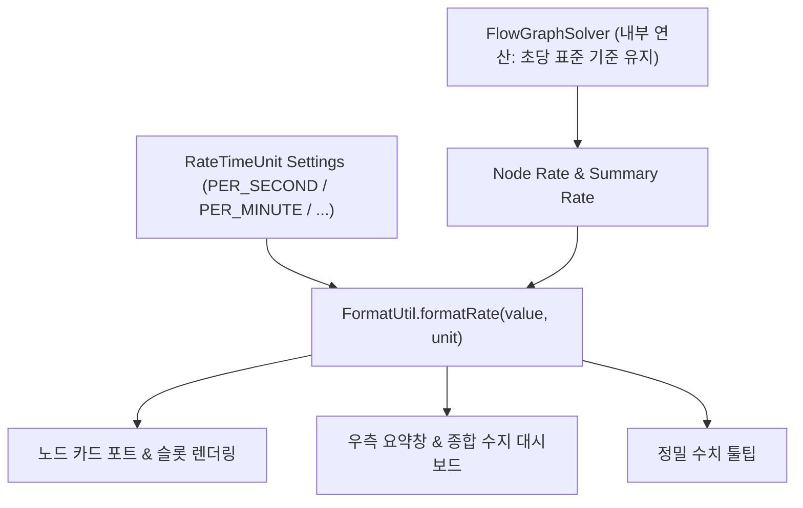

# RFC: GTCalcBoard v1.1.0 - 다중 시간 단위계 전환 시스템 (Flexible Rate Time Units)

* **문서 번호**: RFC-005
* **대상 버전**: `v1.1.0` (또는 `v1.0.6+`)
* **상태**: `PROPOSED / PLANNING`
* **주제**: 생산량/소비량 유량의 시간 단위계(`/t`, `/s`, `/min`, `/h`) 동적 전환 및 전역 스케일링

---

## 1. 개요 및 배경 (Motivation)

### 1.1 배경
현재 GTCalcBoard의 모든 기계 노드, 입출력 포트, 우측 요약 패널 및 종합 수지 대시보드는 **초당 유량(`/s`)**으로 고정 표기되고 있습니다.
그러나 테크 모드팩 유저마다 공정을 설계할 때 선호하는 기준 단위계가 서로 다릅니다:

1. **`/t` (틱당, Per Tick, 1/20초)**: 그렉텍의 파이프 용량, 해치 입출력 한계 및 기계 틱당 소모량과 1:1로 비교하고 싶은 엔지니어링 유저.
2. **`/s` (초당, Per Second, 기본값)**: 직관적이고 표준적인 초당 유량.
3. **`/min` (분당, Per Minute, 60초)**: Satisfactory, Factorio 스타일에 익숙하여 분당 단위(예: 분당 300개, 분당 6,000 mB)로 물류를 계획하는 유저.
4. **`/h` (시간당, Per Hour, 3,600초)**: 대용량 저장 탱크, 핵연료 주기, 대형 발전소 등 대규모 장기 비축/소모량을 계산하는 유저.

### 1.2 목표
1. **4단계 시간 단위계 (`RateTimeUnit`) 지원**: `/t` (틱당), `/s` (초당), `/min` (분당), `/h` (시간당) 완벽 지원.
2. **원클릭 전역 전환 & 단축키**: 툴바 또는 요약창의 버튼 클릭(`[⏱ /s]`) 및 단축키로 캔버스 전체 수치를 즉시 재계산 없이 스케일링하여 렌더링.
3. **설정 영속화**: 사용자가 선택한 단위계가 클라이언트 설정(`gtcalcboard-client.toml`)에 영구 보존.

---

## 2. 단위계 정의 및 스케일링 수학 모델

### 2.1 단위계 열거형 (`RateTimeUnit`)

| 단위계 Enum | 표기 접미사 | 초당 배율 ($Factor$) | 설명 |
| :--- | :--- | :--- | :--- |
| `PER_TICK` | `/t` | $\times \frac{1}{20} = 0.05$ | 1 마인크래프트 틱(0.05초) 기준 유량 |
| `PER_SECOND` | `/s` | $\times 1.0$ (기준) | 1초 기준 유량 (기본값) |
| `PER_MINUTE` | `/min` | $\times 60.0$ | 1분(60초) 기준 유량 |
| `PER_HOUR` | `/h` | $\times 3600.0$ | 1시간(3,600초) 기준 유량 |

### 2.2 수치 변환 공식
내부 연산 엔진(`FlowGraphSolver`)은 항상 표준 초당 기본값($Rate_{\text{base}}$)을 유지하고, **UI 렌더링 레이어(`FormatUtil`)에서 단위계 배율을 곱하여 표기**합니다:

$$DisplayRate = Rate_{\text{base}} \times Factor$$

* 예시 (초당 50 mB 생산 레시피):
  - `/t` 모드: $50 \times 0.05 = \mathbf{2.5\text{ mB/t}}$
  - `/s` 모드: $50 \times 1.0 = \mathbf{50.0\text{ mB/s}}$
  - `/min` 모드: $50 \times 60 = \mathbf{3.0\text{k mB/min}}\ (3,000\text{ mB/min})$
  - `/h` 모드: $50 \times 3600 = \mathbf{180.0\text{k mB/h}}\ (180,000\text{ mB/h})$

---

## 3. UI / UX 디자인 상세

### 3.1 툴바 & 요약 패널 단위 토글 버튼

```text
+-----------------------------------------------------------------------------------------------------------------+
| [+ Page 1] | 📖 Guide  🎯 Ratio  🚀 Flow  📦 Group  [⏱ /s ▼]  [📊 종합 수지]  [💾 저장]  [📋 공유]           |
+-----------------------------------------------------------------------------------------------------------------+
```

* **인터랙션**:
  - `[⏱ /s ▼]` 버튼 **좌클릭**: 다음 단위로 순환 전환 (`/s` $\rightarrow$ `/min` $\rightarrow$ `/h` $\rightarrow$ `/t` $\rightarrow$ `/s`).
  - 버튼 **우클릭 / 드롭다운**: 원하는 단위를 팝업 메뉴에서 직접 선택.
  - 마우스 호버 툴팁: *"클릭하여 표시 시간 단위를 전환합니다 (현재: 초당 /s)"*.

---

### 3.2 노드 카드 및 요약창 렌더링 변화

1. **노드 카드 슬롯**:
   - `Ethylene: 50.0/s` $\rightarrow$ `Ethylene: 3.0k/min` (단위 변경 시 텍스트 및 SI 접두사 자동 정렬).
2. **요약 패널 (`SummaryOverlay`)**:
   - `Net Ethylene: +200.00 mB/s` $\rightarrow$ `Net Ethylene: +12.00k mB/min`.
3. **정밀 수치 툴팁 (Raw Value Tooltip)**:
   - 마우스 호버 시 표시되는 원본 정밀 툴팁도 선택된 단위계에 맞추어 정확한 수치를 쉼표 포맷으로 병기 (예: `Rate: 180,000.00 mB/h`).

---

## 4. 아키텍처 및 무결성 보장



* **엔진 무결성**: 그래프 계산 및 자동 비율 알고리즘은 내부적으로 언제나 불변의 초당 단위($1.0$)로 계산하므로, 단위계를 바꾸더라도 기계 대수나 와이어 연결 계산에 0.0001%의 오차나 부동소수점 왜곡이 발생하지 않습니다.

---

## 5. 결론

본 RFC의 **다중 시간 단위계 전환 시스템**은 초보 유저부터 하드코어 팩토리 엔지니어까지 각자의 작업 스타일에 맞추어 틱당, 초당, 분당, 시간당 수치를 자유자재로 오가며 완벽한 공정 설계를 수행할 수 있는 탁월한 유연성을 제공할 것입니다.
