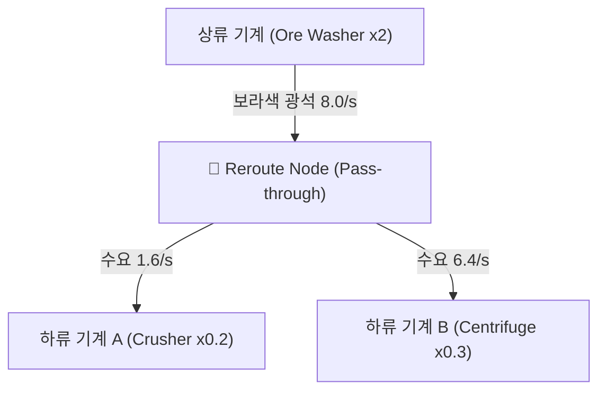

# RFC: GTCalcBoard v1.1.0 - 와이어 정리 및 분기를 위한 경유/정션 노드 (Reroute & Junction Nodes)

* **문서 번호**: RFC-006
* **대상 버전**: `v1.1.0` (또는 `v1.0.6+`)
* **상태**: `PROPOSED / PLANNING`
* **주제**: 복잡한 배선 정리, 1:N 분기 및 물류 버스 라인 구성을 위한 경유(Reroute) 중계 노드

---

## 1. 개요 및 배경 (Motivation)

### 1.1 배경
대규모 공정 캔버스에서는 하나의 산출물(예: 정제된 황산 또는 분쇄된 광석)을 3~5개 이상의 하위 기계로 공급해야 하는 경우가 빈번합니다.
* 현재 방식으로는 메인 기계의 작은 포트 하나에서 수많은 긴 와이어가 부채꼴로 뻗어나가면서, 중간에 있는 다른 기계 카드들을 가로지르며 배선이 복잡하게 얽히는 **"스파게티 배선 문제"**가 발생합니다.

### 1.2 목표
1. **슬림한 경유/정션 노드 (`RerouteNode`)**: 불필요한 기계 정보 없이 오직 입출력 포트만 가진 미니멀한 중계 캡슐 노드 제공.
2. **1:N 분기 및 N:1 합류 버스 라인**: 상단에서 들어온 유량을 여러 하위 기계로 깔끔하게 분기.
3. **와이어 더블클릭 자동 삽입 UX**: 기존 와이어를 더블클릭하면 그 위치에 즉시 정션 노드가 생성되며 와이어가 자연스럽게 분할 연결.
4. **무비용 패스스루 (Zero-Cost Pass-through)**: 전력 소모 $0\text{ EU/t}$, 소요 시간 $0\text{ s}$로 상류의 유량과 자동 비율(Auto Ratio) 신호를 왜곡 없이 $100\%$ 전달.

---

## 2. 사용자 핵심 유저 스토리 (User Stories)

| ID | 역할 | 행동 (Action) | 기대 효과 (Outcome) |
| :--- | :--- | :--- | :--- |
| **US-01** | 공정 설계자 | 길게 늘어진 와이어의 중간 지점을 더블클릭 | 해당 위치에 즉시 소형 `Reroute Node`가 삽입되고 와이어가 깔끔하게 꺾임 |
| **US-02** | 공정 설계자 | 정션 노드의 하단 출력 포트에서 여러 기계로 와이어 연결 | 하나의 주 배관에서 여러 갈래로 분기되는 버스 라인 배선 완성 |
| **US-03** | 공정 설계자 | 기준 노드(`🎯`)를 잡고 `[⚖ 비율 맞춤]` 실행 | 정션 노드를 거쳐가는 모든 상/하류 기계들의 대수가 오차 없이 1:1로 자동 비율 계산 |

---

## 3. UI / UX 및 노드 렌더링 명세

### 3.1 노드 외형 디자인 (`RerouteNodeWidget`)

```text
       [  💧 Ethylene  ]  <- 입력 포트 (상단)
     +-------------------+
     |        🔀         |  <- 콤팩트 캡슐 바디 (28 x 32 px)
     +-------------------+
       [  💧 Ethylene  ]  <- 출력 포트 (하단 - 여러 와이어 연결 가능)
```

* **크기**: 일반 기계 카드($140 \times 160\text{ px}$) 대비 $1/5$ 크기인 **$28 \times 32\text{ px}$ 초소형 캡슐**.
* **동적 포트 타입 결정**:
  - 첫 번째 와이어가 연결되는 순간 해당 자원(아이템/유체 종류)으로 입출력 포트가 자동 설정됨.
  - 양쪽 와이어가 모두 끊어지면 다시 빈 중립(Neutral) 포트로 초기화.

---

### 3.2 조작 인터랙션 (Controls)

1. **와이어 더블클릭 삽입 (Double-Click on Wire)**:
   * 캔버스 위의 연결된 와이어 선분을 더블클릭하면, 마우스 커서 위치에 즉시 `RerouteNode`가 생성되고 기존 연결이 `A -> Reroute -> B`로 자동 재배선.
2. **팔레트/핫키 생성**:
   * 단축키 `J` (Junction) 또는 우클릭 캔버스 메뉴에서 `[+ 정션 노드 추가]` 지원.
3. **간편한 드래그 이동**:
   * 작고 가벼워서 캔버스 빈 공간이나 노드 사이 통로로 자유롭게 이동 및 정렬 가능.

---

## 4. 엔진 계산 모델 (`FlowGraphSolver`)



* **수학적 불변성**:
  $$Rate_{\text{out}} = Rate_{\text{in}}$$
  $$EUt = 0,\quad \text{Duration} = 0$$
* **자동 비율(Auto Ratio) 전파**:
  - 하류 기계들의 총 수요($1.6 + 6.4 = 8.0\text{/s}$)를 상류 기계에 그대로 전달하여, 상류 오레 워셔가 정확히 2대로 계산되도록 완벽한 1:1 보존 법칙 성립.

---

## 5. 결론

본 RFC의 **경유/정션 노드(Reroute & Junction Nodes)**는 언리얼 엔진 블루프린트나 전문 노드 툴처럼 **복잡한 팩토리 공정도를 직관적이고 깔끔한 배선으로 정리**할 수 있게 해주는 필수적인 UX 편의 기능이 될 것입니다.
