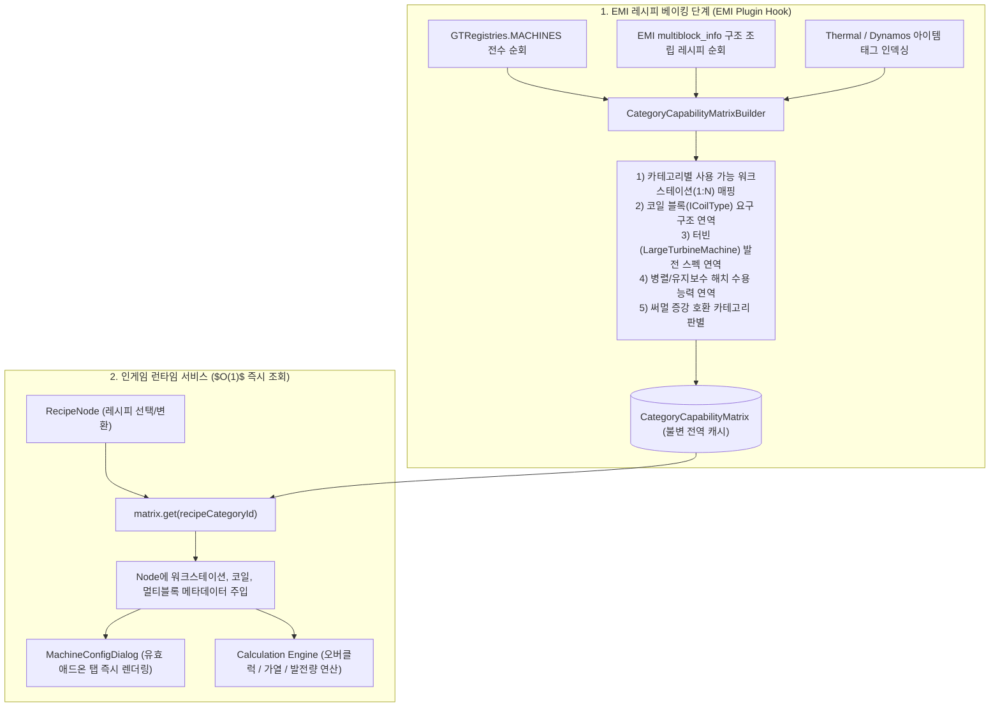
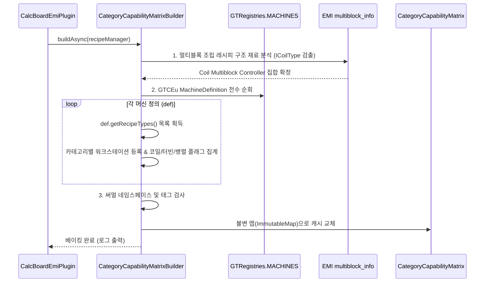

# RFC-V2-005: CategoryCapabilityMatrix (레시피 카테고리 기반 연역적 애드온 수용 능력 사전 베이킹 시스템)

---

## 📌 메타데이터 (Metadata)

| 항목 | 내용 |
| :--- | :--- |
| **문서 번호** | RFC-V2-005 |
| **대상 버전** | `v2.0.0` (Alpha.4+) |
| **상태** | `PROPOSED` (검토 및 기안 완료) |
| **관련 컴포넌트** | `MultiblockDetector`, `MachineAddonCatalog`, `EmiRecipeConverter`, `MachineConfigDialog`, `RecipeNode` |
| **작성 일자** | 2026-08-21 |

---

## 1. 개요 및 제안 배경 (Motivation & Background)

### 1.1 현재 시스템의 기술적 한계
1. **런타임 질의 분산 및 타이밍 해저드**:
   - 코일, 터빈 로터, 병렬 해치, 유지보수 해치, 써멀 증강 등의 장착 가능 여부를 UI 오픈 시점마다 `MultiblockDetector`, `CoilHelper`, `ThermalAugmentHelper` 등 여러 헬퍼 클래스에 분산 질의하고 있음.
   - EMI 레시피 베이킹 완료 이전이나 비동기 스레드에서 조기 호출될 경우, 캐시가 비어있거나 불완전한 상태로 마킹되는 라이프사이클 레이스 컨디션 위험이 상존함.
2. **레시피 카테고리와 기계 간의 복잡한 1:N 관계**:
   - 예를 들어 화학 반응(Benzene 등)의 경우 단일블록 전용 카테고리(`gtceu:chemical_reactor`)와 멀티블록 대형 화학 반응기 전용 카테고리(`gtceu:large_chemical_reactor`)가 레시피 데이터상 분리되어 있거나, 하나의 기계가 여러 레시피 카테고리를 동시에 수행함.
3. **휴리스틱 매칭 위험의 원천적 차단 필요**:
   - 문자열(`contains`) 매칭을 완전히 배제하고, 게임 내 모든 모드팩의 커스텀 레시피와 기계 데이터를 100% 데이터 기반으로 안전하게 다루기 위한 통합 메타데이터 인프라가 필요함.

### 1.2 핵심 목표
* **EMI 레시피 베이킹 종료 시점(1회)**에 게임 내 모든 레시피 카테고리와 기계 정의를 전수 분석하여 **`CategoryCapabilityMatrix`를 사전 빌드(Pre-bake)**.
* 런타임 UI 오픈 및 노드 조작 시 **$O(1)$ 해시 조회**로 지원 가능한 애드온 탭, 워크스테이션 목록, 멀티블록 지원 여부를 즉시 획득.

---

## 2. 시스템 아키텍처 (System Architecture)

### 2.1 아키텍처 파이프라인



---

## 3. 핵심 데이터 구조 명세 (Data Structures)

### 3.1 `CategoryCapability` 불변 레코드 (Record Definition)

```java
package com.gtceu.calcboard.api;

import net.minecraft.resources.ResourceLocation;
import java.util.List;
import java.util.Set;

/**
 * 특정 레시피 카테고리가 가질 수 있는 기계적 수용 능력(Capability)을 사전 정의한 불변 객체.
 */
public record CategoryCapability(
        ResourceLocation categoryId,
        List<ResourceLocation> availableWorkstations,
        ResourceLocation defaultWorkstation,
        boolean hasSingleblockOption,
        boolean hasMultiblockOption,
        boolean canUseCoils,
        boolean isTurbine,
        boolean isThermal,
        GTVoltageTier turbineBaseTier,
        double turbineBaseProduction,
        Set<MachineAddon.Category> supportedAddonCategories
) {
    /**
     * 특정 노드의 현재 상태(싱글/멀티블록 선택 등)에 맞춤형으로 활성화할 탭 목록 반환
     */
    public List<MachineAddon.Category> getActiveCategoriesForNode(RecipeNode node) {
        // O(1) 필터링 로직
    }
}
```

---

## 4. 연역적 사전 베이킹 알고리즘 (Deductive Baking Algorithms)

### 4.1 3단계 통합 빌드 프로세스



---

## 5. UI / UX 및 노드 생명주기 연동 명세

### 5.1 `EmiRecipeConverter` 변환 시점 주입
- EMI 레시피 변환 시 `CategoryCapability`를 조회하여 노드의 `availableWorkstations`, `isMultiblock`, `hasMultiblockOption`, `canUseCoils`를 초기화.

### 5.2 `MachineConfigDialog` 다이얼로그 탭 렌더링
- `MachineAddon.getRelevantCategories(node)`가 기존의 복잡한 조건 분기 대신 `CategoryCapability.getActiveCategoriesForNode(node)`를 $O(1)$로 호출하여 칩 목록 렌더링.

---

## 6. 검증 계획 (Verification Plan)

### 6.1 단위 테스트 (Automated Unit Tests)
- `CategoryCapabilityMatrixTest.java` 신규 작성:
  1. `gtceu:large_chemical_reactor` 및 `gtceu:chemical_reactor` 카테고리의 코일 지원 여부 검증.
  2. `gtceu:steam_turbine` 카테고리의 로터 및 베이스 발전량 매핑 검증.
  3. `thermal:lapidary_fuel` 카테고리의 써멀 증강 슬롯 매핑 검증.
  4. `gtceu:rock_filtrator`의 코일 미지원 예외 격리 검증.

### 6.2 벤치마크 및 렉 검증
- 60,000개 레시피 로딩 환경에서 `CategoryCapabilityMatrix` 빌드 시간이 50ms 미만인지 검증.
- 다이얼로그 오픈 시 GC 생성량 및 렌더링 프레임 드랍 0건 확인.
