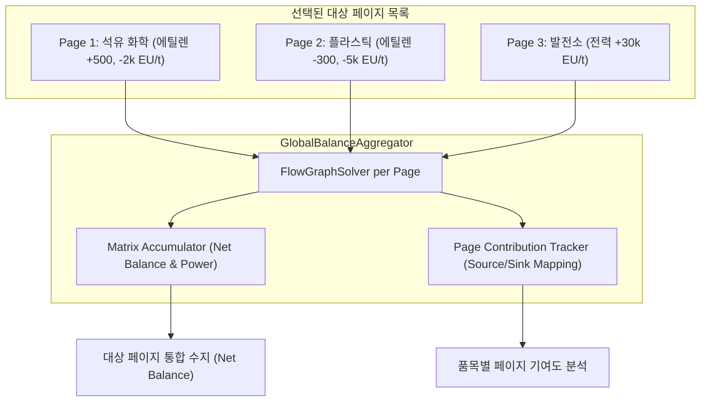

# RFC: GTCalcBoard v2.0.0 - 전역 종합 수지 대시보드 (Global Factory Balance Dashboard)

* **문서 번호**: RFC-003
* **대상 버전**: `v2.0.0`
* **상태**: `PROPOSED / PLANNING`
* **주제**: 다중 페이지 간 생산량/소비량/전력 전역 통합 집계, 공정 기여도 분석 및 팩토리 대차대조표 GUI

---

## 1. 개요 및 배경 (Motivation)

### 1.1 배경
GTCalcBoard는 복잡한 그렉텍 공정을 여러 페이지(Tabs)로 나누어 관리할 수 있습니다.
* 예: `[Page 1: 원유 증류 & 에틸렌]`, `[Page 2: 플라스틱 & 고무 사출]`, `[Page 3: 발전소 전력망]`, `[Page 4: 티타늄 제련]`

하지만 기존 `SummaryOverlay`는 **현재 열려 있는 단일 페이지만의 입출력**을 보여주기 때문에:
1. "기지 전체에서 에틸렌이 남아서 저장 탱크가 넘칠지, 부족해서 플라스틱 공정이 멈출지"
2. "발전소 페이지의 총 발전량이 다른 모든 공정 페이지의 소비 전력 합계를 감당할 수 있는지"

를 파악하려면 유저가 페이지를 일일이 넘나들며 암산하거나 외부 메모장을 써야 하는 한계가 있습니다.

### 1.2 목표
1. **다중 페이지 선택 기반 통합 집계**: 원하는 대상 페이지들을 체크박스로 선택하여 통합 대차대조표를 실시간 계산.
2. **싱글플레이 및 팀 워크스페이스 공통 지원**: 로컬 개인 보드와 서버 팀 워크스페이스 모두에서 일관되게 동작.
3. **품목별 페이지 기여도 세부 분석 (Drill-down Breakdown)**: 특정 자원을 어떤 페이지에서 생산하고 어떤 페이지에서 소비하는지 한눈에 추적.

---

## 2. 시스템 아키텍처 및 계산 모델

### 2.1 전역 집계 파이프라인 (`GlobalBalanceAggregator`)



### 2.2 수학적 집계 공식

선택된 대상 페이지 집합 $S = \{P_1, P_2, \dots, P_k\}$에 대하여:

1. **대상 페이지 총 전력 ($NetPower$)**:
   $$NetPower = \sum_{P_i \in S} (P_{i, \text{gen}} - P_{i, \text{drain}})$$
   - $NetPower \ge 0$: **전력 잉여 (안전 🟢)**
   - $NetPower < 0$: **전력 결손 (블랙아웃 위험 🔴)**

2. **품목 $R$의 대상 페이지 순 유량 ($NetRate_R$)**:
   $$NetRate_R = \sum_{P_i \in S} (Rate_{P_i, \text{produced}}(R) - Rate_{P_i, \text{consumed}}(R))$$
   - $NetRate_R > 0$: **순 잉여 (남아서 완제품으로 축적 또는 배출)**
   - $NetRate_R < 0$: **순 결손 (상위 공정 부족으로 기계 가동 중단 위험)**
   - $NetRate_R = 0$: **100% 완벽한 1:1 자급자족 밸런스**

---

## 3. UI / UX 디자인 상세

### 3.1 툴바 진입점
툴바에 **`[📊 종합 수지]`** 버튼이 추가됩니다 (단축키: `B`).

### 3.2 전역 종합 수지 대시보드 모달 (`GlobalBalanceDashboardDialog`)

```text
+---------------------------------------------------------------------------------------------------+
| 📊 Global Balance Dashboard                                                                   [X] |
+---------------------------------------------------------------------------------------------------+
| [ 좌측: 포함할 대상 페이지 선택 ]           | [ 우측: 선택된 대상 페이지 통합 대차대조표 ]               |
| [✔] 1. 석유 정제 & 에틸렌 라인             | ⚡ 대상 페이지 총 전력: +23,000.0 EU/t (순 잉여 🟢)          |
| [✔] 2. 폴리에틸렌 & 고무 시트               |    • 총 발전량: +30,000.0 EU/t (발전소)                   |
| [✔] 3. 벤젠 가스 터빈 발전소               |    • 총 소비량: -7,000.0 EU/t                             |
| [ ] 4. 티타늄 진공 라인 (제외)             | --------------------------------------------------------- |
| [ ] 5. 나콰다 원자로 (계획중)               | 📦 통합 원자재 및 부산물 수지 (Net Balance):               |
|                                            |  💧 Liquid Ethylene   +200.00 mB/s (+500 -300) [안전 🟢]  |
| [ 전체 선택 ] [ 전체 해제 ]                 |  💧 Liquid Oxygen     -150.00 mB/s (+100 -250) [결손 🔴]  |
|                                            |  🧱 Rubber Sheet      +12.50/s (최종 완제품 🟢)          |
+---------------------------------------------------------------------------------------------------+
| [💡 특정 항목 클릭 시 페이지별 생산/소비 기여도 상세 분석 팝업 표출]                                     |
+---------------------------------------------------------------------------------------------------+
```

### 3.3 품목별 페이지 기여도 분석 팝업 (`ItemContributionPopup`)
대시보드에서 특정 품목(예: `Liquid Oxygen`)을 클릭하면 기여도 상세 내역이 표시됩니다:

```text
[ 💧 Liquid Oxygen 기여도 분석 ]
-------------------------------------------------------------
• Page 1 (원유 정제)   : +100.00 mB/s (생산)
• Page 2 (플라스틱 공정) : -250.00 mB/s (소비)
-------------------------------------------------------------
= 대상 페이지 순 수지: -150.00 mB/s (결손 🔴)
[💡 권장 조치: Page 1의 원유 정제를 2.5배 증설하거나 전해조 라인 신설]
```

---

## 4. 성능 최적화 & 캐싱 전략

* **Lazy Summary Compute**: 대시보드가 열릴 때만 선택된 페이지들의 요약을 집계.
* **페이지별 Dirty Flag 활용**: 내용이 변경되지 않은 페이지는 기존 `BalanceSummary` 캐시를 재활용하여 $O(N)$의 가벼운 합산만 수행.
* **비동기 집계 (Headless Solver)**: 50페이지 이상의 초대형 공정 보드에서도 UI 렉 없이 1프레임(약 1~2ms) 이내에 연산 완료.

---

## 5. 결론

본 RFC의 **전역 종합 수지 대시보드**는 단일 캔버스 계산기에 머물던 기존 모드의 한계를 깨고, **팩토리 전체를 아우르는 전사적 자원 관리(ERP) 수준의 통합 분석 도구**를 제공할 것입니다.
