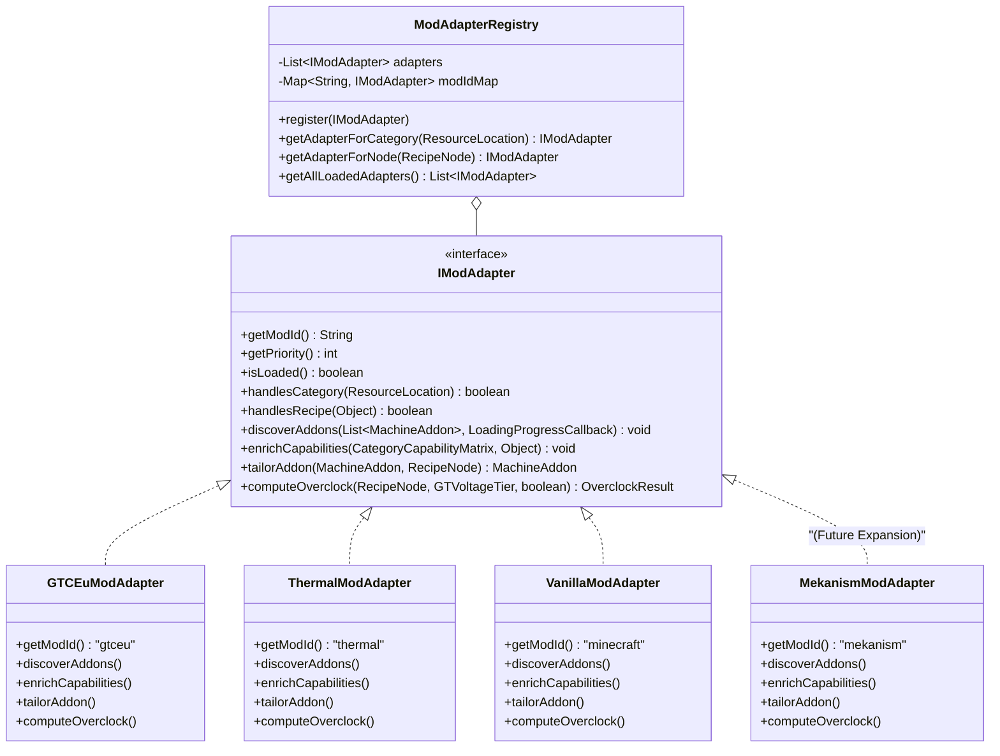

# RFC-V2-006: 모드 호환성 어댑터 시스템 (Mod Compatibility Adapter System)

---

## 📌 메타데이터 (Metadata)

| 항목 | 내용 |
| :--- | :--- |
| **문서 번호** | RFC-V2-006 |
| **대상 버전** | `v2.0.0` (Alpha.5+ / Release Candidate) |
| **상태** | `PROPOSED` (설계 및 기획 완료) |
| **관련 컴포넌트** | `CategoryCapabilityMatrix`, `DynamicAddonCrawler`, `MachineAddonCatalog`, `RecipeNode`, `MachineConfigDialog` |
| **작성 일자** | 2026-08-21 |

---

## 1. 개요 및 제안 배경 (Motivation & Background)

### 1.1 현재 시스템의 구조적 한계
1. **모드별 비즈니스 로직의 코어 침범 (Tight Coupling)**:
   - 현재 `GregTech CEu Modern`과 `Thermal Expansion`의 레시피 처리, 기계 수용 능력 판정, 하드웨어 애드온 수집, 오버클럭 공식 및 전력 계산이 `CategoryCapabilityMatrix`, `DynamicAddonCrawler`, `RecipeNode`, `MachineAddon` 등 계산기 보드의 핵심 클래스들에 `if/else` 및 하드코딩된 분기로 섞여 있습니다.
2. **신규 모드 지원 시의 기하급수적 코드 복잡도 증가**:
   - 향후 `Mekanism` (속도/에너지/가스 업그레이드), `Ender IO` (커패시터 티어), `Create` (RPM/응력), `IndustrialCraft 2` 등의 테크 모드를 확장할 때마다 코어 파일들을 일일이 수정해야 하므로 유지보수 비용과 회귀 버그 위험이 급증합니다.
3. **모드별 고유 메커니즘의 캡슐화 부재**:
   - 전력 단위(EU vs RF vs Joules vs FE), 오버클럭 규칙(GT 티어별 4x EU / 2x Speed, Thermal 스케일링, Mekanism 지수 승수 등), 애드온 슬롯 제한 규칙(써멀 1킷 제한 / 3증강 스태킹, GT 코일 단일 선택 등)이 모드마다 근본적으로 다릅니다.

### 1.2 핵심 목표
* **서비스 제공자 인터페이스 (SPI - Service Provider Interface) 플러그인 아키텍처**를 도입하여 각 모드의 로직을 완전히 독립된 어댑터(`IModAdapter`)로 분리.
* 코어 계산 엔진은 `ModAdapterRegistry`를 통해 작업을 위임받아 수행하므로, **신규 모드 추가 시 코어 코드를 단 한 줄도 수정하지 않고 새 어댑터 클래스 1개만 추가**하면 완벽히 연동되도록 구조화.

---

## 2. 시스템 아키텍처 (System Architecture)

### 2.1 클래스 구조도 (Class Diagram)



---

## 3. 핵심 인터페이스 및 컴포넌트 명세 (Detailed Specifications)

### 3.1 `IModAdapter` 인터페이스

모든 모드 어댑터가 구현해야 하는 표준 SPI 계약입니다:

```java
package com.gtceu.calcboard.compat;

import com.gtceu.calcboard.api.*;
import net.minecraft.resources.ResourceLocation;
import java.util.List;

public interface IModAdapter {

    /**
     * 모드 식별자 (예: "gtceu", "thermal", "mekanism", "minecraft")
     */
    String getModId();

    /**
     * 어댑터 우선순위 (높을수록 먼저 평가됨, 기본값: 100)
     */
    default int getPriority() {
        return 100;
    }

    /**
     * 현재 게임 런타임에 해당 모드가 로드되어 있는지 여부
     */
    boolean isLoaded();

    /**
     * 주어진 레시피 카테고리가 해당 모드의 전용 카테고리인지 판별
     */
    boolean handlesCategory(ResourceLocation categoryId);

    /**
     * 주어진 레시피 객체가 해당 모드의 레시피인지 판별
     */
    boolean handlesRecipe(Object recipe);

    /**
     * 해당 모드에서 제공하는 모든 하드웨어 애드온 (코일, 로터, 해치, 증강 등) 수집
     */
    void discoverAddons(List<MachineAddon> collector, LoadingProgressCallback callback);

    /**
     * CategoryCapabilityMatrix 베이킹 시 모드별 기계 정의 및 멀티블록 수용 능력 주입
     */
    void enrichCapabilities(CategoryCapabilityMatrix matrix, Object emiRecipeManager);

    /**
     * 대상 기계 노드에 맞추어 애드온 파라미터 튜닝 (예: Cracker 전력 할인, LCR 속도, 써멀 병렬 배율 등)
     */
    default MachineAddon tailorAddon(MachineAddon addon, RecipeNode targetNode) {
        return addon;
    }
}
```

---

### 3.2 `ModAdapterRegistry` (중앙 라우터)

등록된 모든 어댑터를 관리하고, 레시피 카테고리 또는 기계 노드에 적합한 어댑터로 $O(1)$ 또는 우선순위 라우팅을 수행합니다.

* **동작 원리**:
  1. 모드 초기화 시점에 내장 어댑터(`GTCEuModAdapter`, `ThermalModAdapter`, `VanillaModAdapter`)를 자동 등록.
  2. `isLoaded()`가 `true`인 활성 어댑터만 필터링하여 우선순위 내림차순 정렬.
  3. `getAdapterForCategory(categoryId)` 호출 시:
     - 네임스페이스(`categoryId.getNamespace()`) 직접 매칭 $\rightarrow$ `handlesCategory()` 매칭 $\rightarrow$ 최종 `VanillaModAdapter` 폴백.

---

## 4. 모드별 어댑터 책임 영역 (Adapter Implementations)

### 4.1 `GTCEuModAdapter` (GregTech CEu Modern)
* **담당 영역**:
  - `GTRegistries.MACHINES`, `GTRegistries.COILS`, `GTRegistries.MATERIALS` 스캔.
  - 가열 코일(Coil Blocks), 대형 터빈 로터(Turbine Rotors), 병렬 해치, 유지보수 해치 수집.
  - 멀티블록 구조체(`multiblock_info`) 분석을 통한 코일/터빈/병렬 수용 능력 연역.
  - GTCEu 바이트코드 공식 기반 오버클럭 및 할인율 연산:
    - Cracker 할인율: $0.9 + (\text{tier} - 9) \times 0.025$ (Tier 10: 0.07x)
    - Pyrolyse 가공 속도: $50 \times (\text{tier} + 1)$
    - LCR 속도/전력: $75 + \text{tier} \times 25$ / $100 - \text{tier} \times 5$
    - Multi Smelter 최대 병렬: $\text{level} \times 32$

### 4.2 `ThermalModAdapter` (Thermal Series)
* **담당 영역**:
  - `thermal:` 레시피 카테고리 및 다이나모 발전기 식별.
  - 기계 업그레이드 킷(LV~EV, 6x~48x 스케일) 1개 장착/교체 규칙 적용.
  - 일반 증강(ARC, MCI 등) NBT 실수 파싱(`AugmentData.Type: Dynamo_Fuel`) 기반 3슬롯 중복 장착(Stacking) 지원.
  - RF $\leftrightarrow$ EU 전력 단위 변환.

### 4.3 `VanillaModAdapter` (Vanilla / Generic Fallback)
* **담당 영역**:
  - `minecraft:smelting`, `minecraft:blasting`, `minecraft:smoking`, `minecraft:crafting` 등 바닐라 레시피 처리.
  - 전용 어댑터가 없는 기타 범용 모드 레시피의 기본 싱글블록 및 커스텀 애드온 슬롯 제공.

---

## 5. 향후 모드 확장 로드맵 (Future Mod Expansion)

본 SPI 아키텍처가 확립되면 향후 다음과 같은 모드들을 기존 코어 수정 없이 플러그인 형태로 즉시 추가할 수 있습니다:

| 모드 이름 | 어댑터 클래스명 | 주요 지원 기능 및 애드온 |
| :--- | :--- | :--- |
| **Mekanism** | `MekanismModAdapter` | • Speed/Energy/Gas/Muffling 업그레이드 (최대 8개 스태킹)<br>• 기계 티어 인스톨러 (Basic $\rightarrow$ Advanced $\rightarrow$ Elite $\rightarrow$ Ultimate Factory)<br>• 가스 파이프라인 및 Joules $\leftrightarrow$ EU 변환 |
| **Ender IO** | `EnderIOModAdapter` | • 커패시터 티어 (Basic, Double-Layer, Octadic, Stellar Capacitor)<br>• 기계 속도 및 전력 소모 승수 연역 |
| **Create** | `CreateModAdapter` | • 회전 속도 (RPM) 및 응력 용량 (Stress Units - SU) 연산<br>• 기계 가공 시간 반비례 스케일링 |
| **Applied Energistics 2** | `AE2ModAdapter` | • 가속 카드 (Acceleration Cards, 1~4장)<br>• 분자 조립기(Molecular Assembler) 및 인scriber 처리 속도 연역 |

---

## 6. 결론 및 기대 효과 (Conclusion & Benefits)

1. **완벽한 모듈화 (High Cohesion, Loose Coupling)**:
   - 코어 계산 엔진과 UI는 모드별 세부 구현에 대해 알 필요가 없으며, 인터페이스를 통해서만 상호작용합니다.
2. **코드 가독성 및 유지보수성 대폭 향상**:
   - 흩어져 있던 모드별 if/else 코드가 각자의 어댑터 패키지(`compat/gtceu`, `compat/thermal` 등)로 깔끔하게 정리됩니다.
3. **안전한 모드팩 환경 보장**:
   - 특정 모드(예: Thermal)가 설치되지 않은 모드팩 환경에서도 어댑터의 `isLoaded()`가 `false`를 반환하여 안전하게 비활성화되므로 `ClassNotFoundException`이나 런타임 크래시 위험이 원천적으로 배제됩니다.
