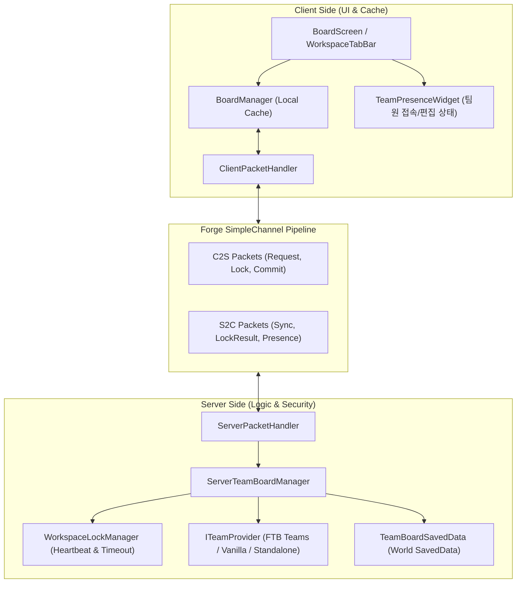
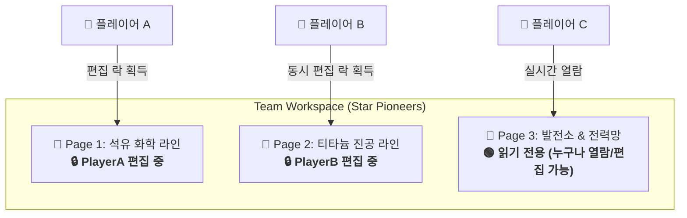
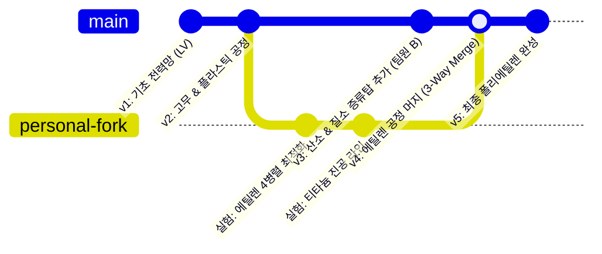
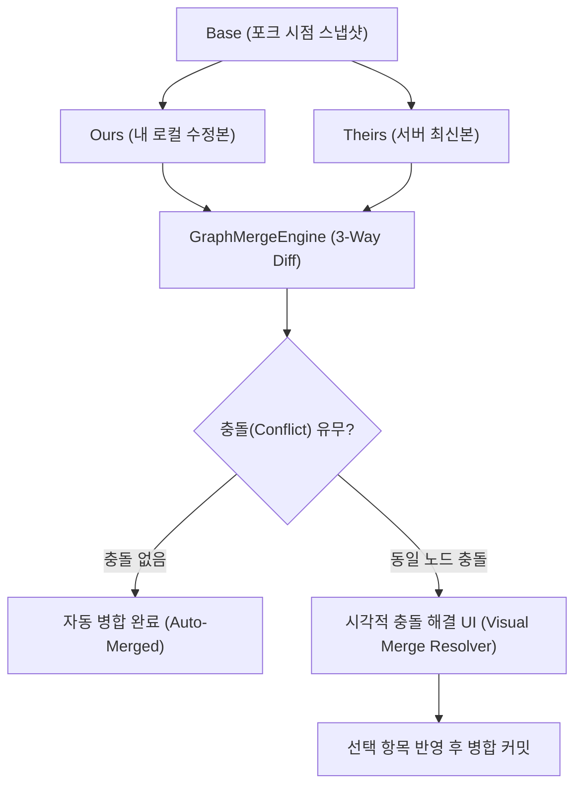
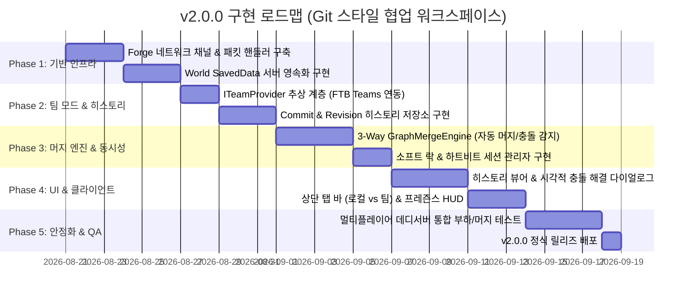

# RFC: GTCalcBoard v2.0.0 - 서버 사이드 멀티플레이 & 팀 공유 워크스페이스

* **문서 번호**: RFC-002
* **대상 버전**: `v2.0.0`
* **상태**: `PROPOSED / PLANNING`
* **주제**: 서버 영속화(SavedData), FTB Teams 연동, 멀티플레이 동시성 제어 및 실시간 협업 워크스페이스

---

## 1. 개요 및 배경 (Motivation)

### 1.1 배경
GregTech CEu 및 대규모 테크 모드팩(Star Technology, GTNH, Monifactory 등)은 대부분 **멀티플레이어 환경(FTB Teams 기반 파티)**에서 진행됩니다.
현재 GTCalcBoard `v1.x`는 클라이언트 로컬(JSON/NBT) 파일로만 저장되므로, 다른 팀원과 공정 설계를 공유하려면 클립보드 블루프린트 코드를 디스코드나 채팅창으로 복사해서 수동으로 붙여넣어야 하는 번거로움이 있습니다.

### 1.2 v2.0.0 목표
1. **서버 사이드 월드 저장 (`SavedData`)**: 서버 월드에 팀별 보드 데이터를 안전하게 영속화.
2. **FTB Teams 무결성 연동**: 팀 모드가 설치되어 있으면 팀 파티와 1:1로 자동 연동되는 공유 워크스페이스 제공.
3. **무설치 소프트 디펜던시 (Soft-Dependency)**: FTB Teams가 없는 바닐라 서버나 싱글플레이에서도 크래시 없이 독립 워크스페이스/스코어보드 팀으로 자연스럽게 동작.
4. **스마트 동시성 제어 (Soft-Lock & Publish)**: 팀원 간 동시 편집 시 데이터 손실을 방지하고, 개인 보드로의 포크(Fork) 및 브로드캐스트 동기화 지원.

---

## 2. 사용자 핵심 유저 스토리 (User Stories)

| ID | 역할 | 행동 (Action) | 기대 효과 (Outcome) |
| :--- | :--- | :--- | :--- |
| **US-01** | 파티 플레이어 | 인게임 보드 화면에서 `[👥 팀 워크스페이스]` 탭을 클릭 | 팀원들이 구성해 둔 최신 공정 플로우차트와 진행 상황이 실시간으로 로드되어 열람 가능 |
| **US-02** | 라인 설계자 | 팀 워크스페이스에서 `[편집 시작]`을 누르고 노드/와이어 수정 | 서버로부터 편집 락(Lock)을 획득하고, 다른 팀원에게는 "🔒 설계자님이 편집 중" 표시 |
| **US-03** | 라인 설계자 | 수정 완료 후 `[🚀 팀에 게시]` 클릭 | 서버 월드에 즉시 저장되고, 접속 중인 모든 팀원의 화면에 변경 사항이 즉시 자동 반영 |
| **US-04** | 팀원 | 다른 팀원이 편집 중일 때 `[📋 개인 보드로 복사]` 클릭 | 팀 보드를 내 로컬 `[👤 내 보드]`로 포크(Fork)하여 방해 없이 자유롭게 개인 실험 수행 |
| **US-05** | 서버 관리자 | 서버 재부팅 및 백업 수행 | `<world>/data/gtcalcboard/`에 월드 데이터로 깔끔하게 저장되어 백업 및 롤백이 용이 |

---

## 3. 시스템 아키텍처 명세 (Architecture Specification)

### 3.1 전체 계층 구조 (Layered Architecture)



---

### 3.2 네트워크 프로토콜 명세 (Network Packets)

모든 패킷은 Forge `SimpleChannel` (`NetworkRegistry.newSimpleChannel`)을 통해 등록되며, 대용량 그래프 전송을 위해 GZIP 압축 NBT 바이트 스트림을 사용합니다.

#### 1. C2S (Client to Server)
| 패킷 클래스 | 페이로드 | 목적 |
| :--- | :--- | :--- |
| `C2SRequestWorkspacePacket` | `UUID teamId, String pageId` | 팀 워크스페이스 데이터 요청 |
| `C2SAcquireLockPacket` | `UUID teamId, String pageId` | 해당 페이지 편집 권한(Lock) 요청 |
| `C2SReleaseLockPacket` | `UUID teamId, String pageId` | 편집 권한 반환 |
| `C2SCommitWorkspacePacket` | `UUID teamId, String pageId, byte[] compressedNBT, int revision` | 수정한 보드 데이터를 서버에 최종 저장/게시 |
| `C2SPingPresencePacket` | `UUID teamId, String pageId, double viewX, double viewY` | 현재 열람 중인 위치 및 하트비트 전송 |

#### 2. S2C (Server to Client)
| 패킷 클래스 | 페이로드 | 목적 |
| :--- | :--- | :--- |
| `S2CSyncWorkspacePacket` | `UUID teamId, String pageId, byte[] compressedNBT, int revision, UUID currentEditor` | 팀 보드 전체 데이터 동기화 |
| `S2CLockResultPacket` | `String pageId, boolean success, UUID lockHolder, long expireTimestamp` | 락 획득 성공/실패 응답 |
| `S2CBroadcastPresencePacket` | `UUID teamId, List<PlayerPresenceData> activeMembers` | 팀원들의 열람/편집 상태 브로드캐스트 |
| `S2CWorkspaceErrorPacket` | `int errorCode, String messageKey` | 권한 부족, 버전 충돌 등 에러 알림 |

---

### 3.3 팀 프로바이더 추상화 계층 (`ITeamProvider`)

외부 모드(FTB Teams) 의존성을 완전 격리하여, FTB Teams가 없어도 컴파일 에러나 런타임 크래시가 발생하지 않도록 어댑터 패턴을 적용합니다.

```java
public interface ITeamProvider {
    /** 플레이어가 속한 팀의 고유 UUID를 반환 (없으면 플레이어 개인 UUID) */
    UUID getPlayerTeamId(ServerPlayer player);

    /** 팀의 표시 이름 반환 (예: "Team Alpha", "Solo_Player") */
    String getTeamDisplayName(UUID teamId);

    /** 해당 팀의 모든 멤버 UUID 목록 반환 */
    Set<UUID> getTeamMembers(UUID teamId);

    /** 플레이어가 해당 팀 보드의 편집 권한이 있는지 검사 */
    boolean canPlayerEdit(ServerPlayer player, UUID teamId);
}
```

* **구현체 1: `FTBTeamsProvider`**
  - FTB Teams API (`dev.ftb.mods.ftbteams.api.FTBTeamsAPI`) 연동
  - `ModList.get().isLoaded("ftbteams")` 확인 후 리플렉션/분리 클래스로 로드
* **구현체 2: `VanillaScoreboardProvider`**
  - 바닐라 스코어보드 팀(`player.getScoreboard().getPlayersTeam(...)`) 연동
* **구현체 3: `StandaloneFallbackProvider`**
  - 싱글플레이 또는 팀이 없는 환경에서 플레이어 UUID 기반 독립 저장

---

### 3.4 서버 데이터 영속화 (`SavedData`)

* **파일 저장 경로**: `<world_directory>/data/gtcalcboard/workspace_<team_uuid>.dat`
* **NBT 구조**:
  ```nbt
  TAG_Compound("WorkspaceData") {
      TAG_Int("FormatVersion"): 2
      TAG_String("TeamUUID"): "c1f7b029-7984-4683-93d3-1a2b3c4d5e6f"
      TAG_String("TeamName"): "Star Pioneers"
      TAG_Long("LastSavedTime"): 1724123456789L
      TAG_Int("GlobalRevision"): 14
      TAG_List("Pages") [
          TAG_Compound {
              TAG_String("PageId"): "page_main_refinery"
              TAG_String("PageTitle"): "에틸렌 & 폴리에틸렌 주공정"
              TAG_Int("PageRevision"): 8
              TAG_String("LockHolderUUID"): "a1b2c3d4-..."
              TAG_Long("LockExpires"): 1724123756789L
              TAG_ByteArray("CompressedGraphData"): [byte[]]
          }
      ]
  }
  ```

---

## 4. 팀 워크스페이스 멀티 페이지네이션 & 세분화된 동시성 제어 (Multi-Page & Granular Locking)

팀 워크스페이스는 단일 캔버스에 국한되지 않고, 개인 보드와 마찬가지로 **무제한 다중 페이지 탭(`PageTabBar`)**을 지원합니다.

### 4.1 팀 다중 페이지네이션 (Multi-Page Workspace)
* **공정별 독립 탭 분할**:
  - `[📄 석유 정제 & 플라스틱]`, `[📄 티타늄 & 백금족 추출]`, `[📄 나콰다 핵연료 발전]`, `[+ 새 페이지]`
* **페이지별 독립 메타데이터**:
  - 각 페이지는 고유한 `PageId`, `Title`, `Revision`, `CompressedGraphData`를 별도로 관리합니다.
  - 팀원은 탭 바를 통해 팀 내의 여러 공정 페이지를 자유롭게 전환하며 열람할 수 있습니다.

### 4.2 페이지 단위 독립 편집 락 (Page-Level Granular Locking)
워크스페이스 전체를 통째로 잠그는 것이 아니라 **"페이지 단위(Page-Level)"**로 독립적인 락을 적용하여 팀원 간 병렬 협업 효율을 극대화합니다.



1. **병렬 협업 (Parallel Editing)**:
   * 플레이어 A가 '석유 화학' 페이지를 편집하는 동안, 플레이어 B는 '티타늄 라인' 페이지를 동시에 편집하고 각자 독립적으로 팀에 커밋할 수 있습니다.
2. **탭 바 시각적 잠금 뱃지**:
   * 페이지 탭에 현재 편집 중인 팀원의 상태가 실시간으로 표시됩니다:
     - `[📄 석유 화학 🔒 A님]` : 다른 팀원에게는 읽기 전용으로 열람됨.
     - `[📄 티타늄 라인 🔒 B님]` : 다른 팀원에게는 읽기 전용으로 열람됨.
     - `[📄 전력망]` : 현재 잠금 없음 (클릭하여 즉시 편집 가능).
3. **하트비트 & 안전 해제**:
   * 편집 중인 플레이어가 해당 페이지를 닫거나, 다른 탭으로 이동하거나, 2분 이상 유휴 상태가 되면 페이지 락이 서버에서 자동 해제됩니다.

---

## 5. Git 스타일 협업 워크플로우 (Fork, Smart Merge & Commit History)

대규모 멀티플레이에서 여러 팀원이 각자 파트를 분담하여 작업하고 안전하게 합칠 수 있도록 **Git 스타일의 분기(Fork) / 병합(Merge) / 커밋 이력(Commit History)** 시스템을 탑재합니다.



---

### 5.1 커밋 히스토리 & 타임머신 롤백 (Commit History)

#### 1. 커밋 생성 (`[🚀 팀에 커밋/게시]`)
* 팀 워크스페이스에서 변경 사항을 저장할 때, **커밋 메시지 입력 다이얼로그(`CommitDialog`)**가 나타납니다.
* 예: `"초전도체 라인 4배 증설 및 UEV 전력 매칭"`
* 서버는 각 커밋마다 고유 Revision 번호, 작성자 UUID/이름, 타임스탬프, 커밋 메시지, NBT 스냅샷 및 변경 노드 델타(Diff)를 영속화합니다.

#### 2. 커밋 히스토리 뷰어 다이얼로그 (`CommitHistoryDialog`)
* 툴바의 `[📜 히스토리]` 버튼을 클릭하여 열람할 수 있습니다.
* **타임라인 목록**:
  ```text
  ● [Rev 14] 2026-08-20 12:15 - PlayerA : "에틸렌 4병렬 최적화 및 오버클럭" (+4 노드, ~2 노드)
  ○ [Rev 13] 2026-08-20 11:30 - PlayerB : "산소/질소 증류탑 라인 신설" (+6 노드, +8 와이어)
  ○ [Rev 12] 2026-08-20 09:10 - PlayerA : "기초 원유 정제 라인 구축" (최초 생성)
  ```
* **제공 액션**:
  - `[👁 미리보기]`: 과거 커밋 시점의 공정 캔버스를 읽기 전용으로 시각적 탐색.
  - `[📋 개인 보드로 복사 (Checkout)]`: 과거 특정 커밋 상태를 내 `[👤 개인 보드]`로 복제하여 가져오기.
  - `[⏪ 이 시점으로 롤백 (Revert)]`: 팀 권한자(Leader)가 과거 커밋으로 팀 워크스페이스를 되돌리기.

---

### 5.2 지능형 3-Way 그래프 머지 엔진 (`GraphMergeEngine`)

팀원이 팀 보드를 개인 보드로 포크(`Fork`)하여 수정하는 동안, 다른 팀원이 팀 보드에 새 공정을 커밋하더라도 두 작업 내용이 안전하게 병합될 수 있도록 **3-Way Graph Diff & Merge 알고리즘**을 구현합니다.

* **$Base$ (포크 시점의 기준 그래프)**
* **$Theirs$ (현재 서버의 최신 팀 그래프)**
* **$Ours$ (내 개인 보드에서 수정한 그래프)**



#### 1. 무충돌 자동 병합 (Automatic Merge)
* **새로운 노드/라인 추가**: 서로 다른 공정 노드를 추가한 경우 $\rightarrow$ 충돌 없이 두 공정이 모두 팀 보드에 추가됨.
* **비간섭 노드 수정**: 팀원 A가 '화학 반응기'를 수정하고, 팀원 B가 '증류탑'을 수정한 경우 $\rightarrow$ 양쪽 수정 사항이 모두 자동 병합.

#### 2. 시각적 충돌 해결 모달 (`VisualMergeResolverDialog`)
* 만약 같은 노드의 **기계 대수, 전압 티어, 오버클럭 모드**를 서로 다르게 수정한 경우 충돌(Conflict)로 감지됩니다.
* 팝업에서 두 버전을 나란히 비교하고 원하는 쪽을 클릭으로 선택하여 손쉽게 해결합니다:
  ```text
  [ 충돌 항목: Forming Press (Nether Star) ]
  -------------------------------------------------------------
  [ ] 서버 최신 (Theirs)    : 999,999대 (UHV, STD OC) [PlayerB 수정]
  [*] 내 로컬 수정 (Ours)   : 1,200,000대 (UEV, PERF OC) [내 수정본 채택]
  -------------------------------------------------------------
  [ 🔀 병합 완료 및 팀에 커밋 ]
  ```

---

## 6. UI / UX 디자인 상세

### 6.1 상단 워크스페이스 헤더 & 툴바
```text
+---------------------------------------------------------------------------------------------------+
| [👤 내 로컬 보드] | [👥 팀 워크스페이스 (Star Pioneers)]              [● 3명 접속 중] 🔒 [PlayerA] 편집 중 |
+---------------------------------------------------------------------------------------------------+
| [+ Page 1] [+ Page 2] | 📖 Guide  🎯 Ratio  🚀 Flow  📦 Group  [🚀 팀 커밋]  [🔀 팀에 머지]  [📜 히스토리] |
+---------------------------------------------------------------------------------------------------+
```

### 6.2 주요 신규 다이얼로그 UI
1. **`CommitDialog`**: 커밋 요약(추가/수정/삭제 노드 수) 확인 및 커밋 메시지 작성.
2. **`CommitHistoryDialog`**: 리비전 타임라인 탐색, 커밋별 Diff 요약, 미리보기 및 롤백.
3. **`VisualMergeResolverDialog`**: 3-Way 머지 시 노드 속성 충돌을 좌/우 비교하여 클릭으로 채택.

---

## 7. 개발 단계 및 마일스톤 (Phased Implementation)



---

## 8. 결론

본 RFC의 **Git 스타일 브랜치/포크, 3-Way 지능형 머지, 그리고 커밋 히스토리 타임머신**은 마인크래프트 테크 모드 역사상 가장 진보된 협업 환경을 제공할 것입니다.
팀원들이 서로의 작업을 덮어쓸 걱정 없이 각자의 개인 보드에서 자유롭게 실험하고, 완성된 공정을 팀 보드에 안전하게 병합할 수 있는 완벽한 아키텍처를 완성합니다.

