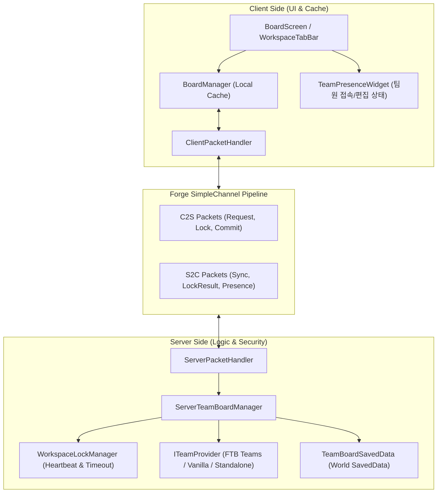
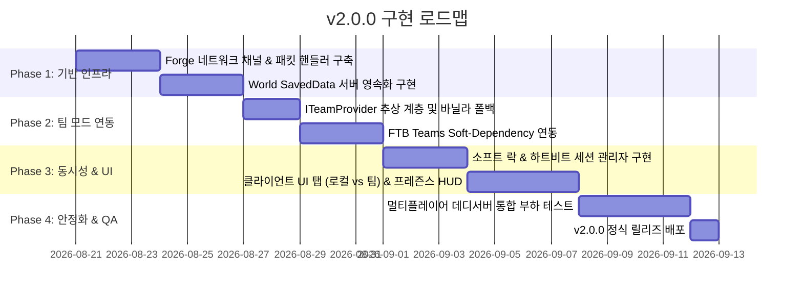

# RFC: GTCalcBoard v2.0.0 - 서버 사이드 멀티플레이 & 팀 공유 워크스페이스

* **문서 번호**: RFC-002
* **대상 버전**: `v2.0.0`
* **상태**: `PROPOSED / PLANNING`
* **주제**: 서버 영속화(SavedData), FTB Teams 연동, 멀티플레이 동시성 제어 및 실시간 협업 워크스페이스

---

## 1. 개요 및 배경 (Motivation)

### 1.1 배경
GregTech CEu 및 대규모 테크 모드팩(Star Technology, GTNH, Monifactory 등)은 대부분 **멀티플레이어 환경(FTB Teams 기반 파티)**에서 진행됩니다.
현재 GTCalcBoard `v1.x`는 클라이언트 로컬(JSON/NBT) 파일로만 저장되므로, 다른 팀원과 공정 설계를 공유하려면 클립보드 블루프린트 코드를 디스코드나 채팅창으로 복사해서 수동으로 붙여넣어야 하는 번거로움이 있습니다.

### 1.2 v2.0.0 목표
1. **서버 사이드 월드 저장 (`SavedData`)**: 서버 월드에 팀별 보드 데이터를 안전하게 영속화.
2. **FTB Teams 무결성 연동**: 팀 모드가 설치되어 있으면 팀 파티와 1:1로 자동 연동되는 공유 워크스페이스 제공.
3. **무설치 소프트 디펜던시 (Soft-Dependency)**: FTB Teams가 없는 바닐라 서버나 싱글플레이에서도 크래시 없이 독립 워크스페이스/스코어보드 팀으로 자연스럽게 동작.
4. **스마트 동시성 제어 (Soft-Lock & Publish)**: 팀원 간 동시 편집 시 데이터 손실을 방지하고, 개인 보드로의 포크(Fork) 및 브로드캐스트 동기화 지원.

---

## 2. 사용자 핵심 유저 스토리 (User Stories)

| ID | 역할 | 행동 (Action) | 기대 효과 (Outcome) |
| :--- | :--- | :--- | :--- |
| **US-01** | 파티 플레이어 | 인게임 보드 화면에서 `[👥 팀 워크스페이스]` 탭을 클릭 | 팀원들이 구성해 둔 최신 공정 플로우차트와 진행 상황이 실시간으로 로드되어 열람 가능 |
| **US-02** | 라인 설계자 | 팀 워크스페이스에서 `[편집 시작]`을 누르고 노드/와이어 수정 | 서버로부터 편집 락(Lock)을 획득하고, 다른 팀원에게는 "🔒 설계자님이 편집 중" 표시 |
| **US-03** | 라인 설계자 | 수정 완료 후 `[🚀 팀에 게시]` 클릭 | 서버 월드에 즉시 저장되고, 접속 중인 모든 팀원의 화면에 변경 사항이 즉시 자동 반영 |
| **US-04** | 팀원 | 다른 팀원이 편집 중일 때 `[📋 개인 보드로 복사]` 클릭 | 팀 보드를 내 로컬 `[👤 내 보드]`로 포크(Fork)하여 방해 없이 자유롭게 개인 실험 수행 |
| **US-05** | 서버 관리자 | 서버 재부팅 및 백업 수행 | `<world>/data/gtcalcboard/`에 월드 데이터로 깔끔하게 저장되어 백업 및 롤백이 용이 |

---

## 3. 시스템 아키텍처 명세 (Architecture Specification)

### 3.1 전체 계층 구조 (Layered Architecture)



---

### 3.2 네트워크 프로토콜 명세 (Network Packets)

모든 패킷은 Forge `SimpleChannel` (`NetworkRegistry.newSimpleChannel`)을 통해 등록되며, 대용량 그래프 전송을 위해 GZIP 압축 NBT 바이트 스트림을 사용합니다.

#### 1. C2S (Client to Server)
| 패킷 클래스 | 페이로드 | 목적 |
| :--- | :--- | :--- |
| `C2SRequestWorkspacePacket` | `UUID teamId, String pageId` | 팀 워크스페이스 데이터 요청 |
| `C2SAcquireLockPacket` | `UUID teamId, String pageId` | 해당 페이지 편집 권한(Lock) 요청 |
| `C2SReleaseLockPacket` | `UUID teamId, String pageId` | 편집 권한 반환 |
| `C2SCommitWorkspacePacket` | `UUID teamId, String pageId, byte[] compressedNBT, int revision` | 수정한 보드 데이터를 서버에 최종 저장/게시 |
| `C2SPingPresencePacket` | `UUID teamId, String pageId, double viewX, double viewY` | 현재 열람 중인 위치 및 하트비트 전송 |

#### 2. S2C (Server to Client)
| 패킷 클래스 | 페이로드 | 목적 |
| :--- | :--- | :--- |
| `S2CSyncWorkspacePacket` | `UUID teamId, String pageId, byte[] compressedNBT, int revision, UUID currentEditor` | 팀 보드 전체 데이터 동기화 |
| `S2CLockResultPacket` | `String pageId, boolean success, UUID lockHolder, long expireTimestamp` | 락 획득 성공/실패 응답 |
| `S2CBroadcastPresencePacket` | `UUID teamId, List<PlayerPresenceData> activeMembers` | 팀원들의 열람/편집 상태 브로드캐스트 |
| `S2CWorkspaceErrorPacket` | `int errorCode, String messageKey` | 권한 부족, 버전 충돌 등 에러 알림 |

---

### 3.3 팀 프로바이더 추상화 계층 (`ITeamProvider`)

외부 모드(FTB Teams) 의존성을 완전 격리하여, FTB Teams가 없어도 컴파일 에러나 런타임 크래시가 발생하지 않도록 어댑터 패턴을 적용합니다.

```java
public interface ITeamProvider {
    /** 플레이어가 속한 팀의 고유 UUID를 반환 (없으면 플레이어 개인 UUID) */
    UUID getPlayerTeamId(ServerPlayer player);

    /** 팀의 표시 이름 반환 (예: "Team Alpha", "Solo_Player") */
    String getTeamDisplayName(UUID teamId);

    /** 해당 팀의 모든 멤버 UUID 목록 반환 */
    Set<UUID> getTeamMembers(UUID teamId);

    /** 플레이어가 해당 팀 보드의 편집 권한이 있는지 검사 */
    boolean canPlayerEdit(ServerPlayer player, UUID teamId);
}
```

* **구현체 1: `FTBTeamsProvider`**
  - FTB Teams API (`dev.ftb.mods.ftbteams.api.FTBTeamsAPI`) 연동
  - `ModList.get().isLoaded("ftbteams")` 확인 후 리플렉션/분리 클래스로 로드
* **구현체 2: `VanillaScoreboardProvider`**
  - 바닐라 스코어보드 팀(`player.getScoreboard().getPlayersTeam(...)`) 연동
* **구현체 3: `StandaloneFallbackProvider`**
  - 싱글플레이 또는 팀이 없는 환경에서 플레이어 UUID 기반 독립 저장

---

### 3.4 서버 데이터 영속화 (`SavedData`)

* **파일 저장 경로**: `<world_directory>/data/gtcalcboard/workspace_<team_uuid>.dat`
* **NBT 구조**:
  ```nbt
  TAG_Compound("WorkspaceData") {
      TAG_Int("FormatVersion"): 2
      TAG_String("TeamUUID"): "c1f7b029-7984-4683-93d3-1a2b3c4d5e6f"
      TAG_String("TeamName"): "Star Pioneers"
      TAG_Long("LastSavedTime"): 1724123456789L
      TAG_Int("GlobalRevision"): 14
      TAG_List("Pages") [
          TAG_Compound {
              TAG_String("PageId"): "page_main_refinery"
              TAG_String("PageTitle"): "에틸렌 & 폴리에틸렌 주공정"
              TAG_Int("PageRevision"): 8
              TAG_String("LockHolderUUID"): "a1b2c3d4-..."
              TAG_Long("LockExpires"): 1724123756789L
              TAG_ByteArray("CompressedGraphData"): [byte[]]
          }
      ]
  }
  ```

---

## 4. 동시성 제어 및 충돌 방지 (Concurrency Control)

팀원 여러 명이 동시에 한 보드를 수정할 때 발생할 수 있는 덮어쓰기(Race Condition)를 방지하기 위해 **낙관적 락(Optimistic Lock) + 세션 락(Session Lock)**을 결합합니다.

1. **소프트 편집 락 (Soft Edit Lock)**:
   * 팀원이 `[✏️ 편집 시작]`을 누르면 서버에 락을 요청합니다.
   * 락을 획득한 플레이어만 편집 모드로 전환되며, 다른 팀원은 **실시간 읽기 모드(Read-Only View)**로 캔버스를 봅니다.
2. **하트비트 & 자동 락 해제 (Timeout & Heartbeat)**:
   * 클라이언트는 30초마다 `PingPresencePacket`을 서버로 전송합니다.
   * 2분 이상 핑이 없거나 게임을 종료하면 서버가 락을 자동으로 해제하여 다른 팀원이 이어서 작업할 수 있도록 보장합니다.
3. **리비전 번호(Revision) 검증**:
   * 클라이언트가 서버로 저장(`C2SCommitWorkspacePacket`)을 보낼 때, 로컬 리비전 번호가 서버의 최신 리비전과 일치하는지 확인합니다.
   * 불일치 시 저장을 거부하고 **"충돌 발생: 최신 내용을 먼저 불러오거나 개인 보드로 백업하세요"** 알림을 띄웁니다.

---

## 5. UI / UX 디자인 상세

### 5.1 상단 워크스페이스 탭 바
화면 최상단 툴바 위에 **워크스페이스 전환 탭**이 추가됩니다:

```text
+-----------------------------------------------------------------------------------------------+
| [👤 내 로컬 보드] | [👥 팀 워크스페이스 (Star Pioneers)]                    [● 3명 접속 중] 🔒 [설계자] 편집 중 |
+-----------------------------------------------------------------------------------------------+
| [+ Page 1] [+ Page 2] | 📖 Guide  🎯 Ratio  🚀 Flow  📦 Group  [🚀 팀에 게시]  [📋 내 보드로 복사]    |
+-----------------------------------------------------------------------------------------------+
```

### 5.2 팀원 접속 상태 표시기 (Presence Indicator)
* 우측 상단에 현재 같은 보드 페이지를 열람하고 있는 팀원들의 아바타와 닉네임이 작은 뱃지로 표시됩니다.
* 마우스를 올리면:
  - `🟢 플레이어A (열람 중)`
  - `🔒 플레이어B (편집 중 - 1분 전 수정)`

---

## 6. 개발 단계 및 마일스톤 (Phased Implementation)



---

## 7. 결론

본 RFC 설계를 통해 GTCalcBoard는 싱글플레이어용 계산기를 넘어, **모든 테크 모드팩 서버에서 필수적으로 사용되는 실시간 협업 인프라**로 거듭날 것입니다.
기존 `1.x` 클라이언트 로컬 기능의 가벼움과 무결성을 100% 유지하면서, 서버 환경에서만 깔끔하게 활성화되는 아키텍처를 구현합니다.
