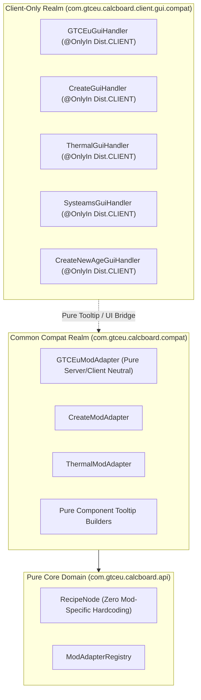

# ADR-001: Dedicated Server 계층 격리 및 호환성 계층 코드 무결성 강화
(Dedicated Server Isolation & Compat Layer Code Integrity Refactoring)

- **문서 번호**: ADR-001
- **대상 버전**: v2.0.0
- **상태**: IMPLEMENTED
- **결정/완료일**: 2026-08-29

---

## 1. 개요 및 배경 (Motivation)

아키텍처 감사(Architecture Audit) 결과, 공용 클래스로딩 영역인 `com.gtceu.calcboard.compat.*` 패키지에 `net.minecraft.client.gui.Font`, `GuiGraphics`, `Minecraft` 등의 클라이언트 전용 클래스를 임포트하는 GUI 핸들러(`*GuiHandler`)가 위치하고 있으며, `GTCEuModAdapter`가 이를 직접 참조하는 구조적 결함이 식별되었습니다.

이로 인해 데디케이티드 서버(Dedicated Server) 환경에서 `NoClassDefFoundError`가 발생할 수 있는 잠재적 위험이 존재하며, `RecipeNode` 및 일부 어댑터 헬퍼에 하드코딩된 모드 ID 문자열 매칭이 잔존하여 Rule 5 및 도메인 순수성 원칙을 일부 저해하고 있습니다.

---

## 2. 세부 설계 및 결정 사항 (Architecture Decision)

### 2.1 주요 변경 항목
1. **GUI 핸들러의 클라이언트 패키지 완전 이전**:
   - `compat.gtceu.GTCEuGuiHandler` $\rightarrow$ `client.gui.compat.gtceu.GTCEuGuiHandler`
   - `compat.create.CreateGuiHandler` $\rightarrow$ `client.gui.compat.create.CreateGuiHandler`
   - `compat.thermal.ThermalGuiHandler` $\rightarrow$ `client.gui.compat.thermal.ThermalGuiHandler`
   - `compat.systeams.SysteamsGuiHandler` $\rightarrow$ `client.gui.compat.systeams.SysteamsGuiHandler`
   - `compat.createnewage.CreateNewAgeGuiHandler` $\rightarrow$ `client.gui.compat.createnewage.CreateNewAgeGuiHandler`
2. **`GTCEuModAdapter` 클라이언트 의존성 0%화**:
   - `GTCEuModAdapter.buildEnergyTooltip`에서 `GTCEuGuiHandler` 호출을 제거하고, 서버-클라이언트 공용 `Component` 빌더 헬퍼(`GTCEuTooltipHelper`)로 분리.
3. **`RecipeNode.java` 모드 중립성 확보**:
   - `supportsSteamMode()` 및 `syncSteamInputSlot()`에서 `ModAdapterRegistry.getAdapterForModId("gtceu")` 폴백을 제거하고 `IModAdapter`의 기본 메서드로 위임.
4. **결정론적 연역 개선 사항 적용 (Rule 5)**:
   - `ThermalAugmentHelper`: `node.getName().contains("dynamo")` 문자열 검사 제거.
   - `StarTTurbineHelper`: `icon.getPath().contains(...)` 대신 `ResourceLocation.equals()` 상수 비교로 전환.

---

## 3. 결과 및 검증 (Consequences & Verification)
- `HeadlessServerIsolationTest`를 포함한 전체 단위 테스트(`.\gradlew.bat test`) 통과.
- `.\gradlew.bat cleanDeploy` 정상 빌드 확인.
- 데디케이티드 서버 환경에서 클라이언트 GUI 클래스 로딩 충돌 원천 차단.
