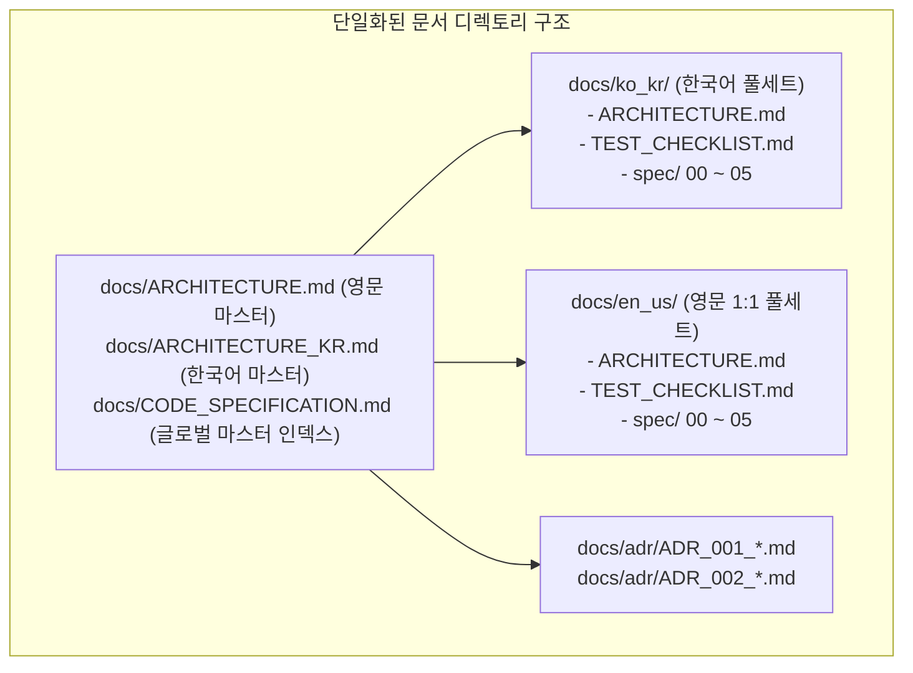

# ADR-002: 아키텍처 및 기술 사양 문서 체계 대량 개편 및 최신화
(Architecture Documentation Restructuring & Complete Technical Specification Modernization)

- **문서 번호**: ADR-002
- **대상 버전**: v2.0.0
- **상태**: IMPLEMENTED
- **결정/완료일**: 2026-08-29

---

## 1. 개요 및 배경 (Motivation)

GregTechCalculatorBoard는 v1.0.0 릴리즈를 향해 가면서 다음과 같은 대규모 핵심 아키텍처 및 수학적/그래픽스/네트워크 혁신을 달성하였습니다:
1. **5계층 시스템 아키텍처**: UI, Core, Compat, Integration 외에 독립적인 **Server & Network** 계층 완비.
2. **5대 그래프 수학 솔버 엔진**: 가우스-요르단 부분 피보팅 기반의 **폐루프 질량 보존 선형 연립방정식 솔버 ($A\mathbf{x} = \mathbf{b}$)** 구현.
3. **고성능 렌더링 파이프라인**: 프레임당 `glClear`를 배제한 단일 패스 배치 렌더링 및 **$128 \times 128$ AABB 균일 그리드 공간 분할 와이어 색인 (`WireSpatialIndex`, $O(E) \rightarrow O(\log E)$)**.
4. **대용량 멀티플레이어 스트리밍 & 2계층 온디맨드 페이징**: Netty 2MB 오버플로우를 원천 차단하는 512KB 청킹 스트리밍 및 분산 임차권 락.
5. **7대 모드 어댑터 및 3단계 결정론적 연역 체계**: GTCEu, Create, Create: New Age, Thermal Series, Systeams, Star Technology, Vanilla.

그러나 기존 문서 체계는 다음과 같은 심각한 파편화와 결손을 안고 있었습니다:
- 루트 `ARCHITECTURE.md`와 하위 폴더 문서 간의 3중 파편화 및 불일치.
- 한국어 스펙 문서(`docs/ko_kr/spec/`)에 최신 혁신 기술(선형 솔버 수식, 온디맨드 페이징, WireSpatialIndex) 누락.
- 영문 스펙 문서(`docs/en_us/spec/`)의 심각한 분량 축약(한국어 대비 40~55%) 및 수식 결손.

---

## 2. 세부 설계 및 결정 사항 (Architecture Decision)

### 2.1 마스터 아키텍처 문서 최신화
- `docs/ARCHITECTURE.md` 및 `docs/ARCHITECTURE_KR.md`를 최신 5계층 아키텍처, 5대 알고리즘, 3단계 결정론적 연역, 고성능 렌더 파이프라인으로 전면 갱신.
- `docs/ko_kr/ARCHITECTURE.md`를 루트 한국어 문서와 완벽히 동기화.

### 2.2 한국어 정식 사양서 (`docs/ko_kr/spec/`) 전면 최신화
- `00_OVERVIEW.md`: 5계층 아키텍처 다이어그램 및 패키지 구조 최신화.
- `01_CORE_DOMAIN_AND_MODELS.md`: `FlowGraph` 불변 뷰 캡슐화, `NodePropertyStore` 규격, $O(1)$ 동기화 보장.
- `02_MATH_AND_ALGORITHMS.md`: [알고리즘 5] 질량 보존 가우스-요르단 선형 연립방정식 솔버 ($A\mathbf{x}=\mathbf{b}$) 수식화, 하이브리드 토폴로지 파이프라인.
- `03_UI_AND_RENDERING_PIPELINE.md` & `03_01_CANVAS_AND_NODE_CARDS.md`: 단일 패스 배치 렌더링, `WireSpatialIndex` AABB 그리드 공간 분할 ($O(E) \rightarrow O(\log E)$).
- `03_02_MACHINE_CONFIG_AND_ADDONS.md`: 9대 애드온 카테고리 연역 명세 최신화.
- `04_MULTIPLAYER_AND_NETWORK_PROTOCOL.md`: 2계층 온디맨드 페이징(`S2CSyncWorkspaceMetaPacket`, `C2SRequestPageDataPacket`), 512KB 청킹 스트리밍(`S2CChunkedDataPacket`), 분산 임차권 락.
- `05_INTEGRATION_AND_I18N.md`: 7대 모드 어댑터, `compat.gtceu.physics` 3단 분리, 3단계 결정론적 연역 체계.

### 2.3 영문 정식 사양서 (`docs/en_us/spec/`) 1:1 완전 대칭 동기화
- `docs/en_us/spec/00_OVERVIEW.md` ~ `05_INTEGRATION_AND_I18N.md`를 한국어 원본과 동일한 깊이 및 수식으로 전면 재작성.
- `docs/en_us/TEST_CHECKLIST.md` 생성 및 동기화.

---

## 3. 결과 및 검증 (Consequences & Verification)
- 모든 마크다운 문서 내 상대/절대 링크 유효성 검증 완료.
- 영문-한국어 간 장/절 번호, Mermaid 다이어그램, LaTeX 수식 1:1 일치 달성.
