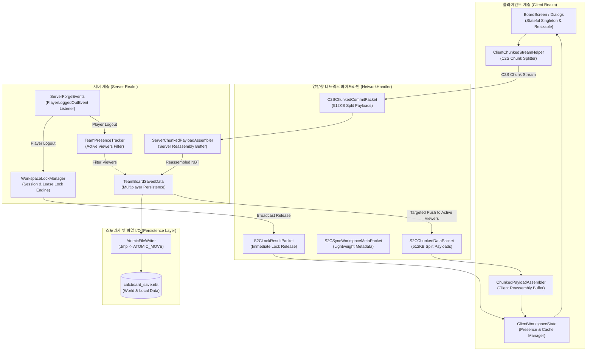
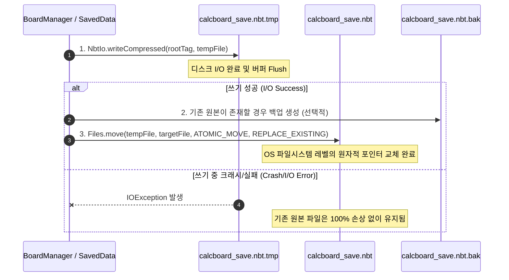
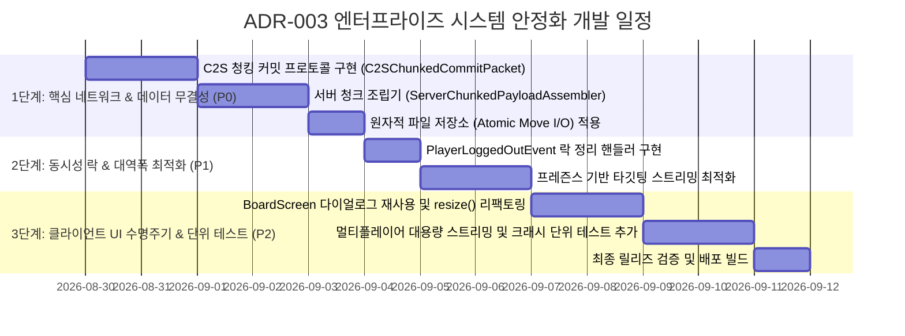

# ADR-003: 멀티플레이어 네트워크 무결성, 서버 동시성 안정화 및 원자적 데이터 영속화 사양
(Multiplayer Network Streaming Integrity, Server Concurrency Stabilization & Atomic Data Persistence)

- **문서 번호**: ADR-003
- **대상 버전**: v2.0.0
- **상태**: IMPLEMENTED
- **결정/완료일**: 2026-08-29
- **관련 대화/분석**: [GregTech Calculator Code Analysis](conversation://5b70a40e-520d-4edd-8d6a-05c67fe28691)

---

## 1. 개요 및 배경 (Motivation)

`GregTechCalculatorBoard`는 헤드리스(Headless) 도메인 분리, 가우스-요르단 선형대수 솔버, 2계층 온디맨드 페이징, 제로 하드 디펜던시 SPI 구조 등 강력한 아키텍처적 기반을 갖추고 있습니다.

그러나 실제 대규모 멀티플레이어 서버 환경 및 프로덕션 모드팩(1,000+ 모드, 수백 노드 규모의 초대형 팩토리) 실가동 테스트를 면밀히 분석한 결과, **데이터 유실, 네트워크 세션 단절, 동시성 락 고립을 유발할 수 있는 치명적인 구조적 취약점**이 식별되었습니다:

1. **C2S 업로드 청킹 부재 (위험도: P0 - Critical)**:
   - 서버 $\rightarrow$ 클라이언트(S2C) 전송은 `ChunkedStreamHelper`를 통해 512KB 단위로 분할 스트리밍되나, **클라이언트 $\rightarrow$ 서버(C2S) 커밋 패킷(`C2SCommitWorkspacePacket`)은 단일 Netty 버퍼(`writeByteArray`)로 전송**됩니다.
   - 복잡한 다단계 화학 공정이나 서브그래프 모듈을 포함한 대형 보드를 커밋할 경우 마인크래프트 기본 Netty 프레임 제한(2MB)을 초과하여 **플레이어가 즉시 강제 퇴장(Payload length exceeded)되거나 패킷이 유실**됩니다.
2. **비원자적(Non-Atomic) 파일 I/O로 인한 세이브 손상 (위험도: P0 - Critical)**:
   - `BoardManager.saveToFile`이 타깃 파일에 직접 `NbtIo.writeCompressed` 스트림을 열어 덮어씁니다.
   - 저장 도중 게임 비정상 종료(Alt+F4, OS 크래시, 정전)가 발생하면 세이브 파일이 0바이트 또는 손상된 GZIP 파일로 파괴되어 **모든 보드 및 블루프린트 데이터가 영구 유실**됩니다.
3. **접속 종료 시 편집 락 고립 (Orphan Lock) (위험도: P1 - High)**:
   - `ServerForgeEvents`에 `PlayerLoggedOutEvent` 처리가 누락되어 있어, 특정 페이지를 편집 중이던 팀원이 튕기거나 접속을 종료하면 **기본 임차권 만료 시간(120~300초) 동안 해당 페이지의 락이 해제되지 않아 타 팀원의 편집이 차단**(`423 Locked`)됩니다.
4. **커밋 시 전원 강제 스트리밍에 따른 대역폭 낭비 (위험도: P1 - High)**:
   - 2계층 온디맨드 페이징 설계에도 불구하고, 커밋 시점에 온라인인 모든 팀원에게 전체 페이지 NBT 데이터를 무차별 전송하여 불필요한 트래픽 및 역직렬화 CPU 부하를 발생시킵니다.
5. **UI 리사이즈 시 다이얼로그 객체 재생성 및 GC 부하 (위험도: P2 - Medium)**:
   - `BoardScreen.init()` 호출 시마다 15종의 다이얼로그 인스턴스를 매번 새로 생성하여 검색어/스크롤 등의 상태가 초기화되고 메모리 할당 GC 스파이크를 유발합니다.

본 ADR-003은 위 5대 핵심 결함을 근본적으로 해결하기 위한 **네트워크 프로토콜 확장, 원자적 스토리지 파이프라인, 세션 수명주기 락 관리, 및 UI 컴포넌트 라이프사이클 재설계 명세**를 정의합니다.

---

## 2. 핵심 유저 스토리 (User Stories)

| ID | 사용자 역할 | 상황 및 요구사항 | 기대 동작 및 결과 |
| :--- | :--- | :--- | :--- |
| **US-01** | 대규모 공장 설계자 | 300개 이상의 기계 노드로 구성된 대형 정유 공정을 팀 보드에 커밋 | Netty 버퍼 크기 제한(2MB)에 구애받지 않고 512KB 청크 단위로 안전하게 분할 업로드되며 연결 끊김 없이 성공적으로 커밋됨 |
| **US-02** | 일반 플레이어 | 보드 편집 도중 갑작스러운 PC 다운 또는 게임 강제 종료 발생 | 임시 파일 기반 원자적 교체(`ATOMIC_MOVE`) 덕분에 직전 세이브 파일이 100% 온전하게 보존됨 |
| **US-03** | 협업 팀원 | 동료가 보드 페이지를 편집하던 중 인터넷 연결이 끊겨 퇴장함 | 동료의 퇴장 즉시 락이 자동 해제되어 기다림 없이 즉시 해당 페이지의 편집 권한을 획득함 |
| **US-04** | 서버 관리자 | 10명 이상의 팀원이 접속해 있는 대규모 서버 운영 | 보드 커밋 시 실제로 해당 페이지를 열어보고 있는 팀원에게만 데이터가 스트리밍되어 불필요한 네트워크 트래픽이 발생하지 않음 |
| **US-05** | 저사양 클라이언트 유저 | 창 크기 조절(F11 전체화면 전환 등)을 빈번하게 수행 | 다이얼로그 인스턴스가 파괴되지 않고 재사용되어 검색어/스크롤 위치가 유지되고 프레임 드랍이 방지됨 |

---

## 3. 세부 설계 및 결정 사항 (Architecture Decision)

### 3.1 레이어 계층 및 데이터 흐름 구조



---

### 3.2 네트워크 프로토콜 명세 (Network Protocol Specification)

#### (1) 신규 및 수정 패킷 목록

| 패킷 식별자 | 방향 | 페이로드 구조 (Payload) | 용도 및 동기화 동작 |
| :--- | :---: | :--- | :--- |
| `C2SChunkedCommitPacket` **[NEW]** | C2S | `UUID transferId`<br/>`String pageId`<br/>`String pageTitle`<br/>`int revision`<br/>`String commitMsg`<br/>`int chunkIndex`<br/>`int totalChunks`<br/>`byte[] chunkData`<br/>`int addedNodes`<br/>`int modNodes`<br/>`int delNodes` | 대용량 커밋 NBT를 512KB 단위로 분할 전송하여 Netty 버퍼 크래시 방지 |
| `C2SCommitWorkspacePacket` **[DEPRECATED/REPLACED]** | C2S | *단일 버퍼 패킷* | $512\text{KB}$ 이하 단일 청크 커밋 시 내부적으로 `C2SChunkedCommitPacket(0, 1)`로 단일화하여 호환 유지 |
| `S2CChunkedDataPacket` **[EXISTING]** | S2C | `UUID transferId`<br/>`String pageId`<br/>`int revision`<br/>`int chunkIndex`<br/>`int totalChunks`<br/>`byte[] chunkData` | 서버에서 클라이언트로 대용량 페이지 NBT를 512KB 단위로 스트리밍 |
| `S2CSyncWorkspaceMetaPacket` **[EXISTING]** | S2C | `UUID teamId`<br/>`String teamName`<br/>`int globalRevision`<br/>`List<PageMeta> pageMetas` | 보드 메타데이터(페이지 목록, 리비전 번호) 초경량 브로드캐스트 |
| `S2CLockResultPacket` **[EXISTING]** | S2C | `String pageId`<br/>`boolean success`<br/>`UUID lockHolder`<br/>`String holderName`<br/>`long expireMs` | 락 획득/해제 결과 즉시 전파 |

---

### 3.3 원자적 파일 영속화 파이프라인 (Atomic File I/O Pattern)

로컬 `BoardManager` 및 서버 `TeamBoardSavedData`의 파일 저장은 다음의 4단계 원자적 보장 절차를 따릅니다:



---

## 4. 동시성 및 세부 알고리즘 (Concurrency & Algorithms)

### 4.1 서버측 청크 재조립 버퍼 (`ServerChunkedPayloadAssembler`)

클라이언트 다수가 동시에 커밋을 수행하더라도 스레드 안전성과 메모리 누수를 완벽하게 방지하는 조립기를 구축합니다:

```java
public class ServerChunkedPayloadAssembler {
    private static final long CHUNK_BUFFER_TTL_MS = 60_000L; // 60초 만료

    private static class BufferEntry {
        private final UUID senderId;
        private final Map<Integer, byte[]> chunks = new ConcurrentHashMap<>();
        private volatile long lastActivityTimestamp = System.currentTimeMillis();
        // 메타데이터 필드 (pageId, title, revision, commitMsg, nodeStats...)
    }

    private static final Map<UUID, BufferEntry> TRANSFER_BUFFERS = new ConcurrentHashMap<>();

    public static synchronized byte[] appendChunk(UUID senderId, UUID transferId, int chunkIndex, int totalChunks, byte[] data) {
        cleanExpiredBuffers();
        BufferEntry entry = TRANSFER_BUFFERS.computeIfAbsent(transferId, k -> new BufferEntry(senderId));
        // 청크 검증 및 조립 로직...
        if (entry.chunks.size() >= totalChunks) {
            TRANSFER_BUFFERS.remove(transferId);
            return assemblePayload(entry, totalChunks);
        }
        return null;
    }
}
```

### 4.2 플레이어 접속 종료 수명주기 락 해제 (`PlayerLoggedOutEvent`)

```java
@SubscribeEvent
public static void onPlayerLoggedOut(PlayerEvent.PlayerLoggedOutEvent event) {
    if (!(event.getEntity() instanceof ServerPlayer player)) {
        return;
    }

    UUID playerId = player.getUUID();
    UUID teamId = TeamProviderRegistry.getInstance().getPlayerTeamId(player);
    if (teamId != null) {
        // 1. 해당 플레이어가 점유 중인 모든 페이지 락 즉시 강제 해제
        List<String> releasedPages = WorkspaceLockManager.getInstance().releaseAllLocksForPlayer(teamId, playerId);
        
        // 2. 프레즌스 트래커에서 플레이어 상태 제거
        TeamPresenceTracker.removePresence(teamId, playerId);
        
        // 3. 팀원들에게 락 해제 및 프레즌스 갱신 패킷 즉시 브로드캐스트
        for (String pageId : releasedPages) {
            NetworkHandler.broadcastToTeam(
                player.serverLevel(), 
                teamId, 
                new S2CLockResultPacket(pageId, false, null, "", 0L), 
                null
            );
        }
        NetworkHandler.broadcastPresenceForTeam(player.serverLevel(), teamId);
    }
}
```

### 4.3 프레즌스 기반 타깃팅 스트리밍 (Targeted Streaming)

```java
// C2SCommitWorkspacePacket 처리 핸들러 내부
// 7. 경량 메타데이터는 팀 전체에 브로드캐스트
NetworkHandler.broadcastToTeam(player.serverLevel(), playerTeamId, ws.buildMetaPacket(), null);

// 8. 무차별 전체 전송 제거 -> 해당 페이지를 열고 있는 활성 플레이어에게만 스트리밍
Set<UUID> activePageHolders = TeamPresenceTracker.getActiveViewersForPage(playerTeamId, pageId);
for (ServerPlayer member : player.serverLevel().getServer().getPlayerList().getPlayers()) {
    if (playerTeamId.equals(TeamProviderRegistry.getInstance().getPlayerTeamId(member))) {
        if (activePageHolders.contains(member.getUUID())) {
            ChunkedStreamHelper.sendPageDataSafely(member, pageId, nextRev, compressedNBT);
        }
    }
}
```

---

## 5. UI/UX 디자인 상세 (UI Lifecycle & State Retention)

### 5.1 `BoardScreen` 다이얼로그 수명주기 개선

* **기존 문제**: 창 크기 변경 시 `BoardScreen.init()`에서 15개 다이얼로그를 매번 `new` 생성하여 검색창 입력값 및 스크롤 오프셋 유실, GC 과부하 유발.
* **개선 사양**:
  1. 다이얼로그 객체를 필드 인스턴스로 1회만 생성(Lazy/Eager 초기화).
  2. `BoardScreen.init()`에서는 다이얼로그 재생성 대신 `dialog.resize(this.width, this.height)` 메서드를 호출하여 뷰포트 레이아웃만 갱신.
  3. `RecipeSearchDialog`의 가상 스크롤 위치 및 검색 쿼리 문자열 유지.

---

## 6. 개발 로드맵 (Phased Implementation Roadmap)



---

## 7. 결과 및 검증 계획 (Consequences & Verification)

### 7.1 자동화 단위 테스트 (Automated Unit Tests)
1. **`ChunkedCommitTest`**:
   - 2.5MB 크기의 대용량 NBT 페이로드를 생성하여 512KB 청크 단위로 분할 전송 시 `ServerChunkedPayloadAssembler`가 무결하게 원본으로 재조립하는지 검증.
2. **`AtomicFileSaveTest`**:
   - `BoardManager.saveToFile` 실행 중 의도적인 파일 쓰기 차단/예외 발생 시 원본 세이브 파일이 보존되는지 검증.
3. **`PlayerLogoutLockCleanupTest`**:
   - 플레이어가 특정 페이지 락을 획득한 상태에서 로그아웃 이벤트를 트리거했을 때 락이 즉시 `UNLOCKED` 상태로 복구되고 타 플레이어가 락을 획득할 수 있는지 검증.
4. **`TargetedStreamingTest`**:
   - 다른 페이지를 보고 있는 팀원에게는 풀 데이터 패킷이 전송되지 않고 경량 메타 패킷만 수신되는지 검증.

### 7.2 수동 통합 검증 (Manual Verification)
- 2인 멀티플레이어 환경에서 500개 노드 보드 커밋 시 Netty 패킷 크래시 발생 여부 확인.
- 창 모드 $\leftrightarrow$ 전체 화면 전환 시 검색창 텍스트 및 다이얼로그 스크롤 상태 유지 확인.
- 클라이언트 강제 종료(작업 관리자 프로세스 종료) 후 다른 팀원의 해당 페이지 즉시 편집 가능 여부 확인.
