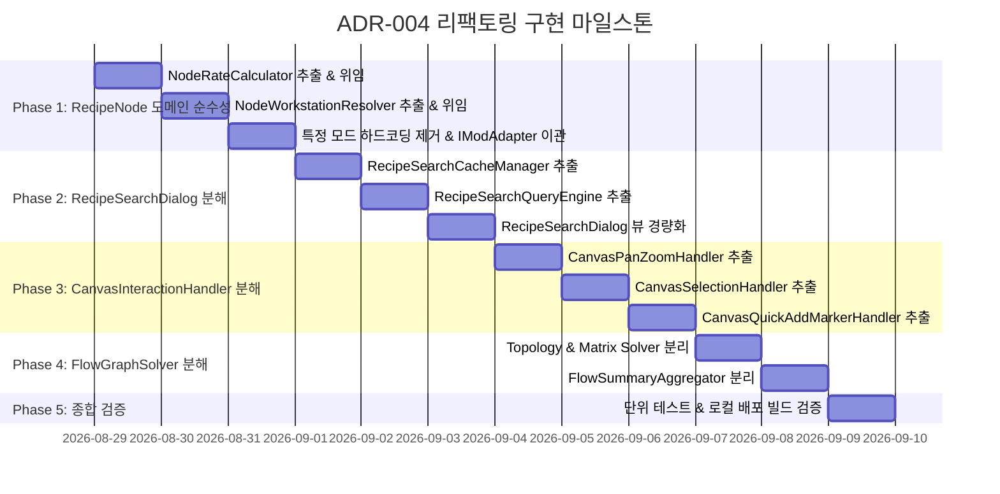

# ADR-004: 클린 아키텍처 정립 및 잔여 갓 클래스(God Class) 책임 분해
(Clean Architecture Realization & Monolithic God Class Decomposition)

- **문서 번호**: ADR-004
- **대상 버전**: v2.0.0-alpha.13+
- **상태**: IMPLEMENTED
- **결정/완료일**: 2026-08-29
- **핵심 주제**: 도메인 엔티티 순수성(Pure Domain Model) 회복, 단일 책임 원칙(SRP) 기반 대형 컴포넌트 4종 분해, SPI 계층 규격 엄격화

---

## 1. 개요 및 배경 (Motivation)

본 프로젝트는 대규모 모드팩(GTCEu Modern, Create, Thermal Series, Star Technology 등) 환경에서 복잡한 멀티블록 및 다중 유체/아이템 공정을 시각화하고 계산하는 기능을 지속적으로 확장해 왔습니다. 
그러나 기능이 추가되는 과정에서 일부 핵심 클래스들에 비즈니스 로직, 렌더링, 수학 연산, 모드별 예외 규칙이 누적되어 단일 파일이 1,000~1,400라인을 초과하는 **모놀리식 갓 클래스(God Class)**가 형성되었습니다.

특히 **[`RecipeNode.java`](file:///d:/dev-ssd/modding/minecraft/GregTechCalculatorBoard/src/main/java/com/gtceu/calcboard/api/model/RecipeNode.java)**의 경우 본 저장소의 **Rule 6 (도메인 모델의 순수성 유지 원칙)**을 위반하여 다음과 같은 심각한 아키텍처 결합이 발생하고 있습니다:
1. **도메인 엔티티 순수성 훼손**: `RecipeNode` 내부에 GTCEu 퓨전 티어 판정(`getFusionTier`), Create 네임스페이스 검사(`isCreateMachine`), 스타테크 헬릭스 문자열(`start_core:helix_`) 등의 모드 종속 하드코딩이 침투.
2. **다중 책임 중첩**: 데이터 모델 필드 관리뿐 아니라 I/O 슬롯별 유량 적분 연산(`calculateInputRates` 등 12개 연산 메서드)과 워크스테이션 검색 알고리즘(`getMultiblockWorkstation` 등 8개 검색 메서드)이 한 클래스에 공존.
3. **유지보수 및 테스트 격리 저하**: UI 모달(`RecipeSearchDialog`), 캔버스 제스처(`CanvasInteractionHandler`), 질량 보존 방정식 풀이기(`FlowGraphSolver`) 또한 여러 계층의 책임이 한곳에 얽혀 단위 테스트 격리가 어렵고 코드 가독성이 저하됨.

따라서 본 ADR-004는 `RecipeNode`를 포함한 4대 대형 클래스를 SRP에 맞게 완전히 분해하고, 클린 아키텍처 4계층 경계를 명확히 확립하는 것을 목표로 합니다.

---

## 2. 핵심 유저 및 엔지니어링 스토리 (User & Engineering Stories)

| 구분 | 주체 | 행동 및 요구사항 | 기대 효과 |
| :--- | :--- | :--- | :--- |
| **US-1** | 도메인 엔지니어 | `RecipeNode`를 순수 POJO/엔티티로 다루며, 모드별 특화 로직은 `IModAdapter` 인터페이스로만 접근 | 특정 모드(GTCEu, Create 등) 변경 시 도메인 엔티티 수정 없이 어댑터만 확장 가능 |
| **US-2** | UI/클라이언트 개발자 | `RecipeSearchDialog`에서 백그라운드 캐싱/인덱싱 엔진과 UI 렌더링 로직을 독립적으로 수정 및 디버깅 | 검색 모달 UI 변경 시 캐시 동기화 버그 원천 차단 |
| **US-3** | 캔버스 제스처 개발자 | 마우스 팬/줌, 마퀴 박스 선택, 퀵 추가 마커 처리를 독립된 핸들러 클래스에서 단위 검증 | 제스처 이벤트 충돌 방지 및 유지보수 용이성 확보 |
| **US-4** | 수학/솔버 연구자 | `FlowGraphSolver`의 그래프 위상 분석(Topology)과 질량 보존 선형대수 행렬 연산 모듈을 분리하여 확장 | 복잡한 순환 공정 솔버 알고리즘의 독립적 튜닝 및 최적화 가능 |

---

## 3. 세부 설계 및 결정 사항 (Architecture Decision)

```mermaid
graph TD
    subgraph Layer 1: Core Domain (순수 모델 및 수학)
        RN[RecipeNode - 순수 엔티티]
        NRC[NodeRateCalculator - 유량/수율 연산기]
        NWR[NodeWorkstationResolver - 머신/멀티블록 매처]
        FG[FlowGraph - 그래프 구조]
    end

    subgraph Layer 2: Solvers & Algorithms (알고리즘)
        FGTA[FlowGraphTopologyAnalyzer - 위상정렬/사이클 탐지]
        FBMS[FlowBalanceMatrixSolver - 선형대수 질량방정식 풀이기]
        FSA[FlowSummaryAggregator - 수지 요약/병목 집계기]
    end

    subgraph Layer 3: Mod Adapters & SPI (외부 연동)
        MAR[ModAdapterRegistry]
        GTMA[GTCEuModAdapter]
        CMA[CreateModAdapter]
    end

    subgraph Layer 4: Client GUI & Canvas (화면 계층)
        RSCM[RecipeSearchCacheManager - 전역 비동기 캐시]
        RSQE[RecipeSearchQueryEngine - 쿼리 파서/필터]
        RSD[RecipeSearchDialog - 렌더링 UI]
        CPZH[CanvasPanZoomHandler]
        CSH[CanvasSelectionHandler]
        CQMH[CanvasQuickAddMarkerHandler]
    end

    RN --> NRC
    RN --> NWR
    RN -.-> MAR
    FGTA --> FBMS
    FBMS --> FSA
    RSD --> RSCM
    RSD --> RSQE
```

### 3.1 `RecipeNode.java` 도메인 순수성 분해 (Domain Decomposition)

* **현재 상태**: 1,379줄 $\rightarrow$ **목표 상태**: **약 350~400줄** (순수 도메인 엔티티)
* **분해 상세**:

| 분리 대상 신규 클래스 / 위임 영역 | 패키지 경로 | 전담 역할 및 이전되는 메서드 |
| :--- | :--- | :--- |
| **`NodeRateCalculator`** | `com.gtceu.calcboard.api.model` | • I/O 유량 적분: `calculateInputRates`, `calculateOutputRates`<br>• 실효 유량: `calculateEffectiveInputRates`, `calculateEffectiveOutputRates`<br>• 슬롯/단일 기계 수율: `getInputSlotRate`, `getOutputSlotRate`, `getEffectiveOutputChance`, `calculateSingleMachineInputRate`, `calculateSingleMachineOutputRate` |
| **`NodeWorkstationResolver`** | `com.gtceu.calcboard.api.model` | • 전압별 워크스테이션 매칭: `getWorkstationForTier`, `getWorkstationForTierFromList`<br>• 단일/멀티블록 판정: `getMultiblockWorkstations`, `getMultiblockWorkstation`, `getSingleblockWorkstation`<br>• 기능 지원 질의: `canUseCoils`, `canUseMultiblockTraits`, `hasMultiblockOption` |
| **스팀 & 보일러 추상화 (`IModAdapter` 위임)** | `com.gtceu.calcboard.compat` | • **스팀 모드 전환 및 슬롯 동기화**: `supportsSteamMode()`, `syncSteamInputSlot(oldMode, newMode)`의 모든 어댑터 순회 로직을 `ModAdapterRegistry` 및 각 모드 어댑터(`GTCEuModAdapter`, `SysteamsModAdapter`)로 위임<br>• **보일러 특화 로직 격리**: `isLiquidBoilerRecipe()`, 보일러 스로틀(`BOILER_THROTTLE`) 연산 및 스팀 기계 전력(0 EU/t) 분기를 도메인 엔티티에서 제거하고 어댑터 물리 계산기로 이관<br>• `RecipeNode`는 단순 상태값(`SteamMode` 열거형 및 프로퍼티) 캡슐화만 유지 |
| **`GTFusionHelper` / 어댑터 위임** | `com.gtceu.calcboard.compat.gtceu.physics` | • 퓨전 티어 연산: `getFusionTier`, `getMinFusionVoltageTier`<br>• 스타테크 헬릭스 문자열 검사 로직 제거 및 `GTCEuModAdapter`로 이관 |
| **`ModCompatHelper` / 어댑터 위임** | `com.gtceu.calcboard.api.util` | • `isCreateMachine` 하드코딩 네임스페이스 검사를 `CreateModAdapter.isCreateMachine()`으로 완전 위임 |

---

### 3.2 `RecipeSearchDialog.java` 3계층 분해 (Search Modal Decomposition)

* **현재 상태**: 1,434줄 $\rightarrow$ **목표 상태**: **약 450줄** (순수 GUI View & Dialog)
* **분해 상세**:

| 분리 대상 신규 클래스 | 패키지 경로 | 전담 역할 |
| :--- | :--- | :--- |
| **`RecipeSearchCacheManager`** | `com.gtceu.calcboard.client.gui.search` | • 전역 `GLOBAL_RECIPES` 스레드 안전 캐시 관리<br>• 비동기 백그라운드 인덱싱 스케줄러 (`SEARCH_SCHEDULER`)<br>• 다단계 인덱싱 프로그레스 (`CachingProgress`) 관리 |
| **`RecipeSearchQueryEngine`** | `com.gtceu.calcboard.client.gui.search` | • 실시간 쿼리 디바운싱 및 비동기 필터링 (`CompletableFuture`)<br>• 카테고리 필터 칩 매칭, 즐겨찾기 필터 판정<br>• 와이어 타겟 컨텍스트(`ContextualWireTarget`) 우선순위 정렬 |
| **`RecipeSearchDialog`** | `com.gtceu.calcboard.client.gui.dialog` | • 모달 윈도우 배경, 헤더, 검색창(`EditBox`), 레시피 카드 렌더링<br>• 마우스 클릭/스크롤 및 가상 스크롤 뷰포트 관리 |

---

### 3.3 `CanvasInteractionHandler.java` 제스처 분해 (Canvas Gesture Decomposition)

* **현재 상태**: 1,223줄 $\rightarrow$ **목표 상태**: **약 380줄** (마우스/이벤트 조정자)
* **분해 상세**:

| 분리 대상 신규 클래스 | 패키지 경로 | 전담 역할 |
| :--- | :--- | :--- |
| **`CanvasPanZoomHandler`** | `com.gtceu.calcboard.client.gui.canvas` | • 마우스 드래그 캔버스 패닝(`panX`, `panY`) 연산<br>• 휠 스크롤 줌(`zoom`, LOD 임계점) 계산 및 경계 클램핑 |
| **`CanvasSelectionHandler`** | `com.gtceu.calcboard.client.gui.canvas` | • 마퀴(Marquee) 박스 드래그 다중 선택 영역 계산<br>• 단일/다중 노드 일괄 이동(`dragStartPositions`) 제어 |
| **`CanvasQuickAddMarkerHandler`** | `com.gtceu.calcboard.client.gui.canvas` | • 빈 공간 더블클릭 스마트 퀵 추가 마커 생성/소멸<br>• 와이어 포트 드래그 후 빈 공간 릴리즈 시 컨텍스트 마커 활성화 |

---

### 3.4 `FlowGraphSolver.java` 수지 솔버 분해 (Solver Algorithm Decomposition)

* **현재 상태**: 1,158줄 $\rightarrow$ **목표 상태**: **약 400줄** (솔버 Facade)
* **분해 상세**:

| 분리 대상 신규 클래스 | 패키지 경로 | 전담 역할 |
| :--- | :--- | :--- |
| **`FlowGraphTopologyAnalyzer`** | `com.gtceu.calcboard.api.solver` | • 그래프 위상 정렬(Topological Sort) 및 레벨링<br>• 순환 루프(Cycle) 탐지 및 피드백 엣지 식별<br>• 독립 서브그래프(Island) 분할 |
| **`FlowBalanceMatrixSolver`** | `com.gtceu.calcboard.api.solver` | • 질량 보존 선형 연립방정식 행렬 구성 ($A \cdot x = b$)<br>• Apache Math LU / QR 분해 기반 희소 행렬 연산<br>• 잉여/결손 물질 비례 배분(Auto-Ratio) 수학 해 산출 |
| **`FlowSummaryAggregator`** | `com.gtceu.calcboard.api.solver` | • 전역 `BalanceSummary` 집계 (총 전력, 틱당 자원 흐름)<br>• 병목(Bottleneck) 노드 및 미가동 노드 진단 |

---

## 4. 단계별 구현 로드맵 (Phased Implementation Plan)



---

## 5. 결과 및 검증 계획 (Consequences & Verification)

1. **도메인 순수성 회귀 검증**:
   - `CalculationTest`, `DomainModelEncapsulationTest`, `NodeFlipTest`를 통해 `RecipeNode`의 분해 후에도 모든 수학적 계산 및 직렬화가 100% 동일하게 유지되는지 검증.
2. **헤드리스 서버 격리 검증 (`HeadlessServerIsolationTest`)**:
   - `RecipeNode`에서 클라이언트/아이템 레지스트리 조작이 완전히 제거되어 서버 단독 환경에서 NoClassDefFoundError가 전혀 발생하지 않는지 검증.
3. **검색 및 UI 상호작용 검증 (`RecipeSearchEngineTest`)**:
   - 비동기 캐싱 및 쿼리 디바운싱 분해 후 레시피 검색 결과 정합성 검증.
4. **빌드 및 배포 검증**:
   - `.\gradlew.bat test` (전체 361+개 테스트 100% PASS)
   - `.\gradlew.bat cleanDeploy` (PrismLauncher 인스턴스 정상 배포)
