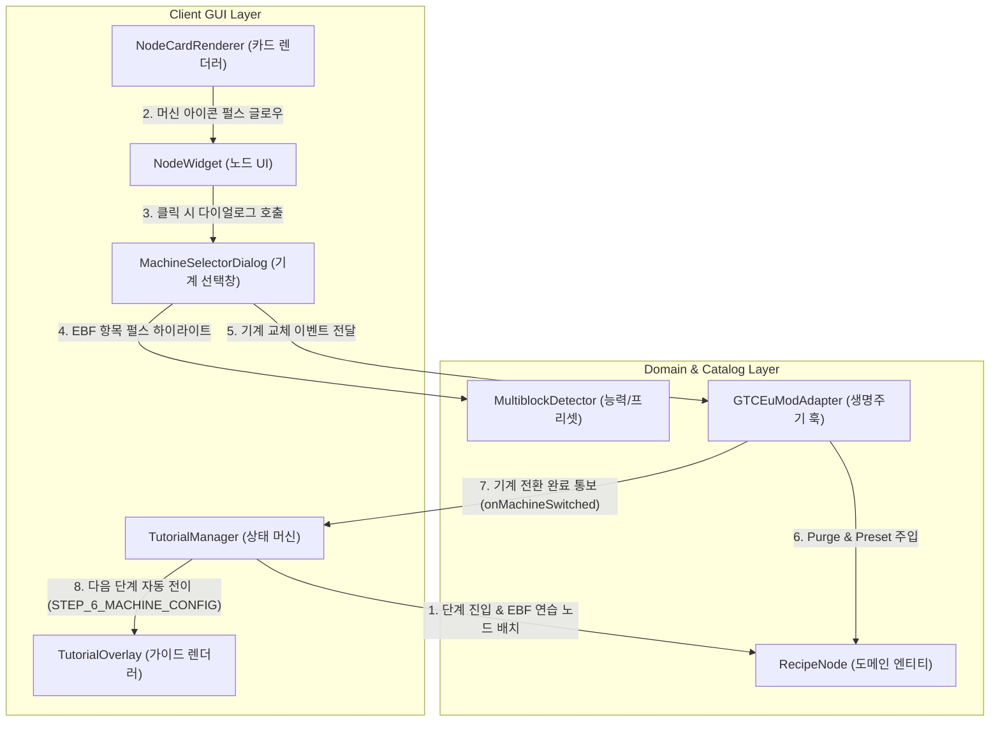

# ADR-005: 기계 및 멀티블록 선택(Machine Selector) 튜토리얼 통합 사양
(Machine & Multiblock Selector Onboarding Tutorial Integration)

- **문서 번호**: ADR-005
- **대상 버전**: v2.1.0-alpha.3
- **상태**: IMPLEMENTED
- **결정/완료일**: 2026-09-01

---

## 1. 개요 및 배경 (Motivation)

본 모드(`GregTechCalculatorBoard`)는 단일블록 기계(ULV~OpV)와 대형 멀티블록 기계(EBF, Large Chemical Reactor, Large Plasma Turbine 등) 간의 전환을 지원하는 기계 선택 다이얼로그(`MachineSelectorDialog`)와 하드웨어 특성 뱃지 시각화(`🏛 Multiblock`, `♨ Coil`, `⚡ Par Hatch` 등)를 갖추고 있습니다.

그러나 기존 9단계 대화형 튜토리얼(`TutorialManager`, `TutorialStep`)에는 기계 교체 UX와 능력 뱃지를 직접 실습할 수 있는 온보딩 단계가 누락되어 있었습니다. 이에 기본 튜토리얼 플로우에 전용 실습 스텝을 편입하기로 결정하였습니다.

---

## 2. 세부 설계 및 결정 사항 (Architecture Decision)

### 2.1 주요 변경 항목

1. **`TutorialStep` 11단계 열거형 체계 확장**:
   - `STEP_5_MACHINE_SELECTOR(5, ...)`를 신규 삽입하고 기존 5단계 이후 스텝 번호를 6~11로 순차 시프트 및 리밸런싱.
   - 기본 모드(BASIC) 완료점을 `STEP_8_COMPOUND_MODULE`, 심화 모드(ADVANCED) 범위를 `STEP_9_SHARED_MACHINE` ~ `STEP_10_BOM_INSPECTION`으로 재매핑.

2. **`TutorialManager` 대화형 상태 머신 훅 연동**:
   - 5단계 진입 시 `setupStep5SelectorExercise`를 통해 단일블록 EBF 연습 노드(`Iron Ingot to Steel`, LV) 자동 배치 및 `selectorNodeId` 추적.
   - `onMachineSwitched(RecipeNode, ResourceLocation)` 훅을 통해 플레이어가 EBF 멀티블록 선택 시 즉시 6단계(`STEP_6_MACHINE_CONFIG`)로 자동 전이.
   - `isMachineIconGlowing` 및 `isMachineSelectorRowGlowing` 판정 헬퍼 제공.

3. **UI 렌더링 및 하이라이트 연동**:
   - `NodeCardRenderer`: `isMachineIconGlowing` 대상 노드의 머신 아이콘에 펄스 테두리(`getGlowBorderColor`) 및 하이라이트 렌더링.
   - `MachineSelectorDialog`: `isMachineSelectorRowGlowing` 대상 항목에 포커스 펄스 테두리 렌더링.
   - `BoardScreen`: `switchMachineWorkstation` 실행 시 `TutorialManager.onMachineSwitched` 훅 호출.

4. **다국어(i18n) 리소스 완전 동기화**:
   - `ko_kr.json`, `en_us.json`, `zh_cn.json`에 `step5_selector_title`, `step5_selector_desc` 추가 및 타이틀 번호 접두어(6~10) 동기화.

---

## 3. 결과 및 파급 효과 (Consequences)

### 3.1 긍정적 효과
- **온보딩 UX 체득률 극대화**: 신규 사용자가 머신 아이콘 클릭을 통한 단일블록 $\leftrightarrow$ 멀티블록 전환과 하드웨어 능력 뱃지 인지 과정을 튜토리얼 내에서 자연스럽게 체득.
- **도메인 순수성 및 SPI 원칙 준수 (Rule 6)**: `RecipeNode`에 모드별 특화 규칙을 하드코딩하지 않고, `ModAdapterRegistry` 및 `TutorialManager` 이벤트 훅을 통해 상태 전이를 처리하여 계층 간 결합도 최소화.

### 3.2 검증 결과
- `TutorialStepTest` (11개 스텝 순서, i18n 키 완전성, 격리 라이프사이클, 5단계 EBF 전환 자동 전이) 및 전체 단위 테스트(`.\gradlew.bat test`) 100% 통과.
