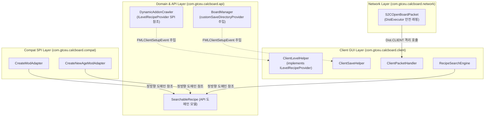

# ADR-009: 헤드리스 계층 격리 및 데디케이티드 서버 안전성 강화 명세
(Headless Layer Isolation & Dedicated Server Safety Enhancement)

- **문서 번호**: ADR-009
- **대상 버전**: v2.1.0-alpha.3
- **상태**: IMPLEMENTED
- **결정/완료일**: 2026-09-01

---

## 1. 개요 및 배경 (Motivation)

아키텍처 감사 및 정적 의존성 분석 결과, 순수 도메인/API 계층 및 Compat 계층에서 클라이언트 전용 클래스를 직접 참조하거나 하위 패키지 모델을 역참조하는 구조적 결함이 식별되었습니다:

1. **API 및 카탈로그 계층의 클라이언트 직접 참조**:
   `com.gtceu.calcboard.api.catalog` (`DynamicAddonCrawler`, `MachineAddonCatalog`) 및 `api.storage` (`BoardManager`)가 `com.gtceu.calcboard.client.ClientLevelHelper` 및 `ClientSaveHelper`를 정규 클래스명(FQCN)으로 직접 참조하고 있었습니다. 데디케이티드 서버(Dedicated Server) 환경에서 바이트코드 검증(Verification) 시 `net.minecraft.client.Minecraft` 로딩으로 인한 잠재적 `NoClassDefFoundError` 위험이 존재했습니다.
2. **Compat 계층의 Client GUI 하위 패키지 역방향 의존**:
   `compat.create` 및 `compat.createnewage`가 `com.gtceu.calcboard.client.gui.search.RecipeSearchEngine.SearchableRecipe` 레코드를 import하여 `compat -> client` 방향의 아키텍처 계층 역전이 발생하고 있었습니다.
3. **S2C 패킷의 `DistExecutor` 래핑 누락**:
   `S2COpenBoardPacket`이 유일하게 `DistExecutor.unsafeRunWhenOn(Dist.CLIENT, ...)` 래핑 없이 `ClientPacketHandler`를 직접 호출하고 있었습니다.

---

## 2. 세부 설계 및 결정 사항 (Architecture Decision)

### 2.1 주요 변경 항목

1. **`SearchableRecipe`의 순수 도메인 모델 승격**:
   - `com.gtceu.calcboard.client.gui.search.RecipeSearchEngine.SearchableRecipe` 내부 중첩 정의를 제거하고 `com.gtceu.calcboard.api.model.SearchableRecipe` 독립 public record로 승격.
   - 모든 Compat 어댑터(`CreateModAdapter`, `CreateRecipeHandler`, `CreateNewAgeModAdapter`, `CreateNewAgeRecipeHandler`) 및 Integration(`IRecipeViewerAdapter`, `Emi*`, `Jei*`, `Vanilla*`)의 import 경로를 정규화하여 계층 역전 0건 달성.

2. **`ILevelRecipeProvider` SPI 도입을 통한 카탈로그 클라이언트 분리**:
   - `com.gtceu.calcboard.api.catalog.ILevelRecipeProvider` SPI 인터페이스를 정의.
   - `DynamicAddonCrawler`와 `MachineAddonCatalog`는 주입된 SPI 프로바이더를 통해서만 레벨 레시피 및 언어 환경에 접근하며, 미주입 시 헤드리스 기본 동작(영문 locale, 빈 레시피 컬렉션 등)을 안전하게 수행.
   - `ClientLevelHelper`가 `ILevelRecipeProvider`를 구현하고 `ClientModBusEvents.onClientSetup` 시점에 정식 등록.

3. **`BoardManager` 세이브 경로 프로바이더 SPI 주입**:
   - `BoardManager.setCustomSaveDirectoryProvider(Function<File, File>)` 주입 인터페이스를 도입하여 `ClientSaveHelper` FQCN 직접 참조를 제거.
   - 클라이언트 셋업 시 `ClientSaveHelper::getClientSaveFile`이 주입되어 단일플레이어/멀티플레이어 경로를 동적으로 분기하며, 데디케이티드 서버/헤드리스 환경에서는 `gtcalcboard/calcboard_save.nbt` 기본 파일로 안전하게 fallback.

4. **`S2COpenBoardPacket`의 `DistExecutor` 무결성 확보**:
   - `ctx.enqueueWork(() -> DistExecutor.unsafeRunWhenOn(Dist.CLIENT, () -> () -> ClientPacketHandler.handleOpenBoard(this)))` 적용.

---

## 3. 결과 및 파급 효과 (Consequences & Verification)

- **클라이언트 전용 클래스 참조 전수 제거**:
  - API, Model, Storage, Compat, Network 계층에서 `com.gtceu.calcboard.client.*` 참조 0건 달성.
- **단위 테스트 및 회귀 검증 완료**:
  - 신규 헤드리스 격리 테스트 [`HeadlessLayerIsolationTest.java`](../../src/test/java/com/gtceu/calcboard/api/HeadlessLayerIsolationTest.java)를 포함하여 전체 테스트 스위트 100% 통과 (`BUILD SUCCESSFUL`).
  - 데디케이티드 서버 환경에서 바이트코드 검증 및 런타임 클래스로딩 안전성 확보.
