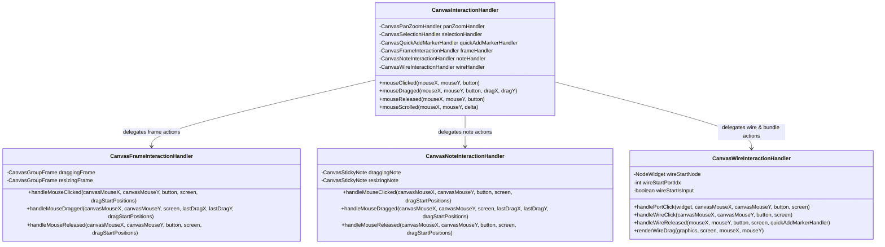
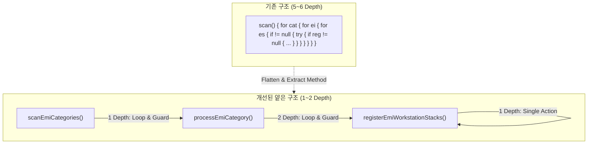

# ADR-011: 제어 흐름 평탄화 및 자기 서술적 클린 코드 정비 명세
*(Control Flow Flattening & Self-Descriptive Code Refactoring)*

| 메타데이터 항목 | 내용 |
| :--- | :--- |
| **문서 번호** | ADR-011 (구 RFC-011) |
| **상태** | 🟢 IMPLEMENTED |
| **대상 버전** | v2.1.0-alpha.3 |
| **결정 및 완료일자** | 2026-09-01 |
| **준수 원칙** | Architecture Pillar 4 (단일 책임, 얕은 메서드 & 자기 서술적 코드), Pillar 6 (모듈 세분화) |

---

## 1. 배경 및 맥락 (Context)

### 1.1 현황 및 식별된 안티패턴
1. **3단계(Depth) 초과 깊은 중첩 제어문**:
   `CategoryCapabilityMatrix`의 EMI/JEI 매트릭스 스캐너, `DynamicAddonCrawler`의 아이템 추출기, `MultiblockStructureCatalog` 및 `MultiblockDetector` 등에서 `for -> for -> for -> if -> try -> if` 형태로 최대 **5~7단계의 깊은 중첩**이 발생하여 가독성과 유지보수성이 저하되었습니다.
2. **코드를 단순 재진술하는 순서 나열 및 섹션 주석 방치**:
   코드가 서술적인 클래스/메서드/변수명으로 스스로 의도를 드러내야 함에도 불구하고 `// 1. Scan...`, `// 2. Process...`, `// NBT Serialization`, `// Getters and Setters` 등 단순 순서 나열/섹션 주석이 광범위하게 잔존하였습니다.
3. **거대 클래스(God Class)에 집중된 상호작용 로직**:
   `CanvasInteractionHandler.java` (1,678줄)에 노드 조작뿐만 아니라 그룹 프레임 조작, 스티키 노트 조작, 와이어 연결/번들/분기 조작이 단일 클래스에 밀집되어 단일 책임 원칙(SRP)을 위반하였습니다.

---

## 2. 의사결정 (Decision)

1. **모든 제어 흐름의 중첩 깊이 1~2단계 평탄화 (Control Flow Flattening)**:
   - 조기 반환(Early Return / Guard Clauses)을 전면 적용하여 루프 및 조건문 중첩을 평탄화하였습니다.
   - 복잡한 분기나 하위 작업은 5~20줄 내외의 명확한 단일 책임을 가진 얕은(Shallow) 헬퍼 메서드로 분리하였습니다.
2. **자기 서술적 코드(Self-Descriptive Code) 정립 및 나열 주석 전면 제거**:
   - 코드를 그대로 재진술하거나 단순 동작 순서를 나열하는 주석(`// 1.`, `// 2.` 등)을 100% 제거하였습니다.
   - 동작 의도와 제어 흐름이 메서드명(`scanEmiCategories`, `processGTRecipeType`, `scanAdapterMultiblocks`, `determineAllowedAbilities` 등) 자체로 명확히 드러나도록 재설계하였습니다.
3. **캔버스 상호작용 거대 클래스 세분화 (Interaction Handler Decomposition)**:
   - `CanvasInteractionHandler`의 책임을 3개의 전담 서브 핸들러로 완전히 분리하여 위임 구조를 확립하였습니다:
     - `CanvasFrameInteractionHandler`: 그룹 프레임 클릭, 드래그, 리사이즈, 컬러 변경, 축소, 자동 맞춤, 편집 다이얼로그 전담.
     - `CanvasNoteInteractionHandler`: 스티키 노트 클릭, 헤더 드래그, 바디 리사이즈, 컬러 변경, 인라인 편집 전담.
     - `CanvasWireInteractionHandler`: 와이어 드래그, 단일/번들 결선, 정션 자동 생성, 포트 분기, 더블클릭 정션 삽입, 와이어 절단 전담.
4. **리플렉션 및 캐시 헬퍼의 얕은 분리**:
   - `DynamicAddonCrawler`, `MultiblockDetector`, `MultiblockStructureCatalog` 내부의 리플렉션/캐시 로직을 컴팩트한 단일 책임 메서드로 분할하였습니다.

---

## 3. 리팩토링 아키텍처 다이어그램

### 3.1 상호작용 핸들러 위임 및 분해 구조

### 3.2 얕은 메서드(Shallow Methods) 리팩토링 흐름

---

## 4. 결과 및 영향 (Consequences)

### 4.1 긍정적 효과 (Positive)
- **가독성 및 유지보수성 비약적 향상**: 복잡한 5~7단계 중첩 루프가 조기 반환과 얕은 헬퍼 메서드로 분리되어 코드 파악 및 버그 수정이 용이해졌습니다.
- **코드 자체의 설명력 확보**: 불필요한 주석 없이도 메서드/클래스명만으로 시스템의 동작 흐름이 명확히 파악되는 자기 서술적 코드가 완성되었습니다.
- **단일 책임 원칙(SRP) 완벽 준수**: `CanvasInteractionHandler`가 1,678줄에서 430줄의 깔끔한 위임자(Facade/Coordinator)로 경량화되었으며, 프레임/노트/와이어 로직이 각각 전담 서브 핸들러로 격리되었습니다.
- **빌드 및 테스트 100% 무결성 유지**: 전체 단위 테스트 및 클린 빌드가 성공적으로 통과되었습니다.

### 4.2 주의사항 및 권고사항 (Recommendations)
- 신규 상호작용 기능(예: 노드 그룹핑 단축키, 신규 와이어 렌더링 스타일) 추가 시 `CanvasInteractionHandler` 본체에 코드를 누적하지 않고 반드시 해당하는 서브 핸들러(`CanvasFrameInteractionHandler`, `CanvasWireInteractionHandler` 등)에 얕은 메서드로 추가해야 합니다.
- 새로운 스캐너나 파서 작성 시 3단계 이상 중첩을 방지하고 항상 조기 반환 가드를 우선 적용해야 합니다.
