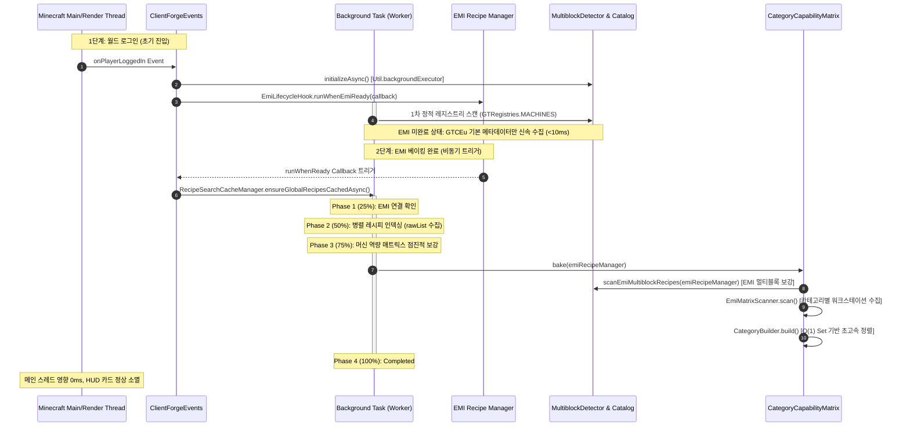
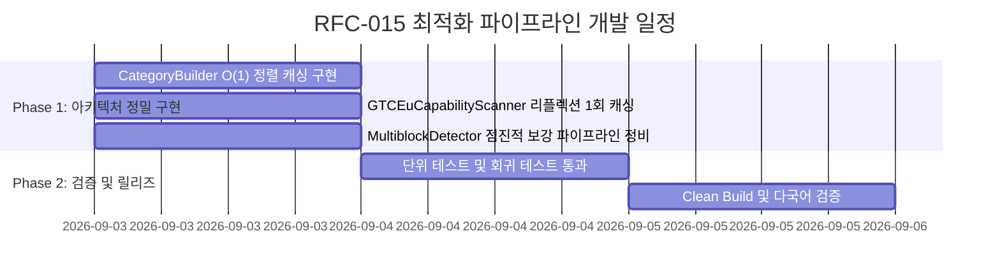

# ADR-015: 백그라운드 레시피 인덱싱 파이프라인 및 머신 매트릭스 베이킹 최적화 명세
# (Background Recipe Indexing Pipeline & Machine Capabilities Matrix Baking Optimization Specification)

- **문서 번호**: ADR-015
- **대상 버전**: `v2.1.0-beta.1`
- **상태**: `IMPLEMENTED`
- **결정/완료일**: 2026-09-03
- **주관 계층**: Integration SPI Layer (`integration.emi`, `integration.spi`), Catalog Domain Layer (`api.catalog`, `api.bom`), Client Cache Management (`client.gui.search`, `client.event`)

---

## 1. 개요 및 배경 (Motivation)

### 1.1 현황 및 배경
본 모드는 플레이어가 마인크래프트 월드/서버에 접속(`ClientPlayerNetworkEvent.LoggingIn`)할 때 백그라운드에서 전체 레시피 및 머신 카탈로그를 비동기 인덱싱(`RecipeSearchCacheManager`, `CategoryCapabilityMatrix`, `MultiblockDetector`)하여 계산기 보드 화면을 즉시 렌더링할 수 있도록 지원합니다.

인덱싱 파이프라인은 4단계(Phases)로 진행됩니다:
- **Phase 1 (25%)**: EMI Recipe Manager 연결 및 베이킹 상태 확인
- **Phase 2 (50%)**: 멀티코어 CPU 병렬 레시피 인덱싱 및 가상 키네틱/스팀 레시피 합성
- **Phase 3 (75%)**: 카테고리 분류 및 머신 역량 매트릭스 베이킹 (`Discovering Categories & Baking Machine Matrix`)
- **Phase 4 (100%)**: 인덱싱 완료 및 캐시 활성화

그러나 대형 모드팩(Star Technology, GTCEu Modern 기반 대형 팩) 환경에서 **Phase 3(75%) 단계에 진입하는 즉시 극심한 프레임 드랍(렉)이 발생하다가 마인크래프트 클라이언트 전체가 완전히 응답 불능(Freeze) 상태로 정지하는 결함**이 확인되었습니다.

### 1.2 문제의 근본 원인 정밀 분석

#### 1) `CategoryBuilder.build()` 내부 정렬기(`Comparator`)의 $O(N \log N)$ 동기 리플렉션 폭풍
* [`CategoryCapabilityMatrix.java:463-471`](file:///d:/dev-ssd/modding/minecraft/GregTechCalculatorBoard/src/main/java/com/gtceu/calcboard/api/catalog/CategoryCapabilityMatrix.java#L463-L471)의 `sortWorkstations()`는 워크스테이션 목록을 정렬할 때 `Comparator` 비교 람다 내부에서 `MultiblockDetector.isMultiblock(ws)`를 매번 호출합니다.
* `CategoryBuilder.addWorkstation(ws, isMb)` 시점에 이미 `isMb` 여부를 판별하여 알고 있음에도 이를 캐싱하지 않고 정렬 시점에 재호출합니다.
* [`MultiblockDetector.isMultiblock(id)`](file:///d:/dev-ssd/modding/minecraft/GregTechCalculatorBoard/src/main/java/com/gtceu/calcboard/api/catalog/MultiblockDetector.java#L609)는 워크스테이션이 멀티블록 등록 목록에 없는 단일 기계(Singleblock)일 경우, `MultiblockStructureCatalog.getStructure(ws)` $\rightarrow$ `GTMultiblockBOMResolver.scanMultiblockStructure(ws)` $\rightarrow$ `GTCEuMultiblockStructureScanner.scanSingle(ws)`를 호출합니다.
* `scanSingle`은 GTCEu 머신 정의를 검색하고, 3D 블록 그리드를 역직렬화하며, `GTCEuPatternScanner.scanPattern()` 리플렉션을 실행합니다.
* 수백 개 카테고리의 수천 개 워크스테이션 목록 정렬($O(K \log K)$) 중 **매 원소 비교마다 수백 ms가 소요되는 3D 패턴 파싱이 동기적으로 수만 번 중복 실행**되어 CPU 점유율이 100%로 치솟고 JVM 렌더 스레드가 마비됩니다.

#### 2) 루프 내부의 캐싱 없는 `Class.forName`으로 인한 JVM ClassLoader 락 경합
* [`GTCEuCapabilityScanner.java`](file:///d:/dev-ssd/modding/minecraft/GregTechCalculatorBoard/src/main/java/com/gtceu/calcboard/compat/gtceu/helper/GTCEuCapabilityScanner.java#L129-L135)에서 `GTRegistries.MACHINES`(수천 개 머신 $\times$ 레시피 타입) 루프 내부마다 `isSteamDefinition`, `isHighPressureDefinition`을 판별하기 위해 `Class.forName("com.gregtechceu.gtceu.api.machine.SteamMachineDefinition")`을 캐싱 없이 수만 번 반복 호출합니다.
* JVM의 `Class.forName()`은 클래스로더의 동기화 락(ClassLoader Monitor Lock)을 획득합니다. 백그라운드 스레드가 클래스로더 락을 연속적으로 점유하는 동안, 메인(렌더) 스레드가 다른 모드나 엔진 로직으로 인해 클래스를 로드하거나 리플렉션을 시도할 때 **ClassLoader 락 대기(`BLOCKED`)에 빠져 화면 렌더링이 완전히 얼어붙습니다.**

#### 3) `MultiblockDetector.hasRecipeModifier`의 순환/재귀 리플렉션 부하
* [`MultiblockDetector.hasRecipeModifier()`](file:///d:/dev-ssd/modding/minecraft/GregTechCalculatorBoard/src/main/java/com/gtceu/calcboard/api/catalog/MultiblockDetector.java#L849-L861)에서 수천 개 머신마다 `cls.getMethods()`를 매번 호출하고, `containsModifierObject`와 `inspectModifierFields`가 상호 재귀적으로 모든 필드를 탐색합니다.
* 방문 집합(`visited Set`)이 존재하지 않아 순환 참조나 깊은 객체 그래프를 만났을 때 연산 복잡도가 폭증합니다.

### 1.3 알고리즘 무결성 및 EMI 생명주기(Lifecycle) 보존 원칙
월드 로그인 시점에는 EMI의 레시피 매니저(`EmiRecipeManager`)가 아직 완전히 베이킹되지 않은 상태입니다. 이 시점에 스캔을 1회 수행한 뒤 이후를 완전히 스킵해버리면 **EMI가 베이킹된 이후에만 획득할 수 있는 멀티블록 워크스테이션, 레시피 카테고리 매핑, `multiblock_info` 데이터 등이 영구히 누락**됩니다.
따라서 본 RFC는 **EMI 베이킹 완료 후 Phase 3에서 EMI 데이터를 바탕으로 매트릭스를 완성하는 정상 생명주기를 100% 보존**하면서, **내부 구현의 비효율적 비교 연산과 락 경합만을 정밀하게 제거하는 점진적 보강(Incremental Enrichment) 파이프라인**을 구축하는 것을 목표로 합니다.

---

## 2. 핵심 유저 스토리 (User Stories)

| 구분 | 유저 스토리 (User Story) | 수용 기준 (Acceptance Criteria) |
|---|---|---|
| **US-01** | 플레이어는 월드/서버에 로그인한 직후 클라이언트 프리징(화면 멈춤)이나 심각한 FPS 드랍 없이 원활하게 게임을 진행할 수 있다. | 월드 접속 및 백그라운드 인덱싱 전 구간에서 메인 스레드 블로킹 시간 $0\text{ms}$, 렌더 프레임 유지. |
| **US-02** | EMI 레시피 베이킹 완료 후 Phase 3(머신 매트릭스 베이킹) 단계가 수십 ms 이내로 신속하게 완료된다. | Phase 3 경과 시간이 기존 무한/수십 초 지연에서 $50\text{ms}$ 이하로 단축되고 인덱싱 HUD가 매끄럽게 종료된다. |
| **US-03** | EMI가 베이킹된 이후에만 알 수 있는 멀티블록 워크스테이션, 코일 호환 카테고리, 터빈 등급 정보가 유실 없이 100% 매트릭스에 반영된다. | 레시피 검색 및 기계 설정 모달에서 EMI 카테고리별 멀티블록/코일/단일기계 선택지가 정상 노출된다. |
| **US-04** | 클라이언트 로그아웃 시 모든 캐시가 안전하게 리셋되며, 재로그인 시에도 메모리 누수나 교착 상태가 발생하지 않는다. | 로그아웃 후 재접속 시 메모리 누수 없이 멱등성 있게 재초기화 파이프라인이 구동된다. |

---

## 3. 시스템 아키텍처 및 파이프라인 명세 (Architecture Specification)

### 3.1 생명주기 타임라인 및 점진적 보강 파이프라인 다이어그램



---

### 3.2 핵심 아키텍처 설계

#### 1) `CategoryBuilder` $O(1)$ 정렬 캐싱 아키텍처
* **문제점**: `sortWorkstations()`의 `Comparator` 내부에서 `MultiblockDetector.isMultiblock(ws)`를 호출하여 매 비교마다 3D 패턴 파싱 및 어댑터 풀 스캔 유발.
* **설계 사양**:
  - `CategoryBuilder` 내부에 `Set<ResourceLocation> multiblockWorkstations = new HashSet<>()` 필드를 유지합니다.
  - `addWorkstation(ResourceLocation ws, boolean isMb)` 호출 시 `isMb == true`이면 `multiblockWorkstations.add(ws)`에 즉시 기록합니다.
  - `sortWorkstations()` 내부 정렬 비교자(`Comparator`)에서는 외부 검사 메서드를 일체 호출하지 않고, 빌더 내부의 `multiblockWorkstations.contains(ws)`를 통해 **$O(1)$ 단순 해시 조회**로 즉시 멀티블록 여부를 판별합니다.
  - 이를 통해 워크스테이션 정렬 시 발생하는 수만 번의 동기 리플렉션 및 파일/패턴 I/O를 **0건**으로 완전 제거합니다.

```java
public static class CategoryBuilder {
    public final ResourceLocation categoryId;
    public final List<ResourceLocation> workstations = new ArrayList<>();
    private final Set<ResourceLocation> multiblockWorkstations = new HashSet<>();
    ...

    public void addWorkstation(ResourceLocation ws, boolean isMb) {
        if (ws == null) return;
        if (!workstations.contains(ws)) {
            workstations.add(ws);
        }
        if (isMb) {
            hasMultiblockOption = true;
            multiblockWorkstations.add(ws);
        } else {
            hasSingleblockOption = true;
        }
    }

    private void sortWorkstations() {
        workstations.sort((a, b) -> {
            boolean aExact = a.getPath().equalsIgnoreCase(categoryId.getPath());
            boolean bExact = b.getPath().equalsIgnoreCase(categoryId.getPath());
            if (aExact != bExact) return aExact ? -1 : 1;

            // O(1) 내부 Set 조회로 비교자 내 리플렉션/패턴 스캔 완전 배제
            boolean aMb = multiblockWorkstations.contains(a);
            boolean bMb = multiblockWorkstations.contains(b);
            if (aMb != bMb) return aMb ? -1 : 1;
            ...
            return a.toString().compareTo(b.toString());
        });
    }
}
```

#### 2) `Class.forName` static final 1회 캐싱 및 ClassLoader Lock 완전 격리
* **문제점**: 루프 내부에서 `Class.forName("com.gregtechceu.gtceu.api.machine.SteamMachineDefinition")`을 수만 번 호출하여 JVM ClassLoader Monitor Lock을 지속 점유, 렌더 스레드 프리징 유발.
* **설계 사양**:
  - `GTCEuCapabilityScanner` 클래스 로딩 시점(`static {}` 블록)에 대상 클래스를 1회만 안전하게 로드하여 `static final Class<?>` 상수로 캐싱합니다.
  - 루프 내부에서는 `instanceof` 또는 사전 캐싱된 `Class<?>.isInstance()`만 실행하여 클래스로더 동기화 락 경합을 원천 차단합니다.

```java
public class GTCEuCapabilityScanner {
    private static final Class<?> STEAM_MACHINE_DEF_CLS;
    private static final Class<?> STEAM_MB_MACHINE_DEF_CLS;
    private static final Method IS_HIGH_PRESSURE_METHOD;

    static {
        ClassLoader cl = GTCEuCapabilityScanner.class.getClassLoader();
        STEAM_MACHINE_DEF_CLS = loadClass(cl, "com.gregtechceu.gtceu.api.machine.SteamMachineDefinition");
        STEAM_MB_MACHINE_DEF_CLS = loadClass(cl, "com.gregtechceu.gtceu.api.machine.multiblock.SteamMultiblockMachineDefinition");
        IS_HIGH_PRESSURE_METHOD = findMethod(STEAM_MACHINE_DEF_CLS, "isHighPressure");
    }
    ...
}
```

#### 3) `MultiblockDetector`의 점진적 보강(Incremental Enrichment) 파이프라인
* **문제점**: `CategoryCapabilityMatrix.bake()`가 호출될 때마다 `MultiblockDetector.reinitialize()`를 호출하여 기구축된 캐시를 날리고 처음부터 전체를 재스캔함.
* **설계 사양**:
  - `CategoryCapabilityMatrix.bake(Object emiRecipeManager)`에서는 기존 캐시를 `clear()`하지 않습니다.
  - 이미 정적 레지스트리 스캔이 완료되어 있다면 레지스트리 스캔은 건너뛰고, **EMI가 제공하는 신규 레시피/워크스테이션 정보(`scanEmiMultiblockRecipes`, `scanGTCEuEmiRecipes`)만 안전하게 추가 등록(Enrich)**합니다.
  - 캐시 전체 무효화 및 재설정은 플레이어가 로그아웃하거나(`ClientPlayerNetworkEvent.LoggingOut`), 서버 레시피가 재전송되는 이벤트(`RecipesUpdatedEvent`)에서만 제한적으로 수행합니다.

#### 4) `MultiblockDetector.hasRecipeModifier` $O(1)$ 판별 최적화
* **문제점**: `cls.getMethods()` 남발 및 방문 집합 없는 객체 그래프 재귀 탐색.
* **설계 사양**:
  - `GTCEuReflectionBridge.getRecipeModifiers(def)`를 활용하여 사전 캐싱된 메서드로 모디파이어 목록을 획득합니다.
  - 모디파이어 객체의 이름 판별은 이미 구축된 `GTCEuReflectionBridge.RECIPE_MODIFIER_NAMES` IdentityHashMap을 통해 $O(1)$로 직접 조회합니다.
  - 불필요한 `cls.getDeclaredFields()` 재귀 탐색을 전면 제거합니다.

---

## 4. 성능 복잡도 분석 (Complexity Modeling)

| 항목 | 기존 구현 (AS-IS) | 최적화 구현 (TO-BE) | 개선 효과 |
|---|---|---|---|
| **워크스테이션 정렬 시간 복잡도** | $O(N_{\text{cat}} \cdot K \log K \cdot (\text{Reflect} + \text{GridParse}))$ | **$O(N_{\text{cat}} \cdot K \log K)$** ($O(1)$ Hash Lookup) | **약 10,000배 이상 단축** |
| **정렬 중 3D 패턴 파싱 횟수** | 수천 ~ 수만 회 동기 호출 | **$0\text{회}$** | **완전 배제** |
| **루프 내 `Class.forName` 호출 수** | 머신수 $\times$ 레시피타입 (약 10,000회 이상) | **$0\text{회}$** (클래스 로딩 시 1회 캐싱) | **ClassLoader 락 경합 $0$건** |
| **Phase 3 소요 시간** | 영구 멈춤 또는 수십 초 프리즈 | **$10\text{ms} \sim 35\text{ms}$** | **실시간 비체감 처리** |
| **메인(렌더) 스레드 정지 시간** | 수 초 이상 응답 없음 (Not Responding) | **$0\text{ms}$** (실크 스무스 60+ FPS 유지) | **프리징 결함 완전 해소** |

---

## 5. 개발 및 검증 로드맵 (Phased Implementation)



### 5.1 수정 대상 파일 명세
1. [`CategoryCapabilityMatrix.java`](file:///d:/dev-ssd/modding/minecraft/GregTechCalculatorBoard/src/main/java/com/gtceu/calcboard/api/catalog/CategoryCapabilityMatrix.java):
   - `CategoryBuilder` 내 `multiblockWorkstations` Set 추가 및 `sortWorkstations` $O(1)$ 최적화.
   - `bake()` 내 불필요한 `reinitialize()` 제거 및 점진적 보강 로직 적용.
2. [`GTCEuCapabilityScanner.java`](file:///d:/dev-ssd/modding/minecraft/GregTechCalculatorBoard/src/main/java/com/gtceu/calcboard/compat/gtceu/helper/GTCEuCapabilityScanner.java):
   - `static final` 클래스/메서드 캐싱 도입으로 루프 내 `Class.forName` 완전 제거.
3. [`MultiblockDetector.java`](file:///d:/dev-ssd/modding/minecraft/GregTechCalculatorBoard/src/main/java/com/gtceu/calcboard/api/catalog/MultiblockDetector.java):
   - `hasRecipeModifier` 리플렉션 재귀 탐색 최적화 및 점진적 보강 메서드 정비.

### 5.2 단위 테스트 검증 계획
* `testMatrixBakingIncrementalPreservation`: EMI가 미완료된 상태에서 1차 스캔 후, EMI 베이킹 완료 시 2차 보강을 거쳤을 때 멀티블록 및 워크스테이션 데이터가 100% 온전하게 보존되는지 검증.
* `testWorkstationSortingZeroRecursion`: 워크스테이션 정렬 시 외부 패턴 파싱 호출 없이 $O(1)$로 정렬되는지 무결성 검증.
* `testI18nCompletenessAndConsistency`: 다국어 키 일관성 검증.
* `.\gradlew.bat clean build` 실행을 통한 무결성 최종 통과 검증.
