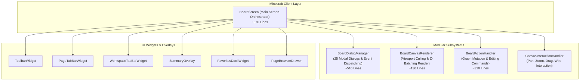

# ADR-016: BoardScreen 모듈화 분해 및 단일 책임 아키텍처 명세
(BoardScreen Modular Decomposition & Single Responsibility Architecture Specification)

- **문서 번호**: ADR-016
- **대상 버전**: `v2.1.0`
- **상태**: 🟢 `IMPLEMENTED`
- **결정/완료일**: 2026-09-03

---

## 1. 개요 및 배경 (Motivation)

초기 프로토타입부터 지속적으로 기능이 누적되어 온 [`BoardScreen.java`](file:///d:/dev-ssd/modding/minecraft/GregTechCalculatorBoard/src/main/java/com/gtceu/calcboard/client/gui/BoardScreen.java)는 1,920줄에 달하는 거대한 모놀리식 GUI 클래스(God Object)로 비대해졌습니다.

### 당면했던 한계 및 문제점:
1. **단일 책임 원칙(SRP) 위반**: 화면 생명주기(Screen Lifecycle), 25종 모달 다이얼로그 관리(Modal Windowing), 캔버스 씬 렌더링 파이프라인(Graphics Rendering), 보드 그래프 편집 작업(Graph Mutation)이라는 서로 다른 관심사가 하나의 클래스에 강결합되어 있었습니다.
2. **입력 이벤트 복잡도 폭증**: `mouseClicked`, `mouseReleased`, `mouseDragged`, `mouseScrolled`, `keyPressed`, `charTyped` 등의 입력 핸들러마다 25개가 넘는 개별 다이얼로그 분기문이 중복 나열되어 코드 가독성과 유지보수성이 극도로 저하되었습니다.
3. **회귀 버그 취약성**: 단일 다이얼로그나 렌더링 로직 수정 시에도 1,920줄 전체 파일에 영향을 주어 버그 유발 위험이 상존했습니다.

---

## 2. 세부 설계 및 결정 사항 (Architecture Decision)

단일 책임 원칙(SRP) 및 컴포넌트 기반 아키텍처에 따라 `BoardScreen`의 책임을 분석하고, 4대 서브시스템으로 분해 및 계층화했습니다.

### 2.1 서브시스템 구조도 (Architecture Diagram)

---

### 2.2 4대 서브시스템별 책임 분리 명세

#### (1) `BoardDialogManager` (`client.gui.dialog.BoardDialogManager`)
* **책임**: 25종 모달 다이얼로그의 수명주기, 지연 초기화, 일괄 렌더링, 이벤트 디스패칭 전담.
* **주요 기능**:
  - `init()`: 다이얼로그 지연 생성 및 화면 컨텍스트 바인딩.
  - `isAnyModalOpen()`: 모달 가시성 일괄 검사.
  - `renderModals(GuiGraphics, int, int, int, int, float)`: 활성 모달 렌더링.
  - `handleMouseClicked`, `handleMouseReleased`, `handleMouseDragged`, `handleMouseScrolled`, `handleKeyPressed`, `handleCharTyped`: 입력 이벤트의 모달 우선 전파 및 소비.
  - 다이얼로그 오픈 라우팅 및 인스턴스 Getter 제공.

#### (2) `BoardCanvasRenderer` (`client.gui.render.BoardCanvasRenderer`)
* **책임**: 캔버스 뷰포트 공간 변환, AABB 컬링 계산, Layered Z-Offset 배칭 렌더링 총괄.
* **주요 기능**:
  - `renderCanvasScene(...)`: 포즈 변환 $\rightarrow$ 뷰포트 컬링 영역 계산 $\rightarrow$ 그룹 프레임/메모 렌더 $\rightarrow$ 와이어 렌더 $\rightarrow$ 노드 위젯 Layered Z-Offset 배칭 렌더 $\rightarrow$ 퀵액션 마커 및 마키 선택 영역 렌더.
  - 렌더링 시간 계측(`getLastWireRenderNs()`, `getLastNodesRenderNs()`)을 통한 성능 HUD 지원.

#### (3) `BoardActionHandler` (`client.gui.action.BoardActionHandler`)
* **책임**: 보드 그래프 및 캔버스 요소의 생성, 편집, 변환, 복제, 삭제, 히스토리 기록 전담.
* **주요 기능**:
  - `flipSelectedNodes(...)`: 선택 노드 및 마우스 호버 노드 플립 반전.
  - `removeNode(...)`: 단일/복합 노드, 연관 와이어 및 프레임 원자적 삭제.
  - `switchMachineWorkstation(...)`, `switchNodeRecipe(...)`: 작업대 아이콘 및 레시피 동적 교체.
  - `createFrameFromSelection()`, `createSharedMachineFrameFromSelection()`, `createFrameAt(...)`: 그룹 프레임 생성.
  - `createNoteAt(...)`, `addRerouteNodeAt(...)`: 메모 및 정션 노드 생성.
  - `groupNodesIntoModule(...)`, `collapseFrameIntoModule(...)`: 컴파운드 모듈 캡슐화.
  - `fitToView()`: 전체 요소 AABB 경계 박스 계산 및 뷰포트 자동 맞춤.
  - `undo()`, `redo()`, `bringNodeToFront(...)`: 실행 취소, 다시 실행, 레이어 순서 조정.

#### (4) `BoardScreen` (`client.gui.BoardScreen`)
* **책임**: 마인크래프트 화면 생명주기(`init`, `render`, `containerTick`, `onClose`) 및 서브시스템 오케스트레이션.
* **주요 기능**:
  - 서브시스템 인스턴스 보유 및 협업 조율.
  - 외부 위젯/클래스 호환성을 위한 1줄 위임 메서드 제공 (Zero-Breaking API).
  - 캔버스 좌표 변환(`toCanvasX`, `toCanvasY`, `toScreenX`, `toScreenY`) 유틸리티 유지.

---

## 3. 결과 및 파급 효과 (Consequences)

### 3.1 긍정적 효과
1. **코드 라인 수 65% 감축**:
   - `BoardScreen.java`가 기존 **1,920줄**에서 **679줄**로 감축되었습니다.
   - 단일 클래스의 비대화가 해소되어 가독성과 유지보수성이 개선되었습니다.
2. **단일 책임 원칙(SRP) 및 관심사의 분리 달성**:
   - 신규 다이얼로그 추가 시 `BoardDialogManager`만 수정하면 되며, `BoardScreen` 본체에 영향을 주지 않습니다.
   - 그래픽 렌더링 파이프라인 최적화나 그래픽스 개선 시 `BoardCanvasRenderer`만 독립적으로 검증할 수 있습니다.
   - 보드 편집 비즈니스 로직 수정 시 `BoardActionHandler`에서 안전하게 처리 가능합니다.
3. **단축키 디스패처 대폭 단순화**:
   - `BoardKeybindDispatcher.java` 역시 개별 다이얼로그 25종 나열 분기를 `dialogManager.handleKeyPressed` / `handleCharTyped` 위임으로 일원화하여 **147줄 $\rightarrow$ 45줄 (70% 감축)**로 슬림화되었습니다.
4. **100% 하위 호환성 유지**:
   - 기존 외부 위젯이나 핫키 핸들러(`BoardHotkeyHandler`, `CanvasInteractionHandler`)가 호출하던 `screen.getSearchDialog()`, `screen.flipSelectedNodes()` 등의 호출 규격을 그대로 유지하여 어떠한 동작 변경이나 회귀 버그도 발생하지 않습니다.

### 3.2 검증 결과
* `.\gradlew.bat clean build` 및 전체 단위 테스트 통과:
  - 552개 전체 단위 테스트 100% 통과 (`BUILD SUCCESSFUL`).
  - 다국어 무결성 및 일관성 테스트 통과 (`testI18nCompletenessAndConsistency`).
