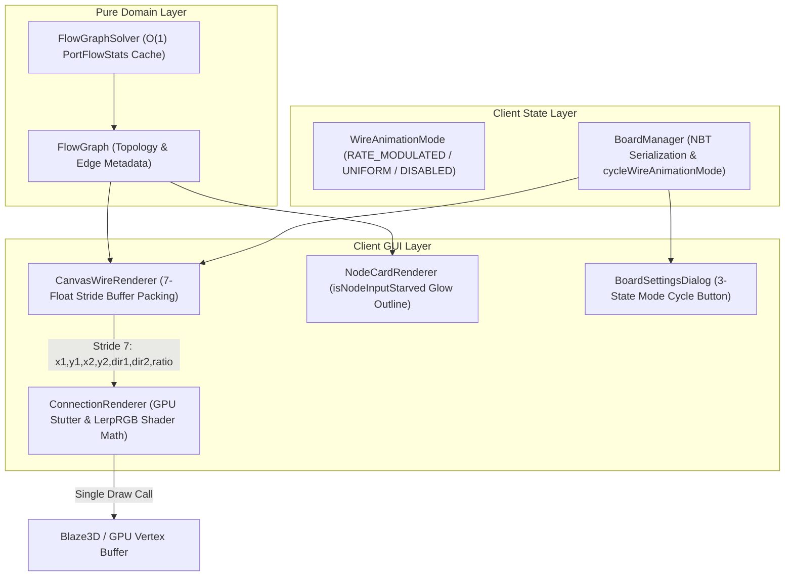

# ADR-018: 처리량 포화도 기반 와이어 애니메이션 변조 및 실시간 병목 시각화 명세
# (Rate-Based Wire Flow Modulation & Canvas Bottleneck Visualization)

- **문서 번호**: ADR-018
- **대상 버전**: `v2.1.0-beta.1`
- **상태**: `IMPLEMENTED`
- **결정/완료일**: 2026-09-04
- **주관 계층**: Client GUI Layer (`client.gui.render`, `client.gui.canvas`, `client.gui.widget`), Client State Layer (`client.gui.model`, `client.gui.manager`), Pure Domain Layer (`api.model`, `domain.graph`)

---

## 1. 개요 및 배경 (Motivation)

### 1.1 현황 및 당면했던 한계
1. **획일적인 펄스 애니메이션의 정보성 부재**:
   - 기존 계산기 캔버스의 연결선(Wire)에는 `ConnectionRenderer.renderPulseDotsBatch`를 통해 $1.6\text{초}$ 고정 주기와 단일 흰색(0xFFFFFFFF)으로 모든 와이어에 동일한 펄스 도트가 이동했습니다.
   - 이는 실제 공정의 유량(Items/s, L/s)이나 기계의 원료 공급 상태와 무관하여 단순한 장식적 효과에 그쳤습니다.
2. **생산 라인 병목(Bottleneck) 식별의 비효율**:
   - 특정 공정에서 이전 단계의 공급이 부족하여 다음 기계가 굶고 있는 결핍 상태(Input Starvation)를 파악하려면 노드 카드의 수치를 일일이 대조해야 하는 불편이 있었습니다.
3. **완전 이산 사건 시뮬레이션(Discrete-Event Simulation) 대안의 기술적 결함**:
   - 외부 사용자로부터 레시피 가공 시간(Duration)에 1:1로 비례하여 큐브가 이동하고 선행 재료가 모두 도착해야 가동되는 실시간 이벤트 시뮬레이션이 제안되었습니다.
   - 그러나 GTCEu Modern 환경은 $0.05\text{초}(1\text{틱})$ 미만의 초고속 레시피, $64\times$ 이상의 고밀도 병렬 처리, 부산물 환류 순환 루프(Recycled Loops)를 포함합니다.
   - 완전 이산 사건 시뮬레이션은 타임스케일 왜곡, 루프 순환 데드락, 기존 정상 상태(Steady-State) 대수 방정식 계산 수치와의 불일치, 대규모 캔버스에서의 CPU/메모리 오버헤드라는 공학적 결함을 유발합니다.

### 1.2 채택된 아키텍처 결정 (The Decision)
- **정적 계산 기반 애니메이션 변조 (Rate-Based Modulation)**:
  - 별도의 무거운 가상 머신이나 시뮬레이션 런타임을 추가하지 않고, 계산기 그래프 솔버가 이미 산출한 **공급 포화율(Saturation Ratio $R = \text{Supply} / \text{Demand}$)**을 와이어 애니메이션 파라미터(듀티 사이클 정지, 속도, 색상)에 직접 투영합니다.
- **간헐적 정지(Duty Cycle Stutter/Stall) 및 3단계 RGB 보간**:
  - $R \ge 1.0$: 부드러운 Cyan Blue (`0xFF38BDF8`) 연속 주행.
  - $0.5 \le R < 1.0$: 부족한 비율만큼 이동 후 끝점에서 정지(Stall), Amber Orange (`0xFFF59E0B`) 보간.
  - $0 < R < 0.5$: 이동 시간보다 정지 시간이 훨씬 길어지는 극심한 지연, Crimson Red (`0xFFEF4444`) 보간.
  - $R \le 0.0$: 무유량 라인은 렌더링 스킵.
- **결핍 노드 경고 외곽선 연동**:
  - 정상 가동 중이지만 입력 포트 중 하나라도 결핍($R < 1.0$)인 노드는 호박색 펄스 외곽선 글로우(`0xFFF59E0B`)를 렌더링.
- **무손실 GPU 배치 파이프라인**:
  - 단일 Tesselator/BufferBuilder 드로우 콜 내에서 듀티 사이클 및 RGB를 직접 계산하여 대규모 그래프에서도 FPS 저하 $0$을 달성.

---

## 2. 세부 설계 및 결정 사항 (Architecture Decision)

### 2.1 시스템 파이프라인 다이어그램

---

### 2.2 수학 공식 및 렌더링 알고리즘 명세

#### 1) 포화율 ($R_e$) 산출
$$\text{SupplyRate} = \text{ActualSupplyRate}(u, i_{\text{out}})$$
$$\text{DemandRate} = \text{RequiredDemandRate}(v, j_{\text{in}})$$
$$R_e = \begin{cases} 
1.0 & \text{if } \text{DemandRate} \le 0.0001 \\
0.0 & \text{if } \text{SupplyRate} \le 0.0001 \\
\min\left(1.0, \frac{\text{SupplyRate}}{\text{DemandRate}}\right) & \text{otherwise}
\end{cases}$$

#### 2) 듀티 사이클 간헐적 정지 (Duty Cycle Stutter)
전역 주기 $T = 1600\text{ ms}$, 기준 시간 $\tau = (t_{\text{now}} \pmod T) / T \in [0, 1)$:
$$t_{\text{eff}} = \begin{cases} 
\frac{\tau}{R_e} & \text{if } \tau < R_e \quad (\text{정상 주행 구간}) \\
1.0 & \text{if } \tau \ge R_e \quad (\text{원료 결핍 대기 정지 구간})
\end{cases}$$

#### 3) 동적 3단계 RGB 보간 (Color Interpolation)
$$C(R_e) = \begin{cases} 
(0.22, 0.74, 0.97) \quad [\text{Cyan}] & \text{if } R_e \ge 1.0 \\
\text{Lerp}\left(\text{Amber}, \text{Cyan}, \frac{R_e - 0.5}{0.5}\right) & \text{if } 0.5 \le R_e < 1.0 \\
\text{Lerp}\left(\text{Crimson}, \text{Amber}, \frac{R_e}{0.5}\right) & \text{if } 0.0 < R_e < 0.5
\end{cases}$$

---

### 2.3 주요 변경 클래스 및 역할

| 클래스 | 변경 내용 | 설계 책임 |
| :--- | :--- | :--- |
| **`WireAnimationMode`** | 신규 열거형 정의 (`RATE_MODULATED`, `UNIFORM_LEGACY`, `DISABLED`) 및 `next()` 순환 메서드 구현 | 와이어 애니메이션 모드 도메인 모델 정의 |
| **`BoardManager`** | `wireAnimationMode` 필드 및 getter/setter/cycle 추가, NBT 입출력 동기화, `isShowWirePulseAnimation()` 하위 호환성 유지 | 전역 설정 영속화 및 생명주기 관리 |
| **`CanvasWireRenderer`** | 뷰포트 내 가시 와이어 추출 시 $O(1)$ 포트 통계로부터 $R_e$를 산출하여 7-float 스트라이드로 패킹 | 캔버스 와이어 수집 및 지오메트리 버퍼 구성 |
| **`ConnectionRenderer`** | `computeEffectivePulseTime`, `computePulseRgb`, `renderPulseQuad` 헬퍼 분리 및 GPU 배치 렌더러 확장 | 단일 배치 GPU 정점 생성 및 셰이더 연산 |
| **`NodeCardRenderer`** | `isNodeInputStarved` 검사 및 결핍 머신 노드 외곽선 호박색 펄스 글로우(`0xFFF59E0B`) 렌더링 | 노드 카드 시각화 및 병목 상태 피드백 |
| **`BoardSettingsDialog`** | 3-state 순환 라벨 체크박스로 와이어 애니메이션 모드 토글 연동 | 사용자 환경설정 인터페이스 |

---

## 3. 결과 및 파급 효과 (Consequences)

### 3.1 긍정적 효과
1. **직관적인 병목 가시화**:
   - 복잡한 수치를 일일이 읽지 않아도, 와이어 펄스가 멈칫거리고 붉은빛으로 변하는 지점을 통해 원료 공급 결핍 구간을 $1\text{초}$ 만에 식별할 수 있습니다.
2. **무손실 성능 유지**:
   - 별도의 상태 머신 루프나 이벤트 큐 없이 기존 $O(1)$ 포트 통계 캐시와 단일 GPU 배치 드로우 콜을 재활용하므로 $120\text{ FPS}$ 환경에서도 프레임 드랍이 전혀 없습니다.
3. **완벽한 하위 호환성 및 다국어 지원**:
   - 기존 설정 파일과의 100% NBT 역호환성을 유지하며, 한국어, 영어, 중국어, 러시아어 4개 국어 번역이 동기화되었습니다.

### 3.2 검증 결과
* **신규 단위 테스트**: [`WireAnimationModeTest.java`](file:///d:/dev-ssd/modding/minecraft/GregTechCalculatorBoard/src/test/java/com/gtceu/calcboard/client/render/WireAnimationModeTest.java) 작성 완료.
  - 열거형 3단 순환, 듀티 사이클 전진/정지 경계값, 3단계 RGB 보간 정확도 100% 검증.
* **전체 빌드 및 테스트 검증**:
  - `.\gradlew.bat clean build` 성공 (`BUILD SUCCESSFUL in 34s`, 11 actionable tasks executed).
