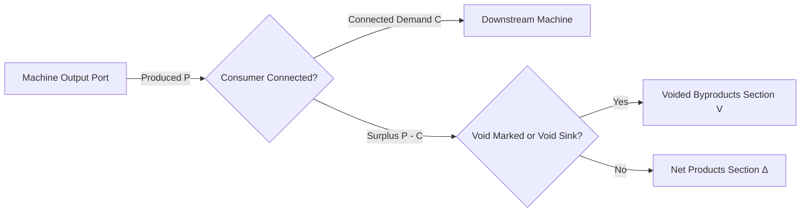

# ADR-019: 잉여 부산물 폐기 처리 및 보이드 싱크 시스템 명세
# (Byproduct Void Management & Sink System Specification)

- **문서 번호**: ADR-019
- **대상 버전**: `v2.1.0-beta.2`
- **상태**: `IMPLEMENTED`
- **결정/완료일**: 2026-09-04
- **주관 계층**: Pure Domain Layer (`api.model`, `api.solver`), Client Presentation Layer (`client.gui.widget`, `client.gui.dialog`, `client.gui.render`), Serialization Layer (`api.storage`)

---

## 1. 개요 및 배경 (Motivation)

### 1.1 현황 및 당면했던 한계
1. **잉여 부산물의 최종 결산 오염**:
   - 석유 정제, 백금족 분해(Platinum Group Processing), 산/화학 공정 등에서 발생하는 타르, 이산화황($\text{SO}_2$), 저급 가스 등의 부산물은 실제 공장에서 쓰레기통(Trash Can)이나 보이드 플루이드 해치(Void Hatch)로 소각/폐기됩니다.
   - 기존 계산기는 모든 출력물을 완전 보존(Mass Conservation) 원칙에 따라 최종 결산(`Net Outputs`)에 합산하므로, 불필요한 부산물이 순 생산품 목록을 채워 실제 목표 생산물의 최종 수치를 파악하기 어렵게 만들었습니다.
2. **다운스트림 분기 시 정션 처리의 한계**:
   - 잉여 부산물을 버리고 싶어도 캔버스 상에서 '소각기(Sink)'를 명시적으로 표현할 방법이 없어 와이어를 단절하거나 미연결 상태로 방치해야 했습니다.
3. **단순 삭제 시 연쇄 붕괴 문제**:
   - 레시피 노드 자체의 출력을 임의로 삭제하면 레시피의 질량 보존 원칙이 파괴되고, 후속 다운스트림 공정에서 해당 원료를 필요로 하는 정상 소비자 기계의 수급 계산이 꼬이는 문제가 발생했습니다.

### 1.2 채택된 아키텍처 결정 (The Decision: 이중 통합 보이드 아키텍처)
사용자 피드백과 모드팩 공정 특성을 모두 충족하기 위해 **방안 A(물리 정션 싱크)**와 **방안 B(포트/요약창 논리 마킹)**를 상호 보완적으로 완전 통합 구현했습니다:

- **방안 A: Junction 물리적 보이드 싱크 (`SupplyMode.VOID_SINK`)**:
  - 기존 중계 정션(Reroute Node)에 `VOID_SINK` 모드를 추가.
  - 와이어로 연결된 잉여 유량을 무한히 흡수/소각 처리하며, 캔버스 상에 명시적인 배관망을 시각화.
  - 역방향 수요 전파(`FlowBalanceMatrixSolver`)를 차단하여 상류 기계가 오토 레시오로 폭증하지 않도록 격리.
- **방안 B: 포트 단위 직접 보이드 마킹 (`Alt+우클릭` & SummaryOverlay `[🗑️]` 토글)**:
  - 기계의 특정 출력 포트에 `isOutputPortVoided` 플래그를 부여.
  - 별도의 정션 노드를 배치하지 않고도 즉시 특정 부산물의 순 잉여분을 결산에서 제외.
  - 우측 결산창(`SummaryOverlay`)의 Net Products 행에서 `[🗑️]` 버튼을 클릭하여 원클릭 일괄 마킹 및 접이식 `🗑️ 폐기된 부산물` 섹션 분리 지원.

---

## 2. 세부 설계 및 결정 사항 (Architecture Decision)

### 2.1 데이터 모델 및 직렬화

1. **`SupplyMode.VOID_SINK`**:
   - `SupplyMode` 열거형에 `VOID_SINK("gui.gtcalcboard.junction.supply_mode.void_sink", false, true)` 등록.
   - `isSink()` 판별 메서드 지원.
2. **`RecipeNode` 도메인 엔티티**:
   - `private final Set<Integer> voidedOutputIndices = new HashSet<>();`
   - `isVoidSink()`: 정션 노드가 `SupplyMode.VOID_SINK`인지 판별.
   - `isOutputPortVoided(int portIndex)`, `setOutputPortVoided(int portIndex, boolean voided)`, `getVoidedOutputIndices()`.
3. **NBT 영속화 (`RecipeNodeSerializer`)**:
   - `voidedOutputs` int array 태그로 출력 포트 보이드 상태를 영속화 및 역직렬화.

### 2.2 유량 수지 및 질량 보존 방정식 (Mass Balance Formulation)

전체 공정 그래프의 특정 물질 $s$에 대해:

$$\Delta(s) = P(s) - C(s) - V(s)$$

- $P(s) = \sum \text{Produced}(s)$: 총 생산량
- $C(s) = \sum \text{Consumed}(s)$: 총 소비량
- $\text{netSurplus}(s) = \max(0, P(s) - C(s))$
- $V(s) = \min(\text{netSurplus}(s), V_{\text{marked}}(s) + V_{\text{sink}}(s))$: 유효 보이드 유량
- $\text{NetOutput}(s) = \text{netSurplus}(s) - V(s)$

결손($P(s) < C(s)$) 상태인 물질은 보이드 대상이 되지 않으며, 다운스트림 정상 소비자가 절대적인 1순위 우선권을 가집니다. 오직 실수요를 초과하는 순 잉여분($\text{netSurplus} > 0$)만 $V(s)$ 한도 내에서 `voidedOutputs`로 재분류됩니다.

#### 1:N 분기 연결 시 소비자 우선순위 엄격 격리 (`getConnectedConsumerDemand`)
하나의 출력 포트가 여러 정상 기계들과 VOID_SINK 정션으로 동시에 분기 연결된 1:N 토폴로지 환경에서:
- `FlowBalanceMatrixSolver.getConnectedConsumerDemand()`는 `consumer.isVoidSink()` 대상의 수요를 **엄격히 0으로 강제 반환**합니다.
- 포트 출력 분배 및 병목 효율 연산 시 VOID_SINK는 총 수요(`totalPortDemand`) 집계 대상에서 완전히 배제되므로, 정상 소비 기계가 공급받아야 할 유량을 N분의 1로 가로채거나 굶주리게(Input Starvation) 만드는 현상이 수학적으로 원천 차단됩니다.
- 오직 정상 소비자들이 필요로 하는 실수요를 모두 충족하고 남은 잔여 유량($P - \sum C_{\text{normal}}$)만이 보이드 싱크의 유효 흡수량($V_{\text{sink}}$)으로 할당됩니다.

### 2.3 프레젠테이션 & 인터랙션 UI

1. **캔버스 노드 렌더링 (`NodeCardRenderer`)**:
   - `VOID_SINK` 정션: 테두리 보라색(`0xFFA855F7`), 상단 `VOID` 배지 부착.
   - 보이드 처리된 포트: 포트 색상 보라색(`0xFFA855F7`), 슬롯 라벨 보라색(`0xFFC084FC`), 테두리 강조.
2. **단축키 및 조작 제스처 (`NodeWidget`, `BoardTooltipRenderer`)**:
   - 기존 우클릭(포트 숨기기 `hidePortAndDisconnectWires`)을 보존하기 위해 **`Alt + 우클릭`**으로 포트 보이드 토글 지원.
   - 포트 호버 툴팁에 `[∅] 보이드 처리됨` 상태 라벨 및 `[Alt+Right-Click]: 보이드 처리 토글` 단축키 가이드 표시.
3. **정션 다이얼로그 (`JunctionSupplyDialog`)**:
   - 4번째 라디오 옵션 `보이드 싱크 (잉여 폐기/무한 흡수)` 지원 및 다이얼로그 높이 185px 확장.
4. **결산창 (`SummaryOverlay`)**:
   - Section B (`Net Outputs`) 행 호버 시 `[🗑️]` 보이드 버튼 렌더링 및 클릭 시 일괄 마킹.
   - Section C (`🗑️ 폐기된 부산물`) 접이식 섹션 제공.
   - 폐기 목록 행 호버 시 `[↩️]` 복원 버튼 제공 및 원클릭 복원.

---

## 3. 검증 결과 (Verification Results)

- **전체 클린 빌드 및 단위 테스트**:
  - `.\gradlew.bat clean build` 성공 (`BUILD SUCCESSFUL in 29s`).
  - 신규 단위 테스트 `MassBalanceVoidTest` 4종 전원 통과:
    1. `testJunctionVoidSinkAbsorbsSurplus`: 정션 VOID_SINK의 잉여 부산물 흡수 및 순 생산품 제외 검증.
    2. `testDirectPortVoidMarking`: 포트 단위 직접 보이드 마킹 및 netOutputs -> voidedOutputs 전이 검증.
    3. `testPartialConsumptionAndVoidRemainder`: 실수요 40 차감 후 남은 잉여 60만 보이드 처리되는 부분 유량 수지 검증.
    4. `testNbtRoundTripWithVoidState`: 노드 포트 보이드 상태 및 정션 VOID_SINK 모드 NBT 직렬화/역직렬화 무결성 검증.
  - 다국어 동기화 검증: `ko_kr.json`, `en_us.json`, `zh_cn.json`, `ru_ru.json` 4개 언어 파일의 키 및 포맷 토큰 100% 동기화 통과 (`testCodeKeysAllPresentInLanguageFiles`).
