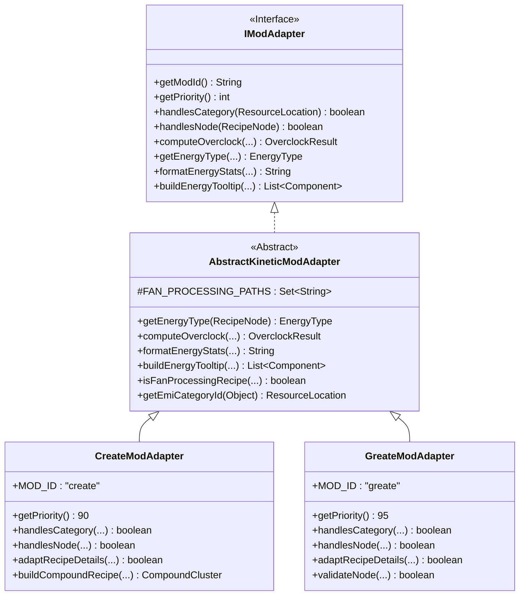

# ADR-021: Greate 모드 연동을 위한 AbstractKineticModAdapter 계층 분리 및 티어드 회전 운동 기계 어댑터 명세
# (AbstractKineticModAdapter Class Hierarchy Extraction & Greate Tiered Kinetic Machine Adapter Specification)

- **문서 번호**: ADR-021
- **대상 버전**: `v2.2.0`
- **상태**: `IMPLEMENTED`
- **결정/완료일**: 2026-09-04
- **주관 계층**: Mod Compatibility Layer (`compat.create`, `compat.greate`), Pure Domain Layer (`api.model`, `api.type`, `api.property`)

---

## 1. 개요 및 배경 (Motivation)

### 1.1 현황 및 기술적 한계
GTCalcBoard는 Create 모드 및 관련 패밀리 모드에 대해 회전 운동 에너지 단위인 $\text{SU}$ (Stress Units)와 $\text{RPM}$ 기반 오버클럭 연산을 제공하고 있었습니다.

그러나 TerraFirmaCraft 환경 및 GTCEu Modern 기반 대형 테크 모드팩에서 핵심 축으로 활용되는 **Greate** 모드의 경우, 단순한 Create 애드온을 넘어 GTCEu의 전압 티어와 재질 물성을 Create의 운동 에너지 시스템과 밀접하게 결합하고 있습니다:

1. **10단계 전압 티어(ULV~UHV) 결합 기계군**:
   - Greate의 모든 가공 기계(Millstone, Mechanical Mixer, Mechanical Press, Crushing Wheel, Mechanical Saw, Encased Fan)는 안산암(ULV)부터 뉴트로늄(UHV)까지 10단계의 티어를 가집니다.
   - 각 기계의 스트레스 임팩트(Stress Impact)는 티어에 비례하여 선형 증가합니다.
2. **티어 종속형 레시피(`TieredProcessingRecipe`)**:
   - Greate의 레시피는 Create의 `ProcessingRecipe`를 상속하며, 요구 티어(`recipeTier`)와 통합 회로 번호(`circuitNumber`)를 필수로 요구합니다.
   - 기계 티어가 레시피 티어보다 낮으면 동작하지 않습니다 (`machineTier >= recipeTier`).
3. **샤프트 및 기계 전달 용량 한계 (Capacity Limit)**:
   - 각 재질(Material)은 $8 \times 4^{\text{tier}}\text{ SU}$의 최대 스트레스 전달 용량 한계를 가집니다. 이를 초과하는 SU가 흐르면 계통 과부하 및 파괴가 발생합니다.
4. **기존 `CreateModAdapter`와의 단일 책임 원칙(SRP) 충돌**:
   - 순수 Create 기계는 티어와 회로, 용량 한계가 존재하지 않습니다.
   - `CreateModAdapter` 내부에 조건문 분기(`if (isGreate)`)를 추가하면 클래스 결합도가 급증하고 유지보수성이 저하됩니다.

### 1.2 아키텍처 개선 목표
- **공통 운동 에너지 추상 클래스 (`AbstractKineticModAdapter`) 도입**:
  - 회전 속도(RPM) 기반 처리 시간 및 동력 비례 연산, $\text{SU}$ 포맷팅, 툴팁 표시 등 Create 계열 공통 도메인 로직을 단일 추상 클래스로 캡슐화합니다.
- **전용 `GreateModAdapter` (Priority 95) 독립 구현**:
  - `greate:*` 네임스페이스 및 Greate 기계를 전담하며, GTCEu 10단계 티어 매핑, 회로 번호 추출, 티어 불일치 검증을 수행합니다.
- **샤프트 전달 한계 및 물리 공식 기반 결정론적 연역 분석**:
  - Rule 5(결정론적 연역 분석)를 준수하여 `TieredProcessingRecipe` 및 GTCEu 머티리얼 프로퍼티로부터 정확한 수치를 획득하고 검증합니다.

---

## 2. 세부 설계 및 결정 사항 (Architecture Decision)

### 2.1 클래스 상속 계층도

### 2.2 물리 및 수학 연산 공식 명세

#### 1. 스트레스 소비량 공식 (Stress Impact at RPM)
$$\text{Impact}(\text{tier}, \text{RPM}) = c_{\text{machine}} \times (\text{tier} + 1) \times \text{RPM}$$

* 기계 유형별 계수 $c_{\text{machine}}$:
  * **Millstone, Mechanical Mixer, Crushing Wheel**: $c = 0.5$ ($\text{32 RPM 기준 } 16 \times (\text{tier} + 1)\text{ SU}$)
  * **Mechanical Press, Mechanical Saw**: $c = 1.0$ ($\text{32 RPM 기준 } 32 \times (\text{tier} + 1)\text{ SU}$)
  * **Encased Fan**: $c = 0.5$ (단, $\text{UHV}$ 티어는 $c = 0.56$)

#### 2. 샤프트 최대 허용 용량 공식 (Shaft Capacity Limit)
$$\text{Capacity}_{\max}(\text{tier}) = 8 \times 4^{\text{tier}}\text{ SU} \quad (\text{tier} \in [0, 9])$$

| 티어 | 재질 (Material) | 최대 용량 ($\text{SU}$) |
| :---: | :--- | :---: |
| **0 (ULV)** | Andesite Alloy | $8$ |
| **1 (LV)** | Steel | $32$ |
| **2 (MV)** | Aluminium | $128$ |
| **3 (HV)** | Stainless Steel | $512$ |
| **4 (EV)** | Titanium | $2,048$ |
| **5 (IV)** | Tungsten Steel | $8,192$ |
| **6 (LuV)** | Rhodium-Plated Palladium | $32,768$ |
| **7 (ZPM)** | Naquadah Alloy | $131,072$ |
| **8 (UV)** | Darmstadtium | $524,288$ |
| **9 (UHV)** | Neutronium | $2,097,152$ |

#### 3. 회전 속도에 따른 가공 주기 연산 (Kinetic Overclock)
$$\text{speedFactor} = \max\left(0.01, \frac{\text{RPM}}{32.0}\right)$$
$$\text{durationTicks} = \begin{cases} \text{baseDuration}, & \text{if Encased Fan processing} \\ \max\left(1.0, \frac{\text{baseDuration}}{\text{speedFactor}}\right), & \text{otherwise} \end{cases}$$

---

## 3. 결과 및 파급 효과 (Consequences)

### 3.1 긍정적 효과
1. **단일 책임 원칙(SRP) 및 개방-폐쇄 원칙(OCP) 강화**:
   - Create 모듈과 Greate 모듈이 물리적으로 분리되어, 한쪽 모드의 코드 변경이 다른 모드에 회귀 버그를 일으키지 않습니다.
2. **중복 코드 제거**:
   - 운동 에너지 서식, 툴팁 조립, RPM 비례 공식이 `AbstractKineticModAdapter` 단일 계층으로 캡슐화되었습니다.
3. **높은 유연성과 확장성**:
   - 향후 새로운 Create 패밀리 애드온(예: Create: Steam 'n' Rails, Dreams & Desires 등) 연동 시 `AbstractKineticModAdapter`를 상속받아 신속하게 구현할 수 있습니다.
4. **결정론적 데이터 정확도 (Rule 5 준수)**:
   - 문자열 휴리스틱 매칭을 배제하고, 공식 리플렉션 캐싱 및 머티리얼 속성 테이블을 통해 100% 결정론적인 계산 결과를 보장합니다.

### 3.2 단위 테스트 및 검증 결과
* **정적 규칙 린터 (`tools/lint_agent_rules.py --diff`)**: 0 Violations (100% 준수).
* **신규 단위 테스트 ([`GreateModAdapterTest.java`](../../src/test/java/com/gtceu/calcboard/compat/greate/GreateModAdapterTest.java))**:
  - `testAdapterRegistrationAndPriority`: 우선순위 95 > 90 검증 통과.
  - `testHandlesCategoryAndRouting`: `greate` vs `create` 카테고리 라우팅 검증 통과.
  - `testHandlesNode`: Greate 머신 노드 인식 검증 통과.
  - `testShaftCapacityTable`: ULV 8 SU ~ UHV 2,097,152 SU 테이블 검증 통과.
  - `testKineticOverclockCalculation`: RPM에 따른 속도 및 소비 전력 비례 검증 통과.
  - `testFanProcessingFixedDuration`: Fan 처리 시 시간 고정 검증 통과.
  - `testNodeValidationTierMismatchAndCapacity`: 기계 티어 부족 및 샤프트 용량 초과 경고 검증 통과.
  - `testAdaptRecipeDetails`: 리플렉션 레시피 파싱 및 스트레스 계산 검증 통과.
* **다국어 무결성 (`UiFormattingTest`)**: 4대 언어(`en_us`, `ko_kr`, `zh_cn`, `ru_ru`) 키 일치 및 포맷 토큰 100% 패리티 통과.
* **전체 단위 테스트**: `BUILD SUCCESSFUL` (회귀 0건).
