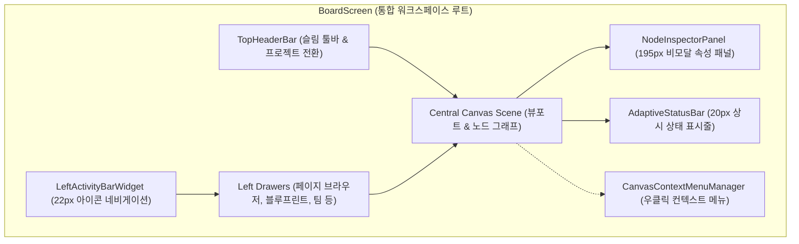
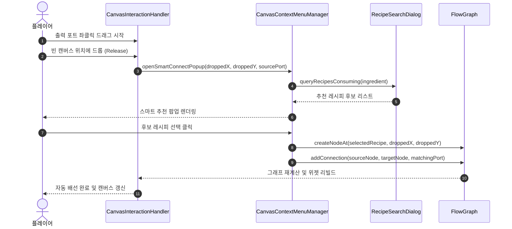

# ADR-025: 3-패널 통합 워크스페이스 및 컨텍스트 중심 UI/UX 현대화 명세
(Unified Canvas Workspace & Context-Driven UI/UX Modernization Specification)

- **문서 번호**: ADR-025
- **대상 버전**: `v2.2.0-alpha.3`
- **상태**: `IMPLEMENTED`
- **결정/완료일**: 2026-09-06
- **주관 계층**: Client GUI Layer (`client.gui`, `client.gui.widget`, `client.gui.interaction`, `client.gui.render`), Pure Domain Layer (`api.model`, `api.storage`)

---

## 1. 개요 및 배경 (Motivation)

### 1.1 현황 및 한계 분석 (AS-IS)
계산 엔진 고도화에 따라 캔버스 조작 및 모니터링 인터페이스가 확장되면서, 기존 클라이언트 GUI 계층은 다음과 같은 사용성 및 구조적 한계가 존재했습니다:

1. **인터랙션 발견성(Discoverability) 저하 및 단축키 의존**:
   - `Auto Connect`의 조합키 분기(`Shift`), `Auto Ratio`의 세부 모드(`Shift` 조화 / `Alt` 분수 비율) 등 핵심 조작이 보이지 않는 단축키에 의존.
   - 포트 제어(우클릭/Ctrl+우클릭)나 대체 재료 순환(휠 스크롤) 등 노드 내부 기능에 대한 시각적 단서가 부족하여 18개 항목의 단축키 목록을 숙지해야 하는 부담 발생.
2. **노드 카드의 시각적 과밀(Visual Clutter)**:
   - 단일 노드 카드 내에 헤더 버튼, 대수 증감 버튼(`-`, `+`, `/2`, `x2`), 티어/속도 제어 텍스트, 오버클럭 버튼, 장착 애드온 트레이, 입출력 포트가 전부 밀집 배치.
   - 노드 수가 증가할 때 캔버스 전체 가독성과 유효 작업 면적이 저하됨.
3. **노드 에디터 표준 인터랙션과의 차이**:
   - 일반적인 노드 기반 도구에서 마우스 우클릭은 컨텍스트 메뉴(Context Menu) 호출로 동작하지만, 기존 시스템은 빈 캔버스 우클릭이 화면 이동(Pan)으로만 바인딩되어 있어 캔버스 레벨 메뉴가 부재.
4. **작업 캔버스 침범 및 화면 분산**:
   - 상단 툴바, 좌상단 탭 바, 좌측 페이지 드로어, 우측/하단 즐겨찾기 독, 좌하단 단축키 HUD, 우하단 수지 요약창이 사방에서 캔버스를 점유.
5. **모달 다이얼로그 중심 인터랙션**:
   - 머신 설정, 자재 명세서(BOM), 글로벌 수지 등 20여 종의 다이얼로그가 모달 형태로 중앙을 덮어 회로를 확인하며 수치를 미세 조정하는 연속적 작업 흐름이 제한됨.

### 1.2 설계 목표 (TO-BE)
- **컨텍스트 기반 인터랙션 도입**: 캔버스 빈 공간, 노드, 포트, 선택 영역 우클릭 시 명확한 컨텍스트 메뉴를 제공하여 단축키 암기 없이 주요 기능을 탐색할 수 있도록 개선.
- **3-패널 통합 워크스페이스 구축**:
  - **좌측 액티비티 바 (`LeftActivityBarWidget`)**: 페이지 탐색, 즐겨찾기, 블루프린트, 팀 관리, 설정 등을 단일 슬림 바(22px)로 통합.
  - **중앙 캔버스 작업 공간**: 노드 카드를 본체-포트 중심으로 슬림화하고 작업 유효 면적 확보.
  - **우측 인스펙터 패널 (`NodeInspectorPanel`)**: 노드 선택 시 티어, 오버클럭, 코일/해치/로터 하드웨어 설정을 비모달(Non-modal) 사이드바(195px)로 실시간 제어.
  - **하단 반응형 상태바 (`AdaptiveStatusBar`)**: 기계 대수/연결선 요약 및 단축키 안내를 하단 20px 바에 상시 표시하고 대시보드 연동 지원.
- **기존 키바인딩 100% 하위 호환성 유지**: `Space`, `J`, `T`, `B`, `Ctrl+G`, `Ctrl+Shift+G` 등 기존 단축키를 완전히 유지.

---

## 2. 세부 설계 및 결정 사항 (Architecture Decision)

### 2.1 3-패널 통합 워크스페이스 구조 (Unified 3-Panel Hierarchy)



### 2.2 핵심 컴포넌트별 책임 분리 명세

#### 1) `CanvasContextMenuManager` (우클릭 컨텍스트 메뉴 엔진)
- **위치**: `com.gtceu.calcboard.client.gui.interaction.CanvasContextMenuManager`
- **역할**: 마우스 우클릭 시 드래그 변위(Drag Threshold: 4px)를 판정하여, 단순 클릭 릴리즈인 경우 마우스 위치에 상황에 맞는 컨텍스트 메뉴 렌더링.
- **컨텍스트 분기**:
  - **빈 캔버스 (Empty Canvas)**: 레시피 검색 및 추가(`Space`), 재배선 정크션 추가(`J`), 클립보드 붙여넣기(`Ctrl+V`), 전체 뷰 맞춤(`Home`), 자동 정렬 등.
  - **단일 노드 (Single Node)**: 상세 설정(우측 인스펙터 토글), 레시피 교체, 입출력 방향 반전, 앵커 지정, 노드 복제(`Ctrl+D`), 삭제(`Del`).
  - **다중 선택 영역 (Multi-Selection)**: 프레임 묶기(`Ctrl+G`), 단일 모듈 압축(`Ctrl+Shift+G`), 선택 영역 비율 맞춤, 일괄 삭제.
  - **포트 (Port)**: 포트 숨기기, 부산물 소각(Void) 토글, 목표 생산량 지정(역산기), 대체 재료 순환.

#### 2) `NodeInspectorPanel` (비모달 우측 인스펙터 패널)
- **위치**: `com.gtceu.calcboard.client.gui.widget.NodeInspectorPanel`
- **역할**: 노드 선택 시 캔버스 우측에서 195px 폭으로 표시되는 속성 편집기. 비모달 형태로 캔버스를 가리지 않고 실시간 편집 지원.
- **주요 기능 영역**:
  - **헤더**: 기계 아이콘, 커스텀 명칭 변경, 노드 삭제 버튼.
  - **기계 대수 제어**: 슬라이더, `[-]`, `[+]`, `/2`, `x2`, 베이스 앵커(Lock) 토글.
  - **전압 및 모드 제어**: 티어 선택기(ULV~MAX), 오버클럭 모드 드롭다운.
  - **하드웨어 부품 장착**: 가열 코일 등급 선택기, 병렬 제어 해치, 터빈 로터/연소 복합체 보조 슬롯.
  - **입출력 포트 관리**: 포트 목록 및 실효 유량 표시, 부산물 소각 스위치, 목표 생산량 역산 입력.

#### 3) `LeftActivityBarWidget` (좌측 액티비티 바)
- **위치**: `com.gtceu.calcboard.client.gui.widget.LeftActivityBarWidget`
- **역할**: 화면 좌측에 22px 폭으로 상주하며 페이지 브라우저, 즐겨찾기, 블루프린트, 자재 명세서(BOM), 글로벌 수지, 멀티플레이 팀, 도움말, 설정 다이얼로그를 단일 진입점으로 통합 제공.

#### 4) `AdaptiveStatusBar` (하단 반응형 상태바)
- **위치**: `com.gtceu.calcboard.client.gui.widget.AdaptiveStatusBar`
- **역할**: 화면 하단 20px 영역에 노드 및 연결선 총계(또는 선택된 노드 수)를 상시 표시하며, 해상도에 맞춰 단축키 안내 힌트 렌더링.

### 2.3 스마트 커넥트 (Smart Connect) 흐름



### 2.4 UI 와이어프레임 구조

```
┌───┬───────────────────────────────────────────────────────────────────┬───┐
│ ▤ │ [프로젝트 명칭 ▼]     [최적화 ▼]  [보기 ▼]  [도움말 ▼]          │ ↶ ↷ │ ✕ │
├───┴───────────────────────────────────────────────────────────────────┴───┤
│[A]│                                                           │[INSPECTOR]│
│ 📁│                                                           │           │
│   │     ┌─────────────────────┐       ┌─────────────────────┐ │ 화학 반응기 │
│ ★ │     │ 증류탑 (x1.00)       │       │ 화학 반응기 (x2.50) │ │ ───────── │
│   │     │ ─────────────────── │───────│ ─────────────────── │ │ ■ 대수:2.5│
│ 📋│     │ ● 원유    ● 나프타 ═╪══════>│ ● 나프타  ● 폴리에틸│ │ [-][+][x2]│
│   │     │           ● 황산가스│       │ ● 염소    ● 잔여염산│ │           │
│ 👥│     └─────────────────────┘       └─────────────────────┘ │ ■ 전압: HV│
│   │                                                           │ [MV](HV)EV│
│ ⚙ │              "우클릭하여 새 레시피 또는 정크션을 추가하세요"      │           │
│   │                                                           │ ■ 부품:   │
│   │                                                           │ [코일/해치]│
├───┴───────────────────────────────────────────────────────────┴───────────┤
│ ● 노드 14개, 연결선 18개  │  Space: 검색 | J: 정크션 | Home: 뷰 맞춤   │ [▲ 대시보드]│
└───────────────────────────────────────────────────────────────────────────┘
```

---

## 3. 결과 및 파급 효과 (Consequences)

### 3.1 긍정적 효과
- **인터랙션 발견성 향상**: 우클릭 컨텍스트 메뉴 및 좌측 액티비티 바를 통해 단축키를 외우지 않고도 모든 기능에 접근 가능.
- **캔버스 작업 영역 확보**: 분산되어 있던 오버레이들을 3-패널(좌측 액티비티 바, 우측 인스펙터, 하단 상태바) 체계로 정리하여 중앙 캔버스 작업 공간을 넓게 확보.
- **실시간 비모달 편집**: 모달 창으로 화면 전체가 가려지지 않고 우측 인스펙터에서 기계 대수, 티어, 부품을 실시간으로 조작하며 캔버스의 유량 변화를 즉시 확인 가능.
- **하위 호환성 유지**: 기존 단축키 및 조작 체계를 완전히 유지하여 기존 사용자의 사용성을 보존.

### 3.2 검증 결과
- `NodeInspectorPanelTierTest` 등 관련 UI 컴포넌트 단위 테스트 및 전체 단위 테스트 스위트 통과.
- 다국어 키 패리티(`ko_kr.json`, `en_us.json`, `zh_cn.json`, `ru_ru.json`) 검증 완료.
