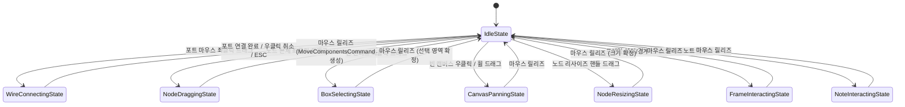

# ADR-027: 캔버스 인터랙션 유한 상태 머신 명세
# (Canvas Interaction Finite State Machine Specification)

- **상태**: `IMPLEMENTED` (구현 완료)
- **결정일**: 2026-09-06
- **대체/상위 문서**: [RFC-027](../../docs/RFC_027_CANVAS_INTERACTION_FINITE_STATE_MACHINE.md) 승격
- **주관 계층**: Client GUI Layer (`com.gtceu.calcboard.client.gui.interaction.state`, `com.gtceu.calcboard.client.gui`)

---

## 1. 배경 및 문제 정의 (Context & Problem Statement)

기존 `GregTechCalculatorBoard`의 캔버스 상호작용 엔진인 `CanvasInteractionHandler.java`는 패닝, 줌, 노드 이동, 와이어 연결, 다중 선택 박스, 그룹 프레임 및 스티키 노트 조작 등 복합 2D 인터랙션을 관리했습니다. 그러나 기존 구현은 다음과 같은 구조적 문제를 지니고 있었습니다:

1. **파편화된 불리언 플래그와 널 기반 상태 제어**:
   - 상호작용 상태가 `wireHandler.isDraggingWire()`, `panZoomHandler.isPanning()`, `draggingNode != null`, `resizingNode != null`, `isPotentialRightClick`, `selectionHandler.isSelecting()` 등 10여 개의 개별 플래그로 흩어져 있었습니다.
2. **상태 오염(State Pollution) 및 이벤트 간섭**:
   - 와이어 연결 도중 패닝 플래그가 켜지거나, 다중 노드 드래그 중 빈 공간 선택 박스 로직이 간섭하는 등 예기치 않은 조작 충돌을 방어하기 위해 복잡한 가드 클로즈가 중첩되었습니다.
3. **취소(Cancel) 및 리소스 정리 누수**:
   - ESC 키 입력이나 조작 취소 시 각 서브 핸들러의 클린업 메서드를 수동으로 일일이 호출해야 하여 누락에 의한 잔여 드래그 잔상이 발생할 위험이 존재했습니다.

---

## 2. 의사결정 (Decision)

본 프로젝트는 캔버스 상호작용의 상호 배타적 생명주기를 캡슐화하고 결정론적 상태 전이를 보장하기 위해 **State Pattern (유한 상태 머신, FSM)**을 전면 도입했습니다.

### 2.1 패키지 구조 (`com.gtceu.calcboard.client.gui.interaction.state`)
- [`CanvasInteractionState.java`](file:///d:/dev-ssd/modding/minecraft/GregTechCalculatorBoard/src/main/java/com/gtceu/calcboard/client/gui/interaction/state/CanvasInteractionState.java): 상태 인터페이스 (`getStateName`, `onEnter`, `onExit`, `onMouseDown`, `onMouseDrag`, `onMouseUp`, `onKeyPressed`, `renderOverlay`, `cancel`)
- [`CanvasInteractionContext.java`](file:///d:/dev-ssd/modding/minecraft/GregTechCalculatorBoard/src/main/java/com/gtceu/calcboard/client/gui/interaction/state/CanvasInteractionContext.java): 핸들러, 화면 좌표 변환, 공용 버퍼 레퍼런스를 캡슐화한 컨텍스트
- [`CanvasStateMachine.java`](file:///d:/dev-ssd/modding/minecraft/GregTechCalculatorBoard/src/main/java/com/gtceu/calcboard/client/gui/interaction/state/CanvasStateMachine.java): 단일 활성 상태 보장, 동기화된 상태 전이, 이벤트 디스패치 오케스트레이터
- **구체 상태 클래스군**:
  - `CanvasIdleState`: 대기 상태 (호버 감지, 퀵애드 버튼, 조작 시작 전이)
  - `CanvasWireConnectingState`: 와이어 연결 수명주기, 실시간 프리뷰 렌더링, ESC/우클릭 취소
  - `CanvasNodeDraggingState`: 단일/다중 노드 드래그, 그리드 스냅 연산, 릴리즈 시 `MoveComponentsCommand` 단일 커맨드 기록
  - `CanvasBoxSelectingState`: 마키 박스 렌더링 및 AABB 내부 노드 선택 세트 확정
  - `CanvasPanningState`: 뷰포트 드래그 이동 및 제자리 클릭(<4.5px) 시 컨텍스트 메뉴 오픈
  - `CanvasNodeResizingState`: 노드 카드 너비/높이 리사이즈 및 스냅
  - `CanvasFrameInteractingState`: 그룹 프레임 이동/리사이즈 조작
  - `CanvasNoteInteractingState`: 스티키 노트 이동/리사이즈 조작

### 2.2 상태 전이 다이어그램 (State Transition Diagram)

---

## 3. 구현 결과 및 기술적 이점 (Consequences)

1. **단일 활성 상태 보장 및 이벤트 격리**:
   - 임의 시점에 오직 1개의 상태 객체만 활성화되므로 와이어 연결 중 패닝이나 선택 박스 생성이 원천 차단됩니다.
2. **`CanvasInteractionHandler`의 책임 분리 및 구조 평탄화**:
   - 700줄에 달하던 거대 클래스에서 16개 이상의 private 메서드와 분산 플래그를 구체 상태 클래스로 이관하여 약 190줄 규모의 얕은 위임자로 단순화되었습니다.
3. **일관된 취소 프로토콜 (`cancel`)**:
   - 모든 상태는 `cancel(CanvasInteractionContext ctx)`을 통해 드래그 시작 좌표 맵(`dragStartPositions`)과 임시 버퍼를 안전하게 정리하고 `IdleState`로 복귀합니다.
4. **$O(1)$ 시간 및 공간 복잡도**:
   - 이벤트 디스패치는 가상 메서드 단일 호출($O(1)$)로 수행되며, 드래그 프레임마다 불필요한 인스턴스를 생성하지 않습니다 (Zero-Allocation on Drag).
5. **완벽한 하위 호환성**:
   - `isDraggingWire()`, `isPanning()`, `cancelWireDrag()` 등 기존 외부 API 계약을 100% 보존하여 `BoardScreen`, `BoardTooltipRenderer`, `BoardHotkeyHandler`의 수정 없이 무결하게 동작합니다.

---

## 4. 검증 결과 (Verification)

- **신규 헤드리스 TDD 단위 테스트**: [`CanvasStateMachineTest.java`](file:///d:/dev-ssd/modding/minecraft/GregTechCalculatorBoard/src/test/java/com/gtceu/calcboard/client/gui/interaction/state/CanvasStateMachineTest.java) 전원 통과 (`BUILD SUCCESSFUL in 17s`).
- **전체 GUI 회귀 테스트**: `com.gtceu.calcboard.client.gui.*` 전원 통과 (`BUILD SUCCESSFUL in 12s`).
- **전체 단위 테스트 스위트**: 전체 프로젝트 테스트 100% 통과 (`BUILD SUCCESSFUL in 18s`).
- **정적 규칙 린터**: `python tools/lint_agent_rules.py --diff` (0 Violations).
- **다국어 무결성**: `python tools/check_i18n.py` (4개 국어 100% 일치).
